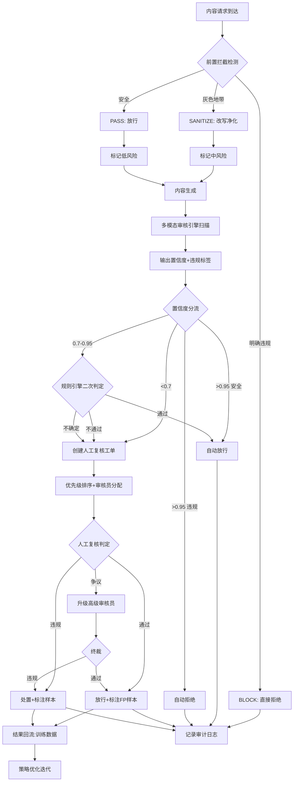

# 内容合规审核 - 标准操作流程（SOP）

## 1. 概述

本SOP定义内容合规审核系统的标准操作流程，覆盖从内容生成前的前置拦截到生成后的多模态审核、置信度分流、人工复核和数据回流的全生命周期管理。系统目标：在保证审核准确率（FN<2%、FP<1.5%）的前提下，实现自动化率>80%，人工复核响应时间<30分钟。

---

## 2. RACI矩阵

| 流程步骤 | 前置拦截卫士 | 审核策略中枢 | 多模态审核引擎 | 人机协作复核员 | 运维团队 | 法务合规 |
|---------|:----------:|:----------:|:------------:|:------------:|:-------:|:-------:|
| 前置安全检测 | **R** | I | - | - | - | - |
| 审核规则配置 | I | **R/A** | I | C | - | C |
| 灰度发布控制 | - | **R/A** | I | - | C | - |
| 多模态内容审核 | - | I | **R** | - | - | - |
| 置信度评分 | - | C | **R** | I | - | - |
| 分流决策执行 | - | I | - | **R** | - | - |
| 规则引擎二次判定 | - | C | - | **R** | - | - |
| 人工复核调度 | - | - | - | **R/A** | - | - |
| 人工复核执行 | - | - | - | **R** | - | C |
| 审核结果回流 | - | **A** | I | **R** | - | - |
| 效果指标监控 | I | **R/A** | I | I | C | - |
| 应急响应 | C | **R/A** | C | C | **R** | I |
| 攻击防御更新 | **R** | **A** | - | - | C | - |
| 合规审计 | I | **R** | I | I | - | **A** |
| 策略变更评审 | C | **R** | C | C | - | **A** |

> R=Responsible(执行), A=Accountable(负责), C=Consulted(咨询), I=Informed(知会)

---

## 3. 核心流程详细步骤

### SOP-1: 内容审核主流程

#### 3.1.1 前置拦截（生成前）

**触发条件**：用户提交内容生成请求

**执行步骤**：
1. 前置拦截卫士接收请求，执行输入预处理（Unicode标准化、编码解析）
2. 运行攻击模式匹配检测（Prompt Injection/Jailbreak/DAN等）
3. 执行PII检测和敏感关键词过滤
4. 进行语义意图分类（正常/灰色地带/明确违规）
5. 输出检测结论：
   - **明确违规（BLOCK）**：直接拒绝请求 → 记录拦截日志 → 通知用户（说明原因但不暴露规则细节）
   - **灰色地带（SANITIZE）**：执行改写净化 → 标记中风险 → 放行净化后内容
   - **安全（PASS）**：标记低风险 → 直接放行

**输出物**：检测结果记录（决策/风险等级/置信度/规则命中/耗时）

**异常处理**：
- 检测服务超时（>200ms）：放行请求但标记"未检测"，后置审核环节加强扫描
- 检测服务不可用：启动降级策略，按历史规则放行低风险渠道请求，高风险渠道全量排队

**质量检查点**：
- 前置拦截延迟P99 < 100ms
- 恶意请求拦截率 > 95%
- 正常请求误拦截率 < 0.5%

---

#### 3.1.2 多模态审核（生成后）

**触发条件**：内容生成完毕，进入审核队列

**执行步骤**：
1. 多模态审核引擎接收待审核内容
2. 执行内容类型识别和预处理：
   - 文本：分段、语言检测
   - 图片：OCR、尺寸标准化
   - 音频：ASR语音转文本、背景音分离
   - 视频：关键帧提取、音轨分离、字幕OCR
3. 并行执行各维度审核模型推理
4. 对多模态混合内容执行跨模态关联分析
5. 执行置信度评分（校准+加权+不确定性量化）
6. 执行违规类型分类（多标签分类+严重度判定）
7. 输出完整审核结果

**输出物**：审核结果（综合置信度/违规标签/维度评分/证据定位/处理耗时）

**异常处理**：
- 单个模型超时：使用其余模型结果，标记审核深度受限
- 零容忍类高置信度命中：立即触发告警，不等待完整流程
- 审核队列积压（深度>阈值）：启动优先级排序，高风险内容优先审核

**质量检查点**：
- 文本审核延迟 < 500ms
- 图片审核延迟 < 1s
- 视频审核延迟 < 5s/分钟
- 审核结果必须附带可解释的证据

---

#### 3.1.3 置信度分流

**触发条件**：多模态审核引擎输出审核结果

**执行步骤**：
1. 人机协作复核员接收审核结果
2. 读取当前生效的阈值配置（可能按违规类型差异化）
3. 执行三级分流判定：
   - **高置信度（>0.95）**：
     - 判定安全 → 自动放行 → 写入通过日志
     - 判定违规 → 自动拒绝 → 写入拒绝日志 → 通知创作方
   - **中置信度（0.7-0.95）**：进入规则引擎二次判定
     - 检查行业白名单/创作者信誉/历史判例/渠道敏感度
     - 二次通过 → 放行 | 二次不通过 → 创建人工复核工单
   - **低置信度（<0.7）**：直接创建人工复核工单
4. 记录分流决策和完整决策依据

**输出物**：分流决策记录（决策/通道/工单/审计日志）

**异常处理**：
- 阈值配置读取失败：使用默认阈值（0.95/0.7）
- 规则引擎不可用：中置信度内容全量转人工
- 分流后发现逻辑错误：支持人工修正并记录修正原因

**质量检查点**：
- 自动放行比例 > 60%
- 人工复核比例 < 15%
- 分流决策延迟 < 20ms

---

#### 3.1.4 人工复核

**触发条件**：工单创建后进入复核队列

**执行步骤**：
1. 工单进入队列，计算优先级分数（时效性30%+影响范围25%+严重度30%+SLA剩余15%）
2. 匹配审核员能力标签，分配给负载最低的合适审核员
3. 审核员接单后执行复核：
   - 查看原始内容
   - 参考AI预判和证据高亮
   - 做出终判：通过/违规/争议
4. 结果处理：
   - **通过**：释放内容 → 记录为FP样本
   - **违规**：执行处置（删除/限流/封号）→ 通知创作方 → 记录为TP/FN样本
   - **争议**：升级高级审核员 → 多人投票 → 终裁
5. 复核结果写入训练数据集

**输出物**：复核结论（判定/依据/训练标注/处置记录）

**异常处理**：
- SLA 80%时间到达未处理：提醒当前审核员
- SLA到期：自动升级Team Lead + 重新分配
- SLA超150%：升级管理层 + 启动应急预案
- 审核员对结果不确定：标记"争议"走升级流程，不强行判定

**质量检查点**：
- SLA达标率 > 95%
- 高优先级响应时间 < 15分钟
- 人工复核与最终结论一致率 > 98%

---

### SOP-2: 灰度发布流程

**触发条件**：新规则完成评审，进入发布阶段

**执行步骤**：

| 阶段 | 最短时间 | 验收指标 | 操作 |
|------|---------|---------|------|
| NoOp（观察模式） | 24小时 | 触发频率合理，无异常模式 | 仅记录不拦截 |
| Shadow（影子模式） | 48小时 | 与人工一致率>95%，样本量>100 | 记录+对比 |
| Prod（生产模式） | 逐步放量 | FP率<1.5%，FN率<2% | 10%→30%→50%→100% |

**加速通道（紧急规则）**：
- 触发条件：涉政/涉恐/突发公共事件
- 流程：跳过NoOp → Shadow≥4小时验证 → Prod直接100%
- 审批：策略中枢+法务双重确认

**回滚条件**：
- Shadow阶段一致率<90%：自动回滚到NoOp
- Prod阶段FP突增>5%：自动回滚到Shadow
- Prod阶段触发频率异常波动>200%：自动回滚+告警

---

### SOP-3: 审核准确率监控

**触发条件**：每日定时执行/实时异常触发

**日常监控**：
| 频率 | 操作 | 负责Agent | 阈值 |
|------|------|----------|------|
| 每5分钟 | 实时FN/FP率计算 | 审核策略中枢 | FN>5%或FP>3%即时告警 |
| 每日 | 日报生成（核心指标+环比+异常标注） | 审核策略中枢 | 连续3天超标触发复盘 |
| 每周 | 周报（趋势+Top问题规则+优化建议） | 审核策略中枢 | FN>2%或FP>1.5%触发策略调整 |
| 每月 | 月报（全面复盘+规则库健康度+ROI） | 审核策略中枢 | 规则有效率<80%触发大规模清理 |

**异常响应**：
- 单时段FN突增>50%：
  1. 紧急启动全量人工复核
  2. 审核策略中枢排查规则漏洞
  3. 定位问题规则并紧急修复
  4. 修复后通过加速通道验证上线
- 连续3天FN>2%：
  1. 暂停相关规则的自动放行（临时降低阈值）
  2. 召开策略复盘会议
  3. 制定整改方案并限期完成

---

### SOP-4: 攻击防御更新

**触发条件**：定期更新/新攻击模式发现

| 场景 | 响应时间 | 流程 |
|------|---------|------|
| 常规更新 | 每周 | 收集攻击样本→分析模式→编写规则→测试→标准灰度发布 |
| 新型攻击 | 2小时 | 样本分析→应急规则编写→快速测试（≥10样本验证）→Shadow≥1小时→Prod |
| 红蓝对抗 | 每月 | 安排攻击团队模拟→收集突破案例→批量修复→效果验证 |

---

### SOP-5: 人工复核SLA管理

| 工单类型 | 工作时间SLA | 非工作时间SLA | 超时升级链 |
|---------|:----------:|:----------:|----------|
| 涉政/涉恐 | 15分钟 | 15分钟 | 审核员→Team Lead（10min）→总监（20min） |
| 涉黄/涉暴 | 30分钟 | 2小时 | 审核员→Team Lead（SLA到期）→管理层（150%SLA） |
| 广告/侵权 | 30分钟 | 2小时 | 审核员→Team Lead（SLA到期） |
| 一般内容 | 30分钟 | 2小时 | 审核员→Team Lead（SLA到期） |

---

### SOP-6: 审计合规

**定期审计**：
- 频率：每季度一次
- 范围：随机抽取1%已审核内容
- 执行人：独立审计团队（非日常审核人员）
- 验收标准：抽检不一致率<5%
- 超标处理：启动全面排查 → 定位系统性问题 → 整改+回溯影响范围

**日志合规**：
- 保留期：180天（热数据30天/温数据150天）
- 内容：原始内容hash/审核结果/审核依据/操作人员/时间戳
- 完整性：每小时执行日志完整性校验
- 访问控制：查询审计日志的操作本身也记录

---

### SOP-7: 策略变更管理

**变更流程**：
1. 变更发起：策略中枢提出变更需求和方案
2. 影响评估：评估变更对现有规则的影响（冲突/覆盖/依赖）
3. 三方评审：策略中枢（技术可行性）+ 业务方（业务适用性）+ 法务（合规性）
4. 测试验证：变更规则通过≥40条测试用例
5. 灰度发布：按SOP-2执行
6. 效果验证：上线后连续7天监控
7. 变更归档：写入版本管理系统

**回滚机制**：
- 所有变更支持一键回滚
- 回滚时间<5秒（配置热更新）
- 回滚后保持对回滚原因的记录

---

## 4. 决策树

---

## 5. KPI指标体系

### 核心安全指标
| 指标 | 目标值 | 告警阈值 | 统计周期 |
|------|--------|---------|---------|
| 漏判率（FN Rate） | <2% | >3%即时告警，>2%连续3天触发复盘 | 日 |
| 误判率（FP Rate） | <1.5% | >2%即时告警，>1.5%连续3天触发复盘 | 日 |
| 零容忍类漏判率 | 0% | >0即时告警+全量人工复核 | 实时 |

### 效率指标
| 指标 | 目标值 | 告警阈值 | 统计周期 |
|------|--------|---------|---------|
| 审核自动化率 | >80% | <70%触发策略优化 | 日 |
| 前置拦截率（恶意请求） | >95% | <90%触发规则库审查 | 周 |
| 人工复核平均响应时间 | <30分钟 | >45分钟触发资源调配 | 日 |
| 规则上线平均耗时 | <1天 | >3天触发流程优化 | 月 |

### 服务质量指标
| 指标 | 目标值 | 告警阈值 | 统计周期 |
|------|--------|---------|---------|
| 审核服务可用性 | >99.9% | <99.5%触发运维响应 | 月 |
| 前置检测延迟P99 | <100ms | >200ms触发性能优化 | 日 |
| 审核引擎延迟P99 | <2s | >5s触发性能优化 | 日 |
| SLA达标率 | >95% | <90%触发资源扩容 | 周 |

### 运营健康指标
| 指标 | 目标值 | 告警阈值 | 统计周期 |
|------|--------|---------|---------|
| 规则库有效率 | >80% | <70%触发规则清理 | 月 |
| 审计抽检一致率 | >95% | <90%触发全面排查 | 季度 |
| 攻击防御更新及时率 | 100% | 新攻击2小时内未响应触发告警 | 实时 |
| 灰度发布成功率 | >90% | <80%触发流程检视 | 月 |

---

## 6. 降级策略

### 审核服务不可用
| 降级等级 | 触发条件 | 策略 | 恢复条件 |
|---------|---------|------|---------|
| L1（轻微） | 单模型超时 | 使用剩余模型结果，标记审核深度受限 | 模型恢复 |
| L2（中度） | 审核引擎整体超时>30s | 仅执行文本快速审核，多媒体排队 | 引擎恢复 |
| L3（严重） | 审核服务完全不可用 | 低风险按历史规则放行，高风险全转人工 | 服务恢复+积压清理 |
| L4（极端） | 服务不可用+人工复核积压>10倍 | 全量排队，仅放行已验证安全的创作者内容 | 服务恢复+积压清理+复盘 |

### 降级恢复流程
1. 服务恢复后，优先处理降级期间放行的内容（追溯审核）
2. 统计降级期间的潜在漏判数量
3. 输出降级影响报告
4. 复盘降级原因，优化预案

---

## 7. 持续改进机制

- **周度**：规则效果Review → 清理低效规则 → 优化高FP规则
- **月度**：全量指标复盘 → 阈值调优 → 模型迭代评估
- **季度**：合规审计 → 架构评估 → 容量规划
- **年度**：法规合规全面评估 → 系统升级规划 → 团队能力提升计划
