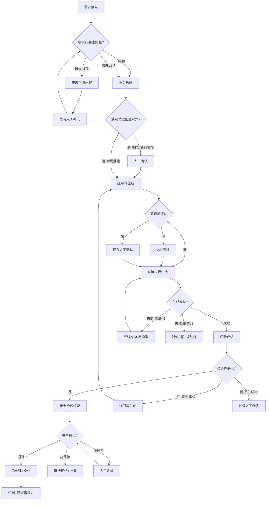

# 创意素材生成 — 标准操作规程（SOP）

## 1. 文档概述

本SOP定义了创意素材生成系统从需求接入到素材交付的完整操作规程，适用于所有通过多智能体协作完成的批量创意素材生产任务。本规程确保每一张交付素材在质量、合规、品牌一致性三个维度均满足标准。

**适用范围**：文生图、图生图、文生视频、图生视频、虚拟试穿、图片编辑等所有AI素材生成场景
**版本**：v1.0
**生效日期**：即日生效
**复盘周期**：每月一次流程复盘，每季度一次SOP版本更新

---

## 2. RACI 责任矩阵

| 流程步骤 | 创意规划师 | 提示词工程师 | 素材合成师 | 质量检验员 | 人工审核 |
|----------|:----------:|:----------:|:----------:|:----------:|:--------:|
| 需求接入与解析 | **R/A** | I | I | I | C |
| 需求完整度校验 | **R** | I | - | - | **A** |
| 任务拆解与计划 | **R/A** | C | I | I | - |
| 创意方向确认 | R | C | - | - | **A** |
| 提示词生成优化 | I | **R/A** | I | - | - |
| 模型路由决策 | C | **R** | **A** | - | - |
| A/B测试执行 | I | **R** | **A** | C | - |
| 批量素材生成 | I | C | **R/A** | I | - |
| 异常处理与降级 | **A** | C | **R** | I | - |
| 质量评估打分 | I | I | - | **R/A** | - |
| 安全合规检查 | I | - | - | **R/A** | C |
| 重生成决策 | I | **R** | A | **R** | - |
| 人工介入升级 | I | I | - | **R** | **A** |
| 后处理与适配 | I | - | **R/A** | C | - |
| 素材交付 | **A** | - | **R** | C | - |
| 质量趋势报告 | C | C | I | **R/A** | - |

> R=Responsible(执行) A=Accountable(决策) C=Consulted(咨询) I=Informed(知会)

---

## 3. 核心流程步骤

### SOP-1：需求准入与结构化

**触发条件**：收到新的素材生成需求（人工提交/系统触发/API调用）

**执行动作**：
1. 创意规划师接收原始需求，执行四要素完整度检查：
   - ✅ 目标受众（人群画像）
   - ✅ 使用场景（渠道+场景+位置）
   - ✅ 品牌规范（VI引用/调性要求）
   - ✅ 输出规格（尺寸/格式/数量/分辨率）
2. 缺失≤1项：补充默认值并标注假设，继续流程
3. 缺失>1项：生成结构化澄清问题，暂停等待人工补充

**输出物**：
- 结构化需求文档（JSON格式）
- 或澄清问题清单（等待回复后重新触发）

**异常处理**：
- 需求方72小时未补充信息 → 自动关闭需求并通知
- 需求明确涉及违规内容 → 直接拒绝并记录

**KPI指标**：
- 需求结构化准确率 ≥ 95%
- 平均需求处理时间 < 10分钟（无需澄清时）
- 澄清问题回复后到结构化完成 < 5分钟

---

### SOP-2：任务拆解与生产计划

**触发条件**：需求结构化文档已完成

**执行动作**：
1. 根据需求规模判断任务类型（单图/系列/Campaign/批量）
2. 执行子任务拆解，明确每个子任务的：
   - 独立验收标准
   - 推荐生成模型
   - 优先级排序
   - 依赖关系
3. 制定生产计划（时间线/并发策略/成本预估）
4. **关键创意决策识别**：
   - 品牌主KV → 必须人工确认
   - 新品首发素材 → 必须人工确认
   - 常规批量任务 → 直接分发执行

**输出物**：
- 子任务清单（含模型建议和验收标准）
- 生产时间线
- 成本预估
- 人工确认请求（如适用）

**异常处理**：
- 预估成本超出预算 → 暂停并通知需求方确认
- 预估时间超出deadline → 提供降级方案（减少数量/降低质量等级）

**质量检查点**：
- 每个子任务必须有可量化的验收标准
- 模型选择必须有明确理由
- 并发度设置必须考虑API限流

---

### SOP-3：提示词生成与优化

**触发条件**：子任务分发到提示词工程师

**执行动作**：
1. 根据任务描述+模型特性构建四模块提示词：
   - 主体描述（Subject）
   - 风格定义（Style）
   - 构图指导（Composition）
   - 负向约束（Negative）
2. 模型路由确认：验证推荐模型是否为最优选择
3. 参数配置：设定Steps/CFG/尺寸/采样器等
4. 置信度评估：
   - 高置信度 → 直接输出
   - 中置信度 → 建议生成2-3个变体进行A/B测试
   - 低置信度 → 建议触发人工确认

**输出物**：
- 完整提示词包（正向+负向+参数+模型）
- 置信度评估结果
- A/B测试方案（如适用）

**质量标准**：
- 每条提示词必须包含四个核心模块
- 新模板上线前须通过≥20次测试验证，通过率>80%方可入库
- 提示词必须使用英文（模型理解最佳语言）

**异常处理**：
- 任务需求超出所有模型能力范围 → 标记为"不可自动化"，升级人工设计
- 品牌规范与模型能力冲突 → 提供备选方案供决策

---

### SOP-4：批量素材生成

**触发条件**：提示词优化完成，生成指令就绪

**执行动作**：
1. 构建任务队列（优先级排序）
2. 批量任务采用分批策略：
   - 第一批（10%）作为Pilot验证
   - Pilot通过率≥70% → 全量投入
   - Pilot通过率<70% → 暂停，通知提示词工程师优化
3. 并发执行生成（并发度5-10，视模型API限制调整）
4. 实时监控：
   - 成功率>90%：正常继续
   - 成功率80-90%：注意，准备降级
   - 成功率<80%：告警，降低并发
   - 成功率<70%：暂停批次

**输出物**：
- 生成素材文件（含完整元数据）
- 批次执行报告

**异常处理**：
| 异常情况 | 处理措施 | 升级条件 |
|----------|----------|----------|
| 单次生成超时 | 重试（最多3次） | 3次超时→切备用模型 |
| 模型5xx错误 | 指数退避重试 | 连续3次→切备用模型 |
| 内容安全拦截 | 标记，不重试 | 上报质量检验员分析原因 |
| 配额耗尽 | 暂停当前模型任务 | 切备用模型或暂停等待 |
| 批次失败率>30% | 暂停整个批次 | 通知创意规划师重新评估 |

**KPI指标**：
- 素材生成成功率 > 95%
- 模型调用成功率 > 99%
- 批量任务平均完成时间 按规模线性比例

---

### SOP-5：质量评估与闭环

**触发条件**：素材生成完成，提交质量检验

**执行动作**：
1. **技术质量评估**（权重40%）：
   - 清晰度/分辨率/AI伪影/色彩/光照/构图完整性
2. **创意匹配度评估**（权重60%）：
   - 需求契合度/风格一致性/美学评分/品牌符合度
3. **综合评分计算**：
   - 综合分 = 技术分×0.4 + 创意分×0.6
4. **判定决策**：

```
IF 安全合规不通过:
    → 安全拒绝（直接上报，不进入重生成）
ELIF 综合分 ≥ 7.0:
    → 通过，进入交付流程
ELIF 综合分 < 7.0 AND 重生成次数 < 3:
    → 退回重生成（附失败原因分析+改进建议）
ELIF 综合分 < 7.0 AND 重生成次数 ≥ 3:
    → 升级人工介入
```

5. **虚拟试穿额外标准**：
   - 人物一致性评分≥8/10方可通过

**输出物**：
- 质量评估报告（三维度分项+综合分+判定）
- 改进建议（退回时必须提供具体可执行的优化方向）

**KPI指标**：
- 质量评分均值 ≥ 7.5/10
- 首次生成通过率 > 70%
- 人工干预率 < 15%

---

### SOP-6：安全合规检查

**触发条件**：质量评估通过，进入安全检查环节

**执行动作**：
1. 政治敏感性扫描（国旗/地图/领导人/政治符号）
2. 色情暴力检测（裸露/血腥/恐怖/自残暗示）
3. 知识产权检查（商标/IP/名人肖像/版权作品）
4. 广告法合规（极限词/虚假承诺/特殊行业限制）
5. 个人信息保护（可识别人脸/个人信息泄露）

**判定标准**：
- 高置信度安全（>0.95）→ 自动放行
- 中置信度（0.7-0.95）→ 标记风险点，人工复核
- 触发任何红线 → 直接拒绝，记录并上报

**输出物**：
- 安全检查报告
- 风险标记（如有）
- 上报工单（如触发红线）

**异常处理**：
- 审核服务不可用 → 暂停交付，全量转人工
- 某类素材频繁触发安全拦截 → 反馈给提示词工程师从源头规避

---

### SOP-7：素材交付与归档

**触发条件**：质量评估通过 + 安全合规通过

**执行动作**：
1. 执行后处理流水线：
   - 多尺寸适配裁切
   - 格式转换（按目标平台要求）
   - 品牌水印叠加（如需要）
   - 质量增强（超分/锐化，如需要）
2. 文件规范化命名
3. 写入资产管理系统
4. 生成预览缩略图
5. 通知需求方交付完成

**输出物**：
- 最终交付素材包
- 资产库入库记录
- 交付通知

---

## 4. 决策树



---

## 5. 监控与告警规则

### 5.1 实时监控指标

| 指标 | 告警阈值 | 严重阈值 | 处理措施 |
|------|----------|----------|----------|
| 批次失败率 | >10% | >30% | 告警→降并发；严重→暂停批次 |
| 模型响应延迟 | >30s | >60s | 告警→监控；严重→超时切换 |
| 配额剩余 | <30% | <10% | 告警→规划；严重→切备用模型 |
| 安全拦截率 | >5% | >10% | 告警→分析原因；严重→暂停+review |
| 质量评分均值 | <7.5 | <7.0 | 告警→分析；严重→流程复盘 |

### 5.2 周期性报告

| 报告类型 | 频率 | 责任人 | 接收方 |
|----------|------|--------|--------|
| 日质量报告 | 每日 | 质量检验员 | 全团队 |
| 周趋势分析 | 每周 | 质量检验员 | 创意规划师+提示词工程师 |
| 月度复盘 | 每月 | 创意规划师 | 管理层 |
| 模型效果评估 | 每月 | 提示词工程师 | 全团队 |

---

## 6. 人工干预规则

### 6.1 必须人工确认的场景
- 品牌主KV创意方向决策
- 新品首发素材最终确认
- 涉及品牌形象变更的任务
- 全新风格方向的首次尝试

### 6.2 必须人工介入的场景
- 累计3次重生成仍不达标的素材
- 安全检查标记为高风险的内容
- 批次失败率>30%需要重新评估方案
- 质量检验员无法判定的边界案例

### 6.3 人工介入SLA
| 场景 | 响应时间 | 升级条件 |
|------|----------|----------|
| 创意确认 | <2小时（工作时间） | 超时→升级管理层 |
| 质量介入 | <1小时（工作时间） | 超时→自动通知备用审核员 |
| 安全复核 | <30分钟 | 涉政/涉恐<15分钟 |
| 批次异常 | <30分钟 | 影响>100素材时立即响应 |

---

## 7. 持续改进机制

### 7.1 质量复盘触发条件
- 周均质量分 < 7.5
- 首次通过率连续3天 < 65%
- 单一模型通过率突降 > 10%
- 人工介入率 > 15%
- 安全拦截率异常升高

### 7.2 复盘输出要求
- 问题根因分析（5 Why方法）
- 具体改进措施（含责任人和截止时间）
- 效果验证计划
- SOP更新记录（如需调整规程）

### 7.3 提示词模板库更新规则
- 新模板上线：≥20次测试+通过率>80%
- 模板下线：连续2周使用该模板的通过率<60%
- 模板优化：根据质量反馈数据每周review一次
- 版本管理：每次变更记录改动点和测试结果

---

## 8. 关键KPI总览

| KPI | 目标值 | 告警线 | 统计周期 |
|-----|--------|--------|----------|
| 素材生成成功率 | >95% | <90% | 实时 |
| 质量评分均值 | ≥7.5/10 | <7.0 | 每日 |
| 首次生成通过率 | >70% | <60% | 每日 |
| 人工干预率 | <15% | >20% | 每周 |
| 模型调用成功率 | >99% | <97% | 实时 |
| 单素材平均成本 | 按预算 | 超预算20% | 每批次 |
| 批量任务交付及时率 | >90% | <80% | 每批次 |
| 安全合规拦截漏判率 | <1% | >2% | 每月 |
