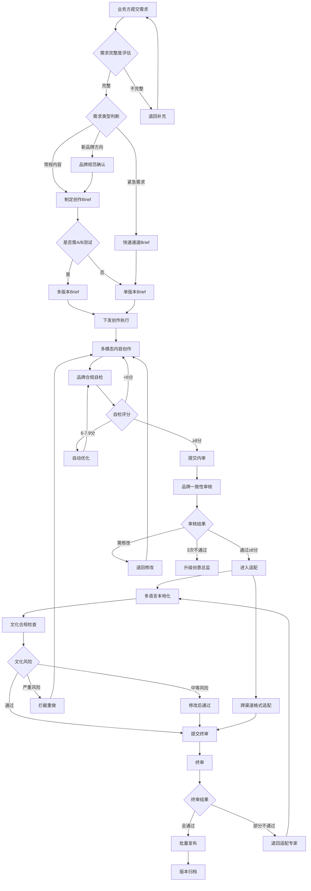

# 多模态内容创作标准操作流程（SOP）

## 1. 文档概述

本SOP定义了多模态内容创作平台从需求接入到内容发布归档的完整操作流程，覆盖品牌规范管理、创作执行、品牌审核、本地化适配和版本管理等核心环节。所有参与角色须严格遵循本流程，确保内容产出在效率和品牌一致性之间达到最优平衡。

**适用范围**：企业级多模态内容创作（文案/图像/视频），多语言本地化，跨渠道平台适配

**核心目标**：
- 品牌一致性评分 ≥ 8.5/10
- 内容产出效率较纯人工提升5倍
- 跨渠道适配一次通过率 > 90%
- 从需求到发布平均周期 < 48小时
- 品牌规范违规率 < 3%

---

## 2. RACI矩阵

| 流程步骤 | 品牌内容策略师 | 多模态创作执行师 | 本地化适配专家 | 业务方 | 人工创意总监 |
|----------|:---:|:---:|:---:|:---:|:---:|
| 需求提交与评估 | A/R | I | I | R | I |
| 品牌规范管理 | R/A | C | C | I | A |
| 创作Brief制定 | R/A | C | I | C | I |
| 内容创作执行 | I | R/A | I | I | I |
| 品牌合规自检 | I | R/A | I | I | I |
| 品牌一致性内审 | R/A | I | I | I | C |
| 修改迭代 | C | R/A | I | I | I |
| 多语言本地化 | I | I | R/A | I | I |
| 跨渠道格式适配 | I | I | R/A | I | I |
| 文化合规检查 | C | I | R/A | I | I |
| 终审发布 | R/A | I | C | I | C |
| 版本归档 | A | C | C | I | I |
| 升级处理 | C | I | I | I | R/A |

> R=Responsible(执行者) A=Accountable(决策者) C=Consulted(被咨询者) I=Informed(被通知者)

---

## 3. 详细流程步骤

### 步骤1：需求输入与评估

**触发条件**：业务方提交内容创作需求（通过需求系统/邮件/会议纪要）

**执行动作**：
1. 品牌内容策略师接收需求并进行完整度评估
2. 核查需求五要素：目标受众/核心信息/调性要求/目标渠道/输出规格
3. 判断需求类型并路由：

**决策分支**：
```
需求评估
├── [完整 + 常规内容] → 直接进入Brief制定
├── [完整 + 新品牌方向] → 需品牌规范确认 → 确认后进入Brief制定
├── [完整 + 紧急需求] → 走快速通道（简化Brief + 跳过多版本）
└── [不完整] → 生成澄清问题列表 → 退回业务方补充 → 重新提交
```

**输出物**：需求评估记录、路由决策、澄清问题列表（如有）

**异常处理**：
- 需求描述模糊无法判断类型 → 与业务方一对一沟通澄清
- 需求与品牌定位存在冲突 → 上升至品牌负责人决策
- 需求量超出当日产能 → 优先级排序，低优先级任务排期

**质量检查点**：需求五要素完整率100%（缺失>1项不得进入下一步）

---

### 步骤2：创作Brief制定

**触发条件**：需求评估通过，进入Brief制定阶段

**执行动作**：
1. 品牌内容策略师根据需求结构化输出Brief
2. 从品牌资产库加载适用的品牌规范版本
3. 明确品牌约束条件（调性关键词/VI参数/禁用元素）
4. 确定是否需要A/B测试多版本产出
5. 设置任务优先级和截止时间

**决策分支**：
```
Brief类型
├── [需A/B测试] → 要求产出≥2个创意方向版本，标注变量控制
├── [确定方向] → 单版本产出
└── [快速通道] → 简化Brief（保留品牌约束和核心信息，省略参考案例和多版本）
```

**输出物**：结构化创作Brief（JSON格式），包含所有必要字段

**异常处理**：
- 品牌规范版本过期 → 暂停，等待规范更新后重新引用
- 渠道规格不明确 → 使用默认规格模板，标注"待确认"
- 截止时间不合理（<4小时） → 评估可行性，必要时协商延期

**质量检查点**：Brief自检通过（五要素完整/品牌规范版本正确/规格参数可行）

---

### 步骤3：内容创作执行

**触发条件**：收到创作Brief分发

**执行动作**：
1. 多模态创作执行师解析Brief，加载品牌规范
2. 根据内容类型执行对应创作流程：
   - **文案**：选择创作框架(AIDA/PAS/FABE) → 撰写 → 品牌调性自检
   - **图像**：构建Prompt → 选择模型 → 生成候选 → 筛选 → 后处理 → VI自检
   - **视频**：撰写分镜脚本 → 准备素材 → 合成 → 添加品牌元素 → 技术规格自检
3. 执行品牌合规自检（调用brand-compliance-self-check技能）
4. 自检通过后提交内审

**决策分支**：
```
创作产出
├── [自检≥8分 + 无硬性问题] → 提交品牌一致性内审
├── [自检6-7.9分] → 自动优化 → 重新自检（最多2轮）
│   ├── [优化后≥8分] → 提交内审
│   └── [仍不达标] → 标注问题提交（附说明）
└── [自检<6分 或 硬性问题] → 重新创作
```

**输出物**：创作产出内容 + 品牌合规自检报告

**异常处理**：
- AI生成模型不可用 → 切换备用模型 → 仍不可用则上报等待
- 图像生成3轮仍不满意 → 调整Prompt策略或升级人工干预
- Brief理解有歧义 → 向品牌内容策略师澄清后再执行

**质量检查点**：品牌合规自检评分≥8/10；图像ΔE<3；文案无禁用词

---

### 步骤4：品牌一致性内审

**触发条件**：创作产出提交内审

**执行动作**：
1. 品牌内容策略师接收产出和自检报告
2. 执行品牌一致性审核（调用brand-consistency-review技能）
3. 多维度打分并生成审核报告
4. 做出审核决策

**决策分支**：
```
内审结果
├── [通过，≥8分] → 进入多语言/多渠道适配
├── [需修改，5-7.9分] → 标注问题点 + 附修改指导 → 退回创作者
│   └── [修改后重新提交] → 重新审核（计次）
│       ├── [修改≤3次通过] → 进入适配
│       └── [修改3次仍不通过] → 升级人工创意总监
└── [严重不合规，<5分] → 驳回，要求重新创作 → 回到步骤3
```

**输出物**：品牌一致性审核报告（总评分 + 各维度分项 + 修改建议）

**异常处理**：
- 审核标准存在争议 → 记录分歧点，升级人工创意总监裁决
- 品牌规范发生变更 → 按新规范重新审核
- 审核时效超过4小时 → 自动提醒 + 升级处理

**质量检查点**：审核评分≥8/10通过；禁用元素零容忍；修改≤3次

**KPI指标**：
- 首次审核通过率目标 > 80%
- 平均审核周期 < 4小时

---

### 步骤5：多语言/多渠道适配

**触发条件**：内审通过，进入适配阶段

**执行动作**：
1. 本地化适配专家接收审核通过的原始内容
2. 执行多语言本地化：
   - 翻译 + 文化适配
   - 回译校验（准确率≥95%）
   - 文化合规检查
3. 执行跨渠道格式适配：
   - 根据目标平台规格调整格式/尺寸/时长
   - 内容策略适配（平台调性差异化）
   - 平台规格自动校验

**决策分支**：
```
适配审核
├── [需本地化外审] → 提交母语reviewer → 等待反馈
│   ├── [通过] → 进入终审
│   └── [需修改] → 修改后重新提交外审
├── [成熟语种] → 抽检模式（20%抽检）
│   ├── [抽检通过] → 进入终审
│   └── [抽检发现问题] → 全量复查
└── [仅渠道适配无多语言] → 规格校验通过即进入终审
```

**输出物**：
- 多语言版本（原文-译文对照 + 回译校验 + 文化checklist）
- 跨渠道适配版本（各平台格式 + 规格校验报告）

**异常处理**：
- 文化合规检查发现严重风险 → 立即拦截，退回重新创作
- 平台规格变更 → 更新规格库，重新适配受影响内容
- 翻译质量不达标（<95%准确率） → 人工校对后重新提交
- 外部reviewer超时未反馈 → 催促 + 分配备用reviewer

**质量检查点**：
- 翻译准确率≥95%（回译校验）
- 文化适配checklist全部通过
- 平台规格校验100%通过
- 跨渠道适配一次通过率 > 90%

---

### 步骤6：终审发布

**触发条件**：所有适配版本完成并通过质量校验

**执行动作**：
1. 品牌内容策略师对所有版本进行终审
2. 重点审核多语言版本的品牌一致性（调性是否被本地化稀释）
3. 确认所有版本的品牌核心要素完整（Logo/色彩/字体/调性）
4. 做出发布决策

**决策分支**：
```
终审结果
├── [全部版本通过] → 批量发布到对应渠道
├── [部分版本不通过] → 标注问题 → 退回本地化适配专家修改
│   └── 修改后重新终审
└── [发现系统性问题] → 暂停所有版本 → 排查根因 → 全量返工
```

**输出物**：终审报告、发布确认单、渠道发布记录

**异常处理**：
- 紧急公关事件 → 所有相关内容立即暂停发布 → 评估影响范围
- 发布系统故障 → 启动备用发布通道 → 通知运维
- 发布后发现问题 → 立即下架 + 启动紧急修正流程

**质量检查点**：品牌一致性终审评分≥8.5/10（所有语言版本）

---

### 步骤7：版本归档

**触发条件**：内容发布完成

**执行动作**：
1. 所有版本（原始 + 各语言 + 各平台）写入内容管理系统
2. 正式发布版本打标签锁定
3. 生成版本对比记录（与Brief要求的对照）
4. 关联到内容日历和营销Campaign
5. A/B测试版本建立效果追踪链接

**输出物**：版本归档记录、版本对比报告、Campaign关联记录

**规范要求**：
- 每个内容项保留完整修改历史
- 正式发布版本不允许覆盖修改（需新建版本）
- 版本标签格式：v{主版本}.{修订次数}-{语言}-{平台}
- 归档信息须包含：创作Brief/审核记录/品牌规范版本/发布渠道/发布时间

---

## 4. 异常处理总览

### 品牌规范更新流程
```
品牌规范变更通知
├── 策略师确认变更内容和影响范围
├── 通知所有进行中任务暂停
├── 评估各任务受影响程度
│   ├── [高影响] → 必须引用新规范重新审核
│   ├── [低影响] → 标注变更点，后续任务引用新版本
│   └── [无影响] → 继续执行
└── 全局更新品牌资产库版本号
```

### 平台规则变更流程
```
平台规格变更检测
├── 本地化适配专家更新规格库
├── 扫描已完成未发布的受影响内容
├── 通知品牌内容策略师评估影响
│   ├── [已发布内容] → 评估是否需要重新适配发布
│   └── [未发布内容] → 重新适配后提交终审
└── 更新适配模板
```

### 紧急公关事件流程
```
公关事件触发
├── 所有相关内容立即暂停发布
├── 品牌内容策略师评估影响范围
├── 确定需要撤回/修改/替换的内容清单
├── 执行应急处理
└── 事件结束后复盘 → 更新禁用清单
```

---

## 5. KPI指标体系

| 指标名称 | 目标值 | 计算方式 | 监控频率 | 预警阈值 |
|----------|--------|----------|----------|----------|
| 品牌一致性评分 | ≥8.5/10 | 所有通过内审内容的平均评分 | 每日 | <8.0 |
| 内容产出效率 | 较人工5x | 单Agent日产出量/人工基线 | 每周 | <3x |
| 跨渠道适配一次通过率 | >90% | 首次校验通过数/总适配数 | 每日 | <85% |
| 多语言本地化质量 | ≥95%准确率 | 回译校验平均准确率 | 每批次 | <92% |
| 首次审核通过率 | >80% | 首次内审通过数/总提交数 | 每日 | <70% |
| 需求到发布周期 | <48小时 | 需求提交到最终发布的时间差 | 每任务 | >72小时 |
| 品牌规范违规率 | <3% | 终审发现违规数/总发布数 | 每周 | >5% |
| 修改迭代次数 | 平均≤1.5次 | 总修改次数/总任务数 | 每周 | >2.5次 |

---

## 6. 决策树（Mermaid格式）



---

## 7. 品牌规范管理SOP

### 7.1 品牌资产库管理

| 操作 | 触发条件 | 执行者 | 审批者 | SLA |
|------|----------|--------|--------|-----|
| 季度Review | 每季度末 | 品牌内容策略师 | 品牌负责人 | 5个工作日 |
| 规范更新 | 品牌升级/纠偏需求 | 品牌内容策略师 | 品牌负责人 | 3个工作日 |
| 新品牌接入 | 新业务线/子品牌/合作品牌 | 品牌内容策略师 | 品牌负责人 | 10个工作日 |
| 紧急禁用更新 | 公关事件/法规变化 | 品牌内容策略师 | — (事后报备) | 2小时内 |

### 7.2 变更生效规则

- 常规变更：审批后T+1工作日生效
- 紧急变更：审批后立即生效
- 新品牌接入：完成三项必填（调性指南+VI规范+禁用清单）后生效
- 旧版本：生效后保留7天兼容期

---

## 8. 质量标准速查表

| 内容类型 | 品牌调性评分 | VI合规标准 | 技术规格 | 本地化标准 |
|----------|:---:|:---:|:---:|:---:|
| 文案 | ≥8/10 | N/A | 字数符合平台限制 | 准确率≥95% |
| 图像 | ≥8/10 | ΔE<3/字体100%/Logo合规 | 分辨率≥1080p | 文化checklist全通过 |
| 视频 | ≥8/10 | 片头片尾/水印/字幕合规 | 帧率≥30fps/码率达标 | 字幕准确率≥98% |

---

## 9. 版本管理规范

1. **版本命名**：`v{主版本}.{修订号}-{语言代码}-{平台代码}`
   - 示例：`v1.0-zh_CN-douyin`, `v1.2-en_US-instagram`
2. **版本状态**：草稿 → 审核中 → 已发布 → 已归档
3. **不可变规则**：已发布版本永久锁定，修改须创建新版本
4. **A/B版本**：`v1.0-A`, `v1.0-B` 格式标注，须关联效果追踪数据
5. **回溯能力**：任何历史版本可在24小时内恢复为当前版本（紧急场景使用）
