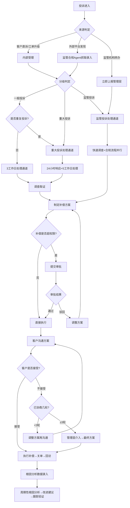

# 投诉管理标准操作程序（SOP）

## 1. 总则

### 1.1 目的
本SOP旨在规范投诉管理全流程的操作标准，确保投诉处理的时效性、合规性和客户满意度，同时通过根因分析推动系统性改进，降低投诉发生率。

### 1.2 适用范围
适用于所有渠道接收的客户投诉，包括：客户直诉、工单升级投诉、外部平台投诉（12315、黑猫投诉等）、监管机构转办投诉。

### 1.3 核心原则
- **快速响应**：所有投诉15分钟内完成受理，按等级要求时限首次联系客户
- **合规优先**：监管投诉100%在法定时限内处理和回复
- **客户挽留**：以挽留客户为导向设计补偿方案，投诉挽回率目标≥85%
- **成本可控**：补偿方案遵循分级审批制度，避免过度补偿
- **源头改进**：投诉不止于个案处理，必须推动系统性根因改进

---

## 2. RACI职责矩阵

| 流程环节 | 投诉受理与分级Agent | 投诉处理与补偿Agent | 投诉根因分析Agent | 监管合规与舆情Agent | 管理层 |
|----------|:---:|:---:|:---:|:---:|:---:|
| 投诉接收与登记 | **R/A** | I | I | C | I |
| 投诉分级判定 | **R/A** | I | I | C | I |
| 重复投诉识别 | **R/A** | I | C | I | I |
| 监管投诉上报 | R | I | I | **R/A** | I |
| 调查取证 | I | **R/A** | I | C | I |
| 补偿方案制定 | I | **R/A** | I | C | I |
| 补偿审批（权限内） | I | **R/A** | I | I | I |
| 补偿审批（超权限） | I | R | I | I | **A** |
| 客户沟通与协商 | I | **R/A** | I | I | I |
| 管理层介入（3轮未果） | I | R | I | I | **R/A** |
| 投诉关单 | I | **R/A** | I | I | I |
| 根因分析 | C | C | **R/A** | C | I |
| 改进措施跟踪 | I | I | **R/A** | I | A |
| 外部平台监控 | I | I | I | **R/A** | I |
| 舆情风险预警 | I | I | I | **R/A** | I |
| 合规材料准备与报送 | I | C | I | **R/A** | A |
| 月度投诉报告 | C | C | **R/A** | C | A |

> R=执行 A=审批/负责 C=咨询 I=知会

---

## 3. 详细流程

### SOP-1: 投诉受理与分级

**触发条件**：
- 客户通过任意渠道提出投诉
- 工单处理Agent将工单标记为投诉升级
- 外部平台（12315/黑猫投诉等）出现新投诉
- 监管机构发出转办通知

**执行步骤**：

| 步骤 | 操作 | 时限 | 责任Agent | 输出 |
|------|------|------|-----------|------|
| 1.1 | 接收投诉信息并创建投诉工单 | 5分钟 | 投诉受理与分级Agent | 投诉工单编号 |
| 1.2 | 提取投诉核心要素（对象、事件、诉求） | 5分钟 | 投诉受理与分级Agent | 结构化投诉信息 |
| 1.3 | 情感分析评估情绪强度 | 2分钟 | 投诉受理与分级Agent | 情绪评分(1-5) |
| 1.4 | 查询客户历史判断是否重复投诉 | 3分钟 | 投诉受理与分级Agent | 重复投诉标记 |
| 1.5 | 执行分级判定（一般/重大/监管） | 3分钟 | 投诉受理与分级Agent | 投诉等级 |
| 1.6 | 计算SLA时限并设置倒计时 | 2分钟 | 投诉受理与分级Agent | SLA截止时间 |
| 1.7 | 按等级分派至对应处理通道 | 2分钟 | 投诉受理与分级Agent | 分派通知 |
| 1.8 | 监管投诉触发上报流程 | 立即 | 监管合规与舆情Agent | 上报记录 |

**质检点**：
- 分级准确率 ≥ 90%（月度抽检50例验证）
- 监管投诉2小时内上报率 100%
- 重复投诉识别率 ≥ 95%
- 受理到分派完成总时长 ≤ 15分钟

**异常处理**：
- 投诉信息不完整：先按已有信息分级受理，同时发起补充信息请求
- 分级存疑：按就高原则处理，后续可根据调查结果降级
- 系统故障无法创建工单：人工记录后补录，不影响处理时限起算

---

### SOP-2: 一般投诉处理

**触发条件**：投诉受理Agent将投诉分级为"一般投诉"并分派

**执行步骤**：

| 步骤 | 操作 | 时限 | 责任Agent | 输出 |
|------|------|------|-----------|------|
| 2.1 | 接收投诉案件，确认信息完整性 | 30分钟 | 投诉处理与补偿Agent | 接手确认 |
| 2.2 | 首次联系客户，表达重视和歉意 | 4小时内 | 投诉处理与补偿Agent | 沟通记录 |
| 2.3 | 调取相关证据，还原事件经过 | 8小时 | 投诉处理与补偿Agent | 调查报告 |
| 2.4 | 判定责任归属，制定补偿方案 | 4小时 | 投诉处理与补偿Agent | 补偿方案 |
| 2.5 | 向客户说明方案，获取反馈 | 2小时 | 投诉处理与补偿Agent | 客户反馈 |
| 2.6 | [接受] 执行补偿 → 关单 | 24小时 | 投诉处理与补偿Agent | 关单记录 |
| 2.7 | [不接受] 调整方案后再次沟通 | 4小时 | 投诉处理与补偿Agent | 调整方案 |

**质检点**：
- 3个工作日解决率 ≥ 90%
- 首次联系时间 ≤ 4小时
- 客户满意度（投诉解决后）≥ 85%
- 一次解决率 ≥ 70%

**异常处理**：
- 客户2轮不接受方案：升级为重大投诉处理流程
- 调查发现实际损害严重：升级为重大投诉
- SLA接近超时（80%）：自动预警并优先处理

---

### SOP-3: 重大投诉处理

**触发条件**：
- 投诉分级为"重大投诉"
- 一般投诉升级为重大投诉
- 重复投诉自动升级

**执行步骤**：

| 步骤 | 操作 | 时限 | 责任Agent | 输出 |
|------|------|------|-----------|------|
| 3.1 | 高级专员接手，通知主管 | 30分钟 | 投诉处理与补偿Agent | 接手通知 |
| 3.2 | 首次联系客户（电话优先） | 2小时内 | 投诉处理与补偿Agent | 沟通记录 |
| 3.3 | 全面调查取证（多源交叉验证） | 24小时 | 投诉处理与补偿Agent | 详细调查报告 |
| 3.4 | 制定补偿方案（含备选方案） | 4小时 | 投诉处理与补偿Agent | 方案+成本分析 |
| 3.5 | 如超出权限，提交审批 | 2小时审批 | 管理层 | 审批结果 |
| 3.6 | 与客户协商方案 | 4小时 | 投诉处理与补偿Agent | 协商记录 |
| 3.7 | [接受] 快速执行补偿 → 关单 | 12小时 | 投诉处理与补偿Agent | 执行确认 |
| 3.8 | [3轮未果] 管理层直接介入 | 24小时 | 管理层 | 最终方案 |

**质检点**：
- 24小时响应率 100%
- 5个工作日解决率 ≥ 85%
- 管理层介入比例 < 10%
- 补偿审批流转时间 ≤ 2小时

**异常处理**：
- 涉及法律纠纷：转法务部门协同处理
- 客户威胁公开维权：同步通知监管合规Agent进行舆情监控
- 补偿预算不足：上报管理层决策

---

### SOP-4: 监管投诉处理

**触发条件**：
- 投诉分级为"监管投诉"
- 外部监管平台发现新投诉
- 监管机构发出正式转办函

**执行步骤**：

| 步骤 | 操作 | 时限 | 责任Agent | 输出 |
|------|------|------|-----------|------|
| 4.1 | 确认监管来源，立即上报管理层 | 2小时 | 监管合规与舆情Agent | 上报记录 |
| 4.2 | 计算法定时限，设置多级预警 | 1小时 | 监管合规与舆情Agent | 时限计划 |
| 4.3 | 启动调查（最高优先级） | 立即启动 | 投诉处理与补偿Agent | 调查启动 |
| 4.4 | 快速调查取证 | 48小时 | 投诉处理与补偿Agent | 调查报告 |
| 4.5 | 制定补偿方案（倾向性解决） | 4小时 | 投诉处理与补偿Agent | 方案建议 |
| 4.6 | 管理层审批方案 | 4小时 | 管理层 | 审批决策 |
| 4.7 | 联系客户协商解决 | 12小时 | 投诉处理与补偿Agent | 协商记录 |
| 4.8 | 准备监管回复材料 | 24小时 | 监管合规与舆情Agent | 回复材料 |
| 4.9 | 法务审核回复内容 | 12小时 | 监管合规与舆情Agent | 审核确认 |
| 4.10 | 在法定时限前提交回复 | 截止前2天 | 监管合规与舆情Agent | 提交凭证 |

**质检点**：
- 法定时限回复率 100%（零容忍）
- 报送材料合规率 100%
- 2小时上报管理层达标率 100%
- 监管投诉客户满意度 ≥ 80%

**异常处理**：
- 法定时限临近但未解决：先提交阶段性回复说明处理进展，保持沟通
- 客户拒绝所有方案：如实向监管报告处理过程和困难
- 多部门配合不力导致延误：管理层协调，必要时启动应急流程

---

### SOP-5: 补偿方案审批

**触发条件**：补偿金额超出投诉处理Agent的直接审批权限

**执行步骤**：

| 步骤 | 操作 | 时限 | 责任Agent | 输出 |
|------|------|------|-----------|------|
| 5.1 | 准备审批材料（方案+依据+成本分析） | 30分钟 | 投诉处理与补偿Agent | 审批申请 |
| 5.2 | 确定审批层级并提交 | 10分钟 | 投诉处理与补偿Agent | 审批工单 |
| 5.3 | 审批人评估方案合理性 | 2小时 | 管理层 | 审批决策 |
| 5.4a | [通过] 通知执行方案 | 10分钟 | 投诉处理与补偿Agent | 执行指令 |
| 5.4b | [驳回] 获取原因并调整方案 | 2小时 | 投诉处理与补偿Agent | 调整方案 |
| 5.4c | [有条件通过] 按调整后金额执行 | 10分钟 | 投诉处理与补偿Agent | 执行指令 |
| 5.5 | 审批超时自动升级 | 超时后15分钟 | 系统自动 | 升级通知 |

**质检点**：
- 审批流转时间 ≤ 2小时
- 方案合理性评分 ≥ 4/5
- 审批材料完整率 100%
- 驳回后24小时内重新提交率 ≥ 90%

**异常处理**：
- 审批人不在线：自动转发至代理审批人
- 紧急投诉（监管/舆情）：启用加急通道，审批时限缩短至1小时
- 连续2次驳回：升级至更高层级审批人直接决策

---

### SOP-6: 根因分析与改进

**触发条件**：
- 周期性触发（每周/每月固定时间）
- 同类投诉7天内累计≥5件
- 管理层指定分析需求

**执行步骤**：

| 步骤 | 操作 | 时限 | 责任Agent | 输出 |
|------|------|------|-----------|------|
| 6.1 | 采集分析周期内投诉数据 | 1天 | 投诉根因分析Agent | 数据集 |
| 6.2 | 多维度聚类分析 | 2天 | 投诉根因分析Agent | 聚类结果 |
| 6.3 | TOP3根因深度分析（5-Why） | 3天 | 投诉根因分析Agent | 根因报告 |
| 6.4 | 制定改进建议并明确责任方 | 1天 | 投诉根因分析Agent | 改进计划 |
| 6.5 | 提交管理层审批和责任方确认 | 2天 | 管理层 | 审批确认 |
| 6.6 | 跟踪改进措施执行进度 | 持续 | 投诉根因分析Agent | 进度台账 |
| 6.7 | 措施上线后效果验证（2-4周） | 4周 | 投诉根因分析Agent | 验证报告 |
| 6.8 | 知识盲区推送至知识库团队 | 实时 | 投诉根因分析Agent | 知识需求 |

**质检点**：
- 月度报告按时输出率 100%（每月5日前）
- 改进措施落地率 ≥ 70%
- 已落地措施的有效率 ≥ 60%（投诉量确实下降）
- 知识盲区推送及时率 ≥ 95%

**异常处理**：
- 某类投诉突然激增：不等月度周期，立即启动专项分析
- 改进措施超期未落地：按催办升级机制处理
- 跨部门配合困难：管理层协调会机制

---

### SOP-7: 舆情监控与应对

**触发条件**：
- 日常持续监控（7×24小时）
- 舆情预警触发
- 管理层指定关注事件

**执行步骤**：

| 步骤 | 操作 | 时限 | 责任Agent | 输出 |
|------|------|------|-----------|------|
| 7.1 | 外部平台品牌投诉监控 | 持续/30分钟周期 | 监管合规与舆情Agent | 监控记录 |
| 7.2 | 新发现投诉录入系统 | 30分钟内 | 监管合规与舆情Agent | 投诉录入 |
| 7.3 | 舆情风险评估 | 15分钟 | 监管合规与舆情Agent | 风险评级 |
| 7.4a | [低风险] 常规流程处理 | - | 投诉受理与分级Agent | 投诉受理 |
| 7.4b | [中风险] 优先处理+持续监控 | 4小时首次响应 | 投诉处理与补偿Agent | 处理进展 |
| 7.4c | [高风险] 紧急上报+加速处理 | 1小时首次响应 | 管理层 | 应急决策 |
| 7.4d | [危机级] 启动公关应急预案 | 立即 | 管理层+PR | 应急启动 |
| 7.5 | 主动联络客户协商 | 视风险等级 | 投诉处理与补偿Agent | 协商记录 |
| 7.6 | 公开平台适当回复（经PR审核） | 4小时 | 监管合规与舆情Agent | 公开回复 |
| 7.7 | 持续监控事态发展 | 至事件平息 | 监管合规与舆情Agent | 监控日志 |

**质检点**：
- 外部平台抓取延迟 ≤ 30分钟
- 风险预警准确率 ≥ 85%
- 高风险事件1小时内上报率 100%
- 舆情事件成功平息率 ≥ 90%

**异常处理**：
- 舆情突然爆发（热搜/刷屏）：立即启动一级应急响应，全渠道快速行动
- 公关回应适得其反：立即撤回/调整口径，法务介入
- 多事件并发：按影响力排序优先级，集中力量处理最大风险事件

---

## 4. 决策树

---

## 5. KPI指标体系

### 5.1 核心指标

| 指标名称 | 目标值 | 计算方式 | 监控频率 |
|----------|--------|----------|----------|
| 投诉处理满意度 | ≥85% | 投诉关单后客户评分≥4的比例 | 每日 |
| 一般投诉3工作日解决率 | ≥90% | 3工作日内关单的一般投诉占比 | 每日 |
| 重大投诉24小时响应率 | 100% | 24小时内首次联系客户的重大投诉占比 | 实时 |
| 监管投诉法定时限合规率 | 100% | 法定时限内完成回复的监管投诉占比 | 实时 |
| 重复投诉率 | ≤8% | 30天内同一客户同一问题再次投诉占比 | 每周 |
| 投诉到解决平均时长 | ≤48小时 | 从受理到关单的平均时长 | 每日 |
| 月度投诉量环比变化 | 持续下降 | (本月-上月)/上月 × 100% | 每月 |
| 根因改进措施落地率 | ≥70% | 按时完成的改进措施/总改进措施 | 每月 |
| 投诉挽回率 | ≥85% | 投诉客户在后续90天内仍活跃的比例 | 每月 |

### 5.2 过程指标

| 指标名称 | 目标值 | 监控频率 |
|----------|--------|----------|
| 投诉受理到分级完成时长 | ≤15分钟 | 实时 |
| 分级准确率 | ≥90% | 每月抽检 |
| 补偿审批流转时间 | ≤2小时 | 每日 |
| 外部平台抓取延迟 | ≤30分钟 | 实时 |
| 舆情预警准确率 | ≥85% | 每月 |
| 客户首次联系时效达标率 | ≥95% | 每日 |
| 月度根因报告按时产出率 | 100% | 每月 |

### 5.3 指标预警阈值

| 指标 | 黄色预警（需关注） | 红色预警（需立即行动） |
|------|-------------------|----------------------|
| 日投诉量 | 环比增长20% | 环比增长50% |
| SLA达标率 | 低于95% | 低于90% |
| 监管投诉时限 | 剩余时限<20% | 剩余时限<10% |
| 重复投诉率 | 超过10% | 超过15% |
| 客户满意度 | 低于80% | 低于70% |

---

## 6. 质量检查点汇总

| 检查点 | 检查频率 | 检查方式 | 合格标准 | 不合格处理 |
|--------|----------|----------|----------|------------|
| 投诉分级准确性 | 月度 | 随机抽检50例 | 准确率≥90% | 分析偏差原因，优化分级规则 |
| 首次联系时效 | 每日 | 系统自动统计 | 达标率≥95% | 预警相关人员，分析延迟原因 |
| 补偿方案合理性 | 月度 | 管理层抽检30例 | 合理性≥4/5 | 反馈改进补偿标准 |
| 沟通质量 | 月度 | 录音/记录抽检 | 合格率≥90% | 针对性辅导培训 |
| 合规材料完整性 | 每次提交前 | 法务审核 | 100%合规 | 修改后重新提交 |
| 根因分析深度 | 每份报告 | 管理层review | 根因明确、可行动 | 返工补充分析 |
| 改进措施闭环率 | 月度 | 台账审计 | 落地率≥70% | 升级催办，纳入绩效 |

---

## 7. 跨域协作接口

### 7.1 与工单处理Scope
- **入口**：工单处理过程中识别的投诉意向 → 推送至投诉受理Agent
- **入口**：SLA超时的工单 → 自动评估是否需要进入投诉流程
- **入口**：满意度回访低分 → 推送至投诉预防性评估

### 7.2 与知识库运营Scope
- **出口**：根因分析发现的知识盲区 → 知识库内容新建需求
- **出口**：高频投诉标准处理方案 → 沉淀为知识库内容
- **入口**：知识库更新通知 → 更新投诉处理参考资料

### 7.3 与管理层
- **上报**：重大/监管投诉即时上报
- **上报**：月度投诉分析报告
- **接收**：补偿审批决策
- **接收**：改进措施立项审批
