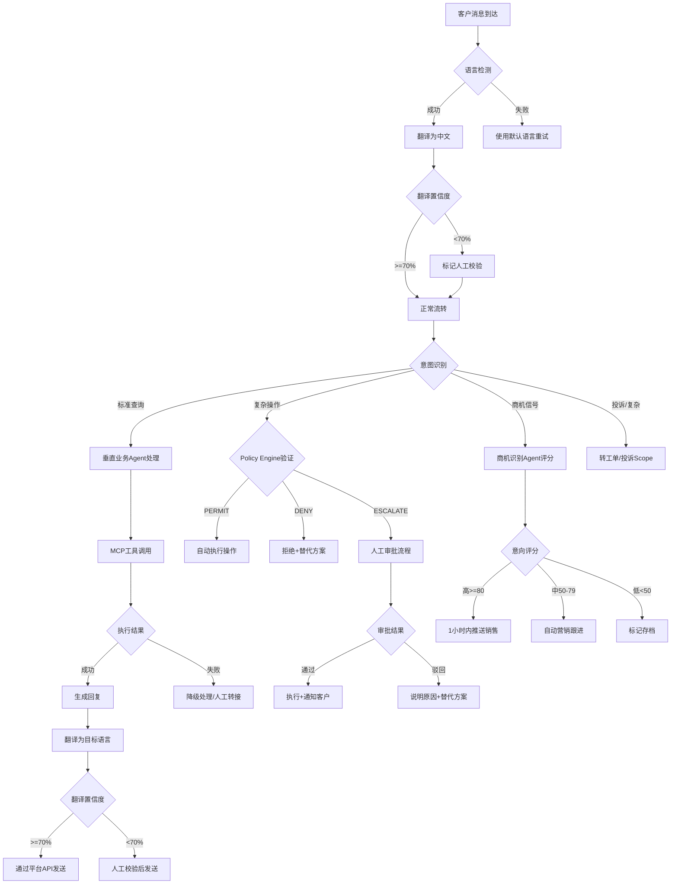

# 跨境与行业垂直客服 — 标准作业程序 (SOP)

## 一、总体概述

本SOP覆盖跨境电商多平台智能客服和行业垂直场景自动化处理的全流程标准作业规范，包含8个核心SOP流程，从消息接入到数据分析形成完整的服务闭环。所有流程以"确保各平台响应时限达标率>=95%、夜间漏单率<5%、商机转化持续提升"为核心目标。

---

## 二、RACI矩阵

| 流程步骤 | 多平台网关Agent | 垂直业务处理Agent | 商机识别Agent | 跨境分析Agent | 人工坐席 | 运维团队 | 管理层 |
|---------|:---:|:---:|:---:|:---:|:---:|:---:|:---:|
| SOP-1: 多平台消息接入与翻译 | **R/A** | I | I | I | C | C | I |
| SOP-2: 7×24小时服务保障 | **R** | R | I | I | **A** | C | I |
| SOP-3: Policy Engine业务决策 | I | **R/A** | I | C | C | I | I |
| SOP-4: 商机识别与跟进 | C | C | **R/A** | I | C | I | I |
| SOP-5: 跨会话记忆管理 | C | **R/A** | C | I | I | C | I |
| SOP-6: 高额操作人工审批 | I | **R** | I | I | **A** | I | C |
| SOP-7: 平台异常应急 | **R** | I | I | C | C | **A** | I |
| SOP-8: 翻译质量持续优化 | C | I | I | **R/A** | C | C | I |

> R=Responsible(执行), A=Accountable(最终负责), C=Consulted(咨询), I=Informed(知会)

---

## 三、核心SOP流程

### SOP-1: 多平台消息接入与翻译

#### 触发条件
- 任一平台（Shopee/Lazada/TikTok Shop/Amazon/独立站）有新客户消息到达
- 系统检测到新平台Webhook推送或长轮询有新数据

#### 执行步骤

| 步骤 | 动作 | 执行者 | 时限 | 输出 |
|------|------|--------|------|------|
| 1.1 | 接收平台原始消息，记录接收时间戳 | 多平台网关Agent | 即时 | 原始消息记录 |
| 1.2 | 解析消息格式，提取核心字段（发送者/内容/订单关联） | 多平台网关Agent | <1秒 | 结构化消息数据 |
| 1.3 | 执行消息去重（基于platform_message_id） | 多平台网关Agent | <500ms | 去重结果 |
| 1.4 | 自动语言检测（置信度>=80%为准） | 多平台网关Agent | <1秒 | 语言代码 |
| 1.5 | 调用翻译引擎，将源语言翻译为中文 | 多平台网关Agent | <2秒 | 翻译后消息+置信度 |
| 1.6 | 置信度评估：>=70%正常流转，<70%标记人工校验 | 多平台网关Agent | 即时 | 路由决策 |
| 1.7 | 计算SLA截止时间，生成标准化消息体 | 多平台网关Agent | 即时 | 标准消息体 |
| 1.8 | 推送至下游处理队列（垂直业务/商机/人工） | 多平台网关Agent | <500ms | 路由确认 |

#### 质检点
- 消息接入端到端延迟<3秒
- 翻译准确率>=90%（月度人工抽检）
- 翻译置信度<70%的消息100%进入人工校验
- 消息去重准确率100%（无遗漏、无误杀）

#### 异常处理
- **平台API超时**：记入缓存队列，5分钟后重试，3次失败通知运维
- **语言检测失败**：使用该平台目标市场的默认语言作为推测
- **翻译引擎不可用**：原文直传 + 标记需翻译 + 通知运维紧急恢复

---

### SOP-2: 7×24小时服务保障

#### 触发条件
- 系统全天候运行，按时段自动切换调度模式
- 时段变更点：08:00（切换为工作模式）、22:00（切换为夜间模式）
- 消息量突增超过预设阈值

#### 执行步骤

| 步骤 | 动作 | 执行者 | 时限 | 输出 |
|------|------|--------|------|------|
| 2.1 | 判断当前时段，加载对应调度策略 | 多平台网关Agent | 即时 | 调度模式 |
| 2.2 | 工作时段：查询在线坐席，按技能+负载匹配分配 | 多平台网关Agent | <1秒 | 分配结果 |
| 2.3 | 夜间时段：L1/L2消息由AI自动处理 | 垂直业务处理Agent | 自动 | 处理结果 |
| 2.4 | 夜间L3消息：缓存+通知值班人工 | 多平台网关Agent | <5分钟 | 值班人工确认 |
| 2.5 | 监控各平台SLA倒计时，接近超时提升优先级 | 多平台网关Agent | 持续 | SLA状态更新 |
| 2.6 | 队列积压>阈值时触发负载均衡/人工支援 | 多平台网关Agent | <1分钟 | 支援请求 |
| 2.7 | AI自动处理结果标记待次日复核（L2） | 垂直业务处理Agent | 自动 | 复核队列 |

#### 质检点
- 夜间漏单率<5%
- AI自动处理率(夜间)>=60%
- 各平台响应时限达标率>=95%
- 值班人工5分钟内确认L3消息
- 次日复核完成率100%（09:30前完成）

#### 异常处理
- **夜间值班人工无响应**：10分钟无响应 → 二级值班接手 → 20分钟仍无 → 通知管理层
- **AI处理能力不足**（错误率激增）：自动降级为全部缓存+紧急通知运维
- **消息量异常暴增**（>5倍日常）：触发高峰应急预案，全量AI快速首响+排队处理

---

### SOP-3: Policy Engine业务决策

#### 触发条件
- 客户请求涉及资金变动（退款、补偿、转账）
- 客户请求涉及高风险操作（账户变更、大额交易）
- 业务规则验证需求（退改签时限、优惠适用条件等）

#### 执行步骤

| 步骤 | 动作 | 执行者 | 时限 | 输出 |
|------|------|--------|------|------|
| 3.1 | 接收业务操作请求，解析操作类型和参数 | 垂直业务处理Agent | 即时 | 请求解析结果 |
| 3.2 | 验证客户身份（订单号+手机尾号双重验证） | 垂直业务处理Agent | <30秒 | 身份验证结果 |
| 3.3 | 加载对应操作类型的规则集（最新版本） | 垂直业务处理Agent | <200ms | 规则集 |
| 3.4 | 执行前置条件验证（时效/完整性/重复提交） | 垂直业务处理Agent | <500ms | 前置验证结果 |
| 3.5 | 按优先级执行规则链评估 | 垂直业务处理Agent | <500ms | 规则匹配结果 |
| 3.6 | 输出决策：PERMIT/DENY/ESCALATE | 垂直业务处理Agent | 即时 | 决策结果 |
| 3.7 | PERMIT → 调用MCP工具执行操作 | 垂直业务处理Agent | <10秒 | 执行结果 |
| 3.8 | DENY → 生成拒绝原因+替代方案 → 回复客户 | 垂直业务处理Agent | <5秒 | 客户回复 |
| 3.9 | ESCALATE → 生成审批工单 → 推送审批队列 → 通知客户等待 | 垂直业务处理Agent | <1分钟 | 审批工单 |
| 3.10 | 写入审计日志（不可篡改） | 垂直业务处理Agent | 即时 | 审计记录 |

#### 质检点
- 规则判定准确率>=95%
- ESCALATE到人工后2小时内处理完成
- 人工推翻DENY决策的比例<10%
- 身份验证通过率监控（异常低可能说明客户体验问题）
- 审计日志完整性100%

#### 异常处理
- **身份验证失败**：允许2次重试，仍失败 → 引导人工协助验证
- **规则引擎异常**：熔断 → 所有操作默认ESCALATE → 通知运维
- **MCP工具调用失败**：重试1次 → 仍失败 → 记录+人工转接
- **审批超时（>2小时）**：自动升级至上级审批人+通知客户延迟原因

---

### SOP-4: 商机识别与跟进

#### 触发条件
- 客户对话消息流中检测到购买意向信号
- 促销活动期间的主动商机筛查
- 定期的沉默客户激活评估

#### 执行步骤

| 步骤 | 动作 | 执行者 | 时限 | 输出 |
|------|------|--------|------|------|
| 4.1 | 实时分析对话内容，检测购买意向信号 | 商机识别Agent | 实时(<1秒) | 信号列表 |
| 4.2 | 多维度综合评分（信号+客户+产品+时效+竞争） | 商机识别Agent | <500ms | 意向度评分 |
| 4.3 | 高意向(>=80)：生成商机卡片+客户画像摘要 | 商机识别Agent | <1分钟 | 商机卡片 |
| 4.4 | 高意向：1小时内推送至对应销售人员 | 商机识别Agent | <1小时 | 推送确认 |
| 4.5 | 中意向(50-79)：选择营销策略并执行 | 商机识别Agent | <30分钟 | 营销动作 |
| 4.6 | 低意向(<50)：标记存档，纳入批量营销池 | 商机识别Agent | 即时 | 存档记录 |
| 4.7 | 跟踪转化结果（7天/14天/30天窗口） | 商机识别Agent | 持续 | 转化数据 |
| 4.8 | 基于转化反馈优化评分模型 | 商机识别Agent | 月度 | 模型更新 |

#### 质检点
- 高意向客户1小时内推送率>=95%
- 商机标记准确率>=80%
- 月度转化率环比提升（或持平，不可连续下降）
- 客户不因营销跟进而投诉（营销投诉率<0.5%）
- 销售团队2小时内响应高意向推送的比例>=80%

#### 异常处理
- **销售未响应高意向推送**：2小时 → 升级提醒 → 4小时 → 转分配其他销售
- **营销内容引发客户不满**：立即停止该客户的营销 → 标记免打扰 → 分析原因
- **评分模型异常**（高意向转化率持续<15%）：暂停模型 → 人工复核 → 校准后恢复

---

### SOP-5: 跨会话记忆管理

#### 触发条件
- 客户发起新会话时自动触发记忆加载
- 对话结束时自动触发记忆保存
- 客户请求删除个人数据时触发记忆清除

#### 执行步骤

| 步骤 | 动作 | 执行者 | 时限 | 输出 |
|------|------|--------|------|------|
| 5.1 | 客户发起会话 → 检索统一客户ID | 垂直业务处理Agent | <100ms | 客户ID |
| 5.2 | 判断距上次交互时间，决定加载STM/LTM | 垂直业务处理Agent | <100ms | 加载策略 |
| 5.3 | <24小时：加载STM（上次对话摘要+未解决问题） | 垂直业务处理Agent | <200ms | STM内容 |
| 5.4 | 加载LTM（语言偏好/常购品类/历史模式） | 垂直业务处理Agent | <200ms | LTM内容 |
| 5.5 | 将记忆上下文注入当前对话，免重复信息采集 | 垂直业务处理Agent | 即时 | 上下文注入 |
| 5.6 | 对话过程中实时更新STM（增量） | 垂直业务处理Agent | 持续 | STM更新 |
| 5.7 | 对话结束时保存STM快照 | 垂直业务处理Agent | <1秒 | STM持久化 |
| 5.8 | 基于累计交互数据更新LTM偏好 | 垂直业务处理Agent | 异步 | LTM更新 |
| 5.9 | 定期验证LTM偏好准确性（30天周期） | 垂直业务处理Agent | 月度 | 准确性报告 |

#### 质检点
- STM 24小时内有效覆盖率>=98%（客户再次咨询时成功加载）
- LTM偏好准确率>=85%（通过行为验证）
- 记忆加载延迟<200ms
- 隐私数据合规存储100%
- 客户要求删除时48小时内完成

#### 异常处理
- **记忆加载失败**：退化为无记忆模式正常服务 → 异步修复 → 不因此拒绝服务
- **跨平台身份冲突**：暂使用当前平台记忆 → 标记冲突 → 人工确认后合并
- **隐私合规告警**：发现存储了禁止字段 → 立即删除 → 记录合规事件 → 排查原因

---

### SOP-6: 高额操作人工审批

#### 触发条件
- Policy Engine输出ESCALATE决策
- 退款金额>500元
- 转账/支付金额>5000元
- 其他超出AI自动处理权限的操作

#### 执行步骤

| 步骤 | 动作 | 执行者 | 时限 | 输出 |
|------|------|--------|------|------|
| 6.1 | 接收ESCALATE决策，生成审批工单 | 垂直业务处理Agent | <1分钟 | 审批工单 |
| 6.2 | 附加完整上下文（客户信息/操作详情/风险评估） | 垂直业务处理Agent | <1分钟 | 增强工单 |
| 6.3 | 根据金额段推送至对应审批人 | 垂直业务处理Agent | 即时 | 推送确认 |
| 6.4 | 向客户发送等待通知（预计30分钟内处理） | 垂直业务处理Agent | <2分钟 | 客户通知 |
| 6.5 | 审批人审核并做出决策（通过/驳回/调整） | 人工审批人 | <=30分钟 | 审批决策 |
| 6.6 | 通过 → 执行操作 → 通知客户结果 | 垂直业务处理Agent | <5分钟 | 执行确认 |
| 6.7 | 驳回 → 生成驳回说明+替代方案 → 通知客户 | 垂直业务处理Agent | <5分钟 | 客户回复 |
| 6.8 | 记录审批决策至审计日志 | 垂直业务处理Agent | 即时 | 审计记录 |

#### 质检点
- 审批流转时间<=30分钟
- 审批决策正确率>=98%
- 客户等待时主动告知进度（15分钟无进展再次通知）
- 审批超时率<5%

#### 异常处理
- **审批人30分钟未响应**：自动升级至上级审批人 + 通知原审批人
- **审批通过后执行失败**：重试 → 失败通知运维 → 告知客户延迟 → 人工处理
- **客户在等待期间取消请求**：标记审批工单为"已取消" → 不执行操作

---

### SOP-7: 平台异常应急

#### 触发条件
- 平台API连接失败或响应超时
- 消息接收量突然归零（可能是Webhook失效）
- 消息发送持续失败
- 平台系统维护公告

#### 执行步骤

| 步骤 | 动作 | 执行者 | 时限 | 输出 |
|------|------|--------|------|------|
| 7.1 | 检测到API异常（连续3次调用失败） | 多平台网关Agent | <1分钟 | 异常告警 |
| 7.2 | 启动消息缓存机制（本地队列暂存） | 多平台网关Agent | 即时 | 缓存确认 |
| 7.3 | 定时重试（5分钟间隔，最多3次） | 多平台网关Agent | 15分钟内 | 重试结果 |
| 7.4 | 3次重试失败 → 通知运维团队 | 多平台网关Agent | 即时 | 运维通知 |
| 7.5 | 运维确认故障范围和预计恢复时间 | 运维团队 | <15分钟 | 故障评估 |
| 7.6 | 对受影响的客户通过替代渠道联系（如邮件/短信） | 多平台网关Agent | <30分钟 | 替代通知 |
| 7.7 | 平台恢复后 → 清理缓存队列（按时间顺序处理） | 多平台网关Agent | <30分钟 | 队列清理 |
| 7.8 | 事后生成故障报告（影响范围+根因+改进） | 跨境分析Agent | <24小时 | 故障报告 |

#### 质检点
- API故障检测时间<=1分钟
- 消息缓存零丢失（缓存期间无消息遗漏）
- 恢复后30分钟内清理完积压队列
- 故障期间受影响客户的替代通知覆盖率>=90%
- 故障报告24小时内输出

#### 异常处理
- **缓存队列溢出**（>10000条）：立即通知管理层 → 启动手动消息转移
- **长时间故障（>2小时）**：启动应急人工团队 → 通过替代平台（邮件/电话）联系客户
- **多平台同时故障**：按GMV优先级排序恢复 → 全量客户发送统一通知

---

### SOP-8: 翻译质量持续优化

#### 触发条件
- 月度翻译质量评估周期（每月1-5日）
- 客户因翻译问题投诉（实时触发）
- 新市场/新语言上线前的质量基线建立
- 翻译引擎版本更新后的效果验证

#### 执行步骤

| 步骤 | 动作 | 执行者 | 时限 | 输出 |
|------|------|--------|------|------|
| 8.1 | 按语言×消息类型分层抽样200+条翻译记录 | 跨境分析Agent | 月度 | 抽样集 |
| 8.2 | 专业翻译团队进行人工评分（5分制） | 人工翻译团队 | 5工作日 | 评分结果 |
| 8.3 | 计算各语言翻译准确率和分场景准确率 | 跨境分析Agent | <1天 | 质量报告 |
| 8.4 | 识别系统性翻译偏差模式 | 跨境分析Agent | <1天 | 问题模式 |
| 8.5 | 输出术语库更新建议和模型优化方向 | 跨境分析Agent | <2天 | 优化建议 |
| 8.6 | 执行术语库更新（新增/修正术语映射） | 运维团队 | <5工作日 | 术语库更新 |
| 8.7 | 验证优化效果（对比前后指标） | 跨境分析Agent | 下一周期 | 效果验证 |
| 8.8 | 更新翻译质量改进台账 | 跨境分析Agent | 即时 | 台账记录 |

#### 质检点
- 月度人工抽检200+条完成率100%
- 术语库月更新率100%（每月至少更新一次）
- 客户因翻译问题投诉率<1%
- 优化建议10工作日内落地率>=80%
- 翻译准确率月度环比不降（>=90%）

#### 异常处理
- **某语言准确率骤降（<80%）**：立即增加该语言的人工校验比例至50% → 紧急排查
- **新术语大量涌入（大促/新品类）**：启动紧急术语采集 → 48小时内完成术语库扩展
- **翻译引擎升级后质量下降**：回滚至上一版本 → 分析问题 → 修复后重新上线

---

## 四、决策树

---

## 五、KPI指标体系

### 第一层：核心业务指标

| 指标 | 目标值 | 计算方式 | 监控频率 | 责任Agent |
|------|--------|----------|----------|-----------|
| 多平台消息接入延迟 | <3秒 | 消息到达时间-系统确认时间 | 实时 | 多平台网关 |
| 各平台响应时限达标率 | >=95% | 达标消息数/总消息数 | 每小时 | 多平台网关 |
| 夜间漏单率 | <5% | 夜间无响应消息/夜间总消息 | 每日 | 多平台网关 |
| AI自动处理率(夜间) | >=60% | AI处理数/夜间总处理数 | 每日 | 垂直业务处理 |
| Policy Engine决策准确率 | >=95% | 正确决策数/总决策数 | 每周 | 垂直业务处理 |

### 第二层：质量指标

| 指标 | 目标值 | 计算方式 | 监控频率 | 责任Agent |
|------|--------|----------|----------|-----------|
| 多语言翻译准确率 | >=90% | 人工抽检>=4分的比例 | 月度 | 跨境分析 |
| 翻译问题投诉率 | <1% | 翻译投诉数/总翻译量 | 每周 | 跨境分析 |
| 跨会话记忆命中率(STM) | >=98% | STM成功加载数/应加载数 | 每日 | 垂直业务处理 |
| LTM偏好准确率 | >=85% | 偏好验证正确数/验证总数 | 月度 | 垂直业务处理 |
| 高额操作审批正确率 | >=98% | 正确审批/总审批数 | 每周 | 人工审批 |

### 第三层：商业转化指标

| 指标 | 目标值 | 计算方式 | 监控频率 | 责任Agent |
|------|--------|----------|----------|-----------|
| 商机识别准确率 | >=80% | 有效商机/标记总数 | 每周 | 商机识别 |
| 高意向商机1小时推送率 | >=95% | 1小时内推送数/高意向总数 | 每日 | 商机识别 |
| 商机转化率 | 环比提升 | 成交数/推送数 | 每月 | 商机识别 |
| 高额操作审批流转时间 | <=30分钟 | 提交到决策的时间 | 每日 | 垂直业务处理 |

### 第四层：系统健康指标

| 指标 | 目标值 | 计算方式 | 监控频率 | 责任Agent |
|------|--------|----------|----------|-----------|
| API故障检测时间 | <=1分钟 | 故障发生到检测的时间差 | 实时 | 多平台网关 |
| 消息缓存零丢失 | 100% | 缓存消息最终处理率 | 事件触发 | 多平台网关 |
| 平台店铺评分 | >4.5(Shopee) | 平台API采集 | 每小时 | 跨境分析 |
| 平台回复率 | >80% | 平台API采集 | 每小时 | 跨境分析 |

---

## 六、质量检查点汇总

| 检查频率 | 检查内容 | 执行方式 | 不达标处理 |
|----------|----------|----------|------------|
| 实时 | 消息接入延迟<3秒 | 系统自动监控 | 触发告警→运维排查 |
| 实时 | SLA倒计时预警 | 系统自动监控 | 优先级提升→人工干预 |
| 每日 | 夜间漏单率<5% | 系统自动统计 | 分析原因→调整调度策略 |
| 每日 | AI自动处理率>=60% | 系统自动统计 | 优化AI能力→调整任务分配 |
| 每周 | Policy Engine准确率>=95% | 人工+系统验证 | 规则审查→调优→灰度验证 |
| 每周 | 商机推送率>=95% | 系统自动统计 | 排查推送失败原因→修复 |
| 月度 | 翻译准确率>=90% | 人工抽检200+条 | 术语库更新→模型优化 |
| 月度 | 商机转化率环比 | 数据分析 | 模型校准→策略调整 |
| 季度 | 全流程SOP合规审计 | 管理层审核 | 更新SOP→培训→执行 |

---

## 七、跨Scope协作接口

| 协作场景 | 源Scope | 目标Scope | 触发条件 | 数据传递 |
|----------|---------|-----------|----------|----------|
| 复杂case建单 | 跨境垂直客服 | 工单处理 | AI无法自动处理的复杂问题 | 翻译后的客户请求+上下文 |
| 投诉转入 | 跨境垂直客服 | 投诉管理 | 识别为投诉的跨境客户消息 | 客户信息+投诉内容+平台来源 |
| 知识盲区反馈 | 跨境垂直客服 | 知识库运营 | 高频咨询但知识库未覆盖的场景 | 问题描述+频次+影响范围 |
| 知识内容获取 | 跨境垂直客服 | 知识库运营 | AI自动回复需要知识库支撑 | 查询关键词+品类+语言 |
| 高额操作审批 | 跨境垂直客服 | 工单处理 | ESCALATE决策生成的审批工单 | 审批工单详情+客户上下文 |
