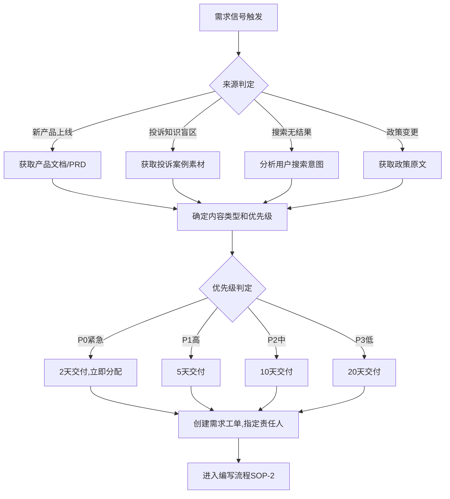
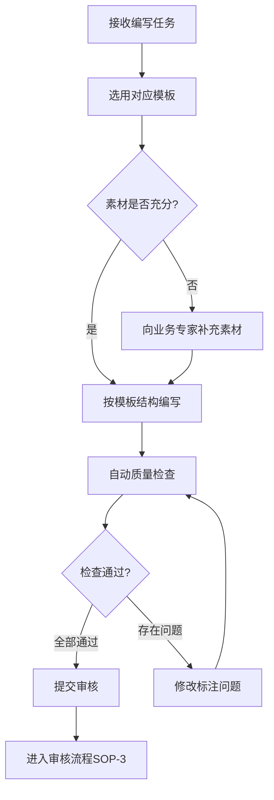
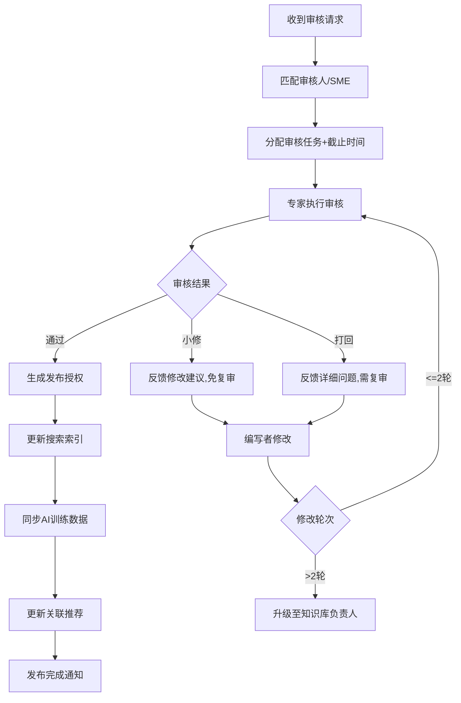
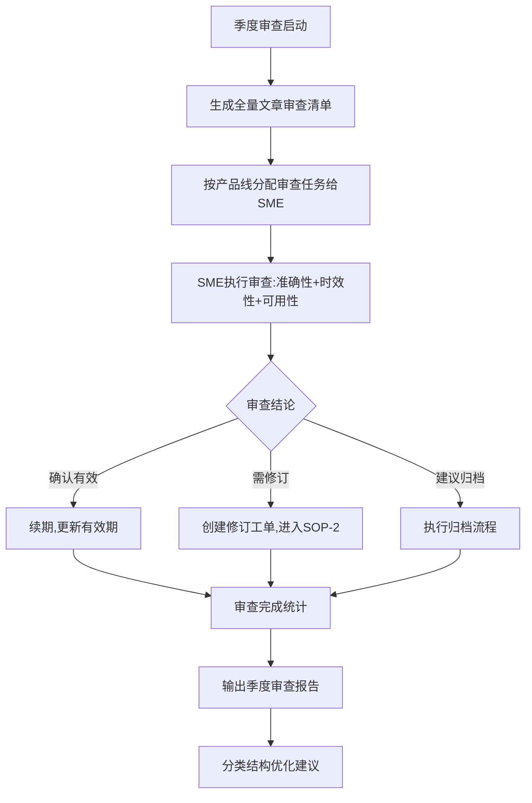

# 知识库运营标准操作流程 (SOP)

## 1. 概述

本SOP定义了知识库运营的七大核心流程，覆盖内容从需求识别到归档退役的完整生命周期。知识库是客户服务体系的知识底座，其质量直接影响AI自动处理率和人工首次解决率。本流程的核心目标是：

- 知识库覆盖率 >=95%
- 搜索命中率 >=90%
- 文章有效性（解决率）>=80%
- 新产品知识按时就绪率 100%
- 过期内容占比 <5%

---

## 2. RACI 责任矩阵

| 流程步骤 | 内容生命周期Agent (R) | 知识质量优化Agent (A) | 知识编写辅助Agent (C) | 业务专家/SME (I) | 管理层 |
|----------|:---:|:---:|:---:|:---:|:---:|
| **SOP-1: 内容需求识别** | R/A | C | I | I | I |
| **SOP-2: 内容创建编写** | A | C | R | C | I |
| **SOP-3: 内容审核发布** | R/A | C | I | R(审核) | I |
| **SOP-4: 版本管理** | R/A | I | C | I | I |
| **SOP-5: 季度审查** | R | A | C | R(审查) | A |
| **SOP-6: 搜索优化** | I | R/A | C | I | I |
| **SOP-7: AI数据同步** | R | A | I | I | I |
| **紧急发布** | R | I | R(编写) | C | A(授权) |

> R=Responsible(执行), A=Accountable(负责), C=Consulted(咨询), I=Informed(知会)

---

## 3. SOP-1: 新内容创建流程

### 触发条件
- 新产品/功能确认上线日期（T-7工作日自动触发）
- 投诉根因分析报告标注"知识盲区"
- 搜索无结果TOP关键词月度统计出炉
- 业务政策变更通知发布
- 手动提交的知识需求工单

### 执行步骤



### 详细操作

| 步骤 | 操作 | 责任Agent | 时限 | 输出物 |
|------|------|-----------|------|--------|
| 1.1 | 监控需求信号源，识别新需求 | 内容生命周期Agent | 持续 | 原始需求信息 |
| 1.2 | 评估需求优先级（影响面×紧急度） | 内容生命周期Agent | 2小时(P0)/1天(其他) | 优先级标记 |
| 1.3 | 检索现有知识库避免重复 | 知识编写辅助Agent | 30分钟 | 重复检查结果 |
| 1.4 | 确定内容类型和模板 | 内容生命周期Agent | 30分钟 | 类型确定 |
| 1.5 | 分配编写责任人和时限 | 内容生命周期Agent | 1小时 | 需求工单 |
| 1.6 | 收集相关素材并移交 | 内容生命周期Agent | 4小时 | 素材包 |

### 质检点
- ✅ 新产品知识需求在上线前5工作日100%完成立项
- ✅ 模板合规率>=95%（选用正确的内容类型模板）
- ✅ 需求工单信息完整率100%（含优先级、类型、责任人、时限）

### 异常处理
- **异常1**: 产品上线提前，来不及按正常流程 → 启动紧急发布流程
- **异常2**: 无法确定内容类型 → 升级至知识库负责人判定
- **异常3**: 无可用SME编写 → 内容生命周期Agent协调资源或外包

---

## 4. SOP-2: 内容编写与创建

### 触发条件
- 收到内容需求工单（来自SOP-1）
- 收到季度审查中标注"需修订"的文章
- 收到紧急发布的编写请求

### 执行步骤



### 详细操作

| 步骤 | 操作 | 责任Agent | 时限 | 输出物 |
|------|------|-----------|------|--------|
| 2.1 | 分析素材，确定模板和结构 | 知识编写辅助Agent | 1小时 | 编写计划 |
| 2.2 | 按模板结构编写/转化内容 | 知识编写辅助Agent | 1-3天(视类型) | 文章草稿 |
| 2.3 | 补全元数据（产品/场景/有效期/责任人） | 知识编写辅助Agent | 30分钟 | 完整元数据 |
| 2.4 | 生成关键词标签和摘要 | 知识编写辅助Agent | 15分钟 | 标签+摘要 |
| 2.5 | 执行质量预检（格式/术语/完整性） | 知识编写辅助Agent | 30分钟 | 检查报告 |
| 2.6 | 修正预检发现的问题 | 知识编写辅助Agent | 1-4小时 | 修正后内容 |
| 2.7 | 提交审核 | 知识编写辅助Agent | 即时 | 审核工单 |

### 质检点
- ✅ 元数据四要素（适用产品/场景/有效期/责任人）100%填写
- ✅ 模板结构合规率>=95%
- ✅ 质量预检通过后才可提交审核
- ✅ 编写周期不超过分配时限

### 异常处理
- **异常1**: 素材不足无法编写 → 退回需求工单并说明缺失信息
- **异常2**: 涉及合规/法律内容 → 必须标注需法务审核
- **异常3**: 编写超时 → 通知内容生命周期Agent协调支援

---

## 5. SOP-3: 内容审核与发布

### 触发条件
- 收到编写完成的审核提交
- 收到修订后的复审请求
- 收到紧急发布后的补审请求

### 执行步骤



### 详细操作

| 步骤 | 操作 | 责任Agent | 时限 | 输出物 |
|------|------|-----------|------|--------|
| 3.1 | 根据产品线匹配审核专家 | 内容生命周期Agent | 1小时 | 审核人分配 |
| 3.2 | 发送审核任务（含检查清单） | 内容生命周期Agent | 即时 | 审核通知 |
| 3.3 | 专家执行审核（准确性+完整性） | 业务专家SME | <=2工作日 | 审核意见 |
| 3.4 | 整理审核反馈并传递 | 内容生命周期Agent | 2小时 | 结构化反馈 |
| 3.5 | 编写者执行修改 | 知识编写辅助Agent | 1工作日 | 修订稿 |
| 3.6 | 审核通过后发布上线 | 内容生命周期Agent | 4小时 | 已发布文章 |
| 3.7 | 同步搜索索引和AI数据 | 内容生命周期Agent | 24小时内 | 同步确认 |

### 质检点
- ✅ 专家审核首次通过率>=80%
- ✅ 审核周期<=2工作日
- ✅ 发布后24小时内完成AI数据同步
- ✅ 审核意见具体可操作（非模糊反馈）

### 异常处理
- **异常1**: 审核人2小时未签收 → 自动提醒，4小时未签收转备审人
- **异常2**: 审核超时（超过2工作日）→ 升级通知组长
- **异常3**: 审核人与编写人对内容存在分歧 → 知识库负责人裁决

---

## 6. SOP-4: 内容版本管理

### 触发条件
- 任何已发布文章的内容修改
- 政策变更导致的批量内容更新
- 产品版本升级导致的内容修订

### 执行步骤

| 步骤 | 操作 | 责任Agent | 时限 | 输出物 |
|------|------|-----------|------|--------|
| 4.1 | 修改前创建当前版本快照 | 内容生命周期Agent | 即时 | 版本快照 |
| 4.2 | 记录变更原因和范围 | 内容生命周期Agent | 修改时 | 变更记录 |
| 4.3 | 判定修改级别（重大/轻微） | 内容生命周期Agent | 15分钟 | 级别判定 |
| 4.4 | 重大修改→进入审核流程 | 内容生命周期Agent | 即时 | 审核工单 |
| 4.5 | 轻微修改→快速发布并记录 | 内容生命周期Agent | 1小时 | 更新记录 |
| 4.6 | 更新版本号和变更日志 | 内容生命周期Agent | 即时 | 版本日志 |

### 质检点
- ✅ 变更记录完整率100%（每次修改有记录）
- ✅ 历史版本100%可追溯（可恢复任意历史版本）
- ✅ 重大修改100%经过审核

### 版本号规则
- 主版本号（X.0）：内容逻辑大幅变化、适用范围变更
- 次版本号（X.Y）：信息补充、步骤调整、准确性修正
- 修订号（X.Y.Z）：错别字、格式调整、标签更新

---

## 7. SOP-5: 季度全面审查

### 触发条件
- 每季度第1个月第1周自动启动
- 管理层要求的专项审查

### 执行步骤



### 详细操作

| 步骤 | 操作 | 责任Agent | 时限 | 输出物 |
|------|------|-----------|------|--------|
| 5.1 | 生成待审查文章清单（全量） | 内容生命周期Agent | 1天 | 审查清单 |
| 5.2 | 按产品线分批分配（4周完成） | 内容生命周期Agent | 1天 | 分配计划 |
| 5.3 | SME执行审查并提交结论 | 业务专家SME | 每批5天 | 审查结论 |
| 5.4 | 汇总结论，对"需修订"创建工单 | 内容生命周期Agent | 2天 | 修订工单 |
| 5.5 | 对"建议归档"执行归档（7天异议期） | 内容生命周期Agent | 7天 | 归档记录 |
| 5.6 | 分析审查结果，输出分类优化建议 | 知识质量优化Agent | 3天 | 优化建议 |
| 5.7 | 输出季度审查报告 | 内容生命周期Agent | 2天 | 审查报告 |

### 质检点
- ✅ 审查覆盖率100%（全量文章均被审查）
- ✅ 过期内容处理率>=95%（到期文章95%已被处理）
- ✅ 审查周期不超过4周
- ✅ 归档前7天异议期100%执行

### 异常处理
- **异常1**: SME审查进度滞后 → 每周check进度，滞后超过3天升级
- **异常2**: 大量文章需修订（超过30%）→ 评估是否需要额外资源
- **异常3**: 对归档有异议 → 知识库负责人最终裁决

---

## 8. SOP-6: 搜索优化

### 触发条件
- 搜索命中率低于90%
- 月度同义词库定期更新周期到达
- 新业务/产品上线后的搜索适配
- 搜索无结果TOP关键词显著变化

### 执行步骤

| 步骤 | 操作 | 责任Agent | 时限 | 输出物 |
|------|------|-----------|------|--------|
| 6.1 | 分析搜索日志，识别命中失败原因 | 知识质量优化Agent | 持续 | 问题诊断 |
| 6.2 | 区分内容缺失vs检索问题 | 知识质量优化Agent | 1天 | 分类结论 |
| 6.3 | 内容缺失→转入SOP-1需求流程 | 知识质量优化Agent | 即时 | 需求工单 |
| 6.4 | 检索问题→制定同义词/标签优化方案 | 知识质量优化Agent | 2天 | 优化方案 |
| 6.5 | 执行同义词库更新 | 知识质量优化Agent | 1天 | 更新包 |
| 6.6 | 执行标签体系调整 | 知识质量优化Agent | 2天 | 调整清单 |
| 6.7 | 回归测试验证效果 | 知识质量优化Agent | 1天 | 测试报告 |
| 6.8 | 效果验证（优化前后对比） | 知识质量优化Agent | 1周后 | 效果报告 |

### 质检点
- ✅ 搜索命中率>=90%
- ✅ 同义词库月度更新率100%（每月至少更新一次）
- ✅ 优化后搜索命中率不降（回归测试通过）
- ✅ 标签体系无冗余（同一概念不超过1个标签）

### 异常处理
- **异常1**: 优化后命中率反而下降 → 立即回滚，重新分析
- **异常2**: 分类结构需大改（影响>30%文章）→ 需管理层审批
- **异常3**: 新业务术语无法映射到现有体系 → 启动标签体系扩展流程

---

## 9. SOP-7: AI数据同步与准确率监控

### 触发条件
- 知识库文章发布/更新/归档
- AI回答准确率监控触发预警
- AI模型版本更新后的效果验证
- 定期（每日）准确率检查

### 执行步骤

| 步骤 | 操作 | 责任Agent | 时限 | 输出物 |
|------|------|-----------|------|--------|
| 7.1 | 文章发布后触发AI数据同步 | 内容生命周期Agent | 发布后即时 | 同步请求 |
| 7.2 | 确认AI系统已加载新内容 | 内容生命周期Agent | 24小时内 | 同步确认 |
| 7.3 | 监控AI回答准确率指标 | 知识质量优化Agent | 持续 | 监控数据 |
| 7.4 | 准确率异常时触发归因分析 | 知识质量优化Agent | 预警后2小时 | 归因报告 |
| 7.5 | 知识内容问题→推送修正工单 | 知识质量优化Agent | 即时 | 修正工单 |
| 7.6 | AI理解问题→推送AI团队工单 | 知识质量优化Agent | 即时 | AI调优工单 |
| 7.7 | 修正后效果验证 | 知识质量优化Agent | 修正后3天 | 验证报告 |

### 质检点
- ✅ 知识发布后24小时内完成AI系统同步
- ✅ AI回答准确率>=95%（知识库相关回答）
- ✅ 准确率预警响应时间<=2小时
- ✅ 偏差修正后验证通过率>=90%

### 异常处理
- **异常1**: AI同步失败 → 重试3次，仍失败升级至技术团队
- **异常2**: 准确率大面积下降（>5%）→ 紧急排查，必要时暂停AI自动回复
- **异常3**: 无法判定偏差归因 → AI团队和内容团队联合排查

---

## 10. 紧急发布流程

### 触发条件
- 重大系统故障（影响>100客户/小时）
- 监管政策即时生效要求
- 产品重大安全漏洞
- 舆情事件需统一口径

### 执行步骤

| 步骤 | 操作 | 责任人 | 时限 | 输出物 |
|------|------|--------|------|--------|
| E.1 | 确认紧急发布条件满足 | 管理层授权 | 30分钟 | 授权记录 |
| E.2 | 快速编写（使用精简模板） | 知识编写辅助Agent | 2小时 | 紧急内容 |
| E.3 | 基础准确性检查（事实核实） | 事故处理团队 | 30分钟 | 确认 |
| E.4 | 紧急发布上线 | 内容生命周期Agent | 即时 | 已发布 |
| E.5 | 通知所有在线坐席 | 内容生命周期Agent | 15分钟 | 通知记录 |
| E.6 | 同步AI系统（如涉及） | 内容生命周期Agent | 1小时 | 同步确认 |
| E.7 | 创建补审工单 | 内容生命周期Agent | 即时 | 补审任务 |
| E.8 | 48小时内完成正式审核 | 业务专家SME | 48小时 | 审核结论 |
| E.9 | 用正式版本替代紧急版本 | 内容生命周期Agent | 审核后4小时 | 正式内容 |

### 质检点
- ✅ 紧急内容2小时内完成发布
- ✅ 48小时内100%完成补审
- ✅ 紧急发布事件100%有授权记录
- ✅ 正式版本72小时内替代紧急版本

---

## 11. KPI指标与监控

| 指标 | 目标值 | 监控频率 | 预警阈值 | 责任Agent |
|------|--------|----------|----------|-----------|
| 知识库覆盖率 | >=95% | 月度 | <92% | 内容生命周期Agent |
| 搜索命中率 | >=90% | 每日 | <87% | 知识质量优化Agent |
| 文章解决率 | >=80% | 周度 | <75% | 知识质量优化Agent |
| AI回答准确率 | >=95% | 每日 | <92% | 知识质量优化Agent |
| 新产品知识按时就绪率 | 100% | 事件触发 | <100% | 内容生命周期Agent |
| 过期内容占比 | <5% | 月度 | >8% | 内容生命周期Agent |
| 内容审核首次通过率 | >=80% | 月度 | <70% | 知识编写辅助Agent |
| 审核周期 | <=2工作日 | 每次 | >3工作日 | 内容生命周期Agent |
| 同义词库更新率 | 月度100% | 月度 | 跳过任一月 | 知识质量优化Agent |
| 坐席满意度 | >=4.0/5 | 季度 | <3.5/5 | 知识质量优化Agent |

---

## 12. 决策树：内容需求处理

```
收到需求信号
├── 判断：是否已有类似内容？
│   ├── 是 → 判断：现有内容是否需要更新？
│   │   ├── 是 → 创建修订工单（SOP-4）
│   │   └── 否 → 关闭需求，标注"已覆盖"
│   └── 否 → 继续
├── 判断：需求优先级？
│   ├── P0（紧急）→ 是否满足紧急发布条件？
│   │   ├── 是 → 启动紧急发布流程
│   │   └── 否 → 加急创建流程（2天交付）
│   ├── P1（高）→ 标准创建流程（5天交付）
│   ├── P2（中）→ 标准创建流程（10天交付）
│   └── P3（低）→ 排入待办，20天内完成
├── 判断：编写者是否有时间？
│   ├── 是 → 直接分配
│   └── 否 → 协调备选编写者 / 外包
└── 进入SOP-2编写流程
```

---

## 13. 跨Scope协作接口

| 协作方向 | 触发条件 | 数据流 | 责任Agent |
|----------|----------|--------|-----------|
| 投诉管理→知识库 | 根因分析标注"知识盲区" | 投诉案例+缺失主题 | 内容生命周期Agent接收 |
| 知识库→工单处理 | 内容发布/更新 | 最新知识内容 | 内容生命周期Agent推送 |
| 工单处理→知识库 | AI自动回复效果数据 | 准确率+命中率数据 | 知识质量优化Agent接收 |
| 知识库→AI系统 | 内容审核通过发布 | 训练数据同步 | 内容生命周期Agent执行 |
| 满意度数据→知识库 | 知识相关低分反馈 | 低分归因信息 | 知识质量优化Agent接收 |

---

## 14. 附录：内容类型与标准

| 内容类型 | 默认有效期 | 审核级别 | 最大长度 | 典型场景 |
|----------|-----------|----------|----------|----------|
| FAQ | 6个月 | 标准审核 | 500字 | 高频问答 |
| 操作指南 | 3个月 | 标准审核 | 2000字 | 分步教程 |
| 故障排查手册 | 3个月 | 高级审核(需技术确认) | 3000字 | 决策树排错 |
| 话术模板 | 6个月 | 标准审核 | 1000字 | 沟通脚本 |
| 产品文档 | 跟随版本 | 高级审核(需产品确认) | 5000字 | 功能/定价/政策 |
