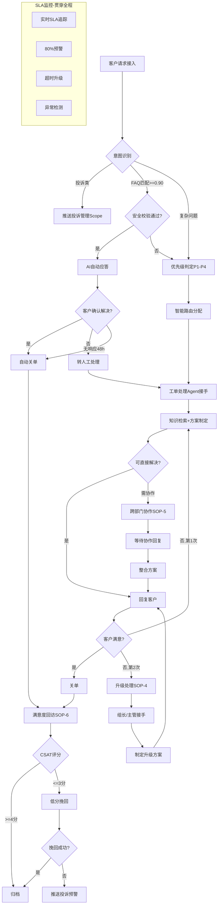

# 工单处理标准操作流程 (SOP)

## 1. 总览

本SOP定义了客户服务工单从接入到关闭全生命周期的标准操作流程，覆盖全渠道接入、智能分类、路由分配、工单处理、SLA监控、升级管理和满意度回访七大核心环节。适用于所有通过电话、在线聊天、邮件、微信/企微、APP和社交媒体渠道接入的客户服务请求。

### 核心目标
- 首次响应时间（FRT）达标率 >= 95%
- 首次解决率（FCR）>= 75%
- AI自动处理率 >= 40%
- 工单SLA达标率 >= 95%
- 客户满意度（CSAT）>= 4.2/5

---

## 2. RACI矩阵

| 流程步骤 | 全渠道路由Agent | 工单处理Agent | SLA监控Agent | 满意度回访Agent | 组长 | 主管 |
|----------|:---:|:---:|:---:|:---:|:---:|:---:|
| SOP-1: 工单接入与分类 | **R/A** | I | I | - | C | - |
| SOP-2: AI自动应答 | **R** | C | I | - | **A** | - |
| SOP-3: 人工工单处理 | I | **R/A** | I | - | C | - |
| SOP-4: SLA升级处理 | I | C | **R/A** | - | **R** | **R** |
| SOP-5: 跨部门协作 | - | **R/A** | I | - | C | - |
| SOP-6: 满意度回访 | - | I | - | **R/A** | C | I |
| SOP-7: 高峰应急 | **R** | R | **R/A** | - | R | **A** |

> R=Responsible（执行）, A=Accountable（问责）, C=Consulted（咨询）, I=Informed（知会）

---

## 3. SOP-1: 工单接入与分类

### 触发条件
- 客户通过任意渠道（电话/在线/邮件/微信/APP/社交媒体）发起服务请求

### 执行步骤

#### 步骤1.1: 渠道统一接入
- 全渠道路由Agent实时监听所有接入渠道
- 收到客户请求后立即创建工单记录（生成唯一工单号）
- 记录接入时间戳（作为SLA计算起点）、接入渠道、客户标识

#### 步骤1.2: 客户身份识别
- 通过手机号/账号/微信OpenID识别客户身份
- 调取客户画像：VIP等级、CLV值、历史工单、产品订购情况
- 未识别到客户身份时标记为"访客"，流程继续不阻断

#### 步骤1.3: 意图识别与分类
- 运用NLP分析客户消息内容
- 输出一级分类（咨询/问题/变更/投诉）和二级意图标签
- 置信度>=0.85确认分类，0.6-0.85标注低置信度，<0.6转人工确认
- 识别客户情绪状态（正面/中性/负面/愤怒）

#### 步骤1.4: 优先级判定
- 综合问题影响度、客户价值、渠道特征判定P1-P4优先级
- VIP客户自动提升一个优先级
- 监管渠道来源自动设为P1
- 重复来单（24h内第3次）自动升级一个优先级

#### 步骤1.5: 路由决策
- FAQ类且置信度>=0.90 → 触发AI自动应答（进入SOP-2）
- 识别为投诉 → 推送至投诉管理Scope
- 其他 → 执行智能路由分配（进入SOP-3）

### 输出物
- 完整工单记录（含分类、优先级、SLA时限）
- 路由分配决策结果
- SLA监控Agent接收到工单分配通知

### 异常处理
- 系统无法识别渠道来源 → 默认为"在线渠道"处理
- NLP服务不可用 → 降级为关键词匹配 + 人工分类
- 客户画像服务超时 → 按普通客户处理，后续补充画像

### 质检点
- 分类准确率 >= 92%
- 路由匹配度 >= 88%
- 接入到分配完成时间 < 30秒

---

## 4. SOP-2: AI自动应答

### 触发条件
- SOP-1中FAQ匹配度>=0.90的咨询类工单
- 客户情绪非"愤怒"状态
- 非敏感操作类问题

### 执行步骤

#### 步骤2.1: 知识匹配验证
- 二次确认FAQ匹配结果的准确性
- 验证FAQ内容是否在有效期内
- 检查是否存在适用条件限制（产品版本、地区等）

#### 步骤2.2: 回复内容生成
- 基于FAQ标准答案，结合客户具体信息生成个性化回复
- 根据渠道调整格式（在线简洁/邮件正式/微信精炼）
- 添加解决确认引导（"是否解决了您的问题？"）

#### 步骤2.3: 安全校验
- 排除涉及退款、账户操作等敏感操作
- 确认同一客户未连续2次收到未确认的自动回复
- 验证回复内容无敏感信息泄露

#### 步骤2.4: 发送与跟踪
- 发送自动回复并启动确认等待
- 客户确认解决 → 自动关单 → 进入SOP-6
- 客户选择"未解决" → 转人工处理（进入SOP-3）
- 24小时无反馈 → 发送提醒，48小时后自动关单

### 输出物
- 自动回复内容发送记录
- 客户确认/未确认状态
- AI自动解决率统计数据

### 异常处理
- 知识库无匹配结果 → 直接转人工，不猜测回答
- 自动回复发送失败 → 重试一次，仍失败转人工
- 客户在自动回复后表达不满 → 立即转人工+通知组长

### 质检点
- AI回复准确率 >= 95%
- 客户确认解决率（满意确认率）>= 80%
- 误发送率（错误/不相关内容）< 0.5%

---

## 5. SOP-3: 人工工单处理

### 触发条件
- SOP-1路由分配的复杂工单
- SOP-2自动应答未解决转人工的工单
- 客户主动要求人工服务

### 执行步骤

#### 步骤3.1: 工单接收与理解
- 工单处理Agent/坐席接收工单
- 完整阅读工单内容、客户画像和历史记录
- 确认理解客户核心诉求，必要时追问澄清

#### 步骤3.2: 知识检索与方案制定
- 在知识库中检索相关解决方案
- 评估方案适用性，必要时综合多源信息定制方案
- 方案必须包含：操作步骤、预期结果、异常处理

#### 步骤3.3: 客户沟通与方案执行
- 以同理心开头确认理解客户问题
- 清晰传达解决方案和操作步骤
- 需要客户操作的给出明确指引
- 需要等待的说明预计时间和后续安排

#### 步骤3.4: 结果确认与关单
- 方案执行后确认客户问题是否解决
- 客户确认解决 → 关单 → 进入SOP-6
- 客户不满意 → 分析原因 → 调整方案再沟通
- 两次方案均失败 → 标记"需升级" → 进入SOP-4
- 需跨部门协作 → 进入SOP-5

### 输出物
- 解决方案记录
- 客户沟通记录
- 工单状态更新（已解决/需升级/待协作）

### 异常处理
- 知识库无相关内容 → 记录为知识盲区，升级至组长处理
- 客户长时间无响应 → 48h发提醒，72h后暂挂处理
- 坐席离线/请假 → 工单自动回到队列重新路由

### 质检点
- 首次响应时间达标率 >= 95%
- 解决方案完整性评分 >= 4/5
- 首次解决率（FCR）>= 75%

---

## 6. SOP-4: SLA升级处理

### 触发条件
- 工单SLA消耗达80%触发预警
- 工单SLA消耗超100%触发升级
- 工单转派超过2次
- 坐席主动申请升级
- 两次方案均失败

### 执行步骤

#### 步骤4.1: 预警阶段（SLA 80%）
- SLA监控Agent发送黄色预警给当前处理坐席
- 预警内容：工单号+客户信息+剩余时间+建议加快处理
- 坐席收到预警后应在15分钟内更新工单进展

#### 步骤4.2: 一级升级（SLA超时50%，即消耗150%）
- 自动升级给组长
- 生成升级通知：工单摘要+处理历史+超时程度+建议动作
- 组长30分钟内必须接手或指定专人处理
- 记录升级事件

#### 步骤4.3: 二级升级（SLA超时100%，即消耗200%）
- 升级给主管
- 生成正式超时事件报告
- 主管15分钟内必须响应
- 可授权特殊处理权限（如加大补偿额度）

#### 步骤4.4: 升级后处理
- 升级接手人查看完整上下文
- 制定升级后的处理方案（可能包含额外补偿/特殊通道）
- 加快执行直至问题解决
- 解决后正常关单 → 进入SOP-6

### 输出物
- 预警通知记录
- 升级事件记录（含升级原因、接手人、处理结果）
- 超时事件报告

### 异常处理
- 组长未在30分钟内接手 → 自动升级至主管
- 主管未在15分钟内响应 → 通知部门总监
- 批量升级（5个以上同时超时）→ 判定为系统性事件，启动SOP-7

### 质检点
- 升级后1小时内必须有人接手
- 升级工单最终解决率 >= 90%
- 升级率控制在5%以内（超过说明一线处理能力不足）

---

## 7. SOP-5: 跨部门协作

### 触发条件
- 工单解决需要非客服部门的支持（财务审批、技术排查、物流确认等）
- 坐席权限不足以完成操作

### 执行步骤

#### 步骤5.1: 协作需求评估
- 确认问题确实需要跨部门协作（排除客服可自行处理的情况）
- 识别目标协作部门和具体需求
- 评估紧急度（基于工单SLA剩余时间）

#### 步骤5.2: 协作请求发起
- 构建标准化协作请求：问题描述+已排查内容+具体需求+时限
- 通过协作系统提交至目标部门
- 同步告知客户已转交相关部门处理，给出预计时间

#### 步骤5.3: 进度跟踪
- 4小时无响应 → 发送催促提醒
- 8小时无响应 → 升级通知对方部门主管
- 收到进展更新 → 及时同步给客户
- 客户追问 → 主动反馈最新进展状态

#### 步骤5.4: 结果整合
- 收到协作方回复后验证完整性
- 将专业回复翻译为客户语言
- 整合到完整解决方案中
- 回复客户并确认解决

### 输出物
- 协作请求记录
- 跨部门沟通记录
- 整合后的解决方案

### 异常处理
- 协作方回复信息不完整 → 追问补充，明确指出缺失信息
- 协作方超过SLA仍未回复 → 升级至双方主管协调
- 客户等不及要求取消 → 记录客户意愿，协作方可终止处理

### 质检点
- 协作请求响应时间 <= 4小时
- 信息传递完整性 100%（不因信息缺失被退回）
- 因协作导致的SLA超时率 < 3%

---

## 8. SOP-6: 满意度回访

### 触发条件
- 工单状态变为"已关闭"
- 排除条件：同一客户30天内已回访2次、客户设置免打扰

### 执行步骤

#### 步骤6.1: 回访触发
- 工单关闭后24小时内自动进入回访队列
- 升级/投诉工单关闭后12小时内进入
- 检查频率限制和免打扰设置

#### 步骤6.2: 渠道选择与发送
- 根据原始接入渠道选择回访方式
- 生成适配的调查内容（评分+开放反馈）
- 发送调查邀请

#### 步骤6.3: 结果收集
- 等待客户响应（截止时间72小时）
- 24小时无响应发送一次温和提醒
- 收到评分后立即记录并归类

#### 步骤6.4: 低分处理
- CSAT <= 3分 → 触发低分预警通知组长
- CSAT <= 2分且含投诉意向 → 推送投诉管理预警
- 发起二次挽回沟通 → 致歉+了解原因+补充方案
- 挽回结果记录

#### 步骤6.5: 数据分析与改进
- 汇总满意度数据（日/周/月）
- 识别低分集中的问题类型和坐席
- 输出改进建议报告
- 跟踪改进措施执行效果

### 输出物
- 满意度调查发送和收集记录
- 低分预警通知
- 挽回沟通记录和结果
- 满意度分析报告和改进建议

### 异常处理
- 调查发送失败 → 切换备选渠道重试
- 客户拒绝评价但表达不满 → 视同低分处理
- 客户评价内容含辱骂/违规信息 → 过滤后仅记录评分

### 质检点
- 回访触达率 >= 70%
- 低分挽回成功率 >= 40%
- 满意度报告按时输出率 100%

---

## 9. SOP-7: 高峰应急

### 触发条件
- 工单到达率超过日均基线3倍以上
- 全局排队等待人数超过阈值（可用坐席数的5倍）
- SLA监控发现批量超时风险（5个以上P2+工单同时接近超时）
- 系统故障导致批量类似问题来单

### 执行步骤

#### 步骤7.1: 应急判定（5分钟内完成）
- SLA监控Agent检测到异常模式
- 确认是否为系统性事件（同类问题批量出现）
- 评估影响范围和预计持续时间
- 通知主管启动应急预案

#### 步骤7.2: 应急措施启动
- **AI分流加强**：临时降低FAQ匹配阈值至0.85，扩大自动应答范围
- **SLA临时调整**：P3/P4工单SLA临时延长50%，保障P1/P2
- **溢出路由启用**：启动跨组支援和外包坐席接入
- **客户通知**：对排队客户发送等待通知和预计时间

#### 步骤7.3: 应急处理执行
- 对批量同类问题统一制定标准回复模板
- 合并相同客户的重复来单
- 优先处理VIP客户和P1/P2工单
- 非紧急工单进入延迟队列

#### 步骤7.4: 恢复与跟进
- 异常消除后评估积压量
- 制定积压清理计划（预计清理时间、需要的人力）
- 逐一跟进延迟处理的工单
- 对因应急导致体验受损的客户主动致歉

#### 步骤7.5: 事后复盘
- 记录应急事件全过程
- 统计影响面（受影响客户数、SLA破坏数）
- 分析根因并输出预防建议
- 更新应急预案和阈值参数

### 输出物
- 应急启动通知
- 应急措施执行记录
- 影响评估报告
- 事后复盘报告和改进建议

### 异常处理
- 应急判定存在误判（实际非系统性事件）→ 5分钟内取消应急，恢复正常
- 应急期间系统进一步恶化 → 升级至部门总监/CTO介入
- 应急超过4小时未缓解 → 启动更高级别的业务连续性计划

### 质检点
- 应急启动时间 <= 5分钟
- 客户等待时通知发送率 100%
- 应急期间P1/P2 SLA达标率 >= 80%
- 事后复盘报告48小时内产出

---

## 10. 决策树

---

## 11. KPI指标体系

### 效率指标
| 指标 | 目标值 | 计算方式 | 监控频率 |
|------|--------|----------|----------|
| 首次响应时间达标率 | >= 95% | 在SLA时限内首次响应的工单占比 | 实时 |
| 平均处理时长(AHT) | 行业基准±10% | 工单分配到关闭的平均时间 | 日报 |
| AI自动处理率 | >= 40% | AI自动解决工单数/总工单数 | 日报 |
| 工单积压量 | < 日均处理量50% | 当前未关闭工单总数 | 实时 |

### 质量指标
| 指标 | 目标值 | 计算方式 | 监控频率 |
|------|--------|----------|----------|
| 首次解决率(FCR) | >= 75% | 一次交互解决的工单占比 | 周报 |
| 工单SLA达标率 | >= 95% | SLA时限内解决的工单占比 | 实时 |
| 分类准确率 | >= 92% | 抽检正确分类的比例 | 周报 |
| 路由匹配度 | >= 88% | 分配后未被转派的比例 | 周报 |

### 体验指标
| 指标 | 目标值 | 计算方式 | 监控频率 |
|------|--------|----------|----------|
| 客户满意度(CSAT) | >= 4.2/5 | 满意度调查加权均分 | 日报 |
| 升级率 | < 5% | 升级工单数/总工单数 | 周报 |
| 重复联系率 | < 15% | 同客户同问题7天内再次联系 | 周报 |
| 回访触达率 | >= 70% | 成功触达回访的客户比例 | 周报 |

### 健康指标
| 指标 | 健康阈值 | 预警信号 | 响应动作 |
|------|----------|----------|----------|
| 升级率 | < 5% | 连续3天>5% | 分析一线处理瓶颈 |
| 重复来单率 | < 15% | 单周>20% | 检查方案有效性 |
| 坐席利用率 | 60-85% | <50%或>90% | 调整排班/增援 |
| 知识库命中率 | >= 90% | <85% | 补充知识盲区 |

---

## 12. 持续改进机制

### 日常改进
- 每日晨会review前日SLA破坏工单和低分评价
- 每周分析TOP5未解决/重复来单问题类型
- 每周更新FAQ和知识库热门文章

### 周期性审查
- 月度：SOP执行合规性审查、指标复盘和目标调整
- 季度：流程优化评审、系统能力升级评估
- 年度：SOP全面修订、SLA标准行业对标调整

### 反馈闭环
- 满意度低分 → 归因分析 → 改进措施 → 效果验证 → 标准固化
- 投诉根因 → 知识补充/流程优化 → 复发率监控
- 坐席反馈 → 工具/流程优化 → 效率提升验证
