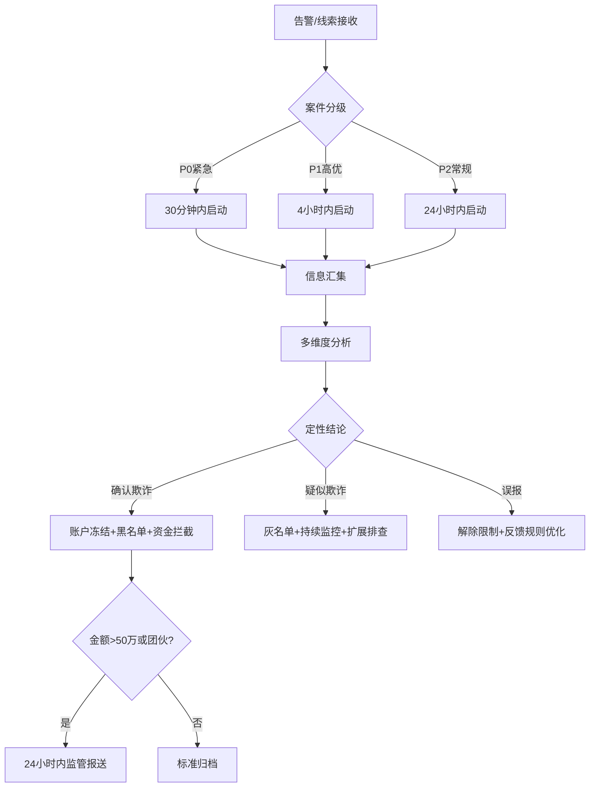

# 反欺诈中心标准操作规程 (SOP)

> 版本：v1.0 | 适用范围：反欺诈中心全业务流程 | 监管依据：《反洗钱法》、《支付结算办法》、人民银行反洗钱相关规定

---

## 一、总则

### 1.1 目的

本SOP定义反欺诈中心从实时交易监控、可疑交易调查、规则策略管理到欺诈情报分析的完整操作规范，确保反欺诈工作在合规、高效、可追溯的框架下运行，最大化欺诈检出率、最小化欺诈损失，同时控制误报率在可接受水平。

### 1.2 适用对象

- 实时监控Agent（交易风险检测与决策）
- 案件调查Agent（可疑交易调查与定性）
- 规则策略Agent（检测策略优化与管理）
- 欺诈情报分析Agent（情报收集与趋势预警）
- 反欺诈中心管理人员（审批与监督）

### 1.3 关键术语

| 术语 | 定义 |
|------|------|
| STR | Suspicious Transaction Report，可疑交易报告 |
| CTR | Currency Transaction Report，大额交易报告 |
| FPR | False Positive Rate，误报率 |
| AUC | Area Under ROC Curve，模型区分能力指标 |
| PSI | Population Stability Index，特征稳定性指标 |
| IOC | Indicators of Compromise，妥协指标/威胁指标 |
| TLP | Traffic Light Protocol，信息共享分级协议 |
| SLA | Service Level Agreement，服务等级协议 |

---

## 二、RACI 责任矩阵

> R=Responsible（执行者），A=Accountable（审批者），C=Consulted（咨询方），I=Informed（知会方）

| 流程步骤 | 实时监控Agent | 案件调查Agent | 规则策略Agent | 欺诈情报分析Agent | 反欺诈负责人 | 合规部门 |
|----------|:---:|:---:|:---:|:---:|:---:|:---:|
| **实时交易风险评分** | R/A | I | C | - | I | - |
| **风险决策路由（放行/拦截）** | R/A | I | - | - | I | - |
| **系统健康监控与降级** | R | I | I | - | A | - |
| **案件受理与分级** | C | R/A | - | C | I | - |
| **欺诈深度调查** | C | R | C | C | A | - |
| **欺诈定性结论** | I | R | I | I | A | C |
| **账户冻结/黑名单更新** | I | R | I | - | A | C |
| **监管报送材料编制** | - | R | - | - | A | R |
| **监管报送提交** | - | I | - | - | A | R |
| **规则需求分析** | C | C | R | C | A | - |
| **规则设计与回测** | - | C | R/A | - | I | - |
| **规则灰度发布** | R | - | R | - | A | - |
| **规则全量发布** | R | - | R | - | A | - |
| **模型性能监控** | C | - | R/A | - | I | - |
| **模型重训触发** | - | C | R | - | A | - |
| **情报收集与初筛** | - | - | I | R/A | I | - |
| **威胁评估与分级** | - | I | I | R/A | I | - |
| **紧急情报预警** | I | I | R | R | A | I |
| **知识库维护** | - | C | C | R/A | - | - |
| **跨机构信息共享** | - | C | - | R | A | R |
| **应急响应启动** | R | R | R | I | A | I |
| **事后复盘** | C | C | C | C | R/A | C |

---

## 三、核心流程与操作规范

### SOP-AF-01：实时交易监控规范

#### 3.1.1 触发条件
- 任何通过业务渠道（网银、手机银行、API、POS、ATM）发起的资金交易请求

#### 3.1.2 操作步骤

```
交易请求 ──→ 数据解析 ──→ 特征计算 ──→ 规则引擎检测 ──→ 综合评分 ──→ 分级决策 ──→ 结果返回
                                    ├──→ ML模型预测   ──┘
```

| 步骤 | 操作内容 | 时限要求 | 执行者 | 输出 |
|------|----------|----------|--------|------|
| 1 | 接收交易报文并解析标准字段 | <5ms | 实时监控Agent | 结构化交易数据 |
| 2 | 实时特征计算（时序特征+即时特征） | <50ms | 实时监控Agent | 特征向量 |
| 3 | 规则引擎并行检测 | <50ms | 实时监控Agent | 规则命中列表+规则评分 |
| 4 | ML模型预测（与步骤3并行） | <100ms | 实时监控Agent | 模型评分+特征贡献度 |
| 5 | 综合评分合成 | <5ms | 实时监控Agent | 综合风险评分(0-100) |
| 6 | 分级决策并执行 | <10ms | 实时监控Agent | 放行/放行待复核/拦截 |
| 7 | 决策日志持久化 | 异步 | 实时监控Agent | 审计日志 |

#### 3.1.3 关键指标（KPI）
| 指标 | 目标值 | 告警阈值 | 监控频率 |
|------|--------|----------|----------|
| 交易检测覆盖率 | 100% | <99.9% | 实时 |
| P99响应延迟 | ≤200ms | >180ms（黄）/ >200ms（红） | 实时 |
| 系统可用性 | ≥99.99% | <99.99% | 日 |
| 拦截决策日志完整率 | 100% | <100% | 实时 |
| 日志保留期 | ≥5年 | - | 季 |

#### 3.1.4 异常处理
| 异常场景 | 处理方式 | 升级条件 |
|----------|----------|----------|
| ML模型响应超时(>150ms) | 自动降级为纯规则引擎模式 | 持续>5分钟升级至运维+负责人 |
| 规则引擎异常 | 切换为核心规则子集模式 | 立即升级至运维+负责人 |
| 系统全面不可用 | 启动熔断，需人工授权决定全放行或全拦截 | 立即升级至CTO |
| 单账户突发大量交易 | 自动触发账户级限流 | 限流后仍持续则冻结账户 |

---

### SOP-AF-02：案件调查规范

#### 3.2.1 触发条件
- 实时监控Agent推送的高风险拦截告警（评分>80）
- 实时监控Agent标记的中风险待复核交易（评分50-80）
- 外部线索：客户报案、同业通报、公安协查函、监管转办件

#### 3.2.2 操作步骤



| 步骤 | 操作内容 | 时限要求 | 执行者 | 输出 |
|------|----------|----------|--------|------|
| 1 | 案件受理、创建工单、分级排序 | P0:即时 / P1:1h / P2:4h | 案件调查Agent | 案件工单 |
| 2 | 全维度信息汇集（交易/账户/设备/外部数据） | P0:30min / P1:2h | 案件调查Agent | 调查数据包 |
| 3 | 多维度深度分析（行为/时间线/身份/模式匹配） | 依案件复杂度 | 案件调查Agent | 分析工作底稿 |
| 4 | 团伙关联扩展分析（如有团伙线索） | 并行执行 | 案件调查Agent | 关联网络图 |
| 5 | 出具定性结论和调查报告 | ≤48小时 | 案件调查Agent | 标准化调查报告 |
| 6 | 执行处置措施（冻结/黑名单/拦截） | 确认后1小时内 | 案件调查Agent | 处置确认记录 |
| 7 | 监管报送材料编制（重大案件） | 确认后24小时内 | 案件调查Agent+合规部门 | STR报告 |

#### 3.2.3 关键指标（KPI）
| 指标 | 目标值 | 告警阈值 | 监控频率 |
|------|--------|----------|----------|
| 高风险告警启动调查时效 | ≤30分钟 | >30分钟 | 实时 |
| 普通告警启动调查时效 | ≤4小时 | >4小时 | 日 |
| 调查报告出具时效 | ≤48小时 | >48小时 | 日 |
| 确认欺诈黑名单更新时效 | ≤1小时 | >1小时 | 实时 |
| 重大案件监管报送时效 | ≤24小时 | >24小时 | 实时 |
| 调查定性准确率 | ≥95% | <90% | 月 |

#### 3.2.4 异常处理
| 异常场景 | 处理方式 | 升级条件 |
|----------|----------|----------|
| 案件堆积超处理能力 | 按优先级排序+请求临时增援 | 积压量>50件升级至负责人 |
| 发现大规模团伙（>10个关联账户） | 启动专项调查+批量冻结 | 立即升级至负责人+报公安 |
| 调查中发现内部员工涉案 | 保密处理+直接上报至审计/纪检 | 立即升级 |
| 外部系统（征信等）不可用 | 标记待补查+延长调查时限 | 记录不可用时段 |

---

### SOP-AF-03：规则管理规范

#### 3.3.1 触发条件
- 案件调查Agent提交新欺诈模式发现
- 误报案件反馈的规则优化需求
- 欺诈情报分析Agent推送的前瞻性防御需求
- 模型性能漂移告警
- 季度规则库审查周期

#### 3.3.2 操作步骤

```
需求输入 → 模式分析 → 规则设计 → 回测验证 → 更新提案 → 审批 → 灰度发布(5%流量,≥24h) → 效果验证 → 全量发布
                                                                                          ↓ (不达标)
                                                                                        回滚+分析
```

| 步骤 | 操作内容 | 时限要求 | 执行者 | 审批者 | 输出 |
|------|----------|----------|--------|--------|------|
| 1 | 欺诈模式分析与规则需求提炼 | ≤2工作日 | 规则策略Agent | - | 规则需求文档 |
| 2 | 规则逻辑设计与阈值确定 | ≤2工作日 | 规则策略Agent | - | 规则定义文档 |
| 3 | 历史数据回测（≥3个月） | ≤1工作日 | 规则策略Agent | - | 回测报告 |
| 4 | 编制规则更新提案 | ≤1工作日 | 规则策略Agent | - | 变更提案 |
| 5 | 提案审批 | ≤1工作日 | - | 反欺诈负责人 | 审批记录 |
| 6 | 灰度发布（5%流量） | ≥24小时 | 规则策略Agent+实时监控Agent | - | 灰度监控数据 |
| 7 | 灰度效果验证 | ≤4小时 | 规则策略Agent | - | 验证报告 |
| 8 | 全量发布或回滚 | 验证后即时 | 规则策略Agent+实时监控Agent | 反欺诈负责人 | 发布确认 |

#### 3.3.3 关键指标（KPI）
| 指标 | 目标值 | 告警阈值 | 监控频率 |
|------|--------|----------|----------|
| 规则更新周期 | ≤每周1次 | >2周无更新 | 周 |
| 新规则灰度测试时长 | ≥24小时 | <24小时 | 每次发布 |
| 规则上线前误报率 | ≤5% | >5% | 每次发布 |
| 规则库季度审查完成率 | 100% | 未完成 | 季 |
| 僵尸规则（30天零命中）占比 | ≤10% | >15% | 月 |
| 规则从需求到上线周期 | ≤7工作日 | >10工作日 | 每次发布 |

#### 3.3.4 紧急规则发布流程
当出现紧急欺诈事件需要快速响应时：
1. 规则策略Agent快速设计应急规则
2. 简化回测（至少回测近1周数据）
3. 反欺诈负责人紧急审批（电话/即时通讯确认）
4. 可跳过灰度直接全量发布
5. 上线后24小时内补充完整回测和灰度验证
6. 72小时内完成正式审批文档补签

---

### SOP-AF-04：模型监控规范

#### 3.4.1 触发条件
- 周度监控周期触发
- 模型性能异常告警
- 案件调查结果的回标数据更新

#### 3.4.2 操作步骤

| 步骤 | 操作内容 | 时限/频率 | 执行者 | 输出 |
|------|----------|-----------|--------|------|
| 1 | 计算模型核心性能指标（AUC/KS/Precision/Recall） | 每周一 | 规则策略Agent | 性能指标报表 |
| 2 | 特征漂移检测（PSI计算） | 每周一 | 规则策略Agent | 漂移报告 |
| 3 | 预测分布和标签分布漂移检测 | 每月 | 规则策略Agent | 分布分析报告 |
| 4 | 异常判定与告警 | 实时（指标异常时） | 规则策略Agent | 告警通知 |
| 5 | 模型重训评估 | 告警触发后48小时内 | 规则策略Agent | 重训评估报告 |
| 6 | 新模型回测+A/B测试 | 重训完成后 | 规则策略Agent | 验证报告 |
| 7 | 模型切换决策 | A/B测试完成后 | 规则策略Agent | 反欺诈负责人审批 |

#### 3.4.3 关键指标（KPI）
| 指标 | 目标值 | 告警阈值 | 监控频率 |
|------|--------|----------|----------|
| 模型AUC | >0.90 | 周度下降>0.02（橙色）/ 绝对值<0.85（红色） | 周 |
| 模型KS值 | >0.35 | <0.30 | 周 |
| Recall@FPR=5% | >85% | 下降>5pp | 月 |
| 特征PSI | <0.10 | >0.25（需干预） | 周 |
| 模型重训周期 | ≤季度 | 超过一个季度未重训 | 季 |
| A/B测试最短时长 | ≥1周 | <1周 | 每次切换 |

---

### SOP-AF-05：情报管理规范

#### 3.5.1 触发条件
- 外部情报渠道推送新情报
- 定期情报收集周期到达
- 重大安全事件发生（如大规模数据泄露）

#### 3.5.2 操作步骤

```
情报收集 → 初筛去重 → 结构化处理 → 威胁评估 → [高威胁:2h紧急预警 / 中威胁:常规排期 / 低威胁:归档] → 分发响应 → 知识库更新
```

| 步骤 | 操作内容 | 时限要求 | 执行者 | 输出 |
|------|----------|----------|--------|------|
| 1 | 多渠道情报收集 | 持续/每日 | 欺诈情报分析Agent | 原始情报 |
| 2 | 初筛去重与相关性评估 | ≤2小时 | 欺诈情报分析Agent | 筛选后情报 |
| 3 | 结构化处理与可信度评级 | ≤4小时 | 欺诈情报分析Agent | 结构化情报 |
| 4 | 威胁等级评估 | 高威胁:≤2小时 / 其他:≤24小时 | 欺诈情报分析Agent | 威胁评估报告 |
| 5 | 分发与响应跟踪 | 高威胁:立即 / 中:下个迭代 / 低:归档 | 欺诈情报分析Agent | 分发记录 |
| 6 | 知识库更新 | ≤48小时 | 欺诈情报分析Agent | 知识库条目 |
| 7 | 定期情报报告编制 | 周报:每周五 / 月报:T+2工作日 | 欺诈情报分析Agent | 情报报告 |

#### 3.5.3 关键指标（KPI）
| 指标 | 目标值 | 告警阈值 | 监控频率 |
|------|--------|----------|----------|
| 高威胁情报响应时效 | ≤2小时 | >2小时 | 实时 |
| 情报来源独立渠道数 | ≥5个 | <5个 | 季 |
| 月度情报报告时效 | T+2工作日 | 超期 | 月 |
| 知识库季度更新率 | ≥20% | <10% | 季 |
| 情报转化为规则的比例 | ≥30%（高+中威胁情报） | <20% | 月 |

---

### SOP-AF-06：应急响应规范

#### 3.6.1 触发条件
- 发现大规模欺诈事件（短时间内多个账户同时触发高风险告警）
- 系统遭受大规模定向攻击
- 重大数据泄露涉及本机构客户
- 监管紧急通知要求立即响应

#### 3.6.2 操作步骤

| 步骤 | 操作内容 | 时限要求 | 执行者 | 审批者 |
|------|----------|----------|--------|--------|
| 1 | 事件识别与应急响应启动 | ≤15分钟 | 首先发现的Agent | 反欺诈负责人 |
| 2 | 初步影响评估（涉及账户数、金额、渠道范围） | ≤30分钟 | 全体Agent协同 | - |
| 3 | 紧急拦截措施（批量冻结、临时收紧规则、关闭高风险渠道） | ≤1小时 | 实时监控Agent+案件调查Agent | 反欺诈负责人 |
| 4 | 全面排查与影响范围确认 | ≤4小时 | 案件调查Agent | - |
| 5 | 客户通知与公关协调 | ≤8小时 | - | 管理层 |
| 6 | 监管报送 | ≤24小时 | 案件调查Agent+合规部门 | 反欺诈负责人 |
| 7 | 事后复盘 | ≤72小时 | 全体Agent | 反欺诈负责人 |

#### 3.6.3 应急响应决策树

```
大规模异常检测
    │
    ├─ 影响评估：涉及账户<10个？
    │   ├─ 是 → 常规案件调查流程（SOP-AF-02）
    │   └─ 否 → 启动应急响应
    │
    ├─ 是否涉及系统攻击？
    │   ├─ 是 → 同步启动IT安全应急预案 + 反欺诈应急
    │   └─ 否 → 反欺诈应急响应
    │
    ├─ 是否需要批量冻结？
    │   ├─ 涉及账户>100个 → 需反欺诈负责人+CRO双重授权
    │   └─ 涉及账户10-100个 → 需反欺诈负责人授权
    │
    └─ 是否涉及客户资金损失？
        ├─ 是 → 同步启动客户赔付评估流程
        └─ 否 → 标准处置流程
```

---

## 四、决策树汇总

### 4.1 交易风险决策树

```
交易请求到达
    │
    ├─ 数据完整？
    │   ├─ 否 → 降级评估通道（仅规则引擎核心规则集）
    │   └─ 是 → 正常评估流程
    │
    ├─ 双层检测评分
    │   ├─ 综合评分 < 50 → 低风险 → 放行
    │   ├─ 综合评分 50-80 → 中风险 → 放行 + 标记待复核
    │   └─ 综合评分 > 80 → 高风险 → 实时拦截 + 冻结 + 告警
    │
    ├─ 黑名单一票否决？
    │   ├─ 是 → 直接拦截（评分设为100）
    │   └─ 否 → 正常综合评分流程
    │
    └─ 系统降级状态？
        ├─ 正常 → 双层检测
        ├─ 一级降级 → 纯规则引擎（评分×1.2）
        ├─ 二级降级 → 核心规则子集
        └─ 三级降级 → 需人工授权决策
```

### 4.2 案件调查定性决策树

```
调查数据汇集完成
    │
    ├─ 多维度交叉分析结果
    │   ├─ 交易行为明显异常 + 身份核验不符 + 设备/IP异常
    │   │   └─ 确认欺诈（置信度>90%）
    │   ├─ 部分维度异常但有合理解释
    │   │   └─ 疑似欺诈（置信度60-90%）→ 持续监控 + 扩展排查
    │   └─ 各维度均可合理解释
    │       └─ 误报 → 关闭告警 + 反馈规则优化
    │
    ├─ 确认欺诈后
    │   ├─ 涉案金额 > 50万元 或 涉及团伙(≥3人) → 重大案件
    │   │   ├─ 24小时内完成监管报送
    │   │   └─ 评估是否报公安
    │   └─ 普通案件 → 标准处置 + 归档
    │
    └─ 发现团伙线索？
        ├─ 是 → 启动团伙网络分析
        └─ 否 → 单案闭环处理
```

---

## 五、质量检查点（Quality Checkpoints）

### 5.1 日检查项
- [ ] 实时监控系统P99延迟≤200ms
- [ ] 无未处理的高风险告警积压（>30分钟未启动调查）
- [ ] 系统降级事件已恢复或已记录
- [ ] 拦截决策日志100%完整

### 5.2 周检查项
- [ ] 模型AUC周度环比变化在±0.02以内
- [ ] 本周规则命中率无异常波动（环比变化<5%）
- [ ] 案件积压量在可控范围（<50件）
- [ ] 高威胁情报均在2小时内完成响应

### 5.3 月检查项
- [ ] 月度欺诈检出率≥85%
- [ ] 月度误报率≤5%
- [ ] 监管报送及时率100%
- [ ] 月度情报分析报告按时产出
- [ ] 催收/投诉误拦截案件48小时内完成复核

### 5.4 季度检查项
- [ ] 规则库全面审查完成
- [ ] 模型是否需要重训评估完成
- [ ] 知识库更新率≥20%
- [ ] 情报来源渠道数≥5个
- [ ] 应急响应演练完成
- [ ] 跨域数据共享机制运行正常

---

## 六、跨域协同接口

### 6.1 与信贷审批域的协同
| 协同内容 | 方向 | 频率 | 接口描述 |
|----------|------|------|----------|
| 黑名单/设备指纹库共享 | 反欺诈中心 → 信贷审批 | 实时同步 | 实时监控Agent ↔ 反欺诈核查Agent |
| 规则库更新同步 | 反欺诈中心 → 信贷审批 | 每次规则发布 | 规则策略Agent → 反欺诈核查Agent |
| 贷前欺诈线索深度调查 | 信贷审批 → 反欺诈中心 | 事件驱动 | 反欺诈核查Agent → 案件调查Agent |
| 欺诈趋势预警 | 反欺诈中心 → 信贷审批 | 事件驱动 | 欺诈情报分析Agent → 合规审批Agent |

### 6.2 与逾期资产治理域的协同
| 协同内容 | 方向 | 频率 | 接口描述 |
|----------|------|------|----------|
| 催收中发现的欺诈线索 | 逾期资产治理 → 反欺诈中心 | 事件驱动 | 催收执行Agent → 案件调查Agent |
| 确认欺诈客户标记 | 反欺诈中心 → 逾期资产治理 | 事件驱动 | 案件调查Agent → 法务处置Agent |
| 行业欺诈情报共享 | 反欺诈中心 → 逾期资产治理 | 事件驱动 | 欺诈情报分析Agent → 智能分案Agent |

---

## 七、附录

### 附录A：风险评分分级标准

| 评分范围 | 风险等级 | 决策 | 后续动作 |
|----------|----------|------|----------|
| 0-49 | 低风险 | 放行 | 仅日志记录 |
| 50-80 | 中风险 | 放行+标记 | 推送待复核队列 |
| 81-100 | 高风险 | 拦截 | 冻结交易+生成告警工单 |
| 100（一票否决） | 确认高风险 | 拦截 | 冻结+立即调查 |

### 附录B：欺诈案件分级标准

| 级别 | 条件 | 响应时限 | 报送要求 |
|------|------|----------|----------|
| 重大案件 | 涉案>50万元 或 团伙≥3人 或 涉及跨境 | 30分钟启动 | 24小时内监管报送 |
| 一般案件 | 涉案5-50万元 | 4小时启动 | 5工作日内监管报送 |
| 轻微案件 | 涉案<5万元 | 24小时启动 | 按月度汇总报送 |

### 附录C：规则变更审批矩阵

| 变更类型 | 审批级别 | 审批人 | 时限要求 |
|----------|----------|--------|----------|
| 紧急规则（应急事件） | 一级审批 | 反欺诈负责人 | 2小时 |
| 新增规则（常规） | 二级审批 | 反欺诈负责人 | 1工作日 |
| 阈值调优 | 二级审批 | 反欺诈负责人 | 1工作日 |
| 规则淘汰 | 二级审批 | 反欺诈负责人 | 1工作日 |
| 模型切换 | 三级审批 | 反欺诈负责人+CRO | 2工作日 |
