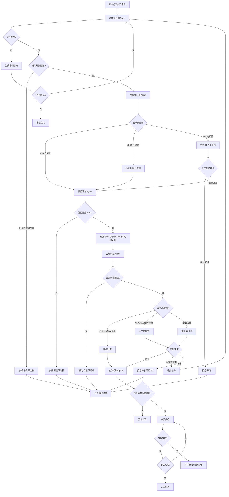

# 信贷审批标准操作规程（SOP）

## 1. 文档概述

### 1.1 目的
本SOP规范了从客户提交贷款申请到最终放款（或拒绝）的完整信贷审批流程，确保审批决策的一致性、合规性和可追溯性。适用于个人消费贷、个人经营贷、企业流动资金贷款和企业项目贷款的审批。

### 1.2 适用范围
- 个人信贷：消费贷（单笔上限50万元）、经营贷
- 企业信贷：流动资金贷款、项目贷款
- 覆盖从进件受理到放款执行的全流程五大环节

### 1.3 核心原则
- **审贷分离**：信用评估与合规审批独立执行（《商业银行法》第35条）
- **人在回路**：关键决策点设置人工介入机制
- **全程留痕**：每一步决策均有据可查、可追溯、可解释
- **风险与效率平衡**：自动化提升效率，人工审核控制风险

### 1.4 SLA要求
| 类型 | 审批总时效 | 放款时效 |
|------|-----------|---------|
| 个人信贷（自动审批） | ≤48小时 | 审批通过后≤4小时 |
| 个人信贷（人工审批） | ≤48小时 | 审批通过后≤4小时 |
| 企业信贷 | ≤5个工作日 | 审批通过后≤1个工作日 |

---

## 2. RACI矩阵

| 流程步骤 | 进件预处理Agent | 反欺诈核查Agent | 信用评估Agent | 合规审批Agent | 放款通知Agent | 人工审批委员会 | 客户 |
|---------|:---:|:---:|:---:|:---:|:---:|:---:|:---:|
| 申请受理与资料校验 | **R/A** | I | I | I | I | - | C |
| OCR信息提取与交叉核验 | **R/A** | I | - | - | - | - | - |
| 基础准入规则筛查 | **R/A** | I | - | I | - | - | I |
| 申请类型识别与路由 | **R/A** | - | - | - | - | - | - |
| 身份核验 | C | **R/A** | - | - | - | - | - |
| 设备与行为分析 | - | **R/A** | - | - | - | - | - |
| 关联图谱分析 | - | **R/A** | - | I | - | - | - |
| 多头借贷检测 | - | **R/A** | C | - | - | - | - |
| 反欺诈评分与分级处理 | - | **R/A** | I | I | - | C | - |
| 征信报告调取与解析 | - | - | **R/A** | I | - | - | - |
| 信用评分计算 | - | - | **R/A** | I | - | - | - |
| 还款能力分析（DTI/财务） | - | - | **R/A** | I | - | - | - |
| 风险定价（额度/利率） | - | - | **R/A** | **A** | - | - | - |
| 白户替代数据评估 | - | - | **R/A** | I | - | - | - |
| 贷款用途合规审查 | - | - | - | **R/A** | - | - | - |
| 利率与集中度合规审查 | - | - | - | **R/A** | - | I | - |
| 自动审批决策 | - | - | - | **R/A** | I | - | - |
| 审批委员会决策 | - | - | C | C | I | **R/A** | - |
| 放款前置检查 | - | - | - | I | **R/A** | - | - |
| 合同要素校验 | - | - | - | - | **R/A** | - | - |
| 放款指令执行 | - | - | - | - | **R/A** | - | - |
| 客户通知（多渠道） | - | - | - | - | **R/A** | - | I |
| 拒贷通知 | - | - | - | C | **R/A** | - | I |

> R=Responsible（执行者），A=Accountable（审批者），C=Consulted（咨询者），I=Informed（知会者）

---

## 3. 流程详细步骤

### 3.1 SOP-CA-01：进件受理与预处理

#### 触发条件
- 客户通过线上/线下渠道提交贷款申请

#### 执行动作

**步骤1.1 申请接收与分类**
- 接收客户提交的贷款申请及附件材料
- 自动识别申请类型：个人/企业 × 消费贷/经营贷/流动资金贷/项目贷
- 记录申请接收时间，启动SLA计时

**步骤1.2 OCR信息提取**
- 对所有上传材料执行OCR识别
- 提取关键信息字段并标注置信度评分
- 置信度<90%的字段标记为需人工复核
- 耗时上限：个人信贷5分钟，企业信贷15分钟

**步骤1.3 交叉核验**
- OCR提取信息与申请表填报数据逐字段比对
- 标记不一致字段并生成差异报告
- 关键字段（姓名、身份证号、金额）不一致时暂停流转

**步骤1.4 资料完整性检查**
- 按产品类型的材料清单逐项检查
- 资料完整率≥98%方可流转
- 不完整则生成补件通知（含缺失项、格式要求、截止时间）

**步骤1.5 基础准入规则筛查**
- 按照"成本从低到高"顺序执行规则：
  1. 年龄校验（18-65周岁）
  2. 地域准入校验
  3. 禁入行业校验
  4. 内部黑名单比对
  5. 外部黑名单比对（法院被执行人/反洗钱名单）
  6. 征信授权书合规性检查
- 任一硬性规则命中 → 直接拒绝并归档
- 软性规则命中 → 标记风险标签后继续

**步骤1.6 路由分发**
- 准入通过的申请路由至对应审批通道
- 设置SLA预警节点（70%/90%时效）

#### 输出
- 结构化申请数据包（含OCR结果、交叉核验结果）
- 准入筛查结果（通过/拒绝/待补件）
- 风险标签集
- 路由决策和SLA信息

#### 异常处理
| 异常场景 | 处理方式 |
|---------|---------|
| OCR识别完全失败 | 转人工录入通道，标记"OCR异常" |
| 材料疑似伪造 | 标记"疑似伪造"风险标签，传递至反欺诈核查Agent |
| 客户撤回申请 | 终止流程，数据归档保留30天 |
| 补件超时（7天未补齐） | 申请自动关闭，通知客户 |

#### KPI指标
- 资料完整率：≥98%方可流转
- OCR识别准确率（高置信字段）：≥95%
- 准入筛查耗时：≤30秒
- 准入规则命中率月度波动：≤5%

---

### 3.2 SOP-CA-02：反欺诈检测

#### 触发条件
- 进件预处理Agent输出准入通过的申请

#### 执行动作

**步骤2.1 身份核验**
- 校验活体检测结果（防范照片/视频/Deepfake攻击）
- 公安二要素/三要素比对
- 手机号三要素核验
- 证件防伪检测

**步骤2.2 设备指纹分析**
- 采集设备指纹信息
- 检测模拟器/虚拟机/多开工具
- 查询设备黑名单和历史关联
- 分析操作行为特征

**步骤2.3 关联图谱分析**
- 构建申请人多维关联网络（1-2度扩展）
- 检测团伙申请模式（多人共享设备/联系人/地址）
- 检测中介代办模式
- 检测关联人风险传导

**步骤2.4 多头借贷检测**
- 分析征信查询记录频次
- 查询第三方多头数据
- 计算多头借贷风险指数
- 分析多头趋势（上升/平稳/下降）

**步骤2.5 综合评分与分级处理**
- 融合规则引擎+ML模型评分
- **评分<50（低风险）**：放行，附"反欺诈通过"标签
- **评分50-80（中风险）**：标注命中规则和风险点后流转至信用评估
- **评分>80（高风险）**：自动拦截，生成欺诈调查工单，转人工复核
- 人工复核须在24小时内出具结论

#### 输出
- 反欺诈检测报告（综合评分、风险等级、各维度结果）
- 命中规则清单（含证据）
- 处理决策（放行/标注流转/拦截）
- 欺诈调查工单（高风险时）

#### 异常处理
| 异常场景 | 处理方式 |
|---------|---------|
| 公安核验接口不可用 | 降级为内部规则+设备分析，标记"数据缺失" |
| 多头查询接口超时 | 重试3次，仍失败则标记"多头数据缺失"后流转 |
| 模型服务异常 | 降级为纯规则引擎模式，告警 |
| 人工复核超24小时 | 升级至反欺诈主管 |

#### KPI指标
- 检测覆盖率：100%（零遗漏）
- 规则命中后初筛时效：≤30分钟
- 人工复核结论时效：≤24小时
- 误拦截率（FPR）：≤3%
- 单笔检测延迟：≤3秒

---

### 3.3 SOP-CA-03：信用评估

#### 触发条件
- 反欺诈核查Agent输出放行或标注流转的申请

#### 执行动作

**步骤3.1 征信报告调取与解析**
- 确认征信授权有效后提交查询
- 系统化解析信贷记录、逾期历史、担保信息、公共信息
- 解析准确率要求≥99.5%
- 征信系统不可用时进入等待队列（个人2h/企业8h超时告警）

**步骤3.2 秒拒判定**
- 央行征信评分<600分 → 触发秒拒
- 生成标准化拒贷理由（代码+大类描述）
- 秒拒申请不再进入后续评估环节，直接流转至放款通知Agent发送拒贷通知

**步骤3.3 信用评分计算**
- 征信≥600的申请进入评分流程
- 调用A卡申请评分模型计算综合评分
- 输出评分分解（各特征贡献度）
- 划分风险等级：A（≥750）/B（700-749）/C（650-699）/D（600-649）

**步骤3.4 白户替代评估**
- 征信数据不足（无信贷记录或<6个月）的客户启用替代方案
- 整合运营商、社保、电商、税务等替代数据
- 调用白户专用评分模型
- 标注"替代数据评分"标签（置信度低于常规评分）

**步骤3.5 还款能力分析**
- 个人客户：收入认定 → DTI测算（阈值50%）
- 企业客户：资产负债率（≤70%）→ 流动比率（≥1.2）→ EBITDA利息覆盖倍数（≥2x）→ 现金流分析
- 计算最大可承受贷款金额

**步骤3.6 风险定价**
- 基于评分和风险等级确定额度区间
- 基于LPR+风险溢价确定利率区间
- 校验利率合规性（不超过LPR 4倍）
- 抵押贷款计算LTV（住宅≤70%/商业≤60%/工业≤50%）

#### 输出
- 信用评估报告：评分、风险等级、建议额度/利率、关键风险点
- 还款能力分析报告：DTI或财务指标、还款能力等级
- 评估结论：建议批准/建议拒绝/需人工复议

#### 异常处理
| 异常场景 | 处理方式 |
|---------|---------|
| 征信系统不可用 | 排队等待，超时告警（个人2h/企业8h） |
| 评分模型服务异常 | 切换备用模型或降级为专家评分卡 |
| 收入证明与流水严重不一致 | 标记"收入存疑"，建议人工核实 |
| 抵押物估值争议 | 启动第二家评估机构复评 |

#### KPI指标
- 评分模型KS值：≥0.30（<0.25触发重训）
- 征信报告解析准确率：≥99.5%
- DTI计算误差：<1%
- 白户替代评估覆盖率：≥85%

---

### 3.4 SOP-CA-04：合规审批决策

#### 触发条件
- 信用评估Agent输出"建议批准"或"需人工复议"的申请

#### 执行动作

**步骤4.1 合规性审查**
- 贷款用途合规性（消费贷禁止流入房市/股市/民间借贷）
- 利率合规性（APR ≤ LPR×4）
- 客户适当性（产品与客户风险能力匹配）
- 集中度限制（单一客户≤资本净额10%，行业限额检查）
- 关联交易审查
- 反洗钱合规审查

**步骤4.2 审批权限判定**
- **自动审批通道**：个人信贷 + 金额≤30万 + 风险等级A/B + 合规审查全部通过 → 系统自动批准
- **人工审批通道**：个人信贷 + 金额>30万 或 风险等级C/D → 提交高级审批官
- **审批委员会通道**：全部企业信贷 + 超大额个人信贷 → 提交审批委员会

**步骤4.3 审批决策**
- **批准**：确定最终额度（≤评估建议上限且≤客户申请额度）、利率、期限、还款方式
- **有条件批准**：生成补充条件清单（增加担保/增加抵押/降额等），反馈至进件预处理Agent
- **拒绝**：生成合规拒贷理由（代码+描述），确保理由合规且不含歧视性内容

**步骤4.4 审批留痕**
- 记录审批决策书（结论、贷款要素、理由、权限标识）
- 记录完整审计轨迹（时间戳、决策者/系统、依据文件编号）
- 审批决策100%可追溯

#### 输出
- 审批决策书（批准/有条件批准/拒绝/上报委员会）
- 最终贷款要素（如批准）
- 补充条件清单（如有条件批准）
- 审计轨迹记录

#### 异常处理
| 异常场景 | 处理方式 |
|---------|---------|
| 合规审查发现疑似违规 | 暂停审批，上报合规部门 |
| 审批委员会未在SLA内决策 | 升级至分管领导 |
| 有条件批准补件超时（15天） | 申请自动转拒绝 |
| 审批系统故障 | 切换至人工审批通道 |

#### KPI指标
- 自动审批占比（个人信贷）：≥70%
- 审批一致性测试通过率：≥95%
- 审批意见记录率：100%
- 合规审查覆盖率：100%

---

### 3.5 SOP-CA-05：放款执行与通知

#### 触发条件
- 合规审批Agent输出"批准"决策
- 客户完成签约（电子合同签署）

#### 执行动作

**步骤5.1 放款前置检查**
- 收款账户有效性验证
- 合同要素与审批决策一致性校验
- 电子签章有效性验证
- 抵押登记完成确认（抵押贷款）
- 放款额度校验（未超审批额度和日限额）

**步骤5.2 放款指令执行**
- 生成标准化放款指令报文
- 金额和账号二次校验
- 提交至核心银行系统
- 实时监控放款状态

**步骤5.3 放款异常处理**
- 放款失败 → 自动重试（最多3次，间隔5分钟）
- 3次均失败 → 触发人工介入告警，状态更新为"放款异常"
- 超时（个人信贷30分钟）→ 告警

**步骤5.4 客户通知**
- 审批通过通知（签约前）：短信+APP推送
- 放款到账通知：短信+APP推送+邮件（全渠道）
- 还款计划通知：邮件（含PDF还款计划表）
- 拒贷通知（被拒申请）：短信+邮件

**步骤5.5 放款后处理**
- 生成借据和还款计划
- 更新贷款台账
- 触发征信信息报送（T+1）
- 同步贷款信息至贷后监控系统

#### 输出
- 放款执行报告（状态、流水号、时间戳）
- 客户通知记录（各渠道送达状态）
- 借据和还款计划
- 贷后系统同步确认

#### 异常处理
| 异常场景 | 处理方式 |
|---------|---------|
| 账户异常（冻结/销户） | 通知客户更换账户，暂停放款 |
| 合同要素不一致 | 中断放款，反馈合规审批Agent |
| 核心系统故障 | 等待恢复后重试，超4小时升级 |
| 通知全渠道送达失败 | 触发人工电话通知 |

#### KPI指标
- 审批通过至放款到账（个人信贷）：≤4小时
- 放款指令校验零差错率：100%
- 客户通知送达率：≥99%
- 放款异常30分钟内告警率：100%

---

## 4. 决策树

---

## 5. 质量检查点

### 5.1 关卡质量检查

| 检查点 | 检查内容 | 检查方式 | 频率 | 负责Agent |
|-------|---------|---------|------|----------|
| Q1-进件质量 | 资料完整率≥98%，OCR高置信率 | 系统自动统计 | 实时 | 进件预处理Agent |
| Q2-反欺诈覆盖 | 检测覆盖率100%，FPR≤3% | 系统自动监控 | 实时 | 反欺诈核查Agent |
| Q3-评分模型质量 | KS值≥0.30，PSI稳定性 | 模型监控系统 | 周度 | 信用评估Agent |
| Q4-审批一致性 | 一致性测试通过率≥95% | 抽样回测 | 月度 | 合规审批Agent |
| Q5-放款准确性 | 放款要素零差错 | 系统自动校验 | 实时 | 放款通知Agent |
| Q6-通知送达 | 送达率≥99% | 渠道回执统计 | 日度 | 放款通知Agent |

### 5.2 定期审查

| 审查项目 | 频率 | 审查内容 | 触发条件 |
|---------|------|---------|---------|
| 准入规则审查 | 月度 | 各规则命中率变化趋势 | 命中率波动>5% |
| 反欺诈规则审查 | 月度 | 规则有效性、误拦截率 | 误拦截投诉增加 |
| 评分模型验证 | 季度 | KS值、AUC、PSI、实际vs预测 | KS<0.25时紧急重训 |
| 审批策略回检 | 月度 | 通过率、首逾率、不良趋势 | 首逾率>2%时策略收紧 |
| 放款流程审计 | 季度 | 流程合规性、异常处理记录 | 放款异常事件发生 |

---

## 6. 核心KPI指标体系

### 6.1 效率指标
| 指标 | 目标值 | 预警线 | 监控频率 |
|------|--------|--------|---------|
| 审批时效（个人信贷TAT） | ≤24小时（均值） | >36小时 | 实时 |
| 审批时效（企业信贷TAT） | ≤3个工作日（均值） | >4个工作日 | 实时 |
| 自动审批占比（STP Rate） | ≥70% | <60% | 日度 |
| 放款时效（个人信贷） | ≤4小时 | >6小时 | 实时 |
| 单笔审批成本 | 持续下降 | 环比上升>10% | 月度 |

### 6.2 风险指标
| 指标 | 目标值 | 预警线 | 监控频率 |
|------|--------|--------|---------|
| 审批通过率 | 35-55% | <30%或>60% | 日度 |
| 首逾率（FPD30） | ≤2% | >2.5% | 月度 |
| 反欺诈拦截率 | 动态评估 | 欺诈损失突增 | 日度 |
| 误拦截率（FPR） | ≤3% | >4% | 周度 |
| 评分模型KS值 | ≥0.30 | <0.25 | 周度 |

### 6.3 合规指标
| 指标 | 目标值 | 预警线 | 监控频率 |
|------|--------|--------|---------|
| 审批留痕率 | 100% | <100% | 实时 |
| 合规审查覆盖率 | 100% | <100% | 实时 |
| 审批一致性 | ≥95% | <90% | 月度 |
| 征信报送及时率 | 100% | <99% | 日度 |
| 客户通知送达率 | ≥99% | <98% | 日度 |

---

## 7. 跨域协作接口

### 7.1 与反欺诈中心的协作
- **共享数据**：黑名单库、规则引擎、设备指纹库
- **信号流向**：进件中发现的欺诈线索 → 反欺诈中心案件调查Agent
- **反向信号**：反欺诈中心规则更新 → 信贷审批域反欺诈检测环节

### 7.2 与逾期资产治理的协作
- **信号流向**：审批通过的贷款基础信息 → 逾期资产治理域
- **反向信号**：特定客群坏账率上升 → 合规审批Agent收紧准入策略
- **数据共享**：贷款要素、客户画像、风险评级

### 7.3 数据闭环
- 所有审批决策日志汇入统一风控数据仓库
- 贷后表现数据（逾期情况）定期反馈用于评分模型迭代
- 反欺诈拦截效果数据反馈用于规则优化

---

## 8. 附录

### 8.1 关键法规引用
| 法规 | 相关条款 | 适用环节 |
|------|---------|---------|
| 《商业银行法》第35条 | 审贷分离原则 | 全流程 |
| 《贷款通则》 | 贷款条件与程序 | 准入、审批 |
| 《个人信用信息基础数据库管理暂行办法》 | 征信查询授权 | 征信调取 |
| 《个人信息保护法》 | 个人信息最小必要原则 | 数据采集全环节 |
| 最高法民间借贷利率司法解释 | LPR 4倍上限 | 风险定价、合规审查 |
| 《反洗钱法》 | 可疑交易报告 | 反欺诈、合规审查 |

### 8.2 产品额度限制
| 产品类型 | 单笔上限 | 自动审批上限 |
|---------|---------|-------------|
| 个人消费贷 | 50万元 | 30万元 |
| 个人经营贷 | 100万元 | 30万元 |
| 企业流动资金贷款 | 视审批 | 不适用（均需人工） |
| 企业项目贷款 | 视审批 | 不适用（均需审委会） |
