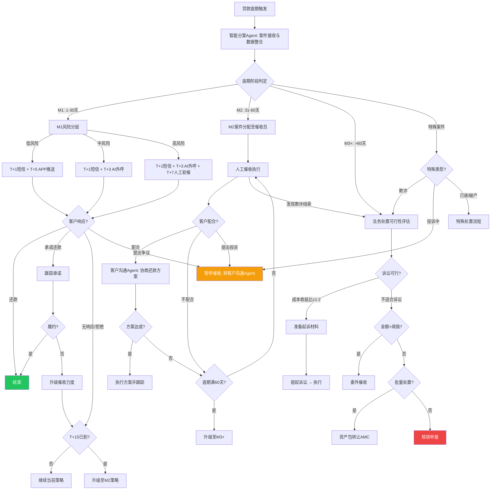
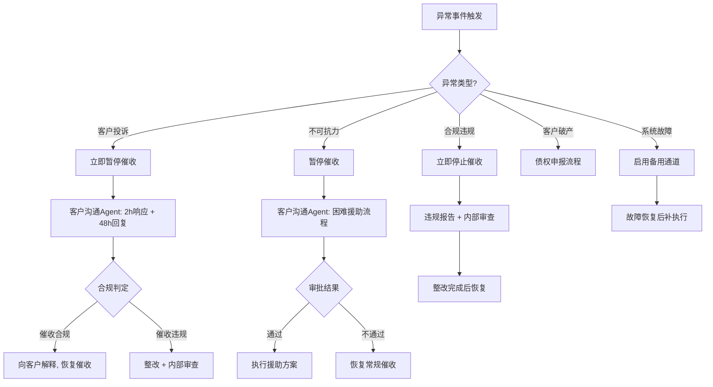

# 逾期资产治理标准操作规程（SOP）

## 1. 文档概述

### 1.1 目的
本SOP定义逾期资产治理业务域的标准化操作流程，覆盖从贷款首次逾期到最终处置（回收/核销/转让）的全生命周期管理。旨在确保催收操作在合规框架内高效执行，最大化资产回收率，降低不良贷款率（NPL），同时维护客户关系和机构声誉。

### 1.2 适用范围
- 所有个人消费贷、经营贷的逾期案件（M1/M2/M3+全阶段）
- 企业流动资金贷款、项目贷款的逾期案件
- 涉及催收执行、客户沟通、法务处置、数据分析的全流程操作

### 1.3 合规基准
| 法规/文件 | 核心要求 |
|-----------|---------|
| 《民法典》合同编 | 债务追索权利与程序合法性 |
| 《个人信息保护法》 | 催收中客户信息使用限制，最小必要原则 |
| 最高法民间借贷利率司法解释 | 利息与罚息上限（LPR 4倍） |
| 银保监会催收行为规范 | 催收时间、频次、话术、联系人范围限制 |
| 《互联网金融个人网络消费信贷贷后催收风控指引》 | 互联网贷款催收行为全面规范 |

### 1.4 催收合规红线（不可逾越）
- ❌ 不得在21:00至次日08:00之间拨打催收电话或发送催收短信
- ❌ 单日催收联系不超过3次（含所有渠道）
- ❌ 不得联系借款人以外的无关第三方（紧急联系人仅可通知转达）
- ❌ 不得使用威胁、恐吓、侮辱等暴力催收手段
- ❌ 催收话术100%使用经审核通过的标准模板

---

## 2. RACI职责矩阵

| 流程步骤 | 智能分案Agent | 催收执行Agent | 客户沟通Agent | 法务处置Agent | 催收数据分析Agent | 人工审批岗 |
|----------|:------------:|:------------:|:------------:|:------------:|:----------------:|:---------:|
| **SOP-DA-01 智能分案** | **R/A** | I | I | I | C | I |
| **SOP-DA-02 M1催收执行** | C | **R/A** | I | - | I | I |
| **SOP-DA-03 M2催收执行** | C | **R/A** | C | - | I | C |
| **SOP-DA-04 客户沟通与投诉** | I | C | **R/A** | I | I | **A**（超限方案） |
| **SOP-DA-05 法务处置** | C | I | I | **R/A** | C | **A**（核销审批） |
| **SOP-DA-06 数据报表与预警** | C | C | C | C | **R/A** | I |
| 策略升级决策 | **R/A** | C | C | C | C | I |
| 合规违规处理 | I | **R** | I | I | I | **A** |
| 减免方案审批（授权内） | I | **R/A** | **R/A** | - | I | - |
| 减免方案审批（超限） | I | C | **R** | - | I | **A** |

> R=Responsible（执行者）, A=Accountable（审批者）, C=Consulted（咨询者）, I=Informed（知会者）

---

## 3. 标准操作流程

### SOP-DA-01：智能分案规范

#### 触发条件
- 核心系统检测到贷款进入逾期状态（还款日T+1未收到足额还款）
- 催收系统每日批量导入新增逾期案件清单
- 策略升级触发的案件重新分案请求

#### 执行步骤

```
步骤1：案件接收与数据整合（T+0, 自动触发）
├── 从核心系统拉取新增逾期案件清单（贷款编号、客户ID、逾期天数、逾期金额、产品类型）
├── 关联客户画像数据（年龄、职业、收入、历史逾期记录）
├── 查询催收历史记录（上次催收时间、渠道、结果、承诺还款情况）
└── 查询外部风险信号（征信变化、多头借贷、司法信息）

步骤2：逾期阶段判定
├── M1（1-30天）：首次逾期或短期逾期，优先自动化催收
├── M2（31-60天）：中期逾期，升级为人工催收+协商
├── M3+（60天以上）：晚期逾期，评估法务处置路径
└── 特殊标记：欺诈案件→直接转法务，投诉中→暂停催收，已故/破产→特殊流程

步骤3：风险分层评估（每阶段内部细分）
├── M1分层：失联概率评分 × 还款意愿评分 → 高/中/低风险
│   ├── M1-低风险（遗忘型）→ 短信+APP提醒即可
│   ├── M1-中风险（周转困难）→ AI外呼+还款引导
│   └── M1-高风险（意愿下降）→ 人工软催+关注升级
├── M2分层：金额 × 剩余期数 × 配合度 → 匹配催收员经验等级
└── M3+分层：可执行财产 × 诉讼成本收益比 → 法务/委外/转让/核销

步骤4：策略匹配与资源分配
├── 根据风险分层结果匹配催收策略模板
├── M1/M2案件分配至催收执行Agent（含催收员指定）
├── M3+案件分配至法务处置Agent
├── 考虑催收员当日产能上限（人均日处理量上限）
└── 记录分案决策依据和匹配逻辑

步骤5：分案结果下发与确认
├── 向催收执行Agent下发M1/M2催收任务清单
├── 向法务处置Agent下发M3+评估案件清单
├── 向催收数据分析Agent同步分案维度数据
└── 确认所有案件已完成分配（覆盖率=100%）
```

#### 输出物
- 每日分案决策报告（案件总量、各阶段分布、策略分配明细）
- 催收任务清单（下发至催收执行Agent和法务处置Agent）
- 分案决策审计日志（每案决策依据可追溯）

#### KPI指标
| 指标 | 目标值 | 预警阈值 |
|------|--------|---------|
| 分案时效 | T+0（当日完成） | 任何案件T+1仍未分案 |
| 分案覆盖率 | 100% | <99% |
| 策略匹配准确率 | ≥90%（回收率验证） | <85% |
| 模型效果回检周期 | 月度 | 超过2个月未回检 |

#### 异常处理
- **数据缺失**：客户画像数据不完整时，按保守策略分案（默认中风险）并标记待补充
- **系统故障**：核心系统数据拉取失败时，启动备用批处理通道，确保T+1前完成
- **特殊案件**：客户已标记为投诉中/协商中/司法程序中的案件，跳过常规分案，保持当前状态

---

### SOP-DA-02：M1催收执行规范

#### 触发条件
- 智能分案Agent下发M1阶段催收任务
- 案件逾期天数1-30天

#### 执行步骤

```
步骤1：催收任务队列生成（接收分案后即时）
├── 接收智能分案Agent下发的M1任务清单
├── 按风险等级和策略类型生成有序任务队列
├── 校验客户联系信息有效性（手机号、APP安装状态）
└── 标记特殊限制（时间偏好、渠道偏好、合规暂停标记）

步骤2：T+1 短信提醒触发
├── 生成柔性提醒短信内容（使用审核通过模板）
├── 内容要素：客户姓名、逾期金额、还款截止日期、还款渠道
├── 发送时间：09:00-20:00之间（避开午休12:00-14:00优化送达率）
├── 确认送达状态（成功/失败/退信）
└── 短信送达率目标：≥95%

步骤3：T+3 AI智能外呼
├── 未在T+1短信后还款的客户进入AI外呼队列
├── 外呼时间窗口：09:00-12:00, 14:00-20:30（合规安全边际）
├── AI外呼能力：多轮对话、情绪识别、还款金额确认、分期方案介绍
├── 单次通话时长控制：3-5分钟
├── 记录通话结果：接通/未接通、客户态度、承诺还款日期
└── AI外呼接通率目标：≥45%

步骤4：T+5 APP推送通知
├── 对仍未还款且安装了APP的客户发送推送通知
├── 推送内容包含便捷还款入口（一键跳转还款页面）
└── 记录推送送达和点击情况

步骤5：T+7 人工软催收电话（M1-高风险案件）
├── 仅对M1-高风险且AI外呼未接通/未承诺的案件
├── 为催收员生成案件摘要卡片（客户信息、逾期详情、前期催收记录）
├── 提供推荐话术要点
├── 催收员拨打后记录通话要点和客户态度
└── 合规监控：实时检测通话合规性

步骤6：承诺还款跟踪
├── 对已承诺还款日期的客户，到期前24小时发送提醒短信
├── 到期日检查还款状态
├── 履约：标记案件回收成功，结案
└── 未履约：标记承诺违约，升级催收力度

步骤7：策略升级评估（T+15）
├── 对T+15仍未回款且未取得有效联系的客户
├── 标记为"失联"或"拒绝还款"
├── 反馈给智能分案Agent触发M1→M2策略升级
└── 生成升级说明（前期催收动作汇总、客户响应情况）
```

#### 输出物
- 每日催收执行报告（触达量、接通率、承诺还款量）
- 单案催收记录（联系时间、渠道、结果、下次跟进计划）
- 合规监控日报（合规率、异常事件）
- 策略升级申请（反馈至智能分案Agent）

#### KPI指标
| 指标 | 目标值 | 预警阈值 |
|------|--------|---------|
| 首次触达时效 | ≤T+1 | >T+2 |
| AI外呼接通率 | ≥45% | <40% |
| 短信送达率 | ≥95% | <90% |
| 单案日催收次数 | ≤3次（合规上限） | 任何超限立即告警 |
| 话术合规率 | 100% | <100%（零容忍） |
| M1回收率 | 70-85% | <65% |

#### 异常处理
- **客户号码无效**：标记失联，尝试通过紧急联系人获取有效联系方式（仅通知转达）
- **客户明确拒绝沟通**：记录拒绝意愿，暂停当日催收，次日重新评估策略
- **客户提出争议**：立即暂停催收动作，转交客户沟通Agent处理
- **合规违规事件**：立即停止该案催收，生成违规报告，启动内部审查

---

### SOP-DA-03：M2催收执行规范

#### 触发条件
- 案件逾期天数进入31-60天（自然迁移）
- 智能分案Agent下发M1→M2策略升级的案件
- M2案件重新分配（催收员调整）

#### 执行步骤

```
步骤1：案件分配至催收员（接收后24小时内首次跟进）
├── 接收智能分案Agent分配的M2案件和指定催收员
├── 生成详细案件摘要：客户基本信息、逾期详情、M1阶段催收全记录、客户画像分析
├── 提供沟通策略建议和推荐话术
└── 催收员确认接收并安排首次跟进计划

步骤2：人工催收执行
├── 催收员按计划拨打催收电话（合规时间窗口内）
├── 沟通要点：了解逾期原因、评估还款意愿和能力、提出还款方案建议
├── 对有还款意愿但暂时困难的客户：引导至还款方案协商
├── 对拒绝沟通的客户：记录拒绝情况，安排后续跟进策略
├── 实时记录通话要点、客户态度评估、承诺内容
└── 合规监控：话术合规检测、频次监控、时间窗口校验

步骤3：还款方案协商（授权范围内）
├── 对表达还款意愿的客户，根据逾期金额和客户情况提出方案
├── M2可用方案：分期还款（最长6期）、延期还款（最长30天）
├── 减免方案在授权矩阵内自动审批
├── 超出授权矩阵的方案（减免>5000元或>50%）上报人工审批
├── 方案审批时效：≤4小时
└── 方案达成后录入系统，设置跟踪提醒

步骤4：承诺还款跟踪与履约监控
├── 对承诺还款的客户，到期前24小时发送提醒
├── 到期日自动检查还款状态
├── 履约：更新案件状态，按方案继续跟踪（分期案件跟踪至全部结清）
└── 未履约：标记违约，评估是否升级催收力度或转M3+

步骤5：策略升级评估（逾期满60天）
├── 对逾期满60天仍未达成有效还款方案的案件
├── 综合评估：客户配合度、还款能力、可执行资产状况
├── 反馈给智能分案Agent触发M2→M3+策略升级
└── 生成升级建议（含法务处置可行性初评）
```

#### 输出物
- 催收员工作日报（跟进案件量、沟通结果、方案达成量）
- 还款方案审批记录（方案内容、审批结果、执行状态）
- 合规抽检报告（月度，抽检率≥20%）
- M3+升级申请报告

#### KPI指标
| 指标 | 目标值 | 预警阈值 |
|------|--------|---------|
| 首次跟进时效 | 分配后24小时内 | >48小时 |
| 还款方案审批时效 | ≤4小时 | >8小时 |
| 承诺还款到期提醒触发率 | 100% | <100% |
| 月度合规抽检率 | ≥20% | <15% |
| M2回收率 | 40-60% | <35% |

#### 异常处理
- **客户要求减免超出授权**：转交客户沟通Agent进行专项协商
- **客户提出不可抗力证明**：暂停催收，转交客户沟通Agent启动困难客户援助
- **催收员合规违规**：立即暂停该催收员的所有案件，启动调查

---

### SOP-DA-04：客户沟通与投诉处理规范

#### 触发条件
- 催收执行Agent转交的争议/特殊诉求案件
- 监管投诉/12378热线转办的催收投诉件
- 客户主动提交的息费减免/困难援助申请

#### 执行步骤

```
步骤1：诉求分类与优先级判定（收到后30分钟内）
├── 分类判定：
│   ├── A类-监管投诉（12378/银保监转办）→ 最高优先级
│   ├── B类-催收行为投诉 → 高优先级
│   ├── C类-息费减免申请 → 正常优先级
│   ├── D类-困难客户援助 → 正常优先级
│   └── E类-账单金额异议 → 正常优先级
├── 对A/B类立即暂停该案件所有催收动作
└── 生成受理工单，分配处理责任人

步骤2：投诉调查与处理（A/B类，2小时响应+48小时回复）
├── 2小时内向客户发送受理确认通知
├── 调取催收全过程记录（通话录音、短信记录、系统操作日志）
├── 还原催收行为时间线，逐项核对合规性
├── 判定结论：催收合规→向客户解释说明 / 催收违规→启动整改
├── 出具正式调查回复（48小时内）
├── A类投诉需同步向监管部门提交回复
└── 记录投诉处理全过程，归档备查

步骤3：息费减免方案评估（C类）
├── 核查客户逾期原因和还款历史
├── 评估客户当前经济状况和还款能力
├── 设计减免方案（在授权矩阵范围内）：
│   ├── M1阶段：滞纳金减免上限30%
│   ├── M2阶段：分期方案最长6期 + 部分息费减免
│   └── M3+阶段：可协商一次性结清减免方案
├── 计算方案NPV影响（机构损失 vs 预期回收）
├── 授权内方案直接审批，超限方案（>5000元或>50%）上报人工
└── 方案达成后通知催收执行Agent设置跟踪

步骤4：困难客户援助处理（D类，3个工作日内完成）
├── 收集困难证明材料（医疗诊断书、失业证明、灾害证明等）
├── 核验材料真实性（交叉验证）
├── 设计援助方案（延期还款、减免结清，遵循监管"合理延期还款"要求）
├── 提交援助审批（3个工作日SLA）
├── 审批通过后执行方案，设置后续跟踪节点
└── 审批未通过需说明原因，提供替代建议

步骤5：账单异议核查（E类）
├── 与核心银行系统交叉核对：本金、利息、罚息、费用各项明细
├── 核对还款记录：是否存在入账延迟、重复扣款等问题
├── 确认异议成立：出具差异说明和调账方案
├── 确认异议不成立：出具详细计算说明
└── 核查结果通知客户和催收执行Agent
```

#### 输出物
- 投诉调查报告（含催收行为还原、合规判定、整改措施）
- 正式投诉回复函（48小时内）
- 减免方案评估报告（含NPV分析）
- 困难客户援助审批材料
- 账单异议核查报告
- 月度客户沟通汇总（诉求分类统计、处理满意度、减免总额）

#### KPI指标
| 指标 | 目标值 | 预警阈值 |
|------|--------|---------|
| 投诉响应时效 | ≤2小时 | >4小时 |
| 正式回复时效 | ≤48小时 | >72小时 |
| 减免方案授权合规率 | 100% | <100%（零容忍） |
| 困难援助审批时效 | ≤3个工作日 | >5个工作日 |
| 投诉处理满意度 | ≥80% | <70% |

#### 异常处理
- **客户提供虚假困难证明**：终止援助流程，标记欺诈风险，反馈至智能分案Agent
- **投诉涉及严重违规**：立即上报合规部门，启动纪律处分程序
- **客户重复投诉同一事项**：升级处理级别，由管理层介入

---

### SOP-DA-05：法务处置规范

#### 触发条件
- 智能分案Agent下发M3+阶段案件
- M2阶段催收失败的升级案件
- 确认为欺诈的案件（直接转法务）

#### 执行步骤

```
步骤1：法务处置可行性评估（收到案件后5个工作日内完成）
├── 查询被执行人财产线索
│   ├── 不动产（房产登记信息）
│   ├── 动产（车辆登记信息）
│   ├── 金融资产（银行存款、证券、保险）
│   └── 其他资产（股权、知识产权）
├── 计算诉讼成本收益比
│   ├── 成本项：律师费（回收金额5-15%）+ 诉讼费（按标的额阶梯计算）+ 执行费 + 送达成本
│   └── 收益项：预期回收金额 = 可执行资产价值 × 执行成功率
├── 评估胜诉概率：证据链完整性、合同有效性、诉讼时效
├── 评估执行概率：可执行财产充分性、被执行人配合度
└── 输出处置建议：诉讼 / 委外催收 / 资产包转让 / 核销

步骤2：诉讼路径执行（适合诉讼的案件）
├── 起诉材料准备（5个工作日内）
│   ├── 起诉状（含诉讼请求、事实与理由）
│   ├── 证据清单（借款合同、放款凭证、催收记录、逾期通知等）
│   └── 送达地址确认书
├── 提交法院立案
├── 跟踪诉讼进度：立案→送达→开庭→判决→执行申请→强制执行
├── 关键节点月度更新
└── 执行回款入账处理

步骤3：委外催收执行（不适合诉讼但有一定回收可能的案件）
├── 根据案件特征选择委外催收机构（佣金率15-25%）
├── 办理案件移交手续（数据加密传输、授权书签署）
├── 设定回收目标和考核指标
├── 月度跟踪委外催收进度和回收金额
└── 季度合规审计（检查委外机构催收行为合规性）

步骤4：资产包转让（批量处置方案）
├── 筛选适合打包转让的案件（小额、无可执行财产、诉讼不经济）
├── 请求催收数据分析Agent提供历史回收率数据
├── 基于历史数据和市场可比案例确定底价（通常为本金2-8折）
├── 对接AMC（资产管理公司）进行定价谈判
├── 完成转让交割手续
└── 记录转让损益

步骤5：核销申报（确认无法回收的案件）
├── 收集核销申报材料：催收全记录、法务评估报告、无财产证明
├── 核销材料合规审查（100%通过率要求）
├── 提交内部审批流程
├── 审批通过后执行账务核销
└── 核销后持续关注被执行人财产变化（保留追索权利）
```

#### 输出物
- 法务处置可行性评估报告
- 起诉材料包（起诉状、证据清单、送达材料）
- 诉讼进度跟踪表（月度更新）
- 委外催收绩效报告（月度）
- 委外催收合规审计报告（季度）
- 资产包转让评估与定价报告
- 核销申报材料

#### KPI指标
| 指标 | 目标值 | 预警阈值 |
|------|--------|---------|
| M3+法务评估覆盖率 | 100% | <95% |
| 起诉材料准备时效 | ≤5个工作日 | >7个工作日 |
| 诉讼进度更新频率 | 月度 | >2个月未更新 |
| 诉讼成本收益比 | ≥1:2 | <1:1.5 |
| 委外催收合规审计 | 季度 | 超过1个季度未审计 |
| 核销材料合规审查通过率 | 100% | <100%（零容忍） |
| M3+综合回收率 | 15-30% | <12% |

#### 异常处理
- **客户主动还款（诉讼中）**：暂停诉讼程序，通知催收执行Agent处理入账，评估是否撤诉
- **被执行人无可供执行财产**：申请终止本次执行，案件转入核销评估或资产包转让
- **委外催收机构违规**：立即暂停合作，启动应急案件回收，考虑更换机构
- **客户破产**：启动债权申报流程，参与破产清偿

---

### SOP-DA-06：数据报表与预警规范

#### 触发条件
- 每日定时（09:00）生成日度监控简报
- 每月T+3个工作日生成月度综合报告
- 迁徙率异常变动实时触发预警
- 管理层/监管部门临时数据需求

#### 执行步骤

```
步骤1：日度监控数据采集（每日09:00前完成）
├── 采集各Agent回传的前一日数据：
│   ├── 智能分案Agent：新增逾期案件量、分案完成率、各阶段分布
│   ├── 催收执行Agent：触达量、接通率、承诺量、回款量
│   ├── 客户沟通Agent：新增投诉量、处理完成量、减免金额
│   └── 法务处置Agent：新增诉讼量、回款量、核销量
├── 数据清洗和校验（准确率≥99.5%）
└── 生成日度监控简报

步骤2：核心指标计算与监控
├── 各阶段在管余额和户数（M1/M2/M3+/核销）
├── 各阶段回收率（日/周/月维度）
├── 迁徙率计算（Roll Rate）：
│   ├── M0→M1迁徙率（正常→首次逾期）
│   ├── M1→M2迁徙率（早期→中期恶化）
│   ├── M2→M3迁徙率（中期→晚期恶化）
│   └── M3→核销迁徙率
├── 催收成本收入比（Cost to Collect）
├── 催收投诉率（每千件投诉数）
└── 不良贷款率（NPL Ratio）

步骤3：迁徙率异常预警（实时）
├── 监控规则：月度迁徙率环比上升>2个百分点
├── 触发预警后：
│   ├── 分析恶化原因（按产品/客群/地区下钻）
│   ├── 向智能分案Agent发送策略调整建议
│   ├── 向信贷审批域的合规审批Agent发送资产质量预警信号
│   └── 通知管理层关注
└── 预警响应跟踪（策略调整后效果评估）

步骤4：月度综合报告生成（T+3个工作日）
├── 逾期资产总览（各阶段在管规模、趋势）
├── 新增逾期分析（归因：哪些产品/客群/审批策略贡献了逾期）
├── 催收效能分析：
│   ├── 各渠道回收率对比（短信/AI外呼/人工/法务）
│   ├── 各策略组合ROI评估
│   ├── 催收员绩效排名
│   └── A/B测试效果评估（统计显著性P<0.05）
├── 回收预测（未来3个月回收金额预测+置信区间）
├── 拨备充足性评估（当前拨备覆盖率 vs 监管红线150%）
└── 策略优化建议

步骤5：数据对外输出
├── 监管报送数据（按监管格式标准化输出）
├── 管理层仪表盘（关键指标可视化）
├── 财务部门数据（拨备计提依据、回收预测数据）
└── 信贷审批域反馈（资产质量信号，驱动贷前策略调整）
```

#### 输出物
- 日度监控简报（关键指标+异常标记）
- 月度逾期资产治理综合报告
- 迁徙率异常预警通知
- 催收效能分析报告
- 回收预测报告（3个月前瞻）
- 拨备充足性评估报告
- 监管报送数据包

#### KPI指标
| 指标 | 目标值 | 预警阈值 |
|------|--------|---------|
| 月度报告产出时效 | T+3个工作日 | >T+5个工作日 |
| 数据准确率 | ≥99.5% | <99% |
| 迁徙率预警及时性 | 实时 | 延迟>24小时 |
| 回收预测偏差 | ±10%以内 | >±15% |
| 拨备覆盖率 | ≥150%（监管红线） | <160%（预警缓冲） |

#### 异常处理
- **数据源异常**：某Agent数据回传延迟或缺失，标记受影响指标，使用上期数据暂代并标注
- **指标大幅异常波动**：排除数据错误后，启动专项分析，确认是否存在系统性风险
- **监管临时数据需求**：启动紧急数据提取流程，确保在监管要求时限内完成

---

## 4. 决策树



### 异常处理决策树



---

## 5. 全局KPI总表

| 类别 | 指标名称 | 目标值 | 监控频率 | 责任Agent |
|------|---------|--------|---------|----------|
| **回收效率** | M1回收率 | 70-85% | 日/月 | 催收执行Agent |
| | M2回收率 | 40-60% | 日/月 | 催收执行Agent |
| | M3+回收率 | 15-30% | 月 | 法务处置Agent |
| **资产质量** | 不良贷款率（NPL） | 行业基准内 | 月 | 催收数据分析Agent |
| | 逾期迁徙率（Roll Rate） | 环比波动≤2pp | 月 | 催收数据分析Agent |
| | 拨备覆盖率 | ≥150% | 月/季 | 催收数据分析Agent |
| **运营效率** | 分案时效 | T+0 | 日 | 智能分案Agent |
| | 首次触达时效 | ≤T+1 | 日 | 催收执行Agent |
| | AI外呼接通率 | ≥45% | 日 | 催收执行Agent |
| | 还款方案审批时效 | ≤4小时 | 日 | 客户沟通Agent |
| **合规指标** | 催收时间合规率 | 100% | 实时 | 催收执行Agent |
| | 催收频次合规率 | 100% | 实时 | 催收执行Agent |
| | 话术合规率 | 100% | 实时 | 催收执行Agent |
| | 催收投诉率 | ≤2‰ | 月 | 客户沟通Agent |
| | 核销合规审查通过率 | 100% | 每案 | 法务处置Agent |
| **客户体验** | 投诉响应时效 | ≤2小时 | 每案 | 客户沟通Agent |
| | 投诉回复时效 | ≤48小时 | 每案 | 客户沟通Agent |
| | 投诉处理满意度 | ≥80% | 月 | 客户沟通Agent |
| **成本效率** | 催收成本收入比 | 行业最优四分位 | 月 | 催收数据分析Agent |
| | 法务催收诉讼成本收益比 | ≥1:2 | 每案 | 法务处置Agent |
| **数据质量** | 月报产出时效 | T+3 | 月 | 催收数据分析Agent |
| | 数据准确率 | ≥99.5% | 日 | 催收数据分析Agent |
| | 回收预测偏差 | ±10% | 月 | 催收数据分析Agent |

---

## 6. 质量检查清单

### 6.1 日度检查
- [ ] 新增逾期案件100%完成分案
- [ ] 催收合规监控无违规事件
- [ ] 承诺还款到期案件100%发送提醒
- [ ] 高优先级投诉件2小时内已响应

### 6.2 周度检查
- [ ] 各阶段回收率趋势正常
- [ ] 催收员工作量分配均衡
- [ ] 委外催收机构回款按期到账
- [ ] 诉讼进度无超期未更新案件

### 6.3 月度检查
- [ ] 逾期治理综合报告按时产出（T+3）
- [ ] 迁徙率无异常上升（环比<2pp）
- [ ] 拨备覆盖率达标（≥150%）
- [ ] 催收员合规抽检完成（≥20%）
- [ ] 分案模型效果回检完成
- [ ] 减免方案合规审查100%通过

### 6.4 季度检查
- [ ] 委外催收机构合规审计完成
- [ ] 催收策略整体效果评估
- [ ] 回收预测模型准确性评估
- [ ] 系统能力与产能评估

---

## 7. 附录

### 7.1 授权矩阵

| 操作类型 | 自动审批范围 | 需人工审批 |
|----------|------------|-----------|
| M1滞纳金减免 | ≤30% | >30% |
| M2分期方案 | ≤6期 | >6期 |
| 息费减免金额 | ≤5,000元 | >5,000元 |
| 息费减免比例 | ≤50% | >50% |
| 困难客户延期 | - | 全部需审批 |
| 一次性结清减免 | ≤本金10% | >本金10% |
| 核销申报 | - | 全部需审批 |

### 7.2 催收时间窗口

| 渠道 | 允许时间 | 推荐时间（接通率最优） |
|------|---------|---------------------|
| 短信 | 09:00-20:00 | 10:00-11:00, 15:00-16:00 |
| AI外呼 | 09:00-20:30 | 10:00-11:30, 14:30-17:00 |
| 人工电话 | 08:00-21:00 | 10:00-11:30, 14:00-17:30 |
| APP推送 | 08:00-21:00 | 12:00-13:00, 19:00-20:00 |

### 7.3 逾期阶段定义

| 阶段 | 逾期天数 | 风险等级 | 主要策略 |
|------|---------|---------|---------|
| M0 | 0天（到期未扣款当日） | 提醒 | 还款日提醒 |
| M1 | 1-30天 | 早期 | 自动化催收为主 |
| M2 | 31-60天 | 中期 | 人工催收+协商 |
| M3 | 61-90天 | 晚期 | 法务评估+委外 |
| M4+ | 91天以上 | 深度逾期 | 诉讼/转让/核销 |
