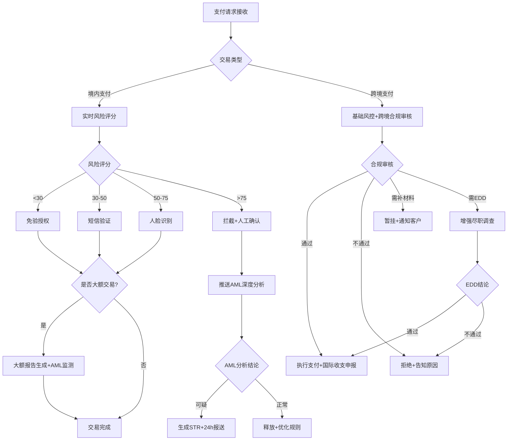

# 支付与交易风控标准作业规程 (SOP)

## 1. 文档信息

| 项目 | 内容 |
|------|------|
| 文档编号 | SOP-PTR-2024 |
| 适用范围 | 支付与交易风控全业务域 |
| 版本 | v1.0 |
| 生效日期 | 2024-01-01 |
| 审批人 | 首席风控官 / 反洗钱合规负责人 |

---

## 2. RACI 责任矩阵

| 流程环节 | 支付授权Agent | AML监测Agent | 跨境合规Agent | 策略调优Agent | 合规官(人工) | 运维团队 |
|---------|:---:|:---:|:---:|:---:|:---:|:---:|
| 实时风险评分 | **R/A** | I | I | C | I | I |
| 支付授权决策 | **R/A** | I | I | C | I | I |
| 大额交易标记 | R | **A** | I | I | I | I |
| 可疑交易监测 | C | **R/A** | C | I | **A**(终审) | I |
| STR报告提交 | I | **R** | I | I | **A** | I |
| 大额交易报告 | I | **R/A** | I | I | C | I |
| 制裁名单筛查 | C | **R/A** | C | I | **A**(冻结审批) | I |
| 跨境身份验证 | I | I | **R/A** | I | C | I |
| 贸易背景审核 | I | I | **R/A** | I | C | I |
| 外汇额度管控 | I | I | **R/A** | I | I | I |
| 增强尽职调查 | I | C | **R** | I | **A** | I |
| 风控指标监控 | C | C | C | **R/A** | I | C |
| A/B测试管理 | C | I | I | **R/A** | I | C |
| 策略参数调优 | I | I | I | **R** | **A** | C |
| 模型健康评估 | I | I | I | **R/A** | I | C |
| 合规报告生成 | C | C | C | **R** | **A** | I |
| 系统降级处理 | **R** | I | I | C | I | **A** |
| 应急响应 | C | C | C | C | **A** | **R** |

> R=Responsible(执行), A=Accountable(批准/问责), C=Consulted(咨询), I=Informed(知会)

---

## 3. SOP-PT-01 支付授权规范

### 3.1 流程目标
在P99≤100ms的性能约束内，完成每笔支付交易的多维度风险评估和授权决策，确保资金安全与客户体验的最优平衡。

### 3.2 触发条件
- 支付网关接收到任何类型的支付请求（银行卡/转账/快捷支付/二维码）

### 3.3 执行步骤

| 步骤 | 动作 | 执行者 | SLA | 输出 |
|------|------|--------|-----|------|
| 1 | 接收支付请求，解析交易要素 | 支付授权Agent | 5ms | 结构化交易数据 |
| 2 | 提取实时特征（时序特征+客户画像） | 支付授权Agent | 20ms | 特征向量 |
| 3 | 执行风险评分模型推理 | 支付授权Agent | 30ms | 风险评分(0-100) |
| 4 | 判定风险等级，路由验证策略 | 支付授权Agent | 5ms | 授权决策 |
| 5 | 校验交易限额（单笔/日/月） | 支付授权Agent | 5ms | 限额校验结果 |
| 6 | 大额交易标记与推送 | 支付授权Agent | 5ms | 大额标记 |
| 7 | 生成决策日志并返回结果 | 支付授权Agent | 5ms | 授权响应 |

### 3.4 决策矩阵

| 风险评分 | 验证方式 | 大额交易附加 |
|---------|---------|-------------|
| < 30分 | 免验直接授权 | +短信验证码 |
| 30-50分 | 短信验证码 | +人脸识别 |
| 50-75分 | 人脸识别 | +人脸+人工确认 |
| > 75分 | 拦截+人工确认 | 拦截+AML深度分析 |

### 3.5 异常处理

| 异常场景 | 处理策略 | 恢复条件 |
|---------|---------|---------|
| 主模型超时(>80ms) | 切换备用规则引擎 | 主模型恢复且连续5次成功 |
| 备用引擎也不可用 | 最保守策略（小额放行，其余拦截） | 任一引擎恢复 |
| 全系统故障 | 交易排队+灾备切换 | 系统完全恢复 |
| 限额服务不可用 | 按最小限额放行 | 限额服务恢复 |

### 3.6 KPI指标

| 指标 | 目标值 | 告警阈值 | 监控频率 |
|------|--------|---------|---------|
| P99授权延迟 | ≤100ms | >120ms | 实时 |
| 系统可用性 | ≥99.99% | <99.95% | 实时 |
| 授权通过率 | 85-95% | <80%或>98% | 日度 |
| 交易欺诈率 | ≤0.01% | >0.015% | 日度 |
| 验证放弃率 | ≤15% | >15% | 日度 |
| 决策日志完整率 | 100% | <100% | 实时 |
| 大额交易标记覆盖率 | 100% | <100% | 日度 |

---

## 4. SOP-PT-02 AML监测规范

### 4.1 流程目标
全面、准确地识别可疑交易和大额交易，确保可疑交易报告（STR）在24小时内提交，大额交易报告在5个工作日内报送，制裁名单筛查零遗漏。

### 4.2 触发条件
- 交易完成后的批量扫描（T+1）
- 支付授权Agent推送的高风险/大额交易
- 高风险客户的实时交易
- 制裁名单更新事件
- 外部线索（监管通知、同业通报）

### 4.3 执行步骤

#### 4.3.1 可疑交易监测流程

| 步骤 | 动作 | SLA | 输出 |
|------|------|-----|------|
| 1 | 汇集交易数据执行规则引擎筛查 | T+1批量 / 30min实时 | 初筛告警列表 |
| 2 | ML模型评估可疑概率 | 与规则并行 | 可疑度评分 |
| 3 | 综合评定可疑等级(高/中/低) | 规则+模型完成后 | 可疑等级 |
| 4 | 生成可疑交易分析报告 | 4小时内 | 分析报告 |
| 5 | 合规人员审核确认 | 8小时内 | 确认/关闭 |
| 6 | 确认后生成STR并提交 | 确认后4小时内 | STR |

**关键时限**：从发现可疑到STR提交，总时限≤24小时。

#### 4.3.2 大额交易报告流程

| 步骤 | 动作 | SLA | 输出 |
|------|------|-----|------|
| 1 | 实时识别达标大额交易 | 交易完成即触发 | 大额标记 |
| 2 | 补全报告所需信息 | 1个工作日 | 完整报告数据 |
| 3 | 自动生成标准格式报告 | 1小时 | 大额交易报告 |
| 4 | 校验报告完整性和准确性 | 自动 | 校验结果 |
| 5 | 加入报送队列 | 即时 | 报送状态 |
| 6 | 在5个工作日内完成报送 | T+5工作日 | 报送确认 |

#### 4.3.3 制裁名单筛查流程

| 步骤 | 动作 | SLA | 输出 |
|------|------|-----|------|
| 1 | 实时比对交易对手方名称 | ≤20ms | 匹配结果 |
| 2-A | 精确匹配：立即冻结交易 | 即时 | 冻结指令 |
| 2-B | 模糊匹配：暂挂交易 | 即时 | 暂挂指令 |
| 3 | 通知合规官处理 | 5分钟内 | 通知 |
| 4 | 人工确认（模糊匹配） | 4小时内 | 确认/释放 |
| 5 | 确认命中：上报监管 | 确认后2小时 | 报送材料 |

### 4.4 异常处理

| 异常场景 | 处理策略 |
|---------|---------|
| STR即将超24小时未提交 | 自动升级至合规总监，紧急提交通道 |
| 大额报告信息不完整 | 立即触发补全流程，同时预提交（标注待补正） |
| 制裁名单更新失败 | 5分钟内告警，手动导入备用方案 |
| 批量扫描发现大规模可疑 | 启动应急冻结，30分钟内上报 |

### 4.5 KPI指标

| 指标 | 目标值 | 告警阈值 | 监控频率 |
|------|--------|---------|---------|
| STR 24小时提交率 | 100% | <100% | 实时 |
| 大额报告5工作日报送率 | 100% | <100% | 日度 |
| 制裁名单更新生效时间 | ≤30分钟 | >30分钟 | 事件触发 |
| 客户风险评级季度重评覆盖率 | 100% | <95% | 季度 |
| 可疑交易规则有效命中率 | ≥20% | <10% | 月度 |
| 制裁筛查覆盖率 | 100% | <100% | 日度 |

---

## 5. SOP-PT-03 跨境合规规范

### 5.1 流程目标
确保每笔跨境支付交易100%通过合规审核，交易背景真实可靠，外汇额度使用合法合规，涉及敏感国家的交易全部执行增强尽职调查。

### 5.2 触发条件
- 支付授权Agent路由的跨境支付请求
- 外汇购汇/结汇申请
- 跨境收款入账通知

### 5.3 执行步骤

| 步骤 | 动作 | SLA | 输出 |
|------|------|-----|------|
| 1 | 接收跨境支付请求 | 即时 | 交易受理 |
| 2 | SWIFT报文身份信息校验 | 1小时 | 身份校验结果 |
| 3 | 个人年度额度校验 | 实时 | 额度校验结果 |
| 4 | 交易背景材料收集与审核 | 48小时 | 背景审核结果 |
| 5 | 跨境资金流向分析 | 与步骤4并行 | 流向分析结果 |
| 6 | 判定是否需要EDD | 步骤2-5完成后 | EDD判定 |
| 7-A | 不需EDD：综合判定出结论 | 即时 | 合规结论 |
| 7-B | 需EDD：启动增强调查 | 5工作日 | EDD报告 |
| 8 | 通过：执行支付+国际收支申报 | 通过后2小时 | 支付执行+申报 |
| 9 | 不通过：拒绝+通知原因 | 即时 | 拒绝通知 |

### 5.4 EDD触发条件决策树

```
跨境支付请求
├── 目的国/来源国是否为FATF高风险国家？
│   └── 是 → 触发EDD
├── 交易对手是否注册于避税天堂（BVI/开曼/巴拿马等）？
│   └── 是 → 触发EDD
├── 交易主体或UBO是否为PEP？
│   └── 是 → 触发EDD
├── 交易金额是否超过100万美元？
│   └── 是 + 首次交易对手 → 触发EDD
├── 交易结构是否存在多层嵌套或不合理中间环节？
│   └── 是 → 触发EDD
└── 以上均否 → 常规审核流程
```

### 5.5 异常处理

| 异常场景 | 处理策略 |
|---------|---------|
| 客户48小时内未补充材料 | 交易自动拒绝，通知客户可重新申请 |
| 发现分拆购汇 | 拦截交易+标记客户+上报外管局 |
| 客户年度额度已用完 | 引导超额度审批流程（需真实用途证明） |
| 贸易背景存疑但无法确认 | 暂挂+升级至合规官人工判断 |

### 5.6 KPI指标

| 指标 | 目标值 | 告警阈值 | 监控频率 |
|------|--------|---------|---------|
| 跨境支付合规审核覆盖率 | 100% | <100% | 日度 |
| 背景材料核验48小时完成率 | ≥95% | <90% | 周度 |
| 个人额度监控准确率 | 100% | <99.9% | 实时 |
| 国际收支申报及时率 | 100% | <99% | 月度 |
| 敏感国家EDD执行率 | 100% | <100% | 日度 |
| 跨境合规通过率 | 80-95% | <75%或>98% | 月度 |

---

## 6. SOP-PT-04 策略调优规范

### 6.1 流程目标
通过数据驱动的方法持续优化风控策略，确保各项指标处于最优状态，同时保证每一次策略变更都有科学依据和完整的验证流程。

### 6.2 触发条件
- T+1日报产出后的常规分析
- 指标异常告警触发
- 业务部门策略调整需求
- 模型健康度预警
- A/B测试完成需要评估

### 6.3 执行步骤

#### 6.3.1 日常监控与分析

| 步骤 | 动作 | SLA | 输出 |
|------|------|-----|------|
| 1 | 汇总前日风控指标 | T+1 10:00前 | 指标日报 |
| 2 | 异常检测（对比基线） | 与步骤1同步 | 异常告警 |
| 3 | 异常根因分析 | 发现后2小时内 | 分析报告 |
| 4 | 生成调优建议（如需要） | 分析完成后4小时内 | 调优提案 |

#### 6.3.2 策略变更流程

| 步骤 | 动作 | SLA | 输出 |
|------|------|-----|------|
| 1 | 提交调优提案（含数据依据） | - | 提案文档 |
| 2 | 审批（常规/重大/紧急分级） | 1工作日/委员会/2小时 | 审批结论 |
| 3 | 灰度发布（5%→20%→50%→100%） | 每阶段≥24小时 | 灰度观测数据 |
| 4 | 全量生效 | 审批后1小时内 | 策略生效确认 |
| 5 | 效果观测（≥72小时） | 72小时 | 效果评估报告 |
| 6 | 确认或回滚 | 观测完成后 | 最终决策 |

#### 6.3.3 A/B测试流程

| 步骤 | 动作 | SLA | 输出 |
|------|------|-----|------|
| 1 | 实验设计（假设+指标+样本量） | 1工作日 | 实验方案 |
| 2 | 配置并启动实验 | 设计完成后4小时 | 实验启动 |
| 3 | 观察期运行 | ≥72小时 | 实时监控 |
| 4 | 结果分析与统计检验 | 观察期结束后1工作日 | 实验报告 |
| 5 | 决策（推广/放弃/迭代） | 报告产出后 | 决策结论 |

### 6.4 月度报告流程

| 步骤 | 动作 | SLA | 输出 |
|------|------|-----|------|
| 1 | 月度数据汇总 | T+2工作日 | 原始数据集 |
| 2 | 报告编制（风控+AML） | T+4工作日 | 报告初稿 |
| 3 | 合规负责人审核 | T+5工作日 | 审核通过 |
| 4 | 分发与归档 | T+5工作日 | 报告分发 |

### 6.5 KPI指标

| 指标 | 目标值 | 告警阈值 | 监控频率 |
|------|--------|---------|---------|
| 日报T+1产出率 | 100% | <100% | 日度 |
| 异常指标2小时响应率 | ≥95% | <90% | 事件触发 |
| A/B测试观察期 | ≥72小时 | <72小时 | 按测试 |
| 策略变更1小时生效率 | 100% | <95% | 事件触发 |
| 月度报告T+5产出率 | 100% | <100% | 月度 |
| 模型AUC | ≥0.75 | <0.73 | 周度 |
| 模型PSI | <0.1 | >0.25 | 日度 |

---

## 7. SOP-PT-05 应急响应规范

### 7.1 流程目标
在突发安全事件或系统故障场景下，确保最短时间内启动应急响应，控制风险蔓延，保障支付系统的连续性和资金安全。

### 7.2 应急事件分级

| 级别 | 定义 | 示例 | 响应时限 |
|------|------|------|---------|
| P0-紧急 | 系统完全不可用或大规模安全事件 | 支付系统宕机、批量账户盗刷 | 5分钟启动 |
| P1-严重 | 核心功能异常或重大合规风险 | 制裁名单紧急更新、STR超时 | 15分钟启动 |
| P2-一般 | 局部异常不影响核心功能 | 单渠道超时、误拦截投诉 | 2小时启动 |
| P3-提示 | 指标轻微波动 | 通过率小幅下降 | 4小时启动 |

### 7.3 各类应急场景处置

#### 7.3.1 制裁名单紧急更新

| 步骤 | 动作 | SLA | 责任方 |
|------|------|-----|--------|
| 1 | 接收名单更新通知 | - | AML监测Agent |
| 2 | 15分钟内启动全量筛查 | 15分钟 | AML监测Agent |
| 3 | 30分钟内名单全量生效 | 30分钟 | AML监测Agent + 运维 |
| 4 | 命中存量交易/客户立即处置 | 即时 | AML监测Agent + 合规官 |
| 5 | 确认完成并记录 | 生效后1小时 | AML监测Agent |

#### 7.3.2 支付系统故障

| 步骤 | 动作 | SLA | 责任方 |
|------|------|-----|--------|
| 1 | 检测到系统不可用 | 实时监控 | 运维团队 |
| 2 | 5分钟内切换灾备 | 5分钟 | 运维团队 |
| 3 | 确认灾备正常运行 | 切换后2分钟 | 支付授权Agent |
| 4 | 通知管理层和相关方 | 10分钟内 | 运维团队 |
| 5 | 故障排查与修复 | 尽快 | 运维团队 |
| 6 | 恢复主系统（渐进切回） | 修复后 | 运维团队 + 支付授权Agent |

#### 7.3.3 批量可疑交易

| 步骤 | 动作 | SLA | 责任方 |
|------|------|-----|--------|
| 1 | 识别到批量可疑交易模式 | 实时/T+1 | AML监测Agent |
| 2 | 30分钟内启动应急冻结 | 30分钟 | AML监测Agent + 合规官 |
| 3 | 评估影响范围和金额 | 1小时内 | AML监测Agent |
| 4 | 应急报送监管机构 | 2小时内 | 合规官 |
| 5 | 深度调查和后续处置 | 48小时内 | AML监测Agent + 合规官 |

#### 7.3.4 客户误拦截投诉

| 步骤 | 动作 | SLA | 责任方 |
|------|------|-----|--------|
| 1 | 接收客户投诉 | 即时 | 客服系统 |
| 2 | 调取拦截决策日志 | 15分钟内 | 支付授权Agent |
| 3 | 复核拦截合理性 | 2小时内 | 策略调优Agent |
| 4 | 确认误拦截→解冻交易 | 4小时内 | 支付授权Agent + 合规确认 |
| 5 | 分析误拦截原因并优化规则 | 24小时内 | 策略调优Agent |

### 7.4 应急通讯机制

| 事件级别 | 通知对象 | 通知方式 | 时限 |
|---------|---------|---------|------|
| P0 | CRO + CTO + 合规总监 | 电话 + 短信 + IM | 5分钟 |
| P1 | 风控总监 + 合规经理 | 短信 + IM | 15分钟 |
| P2 | 风控经理 | IM + 邮件 | 2小时 |
| P3 | 风控分析师 | IM | 当日 |

---

## 8. 质量检查点

### 8.1 日度检查

- [ ] 支付授权P99延迟是否≤100ms
- [ ] 前日是否有STR超24小时未提交
- [ ] 制裁名单是否为最新版本
- [ ] 大额交易报告队列是否有即将到期
- [ ] 风控指标日报是否按时产出
- [ ] 系统可用性是否≥99.99%

### 8.2 周度检查

- [ ] 模型AUC/KS是否在正常范围
- [ ] 规则命中率分布是否合理
- [ ] 客户验证放弃率趋势
- [ ] 误拦截投诉率趋势
- [ ] A/B测试进展与结论

### 8.3 月度检查

- [ ] 合规报告是否T+5产出
- [ ] 策略变更是否全部走完审批流程
- [ ] 模型PSI是否<0.25
- [ ] 跨境合规审核覆盖率是否100%
- [ ] 应急演练是否按计划执行

### 8.4 季度检查

- [ ] 客户洗钱风险评级是否全量重评
- [ ] 规则库全面审查完成
- [ ] 降级策略演练
- [ ] 监管报送数据质量回顾
- [ ] SOP文档是否需要更新

---

## 9. 决策树总览（Mermaid格式）



---

## 10. 文档维护

| 维护事项 | 频率 | 责任人 |
|---------|------|--------|
| SOP全面审查 | 季度 | 风控合规负责人 |
| 阈值和参数更新 | 随策略变更 | 策略调优Agent |
| 监管规则变更更新 | 监管发布后5工作日 | 合规团队 |
| 应急预案演练验证 | 季度 | 运维+风控团队 |
| 版本记录和变更日志 | 每次修订 | 文档管理员 |
