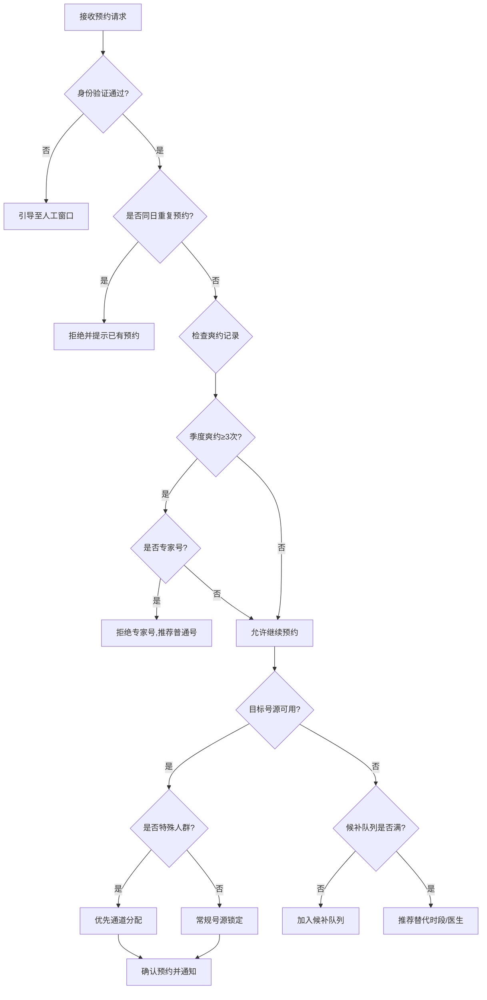
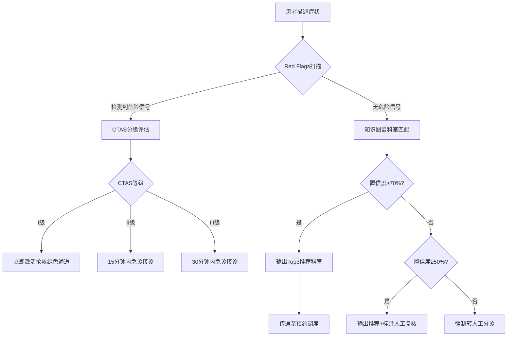

# 预约与患者服务标准操作规程 (SOP)

## 1. 文档概述

### 1.1 目的
本SOP定义了患者从预约挂号到就诊完成后满意度回访的全流程标准操作规范，确保各环节操作的一致性、及时性和高质量，提升患者就医体验并保障号源资源的高效利用。

### 1.2 适用范围
- 门诊预约挂号全渠道受理
- 智能预检分诊服务
- 号源调度与候诊管理
- 就诊提醒与通知服务
- 满意度回访与服务改进

### 1.3 关键绩效指标 (KPI)

| 指标名称 | 目标值 | 监控频率 | 责任Agent |
|----------|--------|----------|-----------|
| 预约诊疗率 | ≥50% | 每日 | 预约调度Agent |
| 智能分诊准确率 | ≥85% | 每周 | 智能分诊Agent |
| 平均候诊等候时间 | ≤30分钟 | 实时 | 候诊优化Agent |
| 患者爽约率 | ≤10% | 每日 | 预约调度Agent |
| 患者满意度评分 | ≥4.2/5.0 | 每周 | 通知提醒Agent |
| 预约系统响应时间 | ≤3秒 | 实时 | 预约调度Agent |
| 急诊分诊敏感度 | ≥95% | 每月 | 智能分诊Agent |
| 回访覆盖率 | ≥80% | 每周 | 通知提醒Agent |

---

## 2. RACI责任矩阵

| 流程步骤 | 预约调度Agent | 智能分诊Agent | 通知提醒Agent | 候诊优化Agent | 人工（导诊/客服） |
|----------|:---:|:---:|:---:|:---:|:---:|
| 预约请求受理 | R/A | - | I | - | C |
| 身份验证与资格检查 | R | - | - | - | A |
| 爽约管控执行 | R/A | - | I | - | C |
| 号源匹配与锁定 | R/A | - | - | - | I |
| 智能分诊评估 | I | R/A | - | - | C |
| CTAS急诊分级 | I | R/A | I | - | C |
| 急诊绿色通道激活 | R | A | I | - | C |
| 预约确认通知 | A | - | R | - | - |
| 就诊前提醒（24h/2h） | - | - | R/A | - | - |
| 候诊排队管理 | I | - | I | R/A | C |
| 等候时间预测更新 | - | - | I | R/A | - |
| 多诊室分流调度 | - | - | I | R/A | C |
| 过号处理 | I | - | R | A | C |
| 爽约判定与号源释放 | R/A | - | I | I | - |
| 停诊通知与改约 | A | - | R | I | C |
| 满意度回访触发 | - | - | R/A | - | C |
| 低分投诉工单处理 | - | - | A | - | R |
| 服务质量报告生成 | C | C | R/A | C | I |

> R=Responsible(执行), A=Accountable(负责), C=Consulted(咨询), I=Informed(知会)

---

## 3. SOP-1：预约受理规范

### 3.1 触发条件
- 患者通过任意渠道（App/小程序、电话、现场窗口、转诊）发起预约请求

### 3.2 执行步骤

#### 步骤1：请求接收与解析（响应时间≤3秒）
- **动作**：系统接收预约请求，解析来源渠道、患者信息和预约目标
- **输出**：标准化预约请求对象
- **异常处理**：系统超时(>3秒)时返回友好提示并记录性能异常日志

#### 步骤2：患者身份验证
- **动作**：核验患者身份信息（身份证号/医保卡/就诊卡），确认建档状态
- **输出**：验证通过/未通过标记；新患者触发建档流程
- **异常处理**：身份信息不匹配时引导至人工窗口

#### 步骤3：预约资格检查
- **动作**：
  - 查询当季度爽约累计次数
  - 检查是否同日同科室重复预约
  - 验证专家号预约资格（是否被爽约限制）
  - 识别特殊人群标识
- **输出**：资格检查结果（合格/受限/不合格）
- **异常处理**：受限患者告知限制原因并推荐普通号

#### 步骤4：号源锁定（锁定时效5分钟）
- **动作**：
  - 查询目标号源可用性
  - 可用：锁定号源（原子操作，防并发冲突）
  - 不可用：生成替代方案（同科室其他医生/相邻日期/候补队列）
- **输出**：锁定成功确认 / 替代方案列表
- **异常处理**：并发冲突时重试一次；号源全满时自动推荐候补

#### 步骤5：确认预约与通知
- **动作**：
  - 生成预约确认单
  - 触发通知提醒Agent发送确认消息
  - 更新号源池状态
  - 记录完整审计日志
- **输出**：预约确认号、确认通知发送状态
- **异常处理**：通知发送失败时记录并在5分钟后重试

### 3.3 质量检查点
| 检查项 | 目标值 | 测量方式 |
|--------|--------|----------|
| 预约成功率 | ≥95% | 成功预约数/总请求数 |
| 系统响应时间 | ≤3秒 | P95响应时间 |
| 号源冲突率 | ≤0.1% | 冲突次数/总锁定次数 |
| 特殊人群识别率 | 100% | 识别数/实际特殊人群预约数 |

---

## 4. SOP-2：智能分诊规范

### 4.1 触发条件
- 患者发起挂号请求且未明确科室
- 患者主动选择"智能分诊"功能
- 急诊患者到院需要紧急分级

### 4.2 执行步骤

#### 步骤1：症状信息采集
- **动作**：
  - 采集主诉（必填，不可跳过）
  - 通过针对性追问采集伴随症状（至少3项临床特征）
  - 查询既往病史和过敏史
- **输出**：结构化症状数据集
- **异常处理**：患者拒绝回答关键问题时标记为"信息不足"并推荐人工分诊

#### 步骤2：危险信号筛查（Red Flags）
- **动作**：
  - 实时匹配危险信号模式库（胸痛+出汗、单侧偏瘫、意识障碍等）
  - 检测生命体征异常（如已采集）
  - 一旦匹配立即中断常规流程
- **输出**：是否存在急诊信号 + CTAS分级
- **异常处理**：信息不足但疑似危急时按高优先级处理

#### 步骤3：科室匹配与推荐
- **动作**：
  - 基于症状-疾病-科室知识图谱执行匹配算法
  - 计算各候选科室的置信度分数
  - 输出Top3推荐科室（含置信度和决策依据）
- **输出**：推荐科室列表 + 置信度 + 匹配依据
- **异常处理**：置信度<70%时标注"建议人工分诊复核"

#### 步骤4：结果输出与流转
- **动作**：
  - 生成分诊评估报告
  - 急诊（I/II级）：直接触发急诊绿色通道
  - 普通门诊：将推荐科室传递给预约调度Agent
  - 症状摘要同步至接诊医生工作站
- **输出**：分诊结果 + 后续流程触发指令
- **异常处理**：系统匹配失败时默认推荐全科/内科并标记人工复核

### 4.3 质量检查点
| 检查项 | 目标值 | 测量方式 |
|--------|--------|----------|
| 分诊准确率 | ≥85% | 最终就诊科室在Top3中的比例 |
| 人工介入率 | ≤15% | 需人工复核数/总分诊数 |
| 急诊识别敏感度 | ≥95% | 正确识别的急诊/实际急诊总数 |
| 分诊用时 | ≤5分钟 | 从开始到出结果的平均时间 |

---

## 5. SOP-3：候诊管理规范

### 5.1 触发条件
- 患者到院签到完成，进入候诊状态
- 当日排班确认后候诊管理系统启动

### 5.2 执行步骤

#### 步骤1：签到与队列初始化
- **动作**：
  - 确认患者到院签到（自助机/App/窗口）
  - 分配排队序号并加入对应诊室队列
  - 计算初始预计等候时间
  - 推送签到成功和等候信息
- **输出**：排队序号 + 预计等候时间 + 诊室位置指引
- **异常处理**：签到异常（非当日预约/已过时段）引导至窗口处理

#### 步骤2：等候时间动态更新（每5分钟）
- **动作**：
  - 重新计算所有候诊患者的预计等候时间
  - 纳入动态因子（医生当前进度、过号情况、加塞等）
  - 变化>10分钟时触发患者通知
- **输出**：更新后的等候时间 + 变化标记
- **异常处理**：计算异常时使用上次有效值并标记告警

#### 步骤3：过号患者处理
- **动作**：
  - 叫号后3分钟无应答标记为"叫号未应"
  - 自动顺延3位（插入当前序号+3的位置）
  - 通知患者已过号及新的排队位置
  - 15分钟仍未应答标记爽约并释放号源
- **输出**：过号记录 + 新排队位置 / 爽约标记
- **异常处理**：高峰时段过号顺延位数可调整为5位

#### 步骤4：异常等候干预
- **动作**：
  - 检测等候时间超过预估30%的患者
  - 等候超60分钟主动推送安抚通知并提供选项
  - 记录异常原因（前方复杂病例/医生暂离等）
  - 严重积压时触发多诊室分流建议
- **输出**：异常等候报告 + 患者通知记录 + 分流建议
- **异常处理**：医生长时间未响应时通知科室护士长确认

#### 步骤5：叫号就诊
- **动作**：
  - 按序号叫号并推送通知
  - 确认患者进入诊室
  - 更新队列状态
  - 触发下一位预备通知
- **输出**：叫号记录 + 就诊开始时间戳
- **异常处理**：叫号系统故障时启用人工叫号备案

### 5.3 质量检查点
| 检查项 | 目标值 | 测量方式 |
|--------|--------|----------|
| 等候时间预估偏差 | ≤10分钟 | \|实际-预估\|的平均值 |
| 患者到诊率 | ≥90% | 实际到诊数/预约数 |
| 过号率 | ≤8% | 过号人次/总叫号人次 |
| 异常等候处理及时率 | 100% | 超60分钟主动通知比例 |

---

## 6. SOP-4：满意度回访规范

### 6.1 触发条件
- 患者就诊完成（有结算记录或医生完诊标记）后48小时

### 6.2 执行步骤

#### 步骤1：回访触发与排除筛选
- **动作**：
  - 就诊完成后48小时自动触发
  - 排除不适合回访的情况（住院转入、术后当日、丧亲等）
  - 确认发送时间不在勿扰时段（22:00-8:00）
  - 选择推送渠道（App>微信>短信）
- **输出**：回访任务 + 目标渠道 + 计划发送时间
- **异常处理**：排除规则误判时保留人工复核机制

#### 步骤2：问卷推送（5维度评分）
- **动作**：
  - 推送标准化问卷（预约便捷性、等候体验、医生服务、环境设施、总体满意度）
  - 每项1-5分评分 + 开放性文字反馈框
  - 设定填写有效期（7天）
  - 未填写3天后发送一次温和提醒
- **输出**：问卷推送记录 + 送达状态
- **异常处理**：推送失败切换备用渠道重试

#### 步骤3：数据收集与分析
- **动作**：
  - 收集评分和文字反馈
  - 自然语言分析文字反馈情感倾向
  - 关联就诊流程数据（等候时长、诊室、医生等）
  - 实时更新各维度统计指标
- **输出**：结构化回访数据 + 情感分析结果
- **异常处理**：无效评分（全部相同分数）标记可疑但不排除

#### 步骤4：低分处理（≤3分）
- **动作**：
  - 总体满意度≤3分立即触发预警
  - 自动生成投诉工单（含完整就诊流程回溯）
  - 指派人工客服24小时内跟进
  - 跟踪处理结果直至关闭
- **输出**：投诉工单 + 指派记录 + 处理时效跟踪
- **异常处理**：24小时未跟进自动升级至客服主管

#### 步骤5：报告生成
- **动作**：
  - 每周生成科室/医生维度满意度报告
  - 按时段分析满意度波动规律
  - 识别系统性问题和改善趋势
  - 输出可行的改进建议
- **输出**：满意度分析报告 + 改进建议清单
- **异常处理**：数据量不足（某科室<30份）时标注统计显著性不足

### 6.3 质量检查点
| 检查项 | 目标值 | 测量方式 |
|--------|--------|----------|
| 回访覆盖率 | ≥80% | 触发回访数/总就诊数 |
| 回访完成率 | ≥40% | 有效回收数/推送数 |
| 投诉响应时效 | ≤24小时 | 工单创建到首次跟进时间 |
| 低分跟进完成率 | 100% | 已处理工单/总低分工单 |

---

## 7. 异常路径处理

### 7.1 医生临时停诊
```
触发：医生确认停诊 / 医务部通知停诊
  → 冻结该医生所有未使用号源
  → 30分钟内通知所有已预约患者（多渠道并发）
  → 通知内容包含：一键改约 + 一键退号 + 替代医生推荐
  → 匹配同科室同级别替诊医生
  → 患者选择后更新预约信息
  → 未响应患者24小时后自动退号退费
```

### 7.2 系统故障恢复
```
触发：预约系统不可用超过5分钟
  → 启动降级服务（仅受理现场窗口预约）
  → 记录故障期间的线上预约请求队列
  → 系统恢复后按请求时间顺序批量处理
  → 通知受影响患者处理结果
```

### 7.3 号源超卖冲突
```
触发：并发预约导致同一号源被重复锁定
  → 以最先完成锁定的请求为准（时间戳排序）
  → 后续请求自动退回并推荐最近可用号源
  → 全过程对患者透明（显示"该号源刚被预约，已为您推荐..."）
  → 记录冲突事件用于系统优化
```

---

## 8. 决策树

### 8.1 预约受理决策树



### 8.2 分诊决策树



---

## 9. 跨模块协同接口

### 9.1 与诊疗辅助模块
- **数据流向**：分诊时预采集的症状信息 → 病史采集Agent（减少重复问诊）
- **触发条件**：患者完成分诊并确认预约后
- **数据格式**：结构化症状摘要（主诉+伴随症状+过敏史+既往史）

### 9.2 与病历质控模块
- **数据流向**：满意度回访数据 → 质量监测Agent（服务质量评估）
- **触发条件**：回访完成后实时同步
- **数据格式**：5维度评分+就诊关联信息

### 9.3 与外部系统
- **HIS系统**：号源数据同步、排班信息获取、结算状态查询
- **医保系统**：患者医保资格验证
- **短信网关**：通知消息发送
- **微信/App推送服务**：多渠道消息触达

---

## 10. 持续改进机制

### 10.1 PDCA循环
- **Plan**：每月基于KPI达成情况制定改进计划
- **Do**：执行改进措施（流程调整/阈值优化/规则修订）
- **Check**：每周检查改进效果（前后对比）
- **Act**：有效措施固化为标准，无效措施调整方案

### 10.2 模型优化周期
- 分诊知识图谱：每季度用确诊结果回测校准
- 等候时间预测模型：每周用实际数据更新参数
- 爽约风险模型：每月分析爽约行为模式优化预防策略
- 号源释放策略：每月根据到诊率数据动态调整

### 10.3 服务质量评审
- **周会**：回顾上周KPI异常事件和患者投诉
- **月会**：分析月度满意度趋势和系统性问题
- **季度评审**：全流程效率审计和目标修订
