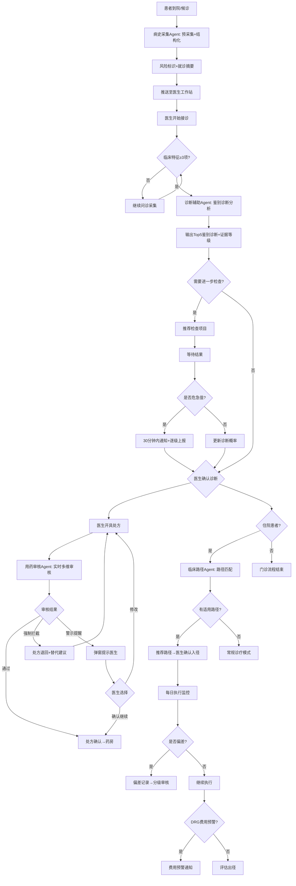

# 诊疗辅助标准操作规程（SOP）

## 1. 文档信息

| 项目 | 内容 |
|------|------|
| 文档编号 | SOP-CDS-001 |
| 版本 | v1.0 |
| 适用范围 | 临床诊疗辅助全流程 |
| 生效日期 | 发布即生效 |
| 审核周期 | 每季度审核一次 |
| 核心原则 | AI辅助决策，医生最终判断；所有建议标注证据等级；患者安全第一 |

---

## 2. RACI矩阵

| 流程步骤 | 病史采集Agent | 诊断辅助Agent | 用药审核Agent | 临床路径Agent | 经治医生 | 上级医师 | 医务部 |
|----------|:---:|:---:|:---:|:---:|:---:|:---:|:---:|
| 病史预采集 | R | - | - | - | I | - | - |
| 风险标识 | R | I | I | - | A | - | - |
| 就诊摘要推送 | R | - | - | - | I | - | - |
| 鉴别诊断生成 | C | R | - | - | A | I | - |
| 检查检验推荐 | - | R | - | - | A | - | - |
| 危急值通知 | - | R | - | - | A | C | I |
| 处方审核（实时） | C | C | R | - | A | - | - |
| 强制拦截处理 | - | - | R | - | A | I | I |
| 抗菌药物专项审核 | - | - | R | - | A | C | I |
| 路径匹配推荐 | - | C | - | R | A | - | - |
| 路径每日监控 | - | - | - | R | I | I | - |
| 偏差记录与审核 | - | - | - | R | A | A | I |
| DRG费用预警 | - | - | - | R | I | I | C |

> R=Responsible(执行)  A=Accountable(审批/负责)  C=Consulted(咨询)  I=Informed(知会)

---

## 3. SOP-1：病史预采集规范

### 3.1 触发条件
- 患者完成签到/候诊状态变更
- 或患者通过App/小程序提前填写（到院前24小时内）
- 或医生手动触发预采集

### 3.2 执行步骤

| 步骤 | 操作 | 执行者 | 时限 | 输出 |
|------|------|--------|------|------|
| 1 | 检查患者是否已有7天内预采集记录 | 病史采集Agent | 即时 | 决定完整/更新模式 |
| 2 | 推送智能问卷（主诉、现病史、过敏史为必填） | 病史采集Agent | - | 问卷链接 |
| 3 | 患者完成填写或超时30分钟 | 患者 | ≤30min | 原始填写数据 |
| 4 | 结构化处理（术语标准化、格式化） | 病史采集Agent | ≤30s | 结构化JSON |
| 5 | 自动关联近6个月检查检验结果 | 病史采集Agent | ≤10s | 历史数据关联 |
| 6 | 风险项识别与标注 | 病史采集Agent | ≤5s | 风险标识报告 |
| 7 | 生成就诊摘要（≤300字） | 病史采集Agent | ≤10s | 就诊摘要 |
| 8 | 推送至医生工作站 | 系统 | 即时 | 医生端展示 |

### 3.3 异常处理
- **患者未完成问卷**：标记为"信息不完整"，仅推送已采集部分
- **系统无法获取历史数据**：标注"历史数据获取失败"，不影响其余流程
- **识别到急症症状描述**：立即标记为紧急，触发加速通道通知

### 3.4 质量检查点

| KPI指标 | 目标值 | 计算方式 | 监控频率 |
|---------|--------|----------|----------|
| 预采集完成率 | ≥70% | 完成预采集的患者/当日就诊患者 | 日 |
| 信息准确率 | ≥90% | 抽样对比面诊记录验证 | 周 |
| 关键风险项识别率 | ≥98% | 实际风险项被系统识别的比例 | 周 |
| 摘要推送及时率 | ≥95% | 在医生接诊前完成推送的比例 | 日 |

---

## 4. SOP-2：辅助诊断规范

### 4.1 触发条件
- 医生开始接诊（打开患者就诊界面）且已有≥3项临床特征输入
- 或医生主动请求诊断辅助
- 或检查检验结果回报时自动触发更新

### 4.2 执行步骤

| 步骤 | 操作 | 执行者 | 时限 | 输出 |
|------|------|--------|------|------|
| 1 | 验证输入临床特征数量≥3 | 诊断辅助Agent | 即时 | 通过/不足提示 |
| 2 | 综合分析症状+体征+检查结果 | 诊断辅助Agent | ≤5s | 分析模型 |
| 3 | 生成鉴别诊断列表（Top5，按概率排序） | 诊断辅助Agent | ≤3s | 诊断列表 |
| 4 | 为每个诊断标注证据等级(A/B/C/D) | 诊断辅助Agent | ≤2s | 证据标注 |
| 5 | 推荐针对性检查检验项目 | 诊断辅助Agent | ≤2s | 检查推荐 |
| 6 | 评估是否存在急危重症特征 | 诊断辅助Agent | 即时 | 预警/无 |
| 7 | 输出结果至医生工作站 | 系统 | 即时 | 界面展示 |
| 8 | 检验结果回报→更新诊断概率 | 诊断辅助Agent | 结果回报后≤30s | 更新后列表 |

### 4.3 危急值通知子流程

```
检验结果接收 → 危急值匹配 → [匹配到危急值?]
  ├─ 是 → 立即通知主管医生（系统弹窗+短信+电话）
  │       → [15分钟内确认?]
  │         ├─ 否 → 升级通知科主任
  │         │       → [30分钟内确认?]
  │         │         ├─ 否 → 通知医务部 + 记录超时事件
  │         │         └─ 是 → 记录处理方案
  │         └─ 是 → 记录处理方案
  └─ 否 → 正常结果流程
```

### 4.4 异常处理
- **临床特征不足3项**：返回"信息不足，建议补充临床信息后再次请求"
- **最高置信度<60%**：在输出中显著标注"证据不足，仅供参考"
- **识别到急危重症**：置顶预警，不受置信度阈值限制
- **知识库无匹配**：标注"当前知识库未覆盖该临床表现组合"

### 4.5 质量检查点

| KPI指标 | 目标值 | 计算方式 | 监控频率 |
|---------|--------|----------|----------|
| 诊断提示覆盖率 | ≥80% | 最终诊断在Top5中的比例 | 季度 |
| 证据等级标注准确率 | ≥90% | 抽样专家复核 | 季度 |
| 危急值通知及时率 | ≥99% | 30分钟内确认比例 | 日 |
| 急危重症识别敏感度 | ≥95% | 实际急危重中系统预警的比例 | 月 |
| 诊断辅助响应时间 | ≤10s | 从触发到结果展示的时间 | 日 |

---

## 5. SOP-3：处方审核规范

### 5.1 触发条件
- 医生在工作站提交处方/医嘱（实时触发，无例外）
- 处方审核覆盖率要求100%

### 5.2 执行步骤

| 步骤 | 操作 | 执行者 | 时限 | 输出 |
|------|------|--------|------|------|
| 1 | 接收处方数据，关联患者信息 | 用药审核Agent | 即时 | 审核上下文 |
| 2 | 过敏史交叉核查 | 用药审核Agent | ≤0.5s | 过敏匹配结果 |
| 3 | 药物相互作用(DDI)检测 | 用药审核Agent | ≤0.5s | DDI检测结果 |
| 4 | 剂量合理性校验 | 用药审核Agent | ≤0.5s | 剂量校验结果 |
| 5 | 禁忌症排查 | 用药审核Agent | ≤0.3s | 禁忌匹配结果 |
| 6 | 重复用药检测 | 用药审核Agent | ≤0.2s | 重复检测结果 |
| 7 | [抗菌药物] 分级管理专项审核 | 用药审核Agent | ≤0.5s | 抗菌药审核结果 |
| 8 | 综合审核结论 | 用药审核Agent | 即时 | 通过/拦截/警示 |
| 9 | 返回结果至医生工作站 | 系统 | 总计≤2s | 审核反馈 |

### 5.3 审核决策树

```
处方提交 → 全维度审核
  ├─ 强制拦截条件（任一满足即拦截）:
  │   • 已知过敏药物（严重过敏史）
  │   • 禁忌级DDI（X级）
  │   • 超极量10倍以上
  │   • 绝对禁忌症
  │   → 处方退回 + 显示拦截理由 + 提供替代方案
  │   → 医生必须修改后重新提交
  │
  ├─ 警示提醒条件:
  │   • 相对禁忌
  │   • 严重/中度DDI（D/C级）
  │   • 超常规剂量（未超10倍极量）
  │   • 重复用药
  │   • 肾功能不全未调整剂量
  │   • [抗菌药物] 权限不足/未送检
  │   → 弹窗提示 + 显示警示详情
  │   → 医生选择：修改处方 / 确认继续（填写理由）
  │   → 确认继续的理由记入备注供药师复核
  │
  └─ 审核通过:
      → 处方进入药房调配流程
      → 记录审核日志
```

### 5.4 抗菌药物专项审核子流程

| 步骤 | 操作 | 判定标准 | 处理 |
|------|------|----------|------|
| 1 | 识别处方中的抗菌药物 | 药品分类库匹配 | - |
| 2 | 确定管理级别 | 非限制/限制/特殊使用 | - |
| 3 | 校验处方权限 | 职称≥对应级别要求 | 不足→拦截 |
| 4 | 适应症匹配 | 有感染相关诊断 | 无→警示 |
| 5 | 微生物送检检查 | 限制级以上需送检 | 未送→警示 |
| 6 | 给药方案合理性 | PK/PD原则 | 不合理→警示 |
| 7 | 围术期用药规范 | 术前0.5-1h、≤24-48h | 偏离→警示 |

### 5.5 异常处理
- **审核超时（>2s）**：允许处方通过但标记"审核超时待复核"，事后人工复核
- **药品信息缺失**：标注"该药品未入审核数据库"，建议人工审核
- **患者信息不完整**（如过敏史空白）：不按安全处理，标注"过敏史信息缺失，请确认"
- **系统故障**：启用降级模式，处方允许通过但标记待审核，恢复后批量补审

### 5.6 质量检查点

| KPI指标 | 目标值 | 计算方式 | 监控频率 |
|---------|--------|----------|----------|
| 处方审核覆盖率 | 100% | 审核处方数/提交处方数 | 日 |
| 强制拦截准确率 | ≥99.5% | 真阳性/(真阳性+假阳性) | 月 |
| 虚警率 | ≤5% | 假阳性/总报警数 | 月 |
| 审核响应时间 | ≤2s | 提交到返回结果的时间 | 实时 |
| 处方合理率 | ≥98% | 审核通过处方/总处方 | 日 |
| 抗菌药物合规率 | ≥95% | 合规处方/抗菌药物处方 | 周 |
| 微生物送检率 | ≥70% | 限制级以上使用前送检比例 | 周 |

---

## 6. SOP-4：临床路径管理规范

### 6.1 触发条件
- 住院患者确认主诊断后自动触发路径匹配
- 或医生手动发起路径查询
- 入径后每日自动触发执行监控

### 6.2 执行步骤

| 步骤 | 操作 | 执行者 | 时限 | 输出 |
|------|------|--------|------|------|
| 1 | 获取患者主诊断和基本信息 | 临床路径Agent | 即时 | 匹配参数 |
| 2 | 路径库匹配（含适用性评分） | 临床路径Agent | ≤5s | 候选路径列表 |
| 3 | 推荐路径方案呈现给医生 | 系统 | 即时 | 路径卡片 |
| 4 | 医生确认入径/不入径 | 经治医生 | ≤24h | 入径决策 |
| 5 | 入径后生成路径执行计划 | 临床路径Agent | ≤30s | 全程任务时间表 |
| 6 | 每日8:00前推送当日任务清单 | 临床路径Agent | 每日定时 | 当日checklist |
| 7 | 实时追踪任务执行状态 | 临床路径Agent | 持续 | 执行进度 |
| 8 | 偏差识别与记录 | 临床路径Agent | 即时 | 偏差工单 |
| 9 | DRG费用监控与预警 | 临床路径Agent | 持续 | 费用仪表盘 |
| 10 | 出径条件评估 | 临床路径Agent | 路径末期 | 出径建议 |

### 6.3 偏差管理决策树

```
偏差事件发生
  → 自动识别偏差类型（时间/活动/药物/出径）
  → 分级评估
    ├─ 轻微偏差（不影响住院日和主要费用）
    │   → 经治医生记录原因即可
    │
    ├─ 一般偏差（影响住院日1-2天或费用增加<50%）
    │   → 经治医生记录原因
    │   → 上级医师审核签字
    │   → 24小时内完成
    │
    └─ 重大偏差（影响住院日≥3天或费用增加≥50%或转ICU/再手术）
        → 经治医生记录原因
        → 科主任审核
        → 报医务部备案
        → 评估是否退径
        → 12小时内完成审核
```

### 6.4 DRG费用预警规则

| 预警级别 | 触发条件 | 通知对象 | 处理要求 |
|----------|----------|----------|----------|
| 绿色(正常) | 费用≤均值×1.2 | - | 常规监控 |
| 黄色预警 | 费用>均值×1.2 | 经治医生 | 关注费用增长点 |
| 红色预警 | 费用>均值×1.5 | 经治医生+科主任 | 费用分析+控制方案 |
| 严重超支 | 费用>均值×2.0 | 经治医生+科主任+医务部 | 特殊审批 |

### 6.5 异常处理
- **无适用路径**：标注"无适用临床路径"，进入常规诊疗模式
- **路径执行中诊断变更**：重新评估路径适用性，必要时退径并匹配新路径
- **患者主动要求出院**：记录为"非计划出径-患者因素"，完成出院安全评估
- **DRG分组调整**：重新计算费用对标基准，更新预警阈值

### 6.6 质量检查点

| KPI指标 | 目标值 | 计算方式 | 监控频率 |
|---------|--------|----------|----------|
| 路径入径率 | ≥50% | 入径人次/符合入径条件人次 | 月 |
| 路径完成率 | ≥70% | 正常出径人次/入径人次 | 季度 |
| 入径匹配准确率 | ≥90% | 正确匹配/总匹配推荐 | 月 |
| 偏差记录完整率 | ≥95% | 完整记录的偏差/总偏差事件 | 月 |
| DRG费用消耗指数 | ≤1.0 | 实际费用均值/标准费用 | 月 |
| DRG时间消耗指数 | ≤1.0 | 实际住院日均值/标准住院日 | 月 |
| 每日任务推送准时率 | ≥98% | 8:00前完成推送的天数比例 | 日 |

---

## 7. 决策总流程图



---

## 8. 系统安全与合规要求

### 8.1 法规遵循
- 《处方管理办法》：处方审核全覆盖，抗菌药物分级管理
- 《抗菌药物临床应用管理办法》：使用率、使用强度、送检率达标
- 《医疗质量管理办法》：质量指标监控和持续改进
- 《电子病历应用管理规范》：数据完整性和可追溯性
- 《个人信息保护法》：患者隐私保护和数据安全

### 8.2 免责声明
- 所有AI输出在界面显著位置标注："本系统输出仅供临床参考，不构成医疗决策依据，最终诊疗决策由主管医生负责"
- AI建议记录保留完整审计轨迹
- 医生对AI建议的采纳或拒绝均有记录

### 8.3 系统可用性要求
- 处方审核模块：可用性≥99.99%（年停机≤53分钟）
- 危急值通知：可用性≥99.99%
- 辅助诊断：可用性≥99.9%
- 路径管理：可用性≥99.9%
- 故障时的降级方案：详见各SOP异常处理章节

---

## 9. 持续改进机制

| 改进活动 | 频率 | 负责人 | 输入 | 输出 |
|----------|------|--------|------|------|
| 诊断准确性回顾 | 季度 | 医务部+AI团队 | 出院诊断vs AI建议 | 模型优化方案 |
| 处方审核规则审查 | 季度 | 药事委员会 | 拦截/虚警统计 | 规则调整 |
| 路径修订评估 | 季度 | 路径管理委员会 | 偏差分析报告 | 路径版本更新 |
| 危急值阈值审查 | 年度 | 检验科+医务部 | 使用数据+文献 | 阈值调整 |
| 抗菌药物分析 | 月度 | 感染科+药学部 | 使用率/DDD/送检率 | 管控策略调整 |
| KPI达标评估 | 月度 | 质控办 | 全量指标数据 | 改进行动计划 |
