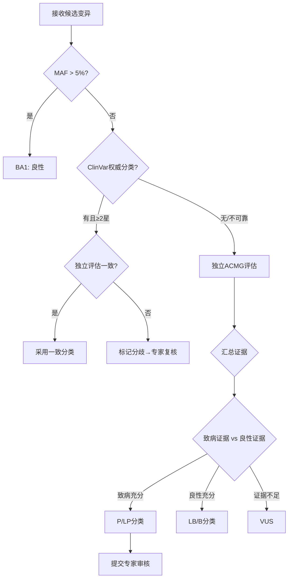
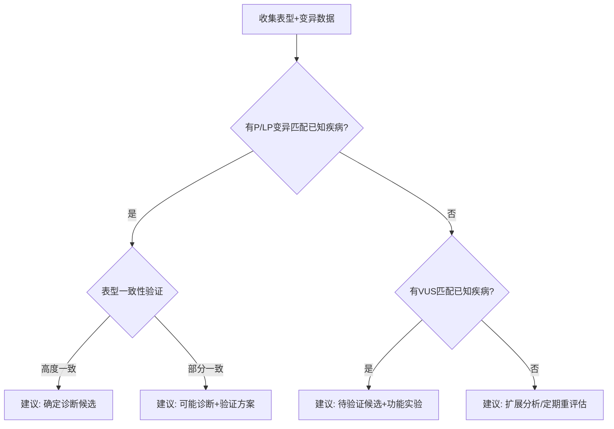

# 基因组与精准医疗标准操作规程 (SOP)

## 1. 文档概述

### 1.1 目的
本SOP定义了基因组测序数据从接收到报告签发的全流程标准操作规范，确保基因变异解读的准确性、一致性和可追溯性，支持罕见病诊断和个体化用药的精准医学实践。

### 1.2 适用范围
- 临床全外显子/全基因组测序变异解读
- 罕见病辅助诊断与候选基因分析
- 药物基因组学个体化用药指导
- 药物再利用候选筛选（科研用途）
- 基因检测报告生成与专家审核

### 1.3 关键绩效指标 (KPI)

| 指标名称 | 目标值 | 监控频率 | 责任Agent |
|----------|--------|----------|-----------|
| 变异分类与ClinVar一致率 | ≥90% | 每月 | 变异解读Agent |
| 报告时限达标率（紧急） | ≥95% | 每周 | 变异解读Agent |
| 报告时限达标率（常规） | ≥98% | 每月 | 变异解读Agent |
| 罕见病诊断辅助率（Top10命中） | ≥70% | 每季度 | 罕见病诊断Agent |
| 药物基因组学建议采纳率 | ≥80% | 每月 | 药物基因组Agent |
| 高风险基因型预警及时率 | 100% | 实时 | 药物基因组Agent |
| 专家审核通过率（首次） | ≥85% | 每月 | 变异解读Agent |
| VUS重评估覆盖率 | ≥90% | 每半年 | 变异解读Agent |

---

## 2. RACI责任矩阵

| 流程步骤 | 变异解读Agent | 罕见病诊断Agent | 药物基因组Agent | 分子遗传学专家 | 临床医生 |
|----------|:---:|:---:|:---:|:---:|:---:|
| 测序数据接收与质控 | R/A | - | - | I | - |
| 群体频率注释与过滤 | R/A | - | - | - | - |
| 计算预测分析 | R/A | - | - | - | - |
| 家系共分离分析 | R/A | I | - | C | - |
| ACMG证据汇总与分类 | R | - | - | A | I |
| 临床表型HPO标准化 | - | R/A | - | - | C |
| 候选基因优先级排序 | C | R/A | - | - | I |
| 罕见病诊断建议 | C | R | - | A | I |
| 药物代谢表型判定 | - | - | R/A | - | I |
| 个体化用药建议 | - | - | R | C | A |
| 高风险基因型预警 | - | - | R/A | I | I |
| 药物再利用分析 | - | - | R/A | C | I |
| 报告生成与质量审核 | R/A | C | C | - | - |
| 专家审核与签发 | R | - | - | A | - |
| 报告递送与通知 | R/A | - | - | - | I |

> R=Responsible(执行), A=Accountable(负责), C=Consulted(咨询), I=Informed(知会)

---

## 3. SOP-1：基因变异解读规范

### 3.1 触发条件
- 生信分析流水线完成变异检出并输出VCF文件
- 样本通过质量评估标准（深度/覆盖度达标）

### 3.2 执行步骤

#### 步骤1：数据质量验证
- **动作**：验证VCF文件完整性、测序质量指标达标（WES≥100x、WGS≥30x、覆盖度≥95%）
- **输出**：质量评估报告（通过/不通过）
- **异常处理**：不达标样本生成质量不合格报告，通知送检方重新送样

#### 步骤2：多数据库注释
- **动作**：查询gnomAD v4频率、ClinVar分类、HGMD记录、计算预测得分
- **输出**：完整注释的变异列表
- **异常处理**：数据库不可用时使用缓存版本并标记版本日期

#### 步骤3：频率过滤与候选变异筛选
- **动作**：MAF>5%→BA1排除；MAF>1%→候选良性；罕见变异（MAF<1%）保留进入深度分析
- **输出**：候选变异列表（通常50-200个）
- **异常处理**：过滤后无候选时放宽阈值并标记

#### 步骤4：ACMG多维度证据评估
- **动作**：对每个候选变异逐条评估ACMG证据（频率/计算/功能/分离/de novo等）
- **输出**：每个变异的证据条目清单
- **异常处理**：证据冲突时优先采用更高质量证据来源

#### 步骤5：分类判定与一致性比对
- **动作**：按ACMG组合规则判定分类；与ClinVar比对；不一致标记人工复核
- **输出**：最终分类结论（P/LP/VUS/LB/B）+ 证据链
- **异常处理**：与ClinVar≥2星注释不一致时强制人工复核

### 3.3 质量检查点
| 检查项 | 目标值 | 测量方式 |
|--------|--------|----------|
| 注释完整率 | 100% | 所有字段非空比例 |
| 与ClinVar一致率 | ≥90% | 独立分类vs ClinVar分类 |
| 证据链完整性 | 100% | 每个分类结论有完整证据支撑 |
| 分类用时（per variant） | ≤30分钟 | 平均单变异分类耗时 |

---

## 4. SOP-2：罕见病辅助诊断规范

### 4.1 触发条件
- 送检指征为疑似遗传病/不明原因多系统受累
- 变异分类发现P/LP变异关联已知遗传病

### 4.2 执行步骤

#### 步骤1：表型标准化与评估
- **动作**：临床描述→HPO术语转换；区分核心/伴随表型；记录时间线和阴性表型
- **输出**：标准化HPO表型集 + 信息完整度评估
- **异常处理**：表型信息不足时反馈临床医生建议补充评估项

#### 步骤2：候选基因综合评分
- **动作**：表型-基因关联×0.4 + 变异致病性×0.3 + 遗传模式×0.2 + 文献×0.1
- **输出**：Top10候选基因排序 + 评分明细
- **异常处理**：所有候选评分均低时建议扩展分析（如RNA-seq、长读长测序）

#### 步骤3：表型-基因型交叉验证
- **动作**：验证候选基因已知表型谱是否覆盖患者核心表型；检查遗传模式一致性
- **输出**：一致性验证报告 + 不匹配点说明
- **异常处理**：表型不典型时考虑表达变异度和年龄依赖性

#### 步骤4：诊断建议生成
- **动作**：输出候选诊断（标注证据强度）、鉴别诊断≥3个、验证方案、下一步建议
- **输出**：罕见病诊断建议报告
- **异常处理**：无法明确诊断时如实报告并建议定期重评估

### 4.3 质量检查点
| 检查项 | 目标值 | 测量方式 |
|--------|--------|----------|
| HPO标准化准确率 | ≥95% | 人工抽查验证 |
| Top10命中率 | ≥70% | 最终确诊疾病在Top10中的比例 |
| 鉴别诊断覆盖度 | ≥3个 | 每例提供鉴别诊断数量 |
| 验证建议可行性 | ≥90% | 临床可执行的建议比例 |

---

## 5. SOP-3：药物基因组学指导规范

### 5.1 触发条件
- 检测包含药物代谢相关基因
- 确诊后需要精准用药指导

### 5.2 执行步骤

#### 步骤1：基因型结果接收与验证
- **动作**：验证基因型标注格式、确认等位基因覆盖范围、标记未检测的重要等位基因
- **输出**：验证通过的基因型数据
- **异常处理**：等位基因命名不标准时转换为星号命名法

#### 步骤2：代谢表型判定
- **动作**：根据基因型组合判定代谢表型（UM/NM/IM/PM）
- **输出**：各基因代谢表型判定结果
- **异常处理**：基因型活性评分不确定时标注范围而非单一判定

#### 步骤3：指南查询与建议生成
- **动作**：查询CPIC/DPWG/PharmGKB，标注证据等级，生成个体化建议
- **输出**：用药建议清单 + 证据等级 + 指南引用
- **异常处理**：无适用CPIC指南时查询DPWG或PharmGKB注释

#### 步骤4：风险预警与通知
- **动作**：高风险基因型（HLA-B*5801等）即时触发禁忌预警
- **输出**：预警通知 + 禁忌药物清单
- **异常处理**：通知发送失败时15分钟重试并升级通知

### 5.3 质量检查点
| 检查项 | 目标值 | 测量方式 |
|--------|--------|----------|
| 代谢表型判定准确率 | ≥99% | 与金标准比对 |
| 高风险预警及时率 | 100% | 发现到通知时间≤1小时 |
| 建议证据等级标注率 | 100% | 每条建议有明确等级 |
| 建议采纳率 | ≥80% | 临床实际采纳比例 |

---

## 6. SOP-4：报告生成与签发规范

### 6.1 触发条件
- 所有分析流程完成，结果汇总就绪

### 6.2 执行步骤

#### 步骤1：报告组装
- **动作**：整合变异分类、诊断建议、用药指导生成完整报告
- **输出**：报告草稿
- **异常处理**：部分模块未完成时可先出部分报告并标注待补充

#### 步骤2：自动质量审核
- **动作**：必填字段检查、HGVS规范性、分类-证据一致性、敏感信息脱敏
- **输出**：质量审核通过/需修正
- **异常处理**：审核不通过自动退回并标注具体问题

#### 步骤3：专家审核
- **动作**：P/LP变异报告提交专家审核；生成审核摘要；记录修改痕迹
- **输出**：审核通过/修改意见
- **异常处理**：专家48小时未审核自动发送提醒

#### 步骤4：签发与递送
- **动作**：专家电子签名→生成最终版→通知送检方→更新患者档案
- **输出**：签发报告 + 递送确认
- **异常处理**：递送失败时备用渠道重试

### 6.3 质量检查点
| 检查项 | 目标值 | 测量方式 |
|--------|--------|----------|
| 紧急报告时限达标 | ≥95% | 7工作日内完成比例 |
| 常规报告时限达标 | ≥98% | 21工作日内完成比例 |
| 首次审核通过率 | ≥85% | 无修改直接通过比例 |
| 报告完整性 | 100% | 必填字段100%覆盖 |

---

## 7. 异常路径处理

### 7.1 紧急报告超时风险
```
触发：距截止时间≤3个工作日且报告未完成
  → 自动预警通知分析人员和科室负责人
  → 评估延迟原因（数据质量/分析复杂度/审核积压）
  → 必要时调配资源加急处理
  → 预计超时需提前通知送检方并说明原因
```

### 7.2 变异分类分歧
```
触发：独立分类与ClinVar权威注释不一致
  → 标记分歧并详细记录两方证据
  → 提交至变异分类讨论会（每周一次）
  → 多专家共识后确定最终分类
  → 如确认ClinVar有误，可提交ClinVar更新请求
```

### 7.3 数据安全事件
```
触发：检测到未授权的基因数据访问
  → 立即锁定相关账户
  → 通知信息安全团队和科室负责人
  → 启动安全事件调查流程
  → 24小时内完成影响评估
  → 按需启动患者告知程序
```

---

## 8. 决策树

### 8.1 变异分类决策树


### 8.2 诊断建议决策树


---

## 9. 跨模块协同接口

### 9.1 与诊疗辅助模块
- **数据流向**：药物基因组学用药建议 → 用药审核Agent（个体化处方校验参考）
- **触发条件**：药物基因组学报告签发后
- **数据格式**：基因型-代谢表型-用药建议-证据等级

### 9.2 与病历质控模块
- **数据流向**：基因检测报告 → 病历质控Agent（作为病历附件管理）
- **触发条件**：报告签发并归档
- **数据格式**：结构化报告数据 + PDF报告文件

### 9.3 与外部系统
- **LIMS系统**：样本信息和检测流程管理
- **生信流水线**：测序数据和变异检出结果
- **临床信息系统**：患者表型和病史信息
- **基因组数据库**：gnomAD/ClinVar/HGMD等

---

## 10. 持续改进机制

### 10.1 PDCA循环
- **Plan**：每季度基于分类准确率和报告时限达标率制定改进计划
- **Do**：执行改进措施（知识库更新/流程优化/培训）
- **Check**：每月检查改进效果（与确诊结果回溯比对）
- **Act**：有效措施固化为标准，优化分类规则库

### 10.2 知识库更新周期
- ACMG规则：发布更新后1个月内纳入系统
- ClinVar数据：每周同步最新版本
- CPIC/DPWG指南：发布后2周内更新
- gnomAD频率数据：重大版本更新后1个月内切换
- VUS定期重评估：每6个月批量重分析

### 10.3 质量评审
- **周会**：审核异常病例和分类分歧
- **月会**：KPI达标情况分析和趋势讨论
- **季度评审**：与临床确诊结果回溯比对校准模型
