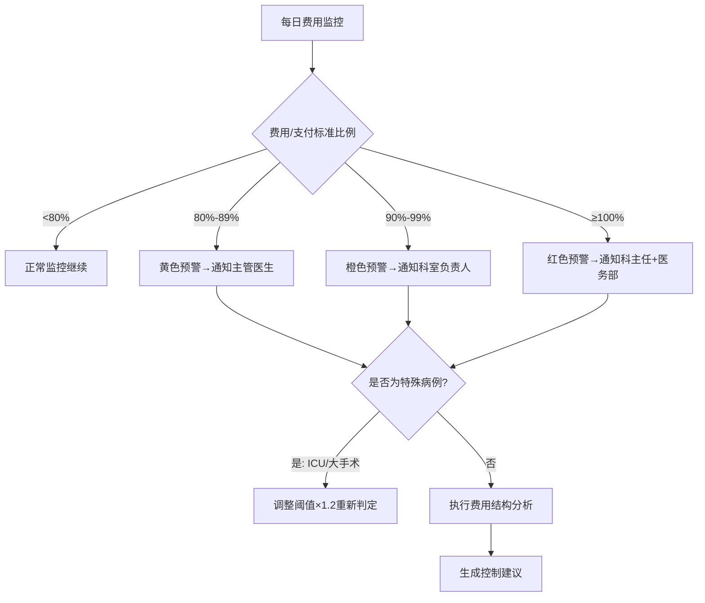
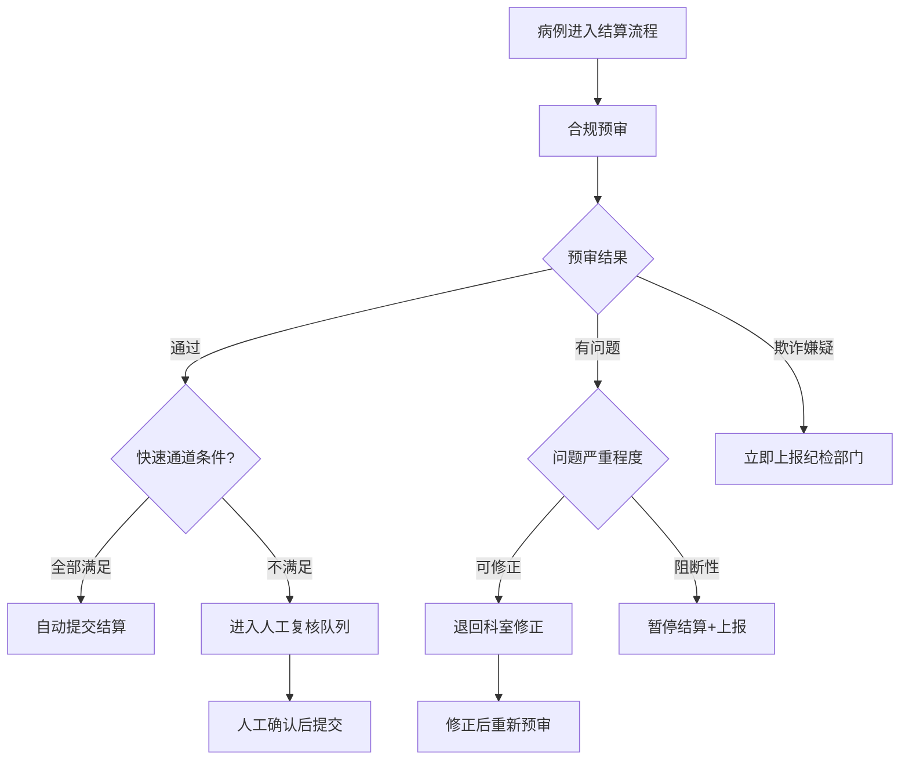

# 医疗财务与收入优化标准操作规程 (SOP)

## 1. 文档概述

### 1.1 目的
本SOP定义了医院在DRG/DIP支付改革背景下的病案编码审核、费用监控预警、医保结算管理和收入分析的全流程标准操作规范，确保编码准确性、费用合规性和收入完整性。

### 1.2 适用范围
- 出院病案首页编码质量审核
- DRG/DIP分组管理与CMI追踪
- 住院费用实时监控与超标预警
- 医保结算合规预审与提交管理
- 收入漏洞检测与堵漏
- 月度科室收入分析报告

### 1.3 关键绩效指标 (KPI)

| 指标名称 | 目标值 | 监控频率 | 责任Agent |
|----------|--------|----------|-----------|
| DRG入组准确率 | ≥95% | 每月 | DRG编码专员Agent |
| 主要诊断正确率 | ≥90% | 每月 | DRG编码专员Agent |
| 手术操作编码完整率 | ≥95% | 每月 | DRG编码专员Agent |
| 医保拒付率 | <3% | 每月 | 合规审计Agent |
| 费用超标预警及时率 | ≥95% | 每周 | 收入优化Agent |
| 收入漏洞检测覆盖率 | 100% | 每日 | 收入优化Agent |
| CMI值环比稳定/提升 | ≥上月值 | 每月 | DRG编码专员Agent |
| 快速结算通道比例 | ≥70% | 每月 | 合规审计Agent |

---

## 2. RACI责任矩阵

| 流程步骤 | DRG编码专员Agent | 收入优化Agent | 合规审计Agent | 病案编码员 | 科室负责人 |
|----------|:---:|:---:|:---:|:---:|:---:|
| 病案首页数据提取 | R/A | - | - | C | - |
| 编码质量审核 | R/A | - | - | I | - |
| 编码问题退回修改 | R | - | - | A | I |
| DRG/DIP分组执行 | R/A | I | I | - | - |
| 费用实时监控 | - | R/A | - | - | I |
| 费用超标预警 | - | R/A | - | - | I |
| 收入漏洞检测 | - | R/A | - | - | I |
| 漏收费补录提醒 | - | R | - | - | A |
| 医保结算预审 | C | - | R/A | - | I |
| 快速通道判定 | - | - | R/A | - | - |
| 结算提交 | - | - | R/A | - | - |
| 拒付分析与申诉 | C | - | R/A | - | I |
| CMI追踪分析 | R/A | C | - | - | I |
| 月度收入报告 | C | R/A | C | - | I |
| 合规风险上报 | I | I | R/A | - | I |

> R=Responsible(执行), A=Accountable(负责), C=Consulted(咨询), I=Informed(知会)

---

## 3. SOP-1：病案编码质量审核规范

### 3.1 触发条件
- 病案首页编码完成提交（出院后24小时内）

### 3.2 执行步骤

#### 步骤1：数据完整性验证
- **动作**：验证病案首页必填字段完整性（主诊、出院方式、入出院日期、手术操作等）
- **输出**：完整性检查通过/不通过
- **异常处理**：必填字段缺失时退回病案室，限2小时内补充

#### 步骤2：主要诊断选择审核
- **动作**：验证主诊是否为本次住院主要原因和最大资源消耗方向
- **输出**：主诊正确/需修改（附建议）
- **异常处理**：常见错误模式（症状代替诊断、并发症误选为主诊）自动提示

#### 步骤3：手术操作编码完整性检查
- **动作**：对比医嘱系统手术记录，验证所有有编码意义的操作均已编码
- **输出**：完整率评分 + 漏编项列表
- **异常处理**：漏编的DRG关键操作（影响分组的）优先标记

#### 步骤4：合并症与编码规范性审查
- **动作**：CC/MCC验证、编码互斥检测、性别年龄逻辑验证
- **输出**：规范性评分 + 问题清单
- **异常处理**：严重规范性问题（互斥编码）强制退回

#### 步骤5：综合评分与流转
- **动作**：综合评分（百分制），≥80分流转至DRG分组，<80分退回修改
- **输出**：编码质量评分 + 审核结论
- **异常处理**：退回次数≥2次升级通知科室质控员

### 3.3 质量检查点
| 检查项 | 目标值 | 测量方式 |
|--------|--------|----------|
| 主要诊断正确率 | ≥90% | 与专家评审对比 |
| 手术操作编码完整率 | ≥95% | 对比手术记录 |
| 审核时效 | 出院后48小时内 | 时间戳记录 |
| 编码退回率 | ≤15% | 退回次数/总审核数 |

---

## 4. SOP-2：费用监控与超标预警规范

### 4.1 触发条件
- 住院病例入院后每日自动执行
- DRG分组完成后触发出院病例费用分析

### 4.2 执行步骤

#### 步骤1：DRG预分组与标准确定
- **动作**：基于入院诊断进行DRG预分组，获取对应支付标准
- **输出**：预分组结果 + 支付标准 + 预警阈值
- **异常处理**：无法预分组时使用科室历史均费作为参考

#### 步骤2：每日费用汇总与比对
- **动作**：汇总当日新增费用，计算累积费用占支付标准比例
- **输出**：费用日报 + 占比曲线 + 趋势预测
- **异常处理**：费用数据延迟时使用T-1数据并标注

#### 步骤3：预警触发与分级通知
- **动作**：达到80%/90%/100%阈值时分级通知
- **输出**：预警通知（含费用结构分析和建议）
- **异常处理**：通知失败5分钟重试，三次失败升级通知方式

#### 步骤4：超支原因分析
- **动作**：对红色预警病例进行费用结构深度分析
- **输出**：超支驱动因素报告 + 可能的控制建议
- **异常处理**：特殊病例（如ICU/大手术）排除误报

#### 步骤5：效果追踪
- **动作**：跟踪预警后的费用变化轨迹
- **输出**：预警响应率和费用控制效果评估
- **异常处理**：持续超标且无响应时逐级升级

### 4.3 质量检查点
| 检查项 | 目标值 | 测量方式 |
|--------|--------|----------|
| 预警及时率 | ≥95% | 达标即发/实际发送延迟 |
| 预警准确率 | ≥90% | 预警后实际超标的比例 |
| 预警后费用控制有效率 | ≥40% | 预警后费用恢复可控比例 |
| 日监控覆盖率 | 100% | 覆盖所有在院病例 |

---

## 5. SOP-3：医保结算合规管理规范

### 5.1 触发条件
- 病例编码审核通过且DRG分组完成
- 费用清单已结算确认

### 5.2 执行步骤

#### 步骤1：合规性预审
- **动作**：执行全量合规检查（诊断-费用一致性、目录合规、限价核对、分解住院检测）
- **输出**：预审结论（通过/有问题/阻断）
- **异常处理**：发现欺诈嫌疑立即上报暂停结算

#### 步骤2：快速通道评估
- **动作**：评估是否满足自动结算条件
- **输出**：快速通道判定结论
- **异常处理**：月末大批量时可适当放宽非关键条件

#### 步骤3：结算提交
- **动作**：格式化打包并提交医保中心
- **输出**：提交确认单（含批次号和时间戳）
- **异常处理**：接口异常时存入重试队列

#### 步骤4：结算跟踪与拒付处理
- **动作**：跟踪状态；拒付时分析原因、评估申诉可行性、准备材料
- **输出**：结算结果记录 / 申诉材料
- **异常处理**：7工作日内完成申诉材料

#### 步骤5：拒付趋势分析与预防
- **动作**：统计月度拒付原因TOP10，更新预审规则库
- **输出**：拒付分析报告 + 预防策略更新
- **异常处理**：同一原因季度≥3次触发专项整改

### 5.3 质量检查点
| 检查项 | 目标值 | 测量方式 |
|--------|--------|----------|
| 预审覆盖率 | 100% | 所有住院病例100%预审 |
| 拒付率 | <3% | 拒付金额/结算总金额 |
| 快速通道比例 | ≥70% | 自动通过/总病例数 |
| 申诉成功率 | ≥50% | 申诉成功/总申诉数 |

---

## 6. SOP-4：收入漏洞检测规范

### 6.1 触发条件
- 每日批量执行（覆盖所有在院和已出院未结算病例）
- 出院前触发终审

### 6.2 执行步骤

#### 步骤1：三方数据采集
- **动作**：提取医嘱数据、执行记录、收费明细
- **输出**：三方数据对齐矩阵
- **异常处理**：数据延迟时标注待确认

#### 步骤2：医嘱-收费比对
- **动作**：检测已执行医嘱但无对应收费的项目
- **输出**：疑似漏收费清单（医嘱维度）
- **异常处理**：套餐类项目需拆分比对

#### 步骤3：执行-收费比对
- **动作**：护理记录/手术记录/检查报告与收费对应
- **输出**：疑似漏收费清单（执行维度）
- **异常处理**：无标准对应关系的项目需人工确认

#### 步骤4：优先级排序与提醒
- **动作**：按金额和确定性排序，在结算前提醒补录
- **输出**：补录提醒（含项目明细和操作路径）
- **异常处理**：已结算不可补录的仅纳入统计

#### 步骤5：月度统计与流程改进
- **动作**：统计月度漏收费总量、科室分布、类型分布
- **输出**：收入漏洞月度报告 + 流程改进建议
- **异常处理**：高频漏收费类型需系统性流程优化

### 6.3 质量检查点
| 检查项 | 目标值 | 测量方式 |
|--------|--------|----------|
| 检测覆盖率 | 100% | 所有病例100%检测 |
| 漏洞识别准确率 | ≥85% | 确认为真实漏收费的比例 |
| 补录成功率 | ≥90% | 在结算前成功补录比例 |
| 月度漏收费下降趋势 | 环比下降 | 月度漏收费金额趋势 |

---

## 7. 异常路径处理

### 7.1 编码欺诈嫌疑
```
触发：检测到系统性高编码（upcoding）或虚报合并症模式
  → 立即标记可疑病例并暂停结算
  → 通知医保合规部门和纪检监察
  → 保全相关数据和操作日志
  → 配合调查并提供分析报告
  → 全面排查该科室/编码员的历史病例
```

### 7.2 医保政策重大变更
```
触发：医保目录调整/支付标准变更/新增限制规则
  → 评估对各科室的影响范围和金额
  → 更新预审规则库和分组引擎
  → 通知受影响科室和编码人员
  → 提供过渡期应对建议
  → 执行后1个月跟踪评估影响
```

### 7.3 DRG分组争议
```
触发：科室对DRG分组结果有异议（认为低编低付）
  → 复核病案首页编码完整性
  → 验证是否有合理的编码优化空间
  → 组织编码专家会商
  → 合规范围内的编码精确化建议
  → 如确属分组规则不合理，向医保部门反馈
```

---

## 8. 决策树

### 8.1 费用预警决策树


### 8.2 医保结算决策树


---

## 9. 跨模块协同接口

### 9.1 与病历质控模块
- **数据流向**：病历内容信息 → 编码审核Agent（辅助编码验证）
- **触发条件**：病案首页提交时
- **数据格式**：出院小结摘要、诊断列表、手术记录摘要

### 9.2 与诊疗辅助模块
- **数据流向**：临床路径执行数据 → 费用预警Agent（路径偏差与费用关联分析）
- **触发条件**：路径偏差事件发生时
- **数据格式**：偏差类型+额外费用项

### 9.3 与外部系统
- **HIS系统**：医嘱、费用、病案数据同步
- **医保结算接口**：结算数据提交和结果接收
- **DRG分组引擎**：分组计算服务
- **财务系统**：收支数据和分析报告

---

## 10. 持续改进机制

### 10.1 PDCA循环
- **Plan**：每月基于拒付率和编码正确率制定改进计划
- **Do**：执行编码培训、流程优化、规则库更新
- **Check**：月度指标跟踪和效果验证
- **Act**：有效措施标准化，无效措施调整方向

### 10.2 规则库更新
- 医保政策：政策发布后5个工作日内更新规则库
- DRG分组方案：年度版本更新后1个月内完成系统切换
- 拒付预防规则：发现新拒付模式后1周内添加规则
- 漏收费检测规则：发现新模式后3天内更新

### 10.3 定期评审
- **周会**：审核本周编码退回和拒付病例
- **月会**：KPI达标分析、CMI追踪、收入报告解读
- **季度评审**：编码质量全面评估、拒付专项分析、流程优化回顾
