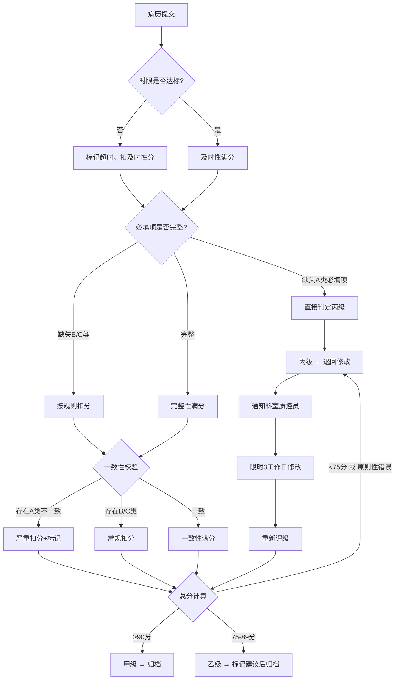
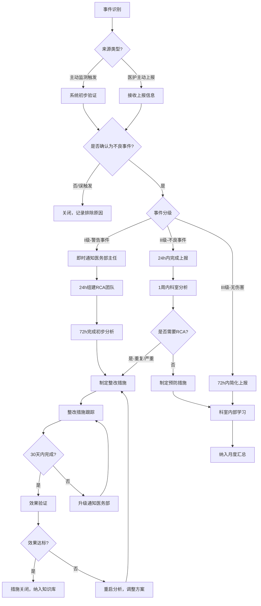

# 病历与医疗质控标准操作规程（SOP）

## 一、文档信息

| 项目 | 内容 |
|------|------|
| 文档编号 | SOP-MRQ-001 |
| 版本 | V1.0 |
| 适用范围 | 全院病历管理与医疗质量控制 |
| 制定依据 | 《电子病历应用管理规范》《医疗质量管理办法》《WHO患者安全框架》 |
| 核心目标 | 病历甲级率≥90%、时限达标率≥95%、不良事件上报及时率100% |

---

## 二、RACI职责矩阵

| 流程步骤 | 病历质控Agent | 质量监测Agent | 不良事件Agent | 责任医生 | 科室质控员 | 科主任 | 医务部 |
|----------|:---:|:---:|:---:|:---:|:---:|:---:|:---:|
| 病历时限监控 | R | I | - | A | C | I | I |
| 病历完整性检查 | R | I | - | A | C | I | - |
| 病历一致性校验 | R | I | - | A | C | I | - |
| 病历等级评定（预评级） | R | I | - | I | C | I | A |
| 超时预警通知 | R | - | - | I | I | I | I |
| 丙级病历整改 | C | I | - | R | A | I | I |
| 质量指标采集计算 | I | R | I | - | - | I | A |
| 指标预警与分析 | I | R | I | - | C | I | A |
| 质量报告生成 | I | R | I | - | C | C | A |
| PDCA改进推动 | I | R | I | - | C | A | R |
| 不良事件识别 | - | I | R | I | C | I | A |
| 不良事件分级上报 | - | I | R | C | C | I | A |
| RCA根因分析 | - | I | R | C | C | C | A |
| 整改措施跟踪 | - | I | R | I | C | A | R |
| 病历归档管理 | R | I | - | A | C | I | I |

> **说明**：R=执行（Responsible）, A=审批（Accountable）, C=咨询（Consulted）, I=知情（Informed）

---

## 三、SOP-1：病历时限监控规范

### 3.1 触发条件
- 患者入院事件（触发入院记录、首次病程记录时限）
- 手术完成事件（触发手术记录时限）
- 患者出院事件（触发出院记录时限）
- 患者死亡事件（触发死亡记录、死亡讨论时限）
- 患者转科事件（触发转科记录时限）
- 每日定时扫描（触发日常病程记录时限检查）

### 3.2 执行步骤

```
步骤1: 事件识别 → 确定病历类型和对应时限规则
步骤2: 启动计时 → 记录起始时间，计算截止时间
步骤3: 提前预警 → 距截止前2小时，系统消息提醒责任医生
步骤4: 超时处理 → 分级通知：
        - 即时：通知主治医生（系统消息+手机推送）
        - +2小时：升级通知科主任
        - +4小时：升级通知医务部
步骤5: 补写确认 → 医生补写后标记完成，记录超时时长
步骤6: 统计记录 → 纳入科室/医生时限达标率统计
```

### 3.3 输出物
- 时限预警通知（推送至医生工作站和手机端）
- 超时病历清单（每日汇总）
- 时限达标率统计报表（按科室/医生/病历类型维度）

### 3.4 异常处理
| 异常情况 | 处理方式 |
|----------|----------|
| 系统宕机导致的延迟 | 不计入医生超时，标注系统原因 |
| 急诊抢救期间 | 抢救结束后重新计算时限（加6小时） |
| 医生休假/离职 | 自动转交科主任，重新指定责任医生 |
| 通知发送失败 | 自动重试3次，失败后短信备用通道 |

### 3.5 KPI指标
- 时限达标率：≥95%
- 预警提醒送达率：100%
- 超时4小时以上病历：月环比下降
- 超时病历月均数：≤全院病历总数的5%

---

## 四、SOP-2：病历质量评定规范

### 4.1 触发条件
- 医生提交保存病历时（环节质控，实时反馈）
- 出院后进入归档倒计时时（终末质控，正式评级）
- 科室质控员发起抽查时（抽查评级）
- 等级评审前全院集中检查时

### 4.2 执行步骤

```
步骤1: 完整性检查
       → 加载对应病历类型的必填项清单
       → 逐项核查填写状态和内容充实度
       → 输出缺失项和不充分项清单

步骤2: 一致性校验（≥5个维度）
       → 诊断与医嘱一致性检查
       → 主诉与现病史呼应性检查
       → 入院诊断与出院诊断变化合理性
       → 手术同意书与手术记录一致性
       → 检查结果与诊断支撑性
       → 输出不一致项及严重等级

步骤3: 术语规范性审查
       → 疾病名称ICD-10编码匹配率检查
       → 手术名称ICD-9-CM3规范性检查
       → 药物名称通用名使用检查
       → 度量单位标准化检查

步骤4: 综合评分与等级判定
       → 及时性15分 + 完整性30分 + 一致性25分 + 规范性20分 + 科学性10分
       → 甲级≥90分（无原则性错误）
       → 乙级75-89分
       → 丙级<75分 或 存在原则性错误

步骤5: 结果处理
       → 甲级：归档入库
       → 乙级：标记建议，归档入库
       → 丙级：退回修改，通知科室质控员，限3个工作日修改
```

### 4.3 决策树



### 4.4 输出物
- 病历评分明细表（含每个扣分点和规范引用）
- 修改建议清单（按优先级排序）
- 病历等级评定结论
- 评级统计报表（病历甲级率）

### 4.5 异常处理
| 异常情况 | 处理方式 |
|----------|----------|
| 自动评级与人工终评不一致 | 记录差异，季度校准模型 |
| 丙级病历超3工作日未修改 | 升级通知科主任和医务部 |
| 退回修改后仍为丙级 | 上报医务部，纳入医生考核 |
| 评分标准争议 | 提交质控委员会裁定 |

### 4.6 KPI指标
- 病历甲级率：≥90%
- 自动预评级与人工终评一致率：≥85%
- 丙级病历48小时内整改率：≥95%
- 丙级病历发生率：零容忍目标（≤1%）

---

## 五、SOP-3：医疗质量监测规范

### 5.1 触发条件
- 每日定时任务（凌晨2:00自动采集计算前日指标）
- 安全类指标实时监测（非计划再入院等，事件触发）
- 指标越限即时触发预警
- 月度质量分析会前1周自动准备数据包
- 年度质量报告撰写启动

### 5.2 执行步骤

```
步骤1: 数据采集
       → 从HIS/EMR/LIS等系统抽取原始数据
       → 按指标定义进行清洗和标准化
       → 校验数据完整性（缺失率<1%方可计算）

步骤2: 指标计算
       → 按日/周/月/季/年周期计算各指标
       → 支持全院/科室/病种/医生多维度分组
       → 计算环比变化率和同比变化率
       → 统计显著性检验（样本量≥30）

步骤3: 阈值判断
       → 与目标值比对，计算偏离率
       → 偏离20%-50%：黄色预警
       → 偏离>50%：红色预警
       → 安全类指标采用绝对阈值

步骤4: 预警处理
       → [判断]是否有指标偏离阈值？
       → (是) 生成预警信息 → 推送相关负责人
       → [判断]是否为趋势性问题（连续3天/周偏离）？
       → (是) 生成专项分析报告 → 推送医务部 → 建议启动PDCA
       → (否) 推送科室负责人关注 → 持续监测
       → (无偏离) 记录数据，纳入定期报告

步骤5: 报告输出
       → 每日指标简报（8:00前推送）
       → 周报（每周一10:00前）含趋势图和排名
       → 月报（每月5日前）含PDCA进展
       → 年报（年末）含对标分析
```

### 5.3 输出物
- 每日指标简报
- 预警通知（实时）
- 周度质量报告
- 月度质量分析报告
- 专项分析报告（问题导向）
- 年度质量报告

### 5.4 异常处理
| 异常情况 | 处理方式 |
|----------|----------|
| 数据源系统异常，采集失败 | 标注数据不可用，使用前日数据+说明 |
| 指标计算结果异常（极端值） | 自动标记待核实，人工确认后发布 |
| 预警疲劳（某指标频繁预警） | 分析是否为阈值设置不合理，建议调整 |
| 新开科室数据不足 | 设置30例最小样本量，不足时不出预警 |

### 5.5 KPI指标
- 指标计算准确率：≥99%
- 预警及时率：100%（越限后5分钟内发出）
- 预警有效率：≥80%（非误报）
- 改进措施执行率：≥80%
- 月报按时完成率：100%

---

## 六、SOP-4：不良事件管理规范

### 6.1 触发条件
- 主动监测系统触发（≥20个触发规则中任一匹配）
- 医护人员主动上报（实名/匿名通道）
- 患者投诉中发现的安全事件
- 院感监测系统报告
- 死亡病例自动触发审核

### 6.2 执行步骤

```
步骤1: 事件识别
       → 主动监测：系统每5分钟扫描触发规则
       → 被动上报：提供简化上报入口（3分钟内可完成）
       → 事件初步确认（排除误触发）

步骤2: 事件分级
       → [判断]患者结局？
       → 死亡/永久伤害 → I级（警告事件）
       → 临时伤害/需额外治疗 → II级（不良事件）
       → 无伤害/及时拦截 → III级（无伤害事件）

步骤3: 分级响应
       → I级（警告事件）：
         • 即时通知医务部主任（电话+系统）
         • 24小时内组建RCA团队
         • 72小时内完成初步RCA分析
         • 制定整改措施（SMART原则）
         • 30天内完成措施落实并验证
       → II级（不良事件）：
         • 24小时内完成标准上报表
         • 1周内科室内部分析讨论
         • 制定预防措施
         • 纳入月度汇总分析
       → III级（无伤害事件）：
         • 72小时内完成简化上报
         • 科室内部学习分享
         • 纳入月度统计

步骤4: RCA根因分析（I级强制，II级选择性）
       → 组建多学科分析团队
       → 重建事件时间线
       → 鱼骨图+5-Why方法分析根因
       → 从人员/流程/设备/环境/制度5维度系统分析
       → 生成RCA报告

步骤5: 整改跟踪
       → 整改措施登记（SMART原则）
       → 执行进度监控（状态跟踪+超期预警）
       → 效果验证（30天观察期）
       → 措施关闭或进入下一轮改进

步骤6: 汇总分析
       → 月度：事件类型分布、趋势变化
       → 季度：上报率环比分析、高风险领域识别
       → 年度：系统性改进成效评估
```

### 6.3 决策树



### 6.4 输出物
- 不良事件上报表（标准化格式）
- RCA分析报告（警告事件必须，其他选择性）
- 整改措施跟踪表
- 月度/季度不良事件汇总分析报告
- 年度患者安全报告

### 6.5 异常处理
| 异常情况 | 处理方式 |
|----------|----------|
| 上报人担心被追责 | 强调非惩罚文化，提供匿名通道 |
| 事件分级存在争议 | 提交医务部裁定，争议期间按高级别处理 |
| RCA分析72h内无法完成 | 报告初步进展，申请延期（最长7天） |
| 整改措施不可行 | 组织专题讨论，调整方案或升级资源支持 |
| 同类事件短期内重复发生 | 立即升级为专项治理，暂停相关操作并排查 |

### 6.6 KPI指标
- 不良事件上报率：季度环比增长（正向指标）
- 上报及时率：100%（各级别按对应时限）
- RCA完成率：I级100%，II级≥90%
- 整改措施完成率：≥85%
- 整改措施有效率：≥70%
- 同类事件30天内复发率：≤5%

---

## 七、SOP-5：病历归档管理规范

### 7.1 触发条件
- 患者出院事件（自动启动7个工作日归档倒计时）
- 死亡病例（死亡讨论完成后启动归档）

### 7.2 执行步骤

```
步骤1: 归档倒计时启动
       → 出院当日自动触发，计算截止日期（7个工作日）
       → 通知责任医生完善病历

步骤2: 终末质控评级
       → 在归档截止前2个工作日自动触发最终评级
       → 执行完整的质量检查流程（完整性+一致性+规范性）
       → 生成最终评级结论

步骤3: 评级结果处理
       → [判断]是否达到甲级？
       → (甲级) 直接归档入库
       → (乙级) 标记改进点，归档入库
       → (丙级) 退回修改 → 限时3个工作日 → 重新评级
       → 重评后仍为丙级 → 科主任签字确认后强制归档+标记

步骤4: 归档入库
       → 电子签名确认
       → 归档状态标记（锁定编辑权限）
       → 分配归档编号
       → 纳入长期保存（住院30年，门诊15年）
```

### 7.3 KPI指标
- 7个工作日内归档率：≥95%
- 归档病历甲级率：≥90%
- 丙级病历修改后达标率：≥90%

---

## 八、质量检查点汇总

| 检查点 | 目标值 | 监测频率 | 责任Agent |
|--------|--------|----------|-----------|
| 病历时限达标率 | ≥95% | 每日 | 病历质控Agent |
| 病历甲级率 | ≥90% | 每月 | 病历质控Agent |
| 自动评级准确率 | ≥85% | 每季度 | 病历质控Agent |
| 指标计算准确率 | ≥99% | 每月 | 质量监测Agent |
| 预警及时率 | 100% | 实时 | 质量监测Agent |
| 改进措施执行率 | ≥80% | 每月 | 质量监测Agent |
| 不良事件上报及时率 | 100% | 实时 | 不良事件Agent |
| RCA完成率 | ≥90% | 每季度 | 不良事件Agent |
| 整改措施完成率 | ≥85% | 每月 | 不良事件Agent |
| 7日归档率 | ≥95% | 每月 | 病历质控Agent |

---

## 九、跨模块协同接口

| 协同场景 | 上游模块 | 下游模块 | 数据/事件 |
|----------|----------|----------|-----------|
| 诊断数据用于一致性校验 | 诊疗辅助 | 病历质控Agent | 诊断列表、医嘱数据 |
| 处方审核结果纳入质控 | 诊疗辅助 | 质量监测Agent | 处方合理率数据 |
| 严重DDI触发不良事件 | 诊疗辅助 | 不良事件Agent | DDI事件通知 |
| 路径偏差纳入质量统计 | 诊疗辅助 | 质量监测Agent | 路径偏差记录 |
| 质控结果影响出诊安排 | 病历质控 | 预约与患者服务 | 暂停出诊通知 |
| 满意度纳入质量评估 | 预约与患者服务 | 质量监测Agent | 满意度评分数据 |
| 危急值处理时效监控 | 诊疗辅助 | 不良事件Agent | 危急值处理记录 |

---

## 十、持续改进机制

### 10.1 SOP回顾周期
- 月度：检查KPI达成情况，微调阈值参数
- 季度：回顾流程执行情况，优化异常处理规则
- 年度：全面修订SOP，纳入新法规要求和最佳实践

### 10.2 知识沉淀
- 每次RCA分析结论纳入知识库
- PDCA改进经验转化为标准流程
- 典型案例编制为培训材料（脱敏后）
- 规则库根据实践反馈持续优化
