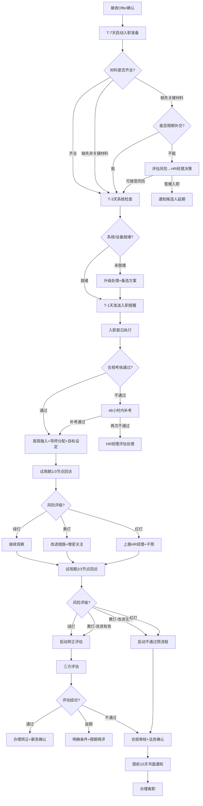

# 员工入职与试用期管理 — 标准操作规程（SOP）

## 1. 文档信息

| 项目 | 内容 |
|------|------|
| 文档编号 | SOP-HR-ONB-001 |
| 版本 | V1.0 |
| 适用范围 | 全公司新员工入职及试用期管理 |
| 责任部门 | 人力资源部 |
| 生效日期 | 即日起 |
| 审批人 | HR总监 |

---

## 2. 目的与范围

本SOP旨在规范从候选人接受Offer到试用期结束（转正/延期/不通过）的全流程管理，确保：
- 新员工入职体验优质、高效、无遗漏
- 试用期管理有目标、有跟踪、有证据
- 转正决策客观公正、合法合规
- 多部门协同有序、职责清晰

适用对象：所有通过正式招聘流程入职的新员工（含社招、校招、内推），不含实习生和外包人员。

---

## 3. RACI职责矩阵

| 流程步骤 | 入职准备协调员 | 入职引导专员 | 试用期管理专员 | 导师体系协调员 | 直属上级 | IT部门 | 行政部门 | HR经理 |
|----------|:---:|:---:|:---:|:---:|:---:|:---:|:---:|:---:|
| 接收Offer确认信息 | R | I | I | I | I | - | - | A |
| 入职材料收集与审核 | R/A | - | - | - | - | - | - | C |
| IT系统账号开通 | R | - | - | - | - | R | - | - |
| 行政设备准备 | R | - | - | - | - | - | R | - |
| 入职提醒发送 | R | I | - | - | I | - | - | - |
| 入职首日报到接待 | I | R/A | - | - | I | - | - | - |
| 劳动合同签署 | - | R | - | - | - | - | - | A |
| 制度培训与考核 | - | R/A | - | - | - | - | - | - |
| 团队介绍与环境引导 | - | R | - | - | C | - | - | - |
| 导师匹配与分配 | C | - | I | R/A | C | - | - | - |
| 试用期目标设定 | - | - | R | C | R | - | - | A |
| 试用期1/3节点回访 | - | - | R/A | C | R | - | - | I |
| 试用期2/3节点回访 | - | - | R/A | C | R | - | - | I |
| 辅导质量监控 | - | - | I | R/A | - | - | - | - |
| 转正评估组织 | - | - | R/A | C | R | - | - | A |
| 不通过合规审核 | - | - | R | - | I | - | - | A |
| 转正手续办理 | - | - | R | - | I | - | - | A |

> R=Responsible(执行) A=Accountable(审批) C=Consulted(咨询) I=Informed(知会)

---

## 4. 标准操作流程

### SOP-1：入职准备（T-7天至T-1天）

#### 触发条件
- 招聘管理scope的Offer管理专员确认候选人已接受Offer并确定入职日期

#### 执行步骤

**T-7天：启动准备清单**
1. 入职准备协调员接收新员工信息（姓名、岗位、部门、入职日期、薪资、直属上级）
2. 选择岗位类型对应的准备清单模板，生成个人化准备清单
3. 向新员工发送《入职材料清单》（邮件+短信双通道）
4. 向IT部门提交系统开通工单（邮箱、VPN、OA、业务系统权限）
5. 向行政部门提交设备准备工单（工位、电脑、门禁卡、办公用品）
6. 通知直属上级确认入职时间并做好接收准备
7. 通知导师体系协调员启动导师匹配

**T-5天：材料跟进**
8. 检查新员工材料提交进度
9. 对未提交材料发送第一次提醒
10. 区分必交材料（阻断项）和可补交材料（非阻断项）

**T-3天：系统检查确认**
11. 确认IT系统账号全部开通并测试通过
12. 确认行政设备到位且功能正常
13. 确认直属上级已知晓入职安排
14. 未就绪项目立即升级处理

**T-1天：最终确认**
15. 向新员工发送入职提醒（报到时间、地点、所需携带材料、着装建议）
16. 确认导师匹配已完成
17. 生成《新员工入职指南》交入职引导专员
18. 完成全部准备确认清单签字

#### 输出物
- 入职准备进度跟踪表（状态：全部就绪）
- 新员工入职指南
- 系统账号开通确认单
- 设备到位确认单

#### 异常处理
| 异常情况 | 处理方式 | 升级条件 |
|----------|----------|----------|
| 非关键材料未提交 | 告知入职后5日内补交，不影响入职 | - |
| 关键材料（离职证明）未提供 | 了解原因，评估法律风险 | 报HR经理决策是否暂缓入职 |
| IT账号T-3天未开通 | 联系IT主管紧急处理 | T-2天仍未解决报HR经理 |
| 设备缺货 | 启动备选方案（临时设备） | 无备选方案时报行政主管 |

---

### SOP-2：入职首日流程

#### 触发条件
- 新员工按约定时间到达公司报到

#### 执行步骤

**上午**
1. 09:00 — 报到登记：入职引导专员迎接，核验身份证原件，发放工牌/门禁卡
2. 09:30 — 合同签署：逐条讲解劳动合同关键条款，双方签署合同及附件
3. 10:00 — 公司介绍：公司历史、组织架构、企业文化和价值观
4. 11:00 — 制度培训：考勤、假期、薪酬发放、费用报销、晋升通道

**下午**
5. 14:00 — 信息安全培训+合规考核（80分及格，未通过48小时内补考）
6. 15:30 — 部门交接：带至工位，介绍团队成员，直属上级欢迎
7. 16:00 — 系统引导：协助完成各系统首次登录和密码设置
8. 16:30 — 首日总结：答疑、确认次日安排、收集首日感受

#### 输出物
- 已签署劳动合同（双方各一份）
- 已签署附件（保密协议、竞业限制协议等）
- 培训签到表
- 制度知情确认书
- 员工手册签收单
- 信息安全考核成绩单

#### 异常处理
| 异常情况 | 处理方式 | 升级条件 |
|----------|----------|----------|
| 员工对合同条款有异议 | 耐心解释，记录具体异议 | 涉及核心条款修改报HR经理 |
| 信息安全考核不通过 | 安排48小时内补考 | 两次不通过报HR经理评估 |
| 员工当日拒签合同 | 约定3日内签署，记录原因 | 超3日未签署报HR经理 |
| 关键材料原件核验不通过 | 暂停入职，启动核查 | 立即报HR总监 |

---

### SOP-3：导师分配与辅导启动

#### 触发条件
- 新员工完成入职首日流程

#### 执行步骤

1. 导师体系协调员在入职后3个工作日内完成导师匹配
2. 基于多维匹配模型推荐Top 3导师候选
3. 征询首选导师意愿并确认
4. 安排三方首次见面（导师+新员工+HR），时长30-45分钟
5. 共同制定辅导计划（阶段目标、沟通频率、重点内容）
6. 辅导计划三方签字确认
7. 将导师信息同步至试用期管理专员

#### 输出物
- 导师匹配报告
- 辅导计划书（三方签字）
- 首次面谈记录

#### 异常处理
| 异常情况 | 处理方式 | 升级条件 |
|----------|----------|----------|
| 首选导师拒绝 | 依次征询第2、3推荐 | 3位均拒绝则放宽匹配条件 |
| 导师池无合适人选 | 安排临时导师+专项培训 | 报HR经理协调跨部门导师 |
| 导师近期工作负荷过重 | 与导师上级协调减负 | 无法协调则更换导师 |

---

### SOP-4：试用期目标设定

#### 触发条件
- 新员工完成入职首周

#### 执行步骤

1. 试用期管理专员发起目标设定流程
2. 与直属上级沟通岗位核心产出要求和能力期望
3. 将试用期分为3个阶段，设定阶段性里程碑目标
4. 审核目标的SMART合规性
5. 确保目标与Offer中的录用条件对齐
6. 组织三方确认会（新员工+直属上级+HR）
7. 《试用期考核目标书》三方签字存档
8. 录入HR系统并设置回访提醒

#### 输出物
- 《试用期考核目标书》（三方签字）
- 目标设定沟通记录
- 系统提醒设置确认

#### 异常处理
| 异常情况 | 处理方式 | 升级条件 |
|----------|----------|----------|
| 上级设定目标过高 | 参照历史数据建议调整 | 无法达成一致报HR经理 |
| 员工不认同目标 | 充分沟通解释，适当调整 | 经沟通仍不接受报HR经理 |
| 入职7天内未完成设定 | 发送催促提醒 | 超10天未完成报HR经理 |

---

### SOP-5：试用期回访评估

#### 触发条件
- 到达试用期1/3节点（首次回访）或2/3节点（二次回访）

#### 执行步骤

1. 试用期管理专员提前3天预约三方回访时间
2. 准备回访材料（目标书、上次记录、近期产出数据）
3. 分别执行结构化回访：
   - 新员工回访（30-45分钟）：适应度、困难、需求
   - 直属上级回访（20-30分钟）：任务完成度、能力评估
   - 导师回访（15-20分钟）：学习进度、成长潜力
4. 汇总三方信息，形成风险评级：
   - 🟢 绿灯：一切正常→存档继续
   - 🟡 黄灯：存在可控风险→制定改进措施、增加关注
   - 🔴 红灯：严重问题→24小时内上报HR经理
5. 回访记录48小时内归档
6. 将行动计划通知相关方

#### 输出物
- 《试用期回访评估报告》
- 风险评级结论
- 改进行动计划（如需）
- 异常上报单（红灯情况）

#### 异常处理
| 异常情况 | 处理方式 | 升级条件 |
|----------|----------|----------|
| 三方评价严重不一致 | 深入沟通确认真实情况 | 疑似管理问题报HR经理 |
| 1/3节点发现严重不胜任 | 制定限期改进计划+增密回访 | 改进30天无效启动预警 |
| 2/3节点改进仍无效 | 启动试用期不通过预流程 | 提前15天准备正式通知 |
| 新员工表达离职意向 | 了解原因，评估挽留可能 | 报HR经理决策挽留方案 |

---

### SOP-6：转正评估与决策

#### 触发条件
- 试用期到期前15个工作日

#### 执行步骤

**转正评估流程**
1. 试用期管理专员发起转正评估
2. 收集目标完成度数据和各节点回访记录
3. 组织三方评估会：
   - 直属上级：岗位胜任力评估（目标达成度、工作质量、独立性）
   - 导师：学习成长评估（学习速度、知识吸收、技能提升）
   - HR：文化适配评估（价值观契合、团队协作、职业稳定性）
4. 评估结论分类：

**A. 通过转正**
5. 确认转正日期和正式薪资
6. 更新合同状态
7. 通知员工并发送转正祝贺
8. 员工进入正式绩效管理循环

**B. 延期转正**
5. 明确延期理由和条件（书面）
6. 设定延期期限（不得超过法定试用期上限）
7. 制定延期期间的改进目标
8. 到期重新评估

**C. 不通过**
5. HR合规审核：检查证据链完整性
6. 法务审查确认合法性
7. 出具《试用期不通过通知书》（含具体原因和证据引用）
8. 提前15天送达员工（书面签收或当面告知+见证人）
9. 办理离职手续（工作交接、设备归还、薪资结算）
10. 开具离职证明

#### 输出物
- 三方评估表
- 转正/延期/不通过决策文件
- 转正通知书 或 不通过通知书
- 离职手续材料（如不通过）

#### 异常处理
| 异常情况 | 处理方式 | 升级条件 |
|----------|----------|----------|
| 三方评估意见分歧 | HR经理组织协调讨论 | 无法达成一致由HR总监裁定 |
| 证据链不完整 | 暂缓不通过决定，补齐证据 | 无法补齐则延期处理 |
| 员工对不通过结果有异议 | 详细解释并出示证据 | 员工提出仲裁则移交法务 |
| 试用期即将到期但评估未完成 | 加急推进评估 | 超期自动视为通过（法律风险） |

---

## 5. 决策树

---

## 6. KPI指标与质量检查点

### 核心KPI指标

| 指标名称 | 目标值 | 计算方式 | 检查频率 |
|----------|--------|----------|----------|
| 入职准备T-3天完成率 | ≥95% | T-3天全部就绪的新员工数/同期入职总数 | 月度 |
| 入职首日满意度 | ≥4.5/5.0 | 首日体验问卷均分 | 每人即时 |
| 劳动合同首日签署率 | 100% | 入职当天完成签署的比例 | 月度 |
| 试用期目标7日内设定率 | ≥95% | 入职7天内完成目标设定的比例 | 月度 |
| 导师3日内分配率 | ≥90% | 入职3天内完成导师分配的比例 | 月度 |
| 导师辅导频率达标率 | ≥85% | 达到每周1次标准的配对比例 | 双周 |
| 回访评估按时完成率 | 100% | 在节点±3天内完成回访的比例 | 每次 |
| 试用期通过率 | ≥90% | 通过转正/总评估人数 | 季度 |
| 新员工30天留存率 | ≥98% | 入职30天仍在职的比例 | 月度 |
| 新员工90天留存率 | ≥95% | 入职90天仍在职的比例 | 季度 |
| 转正评估15天提前启动率 | 100% | 提前15天启动评估的比例 | 每次 |
| 入职到独立上岗天数 | ≤60天 | 从入职到被认定可独立工作的平均天数 | 季度 |

### 质量检查点

| 检查点 | 检查时机 | 检查内容 | 责任人 |
|--------|----------|----------|--------|
| QC-1 准备完成确认 | T-3天 | 系统账号、设备、材料全部就绪 | 入职准备协调员 |
| QC-2 法律文件签署 | 入职首日结束前 | 合同+附件+知情确认书全部签署 | 入职引导专员 |
| QC-3 目标设定质量 | 入职后7天 | 目标符合SMART且与录用条件对齐 | 试用期管理专员 |
| QC-4 导师匹配确认 | 入职后3天 | 导师已分配、计划已制定 | 导师体系协调员 |
| QC-5 首次回访完成 | 试用期1/3节点 | 三方回访完成且记录归档 | 试用期管理专员 |
| QC-6 二次回访完成 | 试用期2/3节点 | 三方回访完成且行动计划明确 | 试用期管理专员 |
| QC-7 证据完备性审查 | 转正评估前 | 不通过决策的证据链完整性 | 试用期管理专员 |
| QC-8 转正流程合规 | 转正评估后 | 评估程序规范、通知时效合规 | HR经理 |

---

## 7. 关键时间节点汇总

| 时间节点 | 事项 | 硬性/软性 |
|----------|------|-----------|
| T-7天 | 启动入职准备清单 | 硬性 |
| T-5天 | 首次材料催收 | 软性 |
| T-3天 | 系统/设备就绪确认 | 硬性 |
| T-1天 | 入职提醒发送 | 硬性 |
| 入职当天 | 合同签署+制度培训 | 硬性 |
| 入职后3天内 | 导师分配完成 | 硬性 |
| 入职后7天内 | 试用期目标设定完成 | 硬性 |
| 试用期1/3节点 | 首次结构化回访 | 硬性 |
| 试用期2/3节点 | 二次结构化回访 | 硬性 |
| 试用期到期前15天 | 启动转正评估 | 硬性（法律要求） |
| 转正评估后5天内 | 三方评估完成 | 硬性 |
| 评估完成后3天内 | 结果通知员工 | 硬性 |

---

## 8. 合规要点提醒

1. **试用期时长**：严格遵循《劳动合同法》第十九条——合同期≤3年试用期≤2个月；合同期>3年试用期≤6个月；同一用人单位与同一劳动者只能约定一次试用期
2. **试用期工资**：不低于合同约定工资的80%，且不低于单位所在地最低工资标准
3. **解除条件**：试用期内解除需证明"不符合录用条件"，举证责任在用人单位
4. **证据要求**：录用条件事先告知+考核标准明确+过程评估有据+给予改进机会+程序合法
5. **通知时效**：试用期不通过需提前告知（建议提前15天书面通知）
6. **特殊保护**：女职工孕期、产期、哺乳期以及医疗期内的试用期管理需特别谨慎
7. **档案管理**：所有书面材料保存期限至少为劳动关系终止后2年

---

## 9. 附录

### 附录A：入职准备标准清单模板
### 附录B：劳动合同签署要件清单
### 附录C：试用期考核目标书模板
### 附录D：结构化回访问卷模板
### 附录E：转正评估表模板
### 附录F：试用期不通过通知书模板
### 附录G：证据完备性检查清单
