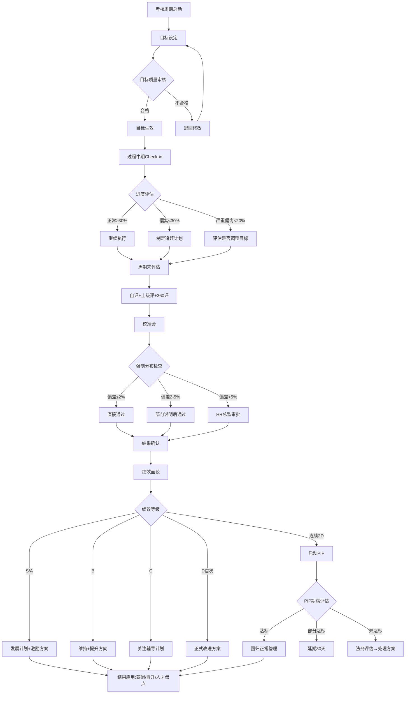

# 绩效管理标准操作流程 (SOP)

## 1. 流程概述

本SOP定义了绩效管理全周期的标准操作流程，覆盖从考核周期启动（目标设定）到结果应用（薪酬/晋升挂钩）的完整闭环。适用于采用KPI+OKR混合体系的中国企业，支持季度OKR评估和年度绩效强制分布双周期运作。

**流程目标**：确保绩效管理过程的公平性、时效性和合规性，最终实现绩效结果对业务目标达成和员工发展的双重驱动。

**适用范围**：全体正式员工（试用期员工参照试用期考核标准另行管理）

---

## 2. RACI矩阵

| 流程步骤 | 目标设定引导师 | 绩效评估协调员 | 绩效面谈与改进专员 | 绩效数据分析师 | 直属管理者 | HR总监 | 员工本人 |
|----------|:---:|:---:|:---:|:---:|:---:|:---:|:---:|
| SOP-1 目标设定 | **R/A** | I | - | C | R | A | R |
| SOP-2 过程跟踪（OKR中期check-in） | C | I | - | **R** | R | I | R |
| SOP-3 评估执行（自评/上级评/360） | I | **R/A** | - | I | R | I | R |
| SOP-4 校准会与强制分布 | I | **R** | - | C | R | **A** | - |
| SOP-5 绩效面谈 | - | I | **R/A** | I | R | I | R |
| SOP-6 结果分类处理与改进计划 | - | I | **R/A** | C | R | A(PIP) | R |
| SOP-7 PIP管理 | - | I | **R** | C | R | **A** | R |
| SOP-8 结果应用（薪酬/晋升） | - | C | I | **R** | I | **A** | I |

> R=Responsible(执行) A=Accountable(审批) C=Consulted(咨询) I=Informed(知会)

---

## 3. SOP-1：目标设定

### 触发条件
- 新考核周期开始（年度KPI：每年1月初；季度OKR：每季度第1周）
- 组织战略/业务规划确定后

### 执行步骤

| 步骤 | 操作 | 责任方 | 时限 | 输出物 |
|------|------|--------|------|--------|
| 1.1 | 获取组织战略目标，启动目标分解 | 目标设定引导师 | Day 1 | 目标分解启动通知 |
| 1.2 | 组织→部门目标分解研讨会 | 目标设定引导师+部门负责人 | Day 1-3 | 部门目标草案 |
| 1.3 | 部门→团队→个人目标分解 | 直属管理者+员工 | Day 3-7 | 个人目标草案 |
| 1.4 | 目标质量审核（SMART+对齐度） | 目标设定引导师 | Day 7-9 | 审核反馈报告 |
| 1.5 | 不合格目标退回修改 | 员工+管理者 | Day 9-10 | 修改后目标 |
| 1.6 | 最终确认生效 | 目标设定引导师+管理者 | Day 10 | 生效目标文档(双方签字) |

### 质量标准
- 目标设定10个工作日内完成率 = 100%
- 每个目标满足SMART五要素
- 个人目标与部门目标对齐度 ≥ 80%
- OKR每人1-3个O，每个O对应2-5个KR
- KPI每人3-5个核心指标，权重合计100%

### 异常处理
| 异常情况 | 处理方案 | 升级路径 |
|----------|----------|----------|
| 员工认为目标过高 | 引导基于历史数据对话，可调整10%弹性 | 管理者→HR BP→HR总监 |
| 管理者认为目标保守 | 提供同岗位标杆数据参考，协商挑战度 | 目标设定引导师协调 |
| 超时未完成设定 | Day 7预警，Day 10未完成纳入管理者考核扣分 | HR BP跟进 |
| 组织目标中途调整 | 30天内启动目标微调流程，保留原始记录 | HR总监审批 |

---

## 4. SOP-2：过程跟踪（OKR中期Check-in）

### 触发条件
- 季度中期（第6-7周）自动触发
- 业务环境重大变化时临时触发

### 执行步骤

| 步骤 | 操作 | 责任方 | 时限 | 输出物 |
|------|------|--------|------|--------|
| 2.1 | 发起OKR进度自评 | 绩效数据分析师 | 中期Week 1 | 自评提醒通知 |
| 2.2 | 员工更新OKR进度（0-100%） | 员工 | 3个工作日 | 进度更新数据 |
| 2.3 | 管理者确认并评论 | 直属管理者 | 2个工作日 | 管理者评论 |
| 2.4 | 汇总分析进度异常 | 绩效数据分析师 | 1个工作日 | 进度异常报告 |
| 2.5 | 低进度目标制定追赶计划 | 员工+管理者 | 3个工作日 | 追赶计划 |

### 质量标准
- 中期check-in参与率 ≥ 95%
- 完成率低于30%的目标需产出追赶计划
- 严重偏离（完成率<20%）需评估是否调整目标

### 异常处理
| 异常情况 | 处理方案 | 升级路径 |
|----------|----------|----------|
| 目标完成率<30% | 管理者与员工沟通制定追赶计划 | 记录但不惩罚 |
| 目标完成率<20%（严重偏离） | 评估根因，决定调整目标/追加资源/调整策略 | 部门负责人+HR BP |
| 外部环境变化导致目标失效 | 申请目标调整（需审批），保留调整记录 | HR总监审批 |

---

## 5. SOP-3：评估执行

### 触发条件
- 考核周期结束（季度末/年末）
- 绩效评估协调员发出评估启动通知

### 执行步骤

| 步骤 | 操作 | 责任方 | 时限 | 输出物 |
|------|------|--------|------|--------|
| 3.1 | 发布评估启动通知，开放系统 | 绩效评估协调员 | Day 0 | 启动通知+操作指引 |
| 3.2 | 员工提交自评 | 员工 | Day 1-3 | 自评表 |
| 3.3 | 上级进行评估 | 直属管理者 | Day 4-8 | 上级评估表 |
| 3.4 | 360度评估（如适用） | 同事/协作方 | Day 4-10 | 360评估结果 |
| 3.5 | 汇总计算综合评分 | 绩效评估协调员 | Day 11 | 综合评分表 |
| 3.6 | 进度监控与催办 | 绩效评估协调员 | 全程 | 进度报告+催办记录 |

### 质量标准
- 自评3日内完成率 ≥ 98%
- 上级评估5日内完成率 ≥ 95%
- 360评估7日内回收率 ≥ 90%
- 评语字数 ≥ 100字（确保实质反馈）
- 综合评分权重：上级评60% + 自评10% + 360评30%

### 异常处理
| 异常情况 | 处理方案 | 升级路径 |
|----------|----------|----------|
| 自评超时未提交 | Day 2提醒→Day 3通知管理者→系统默认空白自评 | HR BP跟进 |
| 上级评估超时 | Day 6首次催办→Day 7通知其上级→Day 8 HR总监介入 | 逐级升级 |
| 360评估回收不足 | 评估人<3人的不出结果，重新指定评估人 | 绩效评估协调员处理 |
| 自评与上级评差异>1.5分 | 标记为校准会重点讨论案例 | 校准会处理 |

---

## 6. SOP-4：校准会与强制分布

### 触发条件
- 全部评估数据汇总完成后
- 绩效评估协调员确认数据完整性

### 执行步骤

| 步骤 | 操作 | 责任方 | 时限 | 输出物 |
|------|------|--------|------|--------|
| 4.1 | 计算各部门配额分配 | 绩效评估协调员 | 评估完成后Day 1 | 配额分配表 |
| 4.2 | 组织部门内校准会 | 部门负责人+HR BP | Day 1-3 | 部门校准结果 |
| 4.3 | 组织跨部门校准会 | HR总监+绩效评估协调员 | Day 4-8 | 跨部门校准结果 |
| 4.4 | 强制分布偏差检查 | 绩效评估协调员 | Day 8 | 偏差报告 |
| 4.5 | 异常处理与审批 | HR总监 | Day 9-10 | 审批记录 |
| 4.6 | 最终结果锁定 | 绩效评估协调员 | Day 10 | 最终评级确认表 |

### 质量标准
- 部门校准会3个工作日内完成
- 跨部门校准会5个工作日内完成
- 强制分布：S(10%±2%) A(20%±2%) B(50%±3%) C(15%±2%) D(5%±2%)
- 偏差>5%需HR总监审批例外
- 校准会纪要100%签字确认

### 异常处理
| 异常情况 | 处理方案 | 升级路径 |
|----------|----------|----------|
| 部门S比例>12% | 要求提供TOP案例的量化支撑，不充分则调降 | 跨部门校准会裁定 |
| 部门D比例=0% | 与部门负责人沟通识别相对最弱者，必要时强制产生 | HR总监最终裁定 |
| 管理者拒绝调整 | 记录分歧→HR总监一对一沟通→最终裁定 | HR总监 |
| 校准后员工申诉 | 受理→核实事实→复议→最终答复(5个工作日) | HR总监终裁 |

---

## 7. SOP-5：绩效面谈

### 触发条件
- 最终绩效评级确认锁定后
- 绩效面谈与改进专员发出面谈通知

### 执行步骤

| 步骤 | 操作 | 责任方 | 时限 | 输出物 |
|------|------|--------|------|--------|
| 5.1 | 发布面谈通知，明确时限要求 | 绩效面谈与改进专员 | 结果确认Day 0 | 面谈通知+指引 |
| 5.2 | 管理者面谈前准备辅导 | 绩效面谈与改进专员 | Day 0-1 | 面谈辅导材料 |
| 5.3 | 执行一对一绩效面谈 | 直属管理者+员工 | Day 1-5 | 面谈记录(双方签字) |
| 5.4 | 面谈进度监控与催办 | 绩效面谈与改进专员 | Day 3/4/5 | 进度报告 |
| 5.5 | 面谈记录归档 | 绩效面谈与改进专员 | Day 6 | 归档确认 |
| 5.6 | 面谈质量抽检 | 绩效面谈与改进专员 | Day 7 | 质量报告 |

### 质量标准
- 面谈5个工作日内完成率 = 100%
- 面谈记录双方签字率 = 100%
- 面谈时长 ≥ 30分钟（不得敷衍了事）
- C/D等级面谈需HR BP旁听或事后确认
- 员工面谈满意度 ≥ 3.5/5.0

### 异常处理
| 异常情况 | 处理方案 | 升级路径 |
|----------|----------|----------|
| 管理者超时未面谈 | Day 3提醒→Day 4通知上级→Day 5纳入管理者绩效扣分 | HR BP→HR总监 |
| 员工拒绝签字 | HR在场见证，记录"员工拒签"并注明原因 | 归档备案 |
| 面谈中员工情绪失控 | 暂停面谈→HR介入安抚→择日重新安排 | HR BP即时支持 |
| 面谈后员工提出申诉 | 受理→核实→5个工作日内答复 | 申诉委员会 |

---

## 8. SOP-6：结果分类处理与改进计划

### 触发条件
- 绩效面谈完成后
- 基于面谈共识制定后续行动方案

### 执行步骤

| 步骤 | 操作 | 责任方 | 时限 | 输出物 |
|------|------|--------|------|--------|
| 6.1 | S/A等级：制定发展加速计划 | 绩效面谈与改进专员+管理者 | 面谈后5天 | 个人发展计划(IDP) |
| 6.2 | B等级：明确提升方向和支持 | 直属管理者 | 面谈后5天 | 提升方向备忘录 |
| 6.3 | C等级：制定关注辅导方案 | 绩效面谈与改进专员+管理者 | 面谈后3天 | 辅导改进计划 |
| 6.4 | D等级（首次）：制定正式改进方案 | 绩效面谈与改进专员 | 面谈后3天 | 改进计划(签字版) |
| 6.5 | 连续2D：启动PIP评估 | 绩效面谈与改进专员 | 面谈后1天 | PIP启动申请 |
| 6.6 | 培训需求汇总推送 | 绩效面谈与改进专员 | 面谈后7天 | 培训需求清单 |

### 质量标准
- 各等级后续方案100%在规定时限内完成
- S/A等级IDP包含清晰的发展路径和资源承诺
- D等级改进计划需HR BP审核确认
- 连续2D的PIP启动申请需24小时内提请审批

### 异常处理
| 异常情况 | 处理方案 | 升级路径 |
|----------|----------|----------|
| S等级员工有离职倾向 | 加急制定保留方案（薪酬调整/发展加速/项目激励） | HR总监+部门负责人 |
| D等级员工拒绝签署改进计划 | HR在场见证记录，书面通知改进要求 | 法务评估 |
| 管理者未按时制定后续方案 | 催促→超时纳入管理者自身绩效评估 | HR BP |

---

## 9. SOP-7：PIP管理

### 触发条件
- 连续两个考核周期绩效评级为D
- HR总监审批同意启动PIP

### 执行步骤

| 步骤 | 操作 | 责任方 | 时限 | 输出物 |
|------|------|--------|------|--------|
| 7.1 | 核实PIP启动条件和历史合规性 | 绩效面谈与改进专员 | 1个工作日 | 合规性检查报告 |
| 7.2 | 制定PIP计划书 | 绩效面谈与改进专员+管理者 | 3个工作日 | PIP计划书(签字版) |
| 7.3 | HR总监审批 | HR总监 | 2个工作日 | 审批记录 |
| 7.4 | 正式告知员工并签署 | 绩效面谈与改进专员+管理者+员工 | 1个工作日 | 签署确认 |
| 7.5 | 每两周check-in | 管理者+HR+员工 | 每2周 | Check-in记录(三方签字) |
| 7.6 | 30天中期评估 | 绩效面谈与改进专员 | Day 30 | 中期评估报告 |
| 7.7 | 60天评估（如适用） | 绩效面谈与改进专员 | Day 60 | 阶段评估报告 |
| 7.8 | PIP期满最终评估 | 绩效面谈与改进专员+管理者+HR总监 | Day 90 | 最终评估报告 |
| 7.9 | 后续处理决策 | HR总监+法务+业务 | Day 90-95 | 处理决策文件 |

### 质量标准
- PIP计划书必须包含：具体改进目标、时间线、支持措施、评估标准
- Check-in每两周一次，不得跳过或延迟
- 所有文件三方签字存档
- PIP全程保留完整证据链（劳动仲裁要件）

### 异常处理
| 异常情况 | 处理方案 | 升级路径 |
|----------|----------|----------|
| 员工PIP期间主动提出离职 | 记录→按正常离职流程处理→不构成违规解除 | HR BP办理 |
| 员工拒绝签署PIP计划 | HR见证→书面送达→记录拒签事实→继续执行 | 法务确认合规性 |
| PIP期间员工怀孕/工伤等 | 中止PIP→进入特殊保护期→保护期结束后重新评估 | 法务+HR总监 |
| PIP改进部分达标 | 可延期30天（需重新审批）→延期后再评估 | HR总监审批 |
| PIP未达标需解除合同 | 法务审核全流程材料→确认无瑕疵→制定协商方案 | HR总监+法务+业务三方会签 |

---

## 10. SOP-8：结果应用

### 触发条件
- 绩效评级最终确认
- 薪酬调整/年终奖/晋升评审窗口期

### 执行步骤

| 步骤 | 操作 | 责任方 | 时限 | 输出物 |
|------|------|--------|------|--------|
| 8.1 | 产出绩效与薪酬对应数据包 | 绩效数据分析师 | 结果确认后5天 | 薪酬调整建议数据 |
| 8.2 | 计算年终奖系数 | 绩效数据分析师 | 结果确认后5天 | 年终奖系数表 |
| 8.3 | 晋升候选人绩效数据整理 | 绩效数据分析师 | 晋升窗口前10天 | 晋升绩效档案 |
| 8.4 | 人才九宫格数据更新 | 绩效数据分析师 | 年度评估后15天 | 人才盘点数据 |
| 8.5 | 绩效分析报告产出 | 绩效数据分析师 | 季度10天/年度20天 | 绩效分析报告 |

### 质量标准
- 年终奖系数对应关系：S=2.0x, A=1.5x, B=1.0x, C=0.6x, D=0x
- 调薪建议：S优先加薪+超额调薪, A正常调薪, B低幅调薪, C/D冻薪
- 晋升硬性条件：近两年绩效无C/D且至少1次A以上
- 数据准确率 = 100%（涉及薪酬不允许错误）

---

## 11. 决策树



---

## 12. KPI指标与质量检查点

### 核心KPI

| 指标名称 | 目标值 | 计算方式 | 监控频率 | 责任方 |
|----------|--------|----------|----------|--------|
| 目标设定按时完成率 | 100% | 10日内完成人数/应完成总人数 | 每考核周期 | 目标设定引导师 |
| 绩效评估按时完成率 | ≥95% | 规定时限内完成人数/总参评人数 | 每考核周期 | 绩效评估协调员 |
| 强制分布达标率 | 各等级偏差≤2% | 实际分布-目标分布的绝对值 | 年度 | 绩效评估协调员 |
| 绩效面谈5日内完成率 | 100% | 5日内完成面谈数/应面谈总数 | 每考核周期 | 绩效面谈与改进专员 |
| PIP改进成功率 | ≥40% | PIP达标人数/PIP启动总人数 | 年度 | 绩效面谈与改进专员 |
| 绩效公平性满意度 | ≥3.8/5.0 | 员工匿名调研得分 | 年度 | 绩效数据分析师 |
| 高绩效员工留存率 | ≥90% | S/A员工年度留存人数/S/A总人数 | 年度 | 绩效数据分析师 |
| 绩效与业务产出相关性 | ≥0.6 | 绩效评级与业务指标的相关系数 | 年度 | 绩效数据分析师 |

### 质量检查点

| 检查点 | 检查时机 | 检查内容 | 不合格处理 |
|--------|----------|----------|------------|
| Q1-目标质量 | 目标设定阶段 | SMART五要素+对齐度 | 退回修改，2轮后升级 |
| Q2-评估完整性 | 评估阶段 | 数据完整性+评语质量 | 催办+升级 |
| Q3-校准公正性 | 校准会后 | 分布合规+决议有据 | HR总监复核 |
| Q4-面谈质量 | 面谈阶段 | 时效+内容+签字 | 管理者绩效扣分 |
| Q5-PIP合规性 | PIP全程 | 文件完整+程序正义 | 法务审核补正 |
| Q6-数据准确性 | 结果应用阶段 | 薪酬数据零错误 | 立即纠正+根因分析 |

---

## 13. 时间线总览

```
考核周期开始
├── Day 1-10: 目标设定 (SOP-1)
├── Week 6-7: 中期Check-in (SOP-2)
├── 周期末 Day 1-10: 评估执行 (SOP-3)
├── 评估后 Day 1-10: 校准会 (SOP-4)
├── 校准后 Day 1-5: 绩效面谈 (SOP-5)
├── 面谈后 Day 1-7: 结果处理 (SOP-6)
├── 如触发: Day 1-90: PIP管理 (SOP-7)
└── 结果确认后 Day 1-20: 结果应用 (SOP-8)
```

---

## 14. 合规要点提示

1. **书面记录**：绩效管理全流程保留书面记录，作为劳动争议时的关键证据
2. **标准先行**：考核标准必须在周期开始前告知员工（目标设定签字确认）
3. **程序公正**：评估过程公开透明，不允许暗箱操作
4. **改进机会**：低绩效处理前必须提供培训或调岗机会（劳动合同法第40条）
5. **保密义务**：绩效结果为个人隐私，不得在公开场合讨论他人绩效
6. **申诉渠道**：必须建立员工绩效申诉渠道，并确保申诉得到及时处理
7. **特殊保护**：孕期、哺乳期、工伤期间员工的绩效处理需额外谨慎

---

## 15. 版本信息

| 版本 | 日期 | 修订内容 | 审批人 |
|------|------|----------|--------|
| V1.0 | 初始版本 | 绩效管理全流程SOP建立 | HR总监 |
