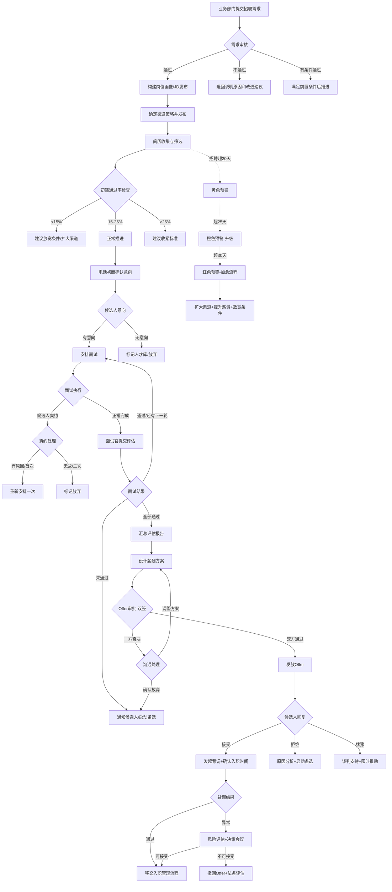

# 招聘管理标准操作规程（SOP）

## 1. 文档概述

### 1.1 目的
本SOP规范从业务部门提出招聘需求到候选人入职报到的端到端招聘全流程，确保招聘工作的效率、质量和合规性，关键岗位招聘周期控制在30个工作日以内。

### 1.2 适用范围
适用于企业所有类型的招聘活动，包括社会招聘、校园招聘、内部推荐和猎头合作。涵盖从需求提出到候选人正式入职（移交入职管理流程）的全部环节。

### 1.3 关键绩效指标（KPI）

| KPI指标 | 目标值 | 预警阈值 | 计算方式 |
|---------|--------|----------|----------|
| 招聘周期 | ≤30工作日 | >20工作日黄色预警 | 需求审核通过日→入职报到日 |
| 简历初筛通过率 | 15-25% | <15%或>25% | 通过初筛数/总收到简历数 |
| 面试到Offer转化率 | ≥60% | <50% | 发出Offer数/进入面试候选人数 |
| Offer接受率 | ≥85% | <75% | 接受Offer数/发出Offer数 |
| 需求审核时效 | ≤2工作日 | >3工作日 | 收到需求→完成审核 |
| 面试安排时效 | ≤3工作日 | >5工作日 | 初筛通过→首轮面试 |
| Offer审批时效 | ≤3工作日 | >5工作日 | 终面通过→Offer发放 |
| 招聘达成率 | ≥90% | <80% | 实际入职数/计划招聘数 |

---

## 2. RACI矩阵

| 流程步骤 | 招聘需求分析师 | 简历筛选专员 | 面试协调专员 | Offer管理专员 | 用人部门 | HR总监 |
|----------|:---:|:---:|:---:|:---:|:---:|:---:|
| 招聘需求提交 | I | - | - | - | R | I |
| 需求审核与画像构建 | R/A | I | - | C | C | I |
| JD编写与发布 | R | C | - | - | A | - |
| 渠道策略制定 | R/A | C | - | - | I | I |
| 简历筛选与初评 | C | R/A | - | - | I | - |
| 电话初面 | - | R | - | - | - | - |
| 面试流程设计 | C | - | R/A | - | C | - |
| 面试安排与协调 | - | - | R | - | C | - |
| 面试评估汇总 | - | - | R/A | C | C | - |
| 薪酬方案设计 | C | - | - | R | C | A |
| Offer审批 | - | - | - | R | A | A |
| Offer发放与跟踪 | - | - | - | R/A | I | I |
| 薪资谈判 | - | - | - | R | C | C |
| 背景调查 | - | - | - | R/A | I | I |
| 入职衔接 | - | - | - | R | C | I |
| 招聘进度监控 | R/A | C | C | C | I | I |
| 招聘复盘分析 | R | C | C | C | C | A |

> R=Responsible（执行）, A=Accountable（问责）, C=Consulted（咨询）, I=Informed（知会）

---

## 3. 标准操作流程

### SOP-1：招聘需求审核

**触发条件**：业务部门通过系统提交招聘需求申请

**时效要求**：收到需求后2个工作日内完成审核

**执行步骤**：

1. **信息完整性检查**（Day 0-0.5）
   - 确认需求单必填字段完整（岗位、人数、级别、时间、预算）
   - 信息不完整→退回补充，标注缺失项

2. **编制审核**（Day 0.5-1）
   - 查询部门编制余额
   - 有空编→通过此维度
   - 无空编→确认是否有加编审批记录，无则退回

3. **预算审核**（Day 1-1.5）
   - 确认部门招聘预算余额覆盖薪资需求
   - 如涉及猎头费用，确认额外预算可用
   - 预算不足→标记风险，建议替代方案

4. **岗位必要性评估**（Day 1.5-2）
   - 分析招聘背景和业务合理性
   - 评估内部调配可能性
   - 形成审核结论

**输出物**：需求审核报告（通过/不通过/有条件通过+改进建议）

**异常处理**：
- 紧急需求（业务明确标注加急）→启动4小时快速审核通道
- 审核不通过→详细说明原因和改进方向，不简单否决
- 需求信息模糊→主动联系用人经理沟通明确

**质量检查点**：✅ 审核结论有明确依据 ✅ 改进建议具体可操作 ✅ 时效达标

---

### SOP-2：JD编写与渠道发布

**触发条件**：招聘需求审核通过

**时效要求**：审核通过后1个工作日内完成JD编写和渠道发布

**执行步骤**：

1. **岗位画像构建**（2-4小时）
   - 与用人经理进行需求深度沟通
   - 明确硬性条件、能力模型、薪资带宽
   - 区分must-have与nice-to-have

2. **JD编写**（1-2小时）
   - 按标准模板编写职位描述
   - 突出岗位亮点和发展空间
   - 薪资信息按公司政策标注（如"面议"或范围）

3. **合规检查**（30分钟）
   - [ ] 无性别限制表述
   - [ ] 无年龄歧视（如"35岁以下"）
   - [ ] 无民族/地域限制
   - [ ] 无婚育状况要求
   - [ ] 无与岗位无关的身体条件要求
   - [ ] 薪资表述无歧义

4. **渠道策略确定与发布**（1-2小时）
   - 根据岗位特征选择渠道组合
   - 在选定渠道上发布JD
   - 同步开放内推通道
   - 如涉及猎头→发出正式委托

**输出物**：岗位画像文档、JD（合规审核通过版）、渠道发布确认

**异常处理**：
- 合规检查不通过→修改JD直至通过，不得带问题发布
- 用人经理对JD有异议→协商修改，以事实和数据说服

**质量检查点**：✅ JD通过合规检查 ✅ 1个工作日内完成发布 ✅ 渠道策略有数据支撑

---

### SOP-3：简历筛选与初评

**触发条件**：招聘渠道开始收到简历投递

**时效要求**：简历到达后24小时内完成初筛；电话初面在初筛通过后48小时内安排

**执行步骤**：

1. **简历收集与去重**（实时）
   - 多渠道简历汇总至ATS系统
   - 执行去重检查（姓名+手机号+邮箱三要素）
   - 猎头推荐简历与自有渠道去重

2. **硬性条件初筛**（每份简历3-5分钟）
   - 学历是否满足最低要求
   - 工作年限是否在区间内
   - 必备技能/经验是否具备
   - 薪资期望是否在预算范围（±20%）

3. **多维度匹配评分**（通过硬性筛选的简历，每份5-10分钟）
   - 技能匹配度（30%权重）
   - 经验相关度（25%权重）
   - 教育背景（15%权重）
   - 职业稳定性（15%权重）
   - 发展潜力（15%权重）
   - 评分≥7分推荐，5-6分待定，<5分不推荐

4. **电话初面**（通过初筛的候选人，15-20分钟/人）
   - 确认求职意向和当前状态
   - 核实简历关键信息
   - 了解薪资期望和到岗时间
   - 评估基本沟通能力

5. **通过率监控**
   - 通过率<15%→反馈至需求分析师，建议放宽条件
   - 通过率>25%→检查是否标准过松，建议收紧

**输出物**：简历评估报告、电话初面记录、通过率分析报告

**异常处理**：
- 收到简历量过少（2周<10份）→启动渠道策略调整
- 简历质量普遍低→向需求分析师反馈市场情况
- 候选人电话不接→分3次不同时段尝试，3次未接标记"联系失败"

**质量检查点**：✅ 24小时筛选时效 ✅ 通过率在15-25%区间 ✅ 电话初面48小时内安排

---

### SOP-4：面试安排与执行

**触发条件**：候选人通过电话初面确认意向

**时效要求**：通过初筛后3个工作日内安排首轮面试；面试官24小时内提交评估

**执行步骤**：

1. **面试流程确认**（首次安排时）
   - 确认该岗位适用的面试流程模板
   - 确认各轮面试官人选
   - 准备结构化面试评估表

2. **时间协调与邀请**（1-2个工作日）
   - 协调面试官和候选人的时间匹配
   - 发送正式面试邀请（邮件+短信）
   - 包含：时间、地点/链接、面试官信息、准备事项
   - 要求候选人24小时内确认

3. **面试执行保障**
   - 面试前1天发送提醒
   - 确认面试室/视频系统准备就绪
   - 面试当天确认双方到位

4. **面试反馈收集**
   - 面试结束后24小时内催收评估表
   - 超24小时→系统自动提醒
   - 超48小时→升级至面试官上级催促
   - 收到反馈后同步更新候选人状态

5. **多轮面试推进**
   - 通过当轮→3个工作日内安排下一轮
   - 未通过→通知候选人结果（1个工作日内）
   - 全部轮次完成→汇总评估报告

**输出物**：面试安排确认单、面试评估表（各轮）、候选人综合评估报告

**异常处理**：
| 异常 | 处理 | 时效 |
|------|------|------|
| 候选人首次改期 | 3天内重新安排 | 即时响应 |
| 候选人爽约（有原因） | 给予1次重新安排机会 | 24小时内沟通 |
| 候选人爽约（无故） | 标记放弃 | 当日处理 |
| 面试官临时缺席 | 启动备选面试官 | 1小时内 |
| 面试评估反馈超时 | 升级催促 | 48小时触发 |

**质量检查点**：✅ 3工作日内安排首面 ✅ 面试官24小时提交评估 ✅ 异常2小时内处理

---

### SOP-5：Offer发放与入职承接

**触发条件**：候选人通过终面，综合评估报告建议录用

**时效要求**：终面通过后3个工作日内完成Offer审批和发放；背景调查5个工作日内完成

**执行步骤**：

1. **薪酬方案设计**（Day 1）
   - 基于评估结果确定薪资定位
   - 设计完整薪酬结构（固薪+绩效+年终+长期激励+福利）
   - 内部公平性检查
   - 编制审批材料

2. **Offer审批**（Day 1-2）
   - 发起双签审批流程
   - 用人部门负责人审批岗位匹配度
   - HR总监审批薪酬合理性
   - 每级审批时限：1个工作日

3. **Offer发放**（审批通过后4小时内）
   - 生成Offer letter（法务已审核模板）
   - 电话通知候选人录用结果+口头沟通薪资
   - 邮件发送正式Offer letter
   - 设定回复期限（3-7天）

4. **候选人回复跟踪**
   - **接受**→发起背景调查+确认入职日期
   - **拒绝**→记录原因+评估是否启动备选候选人
   - **待考虑**→保持联系+适度推动+了解顾虑点

5. **背景调查**（Offer接受后启动，5个工作日内完成）
   - 获取候选人背调授权书
   - 执行学历验证+工作经历确认+离职原因核实
   - 背调通过→确认入职时间+发送入职指南
   - 背调异常→暂停入职+风险评估+决策会议

6. **入职衔接**
   - 将候选人信息移交至入职管理流程
   - 包含：个人信息、入职日期、薪资方案、岗位信息、直属上级
   - 通知用人部门做好接收准备

**输出物**：薪酬方案文档、Offer审批单、Offer letter、背调报告、入职信息移交单

**异常处理**：
- Offer被驳回→了解原因+调整方案+重新提交（不超过2次）
- 候选人counter offer→评估调整空间+谈判策略+必要时启动特批
- 候选人拒绝Offer→原因分析+启动备选候选人+反馈至渠道策略优化
- 背调发现重大造假→法务评估+撤回Offer+启动备选

**质量检查点**：✅ 3工作日内Offer发放 ✅ 背调5工作日完成 ✅ Offer接受率≥85%

---

### SOP-6：过程监控与招聘复盘

**触发条件**：周期性执行（周度监控+月度复盘）

**时效要求**：每周五更新招聘看板；月度复盘在次月5个工作日内完成

**执行步骤**：

1. **每周监控**
   - 更新所有在招岗位的进度状态
   - 标记超期岗位（红色>30天、黄色>20天）
   - 汇总本周新增需求和已关闭岗位
   - 发出超期预警通知

2. **月度招聘复盘**
   - 统计当月招聘核心KPI达成情况
   - 分析招聘漏斗转化率（需求→简历→初筛→面试→Offer→入职）
   - 各渠道效果对比分析
   - 超期岗位原因分析和改进措施
   - 候选人体验反馈汇总

3. **季度策略优化**
   - 基于季度数据趋势调整招聘策略
   - 优化渠道投入和预算分配
   - 更新岗位画像和筛选标准
   - 面试官能力评估和培训需求识别

**输出物**：周度招聘看板、月度招聘分析报告、季度策略优化方案

**质量检查点**：✅ 周度看板按时更新 ✅ 月度报告覆盖全部KPI ✅ 超期岗位100%有分析和措施

---

## 4. 决策树

---

## 5. 校招批量模式补充规程

### 触发条件
校招季（春招3-4月、秋招9-10月）且批量招聘需求≥10人

### 特殊流程调整
1. **批量JD发布**：统一岗位族的JD模板，一次性发布至校招平台
2. **笔试批量评阅**：在线笔试+自动阅卷，通过率设定top 30-40%
3. **群面组织**：6-8人/组，每组2-3位面试官，每天10-15场
4. **批量Offer**：按岗位统一薪资标准，HR总监预批后批量发放
5. **Offer回复管理**：设定统一截止日（7-14天），分批发放预留buffer

---

## 6. 合规要求清单

| 合规项 | 法律依据 | 执行要求 |
|--------|----------|----------|
| 禁止就业歧视 | 《就业促进法》《劳动合同法》 | JD和筛选标准不得包含性别、年龄、民族、婚育等歧视性条件 |
| 背调需获授权 | 《个人信息保护法》 | 必须获得候选人书面授权后才能启动背调 |
| 个人信息保护 | 《个人信息保护法》 | 简历信息仅限招聘用途，不得泄露给无关方 |
| 试用期薪资 | 《劳动合同法》第20条 | 试用期工资不低于正式工资80% |
| Offer法律效力 | 合同法原则 | Offer一经发出即有法律约束力，撤回需谨慎评估 |
| 竞业限制检查 | 《劳动合同法》第23-24条 | 了解候选人是否处于竞业限制期，避免法律风险 |

---

## 7. 持续改进机制

1. **月度复盘**：每月分析招聘KPI达成情况和偏差原因
2. **季度优化**：基于数据趋势优化流程和标准
3. **年度评审**：全面评审SOP有效性，结合业务变化更新流程
4. **最佳实践沉淀**：将成功经验文档化并纳入标准流程
5. **候选人体验调研**：半年度NPS调研，识别体验改进机会
