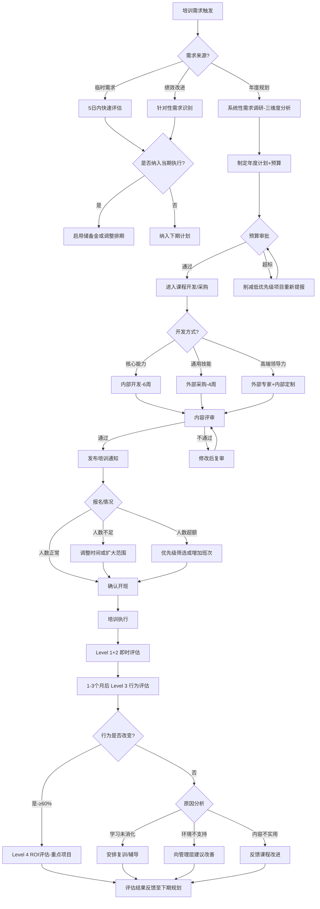

# 培训与发展标准操作流程 (SOP)

## 1. 流程概述

本SOP定义了企业培训与发展业务域的端到端标准操作流程，涵盖从培训需求诊断到效果评估闭环的完整周期。本流程适用于所有层级和类型的培训项目管理，旨在确保培训资源的高效配置和培训效果的持续提升。

**核心目标**：将组织能力需求系统化转化为学习行动，通过科学评估验证投入回报，支撑人才梯队建设和组织能力提升。

---

## 2. RACI矩阵

| 流程步骤 | 培训需求分析师 | 课程开发与实施专员 | 培训效果评估师 | HR总监 | 业务部门负责人 | HRBP |
|----------|:---:|:---:|:---:|:---:|:---:|:---:|
| 培训需求调研 | R/A | I | C | I | C | C |
| 年度培训计划制定 | R | C | C | A | C | I |
| 培训预算编制 | R | C | I | A | I | I |
| 课程开发/采购 | C | R/A | I | I | C | I |
| 讲师选拔与管理 | I | R/A | C | I | C | I |
| 培训通知与报名 | I | R | I | I | I | C |
| 培训执行实施 | I | R/A | I | I | I | I |
| Level 1&2 评估 | I | C | R/A | I | I | I |
| Level 3 行为评估 | C | I | R/A | I | C | C |
| Level 4 ROI评估 | C | I | R/A | A | C | I |
| 学时监控管理 | I | R | C | A | I | C |
| 管理岗必修认证 | I | R | R/A | A | I | C |
| 人才发展路径维护与跟踪 | C | I | R/A | I | C | C |

> R=Responsible(负责执行)  A=Accountable(最终问责)  C=Consulted(咨询)  I=Informed(知会)

---

## 3. 详细流程步骤

### SOP-1: 培训需求收集与计划制定

#### 触发条件
- 每年Q4（10月1日）启动次年培训需求调研
- 或：重大业务变化发生时（新业务上线、组织重组、技术栈迁移）
- 或：绩效管理模块输出的能力差距报告

#### 执行动作
1. **启动调研**（T+0 ~ T+14天）
   - 发放培训需求调研问卷至全部一级部门
   - 安排部门负责人/HRBP深度访谈（每部门至少1次）
   - 收集绩效管理模块的能力差距数据
   - 收集员工IDP中的培训诉求

2. **需求分析**（T+15 ~ T+28天）
   - 执行组织分析、任务分析、人员分析三维度诊断
   - 交叉验证识别共性需求和关键差距
   - 区分培训能解决vs不能解决的问题
   - 运用优先级矩阵排序

3. **计划编制**（T+29 ~ T+50天）
   - 形成年度培训需求报告
   - 编制年度培训计划和课程日历
   - 编制培训预算分配方案
   - 12月底前完成计划初稿

4. **审批发布**（次年1月1日 ~ 1月15日）
   - 提交HR总监审批
   - 根据审批意见修订（如预算削减）
   - 1月15日前完成审批
   - 全公司发布培训日历

#### 输出物
- 年度培训需求分析报告
- 年度培训计划书（含课程日历）
- 年度培训预算方案

#### 异常处理
| 异常情况 | 处理方式 |
|----------|----------|
| 预算超标 | 削减低优先级项目，保留战略关键和合规必修项目，重新提报 |
| 部门不配合调研 | 升级至HRBP介入，必要时HR总监发文要求配合 |
| 临时紧急需求 | 5个工作日内完成评估，启用储备金或调整现有排期 |
| 审批超时 | 1月10日未反馈则主动催办，1月15日硬性截止 |

---

### SOP-2: 课程开发与采购

#### 触发条件
- 年度培训计划中的课程开发任务
- 新增培训需求经评估后确认需要开发/采购课程

#### 执行动作
1. **开发方式决策**
   - 核心能力/企业特有知识 → 内部开发
   - 通用技能 → 外部采购
   - 高端领导力 → 外部专家+内部定制

2. **内部开发流程**（不超过6周）
   - Week 1: 立项审批+确定SME和教学设计师
   - Week 2-3: 教学设计+内容萃取
   - Week 4-5: 材料开发+试讲验证
   - Week 6: 内容评审（准确性+实用性+合规性）→ 上线

3. **外部采购流程**（不超过4周）
   - Week 1: 需求明确+供应商筛选（≥3家比选）
   - Week 2: 试听/试用评估
   - Week 3: 商务谈判+合同签署
   - Week 4: 定制化调整+内部对接

4. **内容评审**
   - 准确性：业务专家确认内容无误
   - 实用性：目标学员代表确认贴近实际
   - 合规性：无涉密/违规/侵权内容

#### 输出物
- 课程包（教案+课件+材料+评估工具）
- 课程评审通过记录
- 外部采购合同（如适用）

#### 异常处理
| 异常情况 | 处理方式 |
|----------|----------|
| 内容评审未通过 | 明确修改要求，返回修改后7天内复审 |
| 开发周期超过6周 | 评估原因，必要时拆分为两期交付 |
| 外部供应商质量不达标 | 试听不通过直接淘汰，签约后不达标启动替换流程 |
| SME配合度不足 | 升级至其直属上级协调时间 |

---

### SOP-3: 培训实施执行

#### 触发条件
- 培训日历中的计划培训即将到期（T-7天触发准备流程）
- 临时培训需求审批通过后

#### 执行动作
1. **培训准备**
   - T-7天：发布培训通知（内容、时间、地点、对象、准备要求）
   - T-7天：开放报名通道
   - T-5天：报名截止，确认参训名单
   - T-3天：分发培训资料
   - T-3天：确认讲师、场地、设备就绪
   - T-1天：发送培训提醒

2. **报名管理**
   - 人数不足（<开班最低人数）→ 调整时间或扩大参训范围
   - 人数超额 → 按业务优先级筛选或增加班次
   - 必修课程人数不足 → 部门负责人督促参加

3. **现场执行**
   - 提前30分钟到场布置
   - 执行签到（出勤率≥90%为有效开班）
   - 全程现场支持（设备、后勤、突发应对）
   - 讲师评分≥4.0/5.0为合格

4. **培训收尾**
   - 当天：收集Level 1满意度问卷
   - 培训结束时：执行Level 2学习测试
   - 48小时内：更新学员学时记录
   - 3个工作日内：编制培训执行总结

#### 输出物
- 培训签到记录
- Level 1满意度数据
- Level 2测试成绩
- 培训执行总结报告
- 学时更新记录

#### 异常处理
| 异常情况 | 处理方式 |
|----------|----------|
| 出勤率<90% | 评估是否继续，若取消则安排补课并分析缺席原因 |
| 讲师临时无法到场 | 启动替补讲师机制，若无替补则延期并提前通知学员 |
| 设备/场地故障 | 30分钟内解决或转移至备用方案（如切换线上） |
| 讲师评分<4.0 | 与讲师沟通改进，连续两次低于3.5暂停其授课资格 |

---

### SOP-4: 培训效果评估

#### 触发条件
- Level 1&2：培训结束当天/当时自动触发
- Level 3：训后1个月时间节点触发
- Level 4：训后3个月时间节点触发（仅限重点项目）

#### 执行动作
1. **Level 1 反应层**（培训当天）
   - 发放满意度问卷（线上/纸质）
   - 回收率要求≥95%
   - 48小时内完成统计分析
   - 评分<3.5的维度标记为改进重点

2. **Level 2 学习层**（培训结束时）
   - 组织知识/技能测评
   - 通过率目标≥85%
   - 未通过者安排补学机会
   - 分析薄弱知识点，反馈课程开发

3. **Level 3 行为层**（训后1-3个月）
   - 确定抽样名单（≥30%参训人员）
   - 执行上级结构化访谈
   - 收集工作行为变化证据
   - 行为改变率目标≥60%
   - 未变化原因分析+干预措施制定

4. **Level 4 结果层**（训后3-6个月）
   - 选定重点项目（每年≥3个）
   - 收集相关业务指标数据
   - 隔离培训效果，计算ROI
   - 编制ROI分析报告

5. **评估闭环**
   - 课程质量问题 → 反馈给课程开发专员
   - 需求定位问题 → 反馈给培训需求分析师
   - 转化环境问题 → 向业务管理层建议

#### 输出物
- 各层级评估报告
- 课程改进建议清单
- 年度培训效果白皮书
- ROI分析报告（重点项目）

#### 异常处理
| 异常情况 | 处理方式 |
|----------|----------|
| Level 1&2回收率<95% | 追加催收，仍未达标则标注数据代表性不足 |
| Level 3行为无变化 | 深入分析原因，制定后续干预（复训/辅导/环境改善） |
| ROI为负值 | 全面复盘该项目（需求是否准确、内容是否实用、学员是否合适），决定是否停办 |

---

### SOP-5: 学时管理与监控

#### 触发条件
- 每季度末（3月31日、6月30日、9月30日、12月31日）
- 年末12月15日启动最终达标检查

#### 执行动作
1. **季度通报**
   - 统计全员培训学时完成进度
   - 生成部门维度和个人维度的进度报告
   - 识别学时落后人员（低于季度目标1/4进度×所在季度数）
   - 发送学时进度通报至部门负责人

2. **预警干预**
   - 对落后人员推送学习提醒和推荐课程
   - 与HRBP沟通协调学习时间安排
   - 严重落后者（进度<50%）上报部门负责人重点关注

3. **年末达标检查**
   - 12月15日统计最终学时数据
   - 未达标（<40学时）人员名单报部门负责人和HR总监
   - 未达标纳入年度绩效考核扣分项
   - 年度培训学时达标率目标≥95%

#### 输出物
- 季度学时进度通报
- 学习提醒和推荐课程推送
- 年度学时达标/未达标名单
- 绩效扣分通知（同步给绩效管理模块）

#### 异常处理
| 异常情况 | 处理方式 |
|----------|----------|
| 部门整体学时严重不足 | HR总监约谈部门负责人，制定追赶计划 |
| 因长期病假/产假未达标 | 按实际在岗时间折算目标学时 |
| 学时数据争议 | 核实LMS记录和签到记录，48小时内解决 |

---

### SOP-6: 管理岗晋升必修课程管理

#### 触发条件
- 管理岗晋升申请提交时自动触发检查
- 潜在晋升候选人名单确定时（如人才盘点后）

#### 执行动作
1. **认证检查**
   - 接收晋升申请或候选人名单
   - 查询员工必修课程完成状态
   - 判定结果：
     - 全部完成 → 出具认证确认，放行晋升评审
     - 未完成 → 推送剩余必修课程安排+通知延期晋升评审

2. **课程安排**（针对未完成者）
   - 30天内安排未完成的必修课程
   - 优先排期，协调业务时间
   - 课程完成+测试通过后更新认证状态
   - 重新同步给绩效管理模块

3. **认证同步**
   - 认证状态变更后24小时内同步给绩效管理模块
   - 确保晋升评审委员会可实时查询认证状态

#### 输出物
- 晋升课程认证确认/未完成通知
- 必修课程补修安排
- 认证状态同步记录

#### 异常处理
| 异常情况 | 处理方式 |
|----------|----------|
| 候选人拒绝参加必修课程 | 通知其直属上级和HR总监，明确不参加则不予晋升评审 |
| 课程安排与业务冲突 | 协调备选时间或安排线上自学+考核方式 |
| 必修课程清单更新 | 变更仅对新申请生效，已获认证者不受影响（祖父条款） |

---

### SOP-7: 人才发展路径维护与跟踪

#### 触发条件
- 每次培训完成后（更新员工能力档案）
- 每季度末（生成发展进度报告）
- 人才盘点/IDP制定时（提供能力数据输入）
- 员工主动申请查看发展进度时

#### 执行动作
1. **培训完成后档案更新**（培训结束48小时内）
   - 更新员工能力发展档案（新增培训记录、认证状态）
   - 累计学习积分
   - 对照岗位序列能力模型更新各维度能力达标状态
   - 生成/更新个人能力雷达图（当前水平vs目标岗位要求）

2. **季度发展进度报告**（每季度末）
   - 为有明确晋升目标的员工生成发展路径进度报告
   - 展示已达标条件/进行中/未开始的清晰状态
   - 识别高潜人才加速发展机会（能力达标率高+绩效优秀）
   - 将发展差距数据反馈给培训需求分析师纳入下期规划

3. **能力模型维护**（每年评审一次）
   - 评审现有岗位序列能力模型的时效性
   - 根据业务发展和技术变化更新能力标准
   - 新增/调整岗位的能力模型建立
   - 更新完成后同步影响所有员工的能力差距评估

#### 输出物
- 员工个人能力发展报告（含雷达图）
- 团队/部门人才发展仪表盘
- 高潜人才加速发展建议
- 能力差距汇总数据（输出给培训需求分析师）

#### 异常处理
| 异常情况 | 处理方式 |
|----------|----------|
| 培训记录数据不一致 | 与LMS系统核对，48小时内修正 |
| 能力模型过时（业务已大幅变化） | 启动紧急评审，2周内完成更新 |
| 员工对能力评估结果有异议 | 安排与直属上级三方沟通确认 |

---

## 4. 决策树

---

## 5. KPI指标与质量检查点

### 核心KPI指标

| 指标名称 | 目标值 | 统计频率 | 责任人 |
|----------|--------|----------|--------|
| 人均年度培训学时 | ≥40学时 | 季度统计 | 课程开发与实施专员 |
| 培训满意度评分（Level 1） | ≥4.2/5.0 | 每次培训 | 培训效果评估师 |
| 知识测试通过率（Level 2） | ≥85% | 每次培训 | 培训效果评估师 |
| 训后行为改变率（Level 3） | ≥60% | 训后1-3个月 | 培训效果评估师 |
| 培训ROI（Level 4） | >0（正向回报） | 年度/重点项目 | 培训效果评估师 |
| 培训预算执行率 | 95-105% | 月度跟踪 | 培训需求分析师 |
| 内部讲师人均授课时长 | 按计划达成 | 季度统计 | 课程开发与实施专员 |
| 管理岗必修课程完成率 | 晋升前100% | 实时监控 | 培训效果评估师 |
| 年度培训学时达标率 | ≥95% | 年度 | 课程开发与实施专员 |
| 培训计划按时完成审批 | 1月15日前 | 年度 | 培训需求分析师 |

### 质量检查点

| 检查点 | 检查时机 | 检查内容 | 不通过处理 |
|--------|----------|----------|-----------|
| Q1: 需求调研质量 | 调研完成后 | 覆盖全部一级部门、数据源≥3种、需求有数据支撑 | 补充调研 |
| Q2: 计划完整性 | 计划提交审批前 | 覆盖全员学时要求、预算合理性、必修课程安排完整 | 修改补充 |
| Q3: 课程上线评审 | 课程上线前 | 准确性+实用性+合规性三维通过 | 返回修改 |
| Q4: 培训准备检查 | T-3天 | 通知已发、资料已分发、场地设备就绪、讲师确认 | 升级处理 |
| Q5: 出勤达标检查 | 培训开始时 | 出勤率≥90% | 评估是否继续/补课 |
| Q6: 评估回收检查 | 评估收集后48小时 | Level 1&2回收率≥95% | 追加催收 |
| Q7: 学时季度检查 | 每季度末 | 学时进度与季度目标匹配 | 推送提醒/上报 |
| Q8: 晋升认证检查 | 晋升申请时 | 必修课程100%完成 | 延期晋升+安排补课 |

---

## 6. 年度关键时间节点

| 时间 | 事项 | 责任人 |
|------|------|--------|
| 10月1日 | 启动次年培训需求调研 | 培训需求分析师 |
| 11月15日 | 完成需求分析和优先级排序 | 培训需求分析师 |
| 12月31日 | 完成年度培训计划初稿和预算方案 | 培训需求分析师 |
| 1月15日 | 完成HR总监审批 | HR总监 |
| 1月底 | 全公司发布培训日历 | 课程开发与实施专员 |
| 每季度末 | 学时进度通报 | 课程开发与实施专员 |
| 6月30日 | 年中计划执行回顾和调整 | 培训需求分析师 |
| 12月15日 | 年末学时达标最终检查 | 课程开发与实施专员 |
| 12月31日 | 年度培训效果白皮书发布 | 培训效果评估师 |

---

## 7. 跨模块协作接口

| 协作对象 | 数据流向 | 内容 | 频率 |
|----------|----------|------|------|
| 绩效管理 → 培训 | 输入 | 能力差距数据、PIP培训需求 | 每考核周期 |
| 培训 → 绩效管理 | 输出 | 必修课程认证状态、内部讲师绩效加分 | 实时 |
| 入职管理 → 培训 | 输入 | 新员工信息和岗位技能培训需求 | 每次入职 |
| 培训 → 入职管理 | 输出 | 新员工培训完成确认 | 入职后1周 |
| 招聘管理 → 培训 | 输入 | 新岗位能力需求信息 | 按需 |
