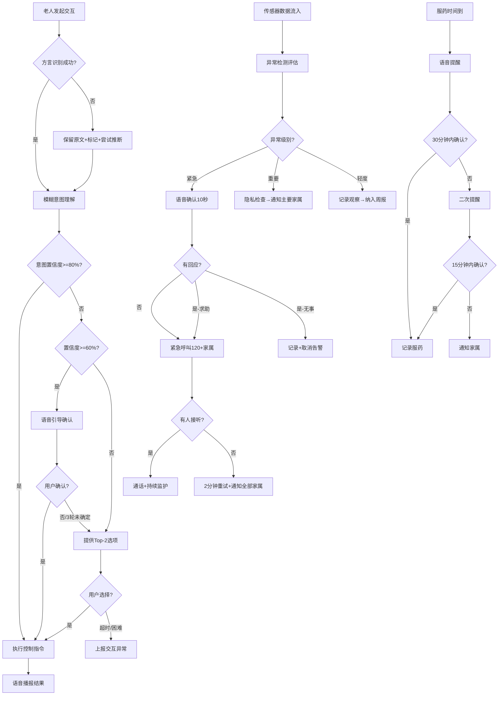

# 适老化与无障碍服务 — 标准操作规程 (SOP)

## 1. 概述

本SOP定义了适老化与无障碍服务域的完整运营标准，涵盖适老交互、健康安全守护、用药管理、家属协同四大核心流程。设计哲学为「科技适老」——系统应像贴心管家，主动服务而非等待指令，出问题时保障安全而非追求功能完整。

### 1.1 适用范围
- 适老交互适配器的方言识别与模糊表达理解流程
- 健康安全守护器的多级异常检测与紧急响应流程
- 用药提醒确认闭环流程
- 家属协同联络器的分级通知与隐私保护流程

### 1.2 核心原则
1. **安全第一**：任何涉及生命安全的事件，响应时间优先于一切
2. **耐心容错**：对老人的交互永远保持耐心，多轮引导而非放弃
3. **隐私尊严**：监测是为了保护，不是为了监控，老人的自主权不可侵犯
4. **精准通知**：避免「狼来了」效应，分级推送确保家属信任度

---

## 2. RACI 职责矩阵

| 流程步骤 | 适老交互适配器 | 健康安全守护器 | 家属协同联络器 | 智能家居控制域(外部) | 家属 |
|---------|:---:|:---:|:---:|:---:|:---:|
| 方言识别与标准化 | R/A | - | - | I | - |
| 模糊意图理解 | R/A | I | - | C | - |
| 语音播报反馈 | R/A | - | - | - | - |
| 传感器数据采集 | - | R/A | - | C | - |
| 跌倒检测判定 | - | R/A | I | C | - |
| 紧急呼叫发起 | - | R/A | C | - | I |
| 健康异常分级 | - | R/A | C | - | I |
| 用药提醒执行 | C | R/A | I | - | - |
| 用药未确认升级 | - | R | A | - | I |
| 分级通知策略执行 | - | C | R/A | - | I |
| 隐私权限校验 | I | I | R/A | - | C |
| 家属远程操作鉴权 | - | - | R/A | C | C |
| 周期报告生成 | - | C | R/A | - | I |
| 老人交互异常上报 | R | A | I | - | - |
| 设备控制指令下发 | C | C | C | R/A | - |

> R=Responsible(执行者) A=Accountable(负责人) C=Consulted(被咨询) I=Informed(被通知)

---

## 3. 核心流程详细说明

### 3.1 适老交互流程

#### 触发条件
- 老人通过语音、触控或物理按键发起交互

#### 流程步骤

**步骤3.1.1：语音接收与方言识别**
- 动作：接收ASR引擎输出文本，执行方言类型判定，进行方言到标准普通话的转换
- 输出：标准化文本 + 方言类型标签 + 置信度评分
- 质量要求：核心5种方言识别准确率 >= 85%
- 异常处理：完全无法识别时保留原文，标记后传递

**步骤3.1.2：模糊意图理解**
- 动作：融合上下文历史、用户习惯、时间场景、设备状态进行意图推断
- 输出：标准化意图结构（设备+操作+参数+置信度）
- 质量要求：模糊表达理解准确率 >= 80%，交互平均轮次 < 3轮

**步骤3.1.3：【决策点】意图确认**
- 置信度 >= 80%：直接执行
- 置信度 60%-80%：语音引导确认（如"您是想关卧室的灯吗？"）
- 置信度 < 60%：提供Top-2选项
- 最多3轮引导，超过则提供选项

**步骤3.1.4：控制执行与结果播报**
- 动作：将确认的意图传递至设备调度控制器执行，执行完毕后语音播报结果
- 输出：语音播报文本（如"已经帮您关掉卧室的灯了"）
- 质量要求：播报延迟 < 1秒，语速为正常的70-80%

**步骤3.1.5：交互异常检测**
- 动作：监测多次重试（>3次）、长时间沉默（>30秒）、语音情绪异常
- 输出：异常信号 → 通知健康安全守护器评估
- 异常处理：交互困难可能暗示健康问题，需人体感应配合判断

---

### 3.2 健康安全守护流程

#### 触发条件
- 7×24持续运行，实时采集传感器数据
- 数据采集周期：穿戴设备每5分钟 / 家居传感器实时 / 视觉分析实时

#### 流程步骤

**步骤3.2.1：多源数据持续采集**
- 动作：整合穿戴设备(心率/血压/血氧)、家居传感器(人体感应/门磁/用水用电)、AI视觉(跌倒/姿态)
- 输出：实时健康行为数据流
- 质量要求：数据采集完整率 >= 98%

**步骤3.2.2：异常检测算法评估**
- 动作：将实时数据与个人基线对比，执行阈值判定和趋势分析
- 输出：异常事件 + 严重等级 + 置信度
- 质量要求：异常检测准确率 >= 85%

**步骤3.2.3：【决策点】异常级别判定与响应**

| 级别 | 触发条件 | 响应动作 | 时限要求 |
|------|---------|---------|---------|
| 紧急 | 跌倒确认/心率骤变(±40bpm)/血氧<90% | 语音确认→紧急呼叫120+家属+开启摄像头 | 检测到呼叫<15秒 |
| 重要 | 连续2天作息异常/48h无活动/用药持续未确认 | 通知主要家属+生成异常报告 | <5分钟 |
| 轻度 | 单日活动量下降>30%/睡眠质量下降/单次偏差 | 记录观察+纳入周报 | 下次报告周期 |

**步骤3.2.4：【异常分支】紧急呼叫无人接听**
- 每2分钟重试一次
- 同时通知所有配置的家属（全通道）
- 最大重试10次
- 持续语音安抚老人

**步骤3.2.5：跌倒检测特殊流程**
- 多源融合判定（视觉+加速度+红外+声音）
- 触发后10秒语音确认窗口
- 无回应→确认跌倒→紧急响应
- 灵敏度 >= 95%，误报率 < 10%

---

### 3.3 用药提醒流程

#### 触发条件
- 到达服药计划中的预定服药时间

#### 流程步骤

**步骤3.3.1：准时提醒发起**
- 动作：语音播报药品信息（称谓+药名+剂量+外观+服用方式）
- 输出：语音播报
- 质量要求：准时率100%（误差<1分钟）

**步骤3.3.2：确认等待**
- 动作：等待用户语音/按钮/药盒传感器确认
- 等待窗口：30分钟
- 输出：确认时间戳和方式 / 超时标记

**步骤3.3.3：【决策点】30分钟内是否确认？**
- 已确认 → 记录服药记录，流程结束
- 未确认 → 进入步骤3.3.4

**步骤3.3.4：二次提醒**
- 动作：发起第二次语音提醒（语调略提升紧迫感但仍温和）
- 等待窗口：15分钟

**步骤3.3.5：【决策点】二次提醒后是否确认？**
- 已确认 → 记录服药记录（标注延迟），流程结束
- 未确认 → 通知主要家属（APP推送含药品名和已过时长）
- 连续2次未确认 → 升级为重要异常

---

### 3.4 家属协同与隐私保护流程

#### 触发条件
- 健康安全守护器输出异常事件
- 家属主动发起远程操作请求
- 到达周期报告生成时间

#### 流程步骤

**步骤3.4.1：隐私配置前置检查**
- 动作：所有通知/操作决策前，先检查老人的隐私配置
- 输出：允许推送的数据类型列表 / 过滤掉的数据类型
- 质量要求：100%按配置执行，不可绕过

**步骤3.4.2：通知策略执行**
- 动作：根据事件级别选择通知渠道和对象
- 紧急：电话+短信+APP同步推送所有紧急联系人
- 重要：APP推送主要家属
- 轻度：汇总至日报/周报
- 质量要求：分级准确率 >= 90%

**步骤3.4.3：家属远程操作鉴权**
- 动作：身份验证 → 权限检查 → 敏感操作二次确认
- 输出：操作允许/拒绝 + 执行结果
- 质量要求：权限校验100%执行

**步骤3.4.4：操作透明化**
- 动作：所有家属远程操作告知老人（语音播报）
- 输出：老人端通知
- 质量要求：100%告知，老人可查看操作日志

**步骤3.4.5：周期报告生成与推送**
- 动作：按日/周/月周期汇总数据生成报告
- 输出：结构化报告（含评分/趋势/亮点/关注点）
- 质量要求：自动生成率100%，推送准时

---

## 4. 决策树

---

## 5. KPI 指标与质量检查点

### 5.1 方言识别与交互质量

| 指标 | 目标值 | 测量方式 | 检查频率 |
|------|--------|---------|---------|
| 核心5种方言识别准确率 | >= 85% | 人工抽样标注验证 | 每周 |
| 模糊表达理解准确率 | >= 80% | 用户确认/否定比例统计 | 每日 |
| 交互平均轮次 | < 3轮 | 系统自动统计 | 每日 |
| 意图首次执行成功率 | >= 75% | 无需引导直接成功的比例 | 每日 |

### 5.2 跌倒检测与紧急响应

| 指标 | 目标值 | 测量方式 | 检查频率 |
|------|--------|---------|---------|
| 跌倒检测灵敏度 | >= 95% | 模拟测试+真实事件回顾 | 每月 |
| 跌倒检测误报率 | < 10% | 语音确认后取消/总触发 | 每周 |
| 检测到告警延迟 | < 5秒 | 系统日志时间戳差 | 实时 |
| 紧急呼叫发起成功率 | 100% | 呼叫模块返回状态 | 实时 |
| 从检测到呼叫发起 | < 15秒 | 系统日志时间戳差 | 实时 |
| 首次接通率(含轮拨) | >= 90% | 通话记录统计 | 每周 |

### 5.3 用药管理

| 指标 | 目标值 | 测量方式 | 检查频率 |
|------|--------|---------|---------|
| 提醒准时率 | 100% | 计划时间vs实际播报时间 | 每日 |
| 服药确认闭环率 | >= 90% | 确认数/提醒总数 | 每周 |
| 未确认告警及时率 | 100% | 超时后通知发送时间 | 每日 |
| 时间误差 | < 1分钟 | 系统时钟精度检查 | 每日 |

### 5.4 生活规律监测

| 指标 | 目标值 | 测量方式 | 检查频率 |
|------|--------|---------|---------|
| 异常检测准确率 | >= 85% | 事后验证（家属反馈） | 每月 |
| 家属通知分级准确率 | >= 90% | 抽样复核 | 每周 |
| 周报自动生成率 | 100% | 系统计划任务执行记录 | 每周 |
| 基线更新及时性 | 每周滑动更新 | 系统日志 | 每周 |

### 5.5 隐私保护

| 指标 | 目标值 | 测量方式 | 检查频率 |
|------|--------|---------|---------|
| 数据访问权限合规率 | 100% | 权限审计日志 | 每月 |
| 无异常时家属推送数 | 0 | 推送记录统计 | 每日 |
| 老人配置变更响应 | 实时生效(<1秒) | 系统日志 | 每日 |
| 访问日志完整率 | >= 99.9% | 日志完整性校验 | 每周 |

---

## 6. 异常处理与应急预案

### 6.1 传感器失联
- **触发**：关键传感器（人体红外/穿戴设备）超过10分钟无数据
- **响应**：标记数据不可信→使用历史均值替代→发送设备异常通知→若为生命安全传感器，通知家属
- **恢复**：传感器恢复后自动切回实时数据

### 6.2 网络中断
- **触发**：智能家居网关与云端失联
- **响应**：切换至本地运行模式→紧急呼叫走蜂窝网络备份→本地存储数据待恢复后上传
- **恢复**：网络恢复后批量同步数据→检查期间是否有遗漏告警

### 6.3 误报处理
- **触发**：家属反馈收到错误的紧急/重要通知
- **响应**：记录误报事件→分析误报原因→调整检测阈值→若误报频率过高，启动算法复审
- **预防**：语音确认环节可拦截大部分误报；月度误报次数>3次触发系统优化

### 6.4 老人拒绝配合
- **触发**：老人多次关闭提醒/拒绝交互/要求停止监测
- **响应**：尊重老人意愿→记录拒绝事件→通知主要家属→建议家属人工介入沟通
- **底线**：紧急生命安全类监测不可被完全关闭（但可调低灵敏度）

---

## 7. 持续改善机制

### 7.1 数据驱动优化
- 每周分析交互失败案例，补充方言词汇库和模糊表达映射
- 每月回顾跌倒检测误报案例，优化多源融合算法
- 每季度评估通知分级效果（家属反馈满意度调查）

### 7.2 版本迭代
- 方言模型每月更新（增加新方言词汇覆盖）
- 异常检测阈值每季度复审（基于累积数据调优）
- 隐私政策年度审计（合规性检查）

### 7.3 用户反馈闭环
- 老人：交互后满意度（语音"不好用"即为负反馈）
- 家属：月度满意度问卷（通知有用性/频率合理性/信息完整性）
- 医护人员：报告实用性反馈（就医展示是否方便）
