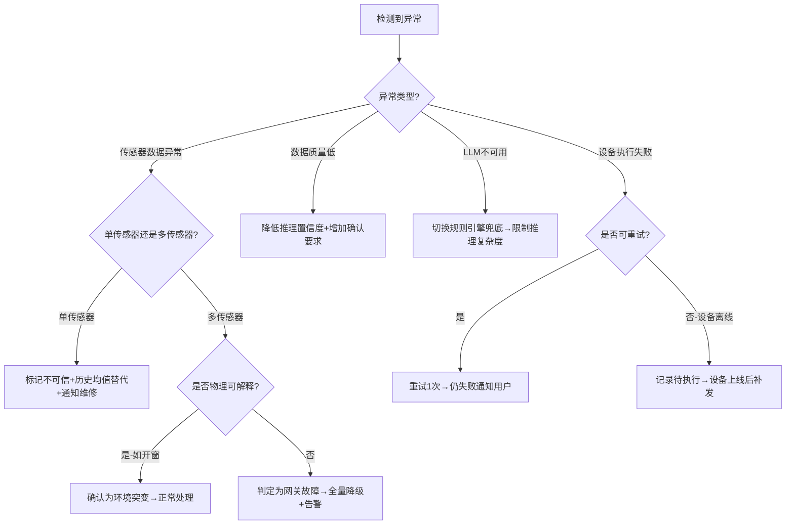

# 场景智能与主动感知 — 标准作业程序 (SOP)

## 1. 概述

本SOP定义了场景智能域从数据采集到智能推荐再到反馈闭环的全流程标准作业规范。目标是确保系统在90%以上场景触发准确率的前提下，提供个性化、节能、隐私合规的主动智能服务。

---

## 2. RACI 责任矩阵

| 流程步骤 | 环境感知融合器 | 用户偏好学习引擎 | 场景推理决策器 | 设备调度控制器(外部) | 用户 |
|---------|:---:|:---:|:---:|:---:|:---:|
| 传感器数据采集与清洗 | **R/A** | I | I | - | - |
| 外部数据源集成 | **R/A** | - | I | - | - |
| 异常数据检测与标记 | **R/A** | - | I | C | - |
| 环境状态向量输出 | **R/A** | I | C | - | - |
| 用户操作日志收集 | I | **R/A** | - | C | - |
| 行为模式识别 | - | **R/A** | I | - | - |
| 偏好模型更新 | - | **R/A** | I | - | I |
| 冷启动策略执行 | - | **R/A** | C | - | C |
| 场景触发条件评估 | C | C | **R/A** | - | - |
| LLM场景推理 | - | C | **R/A** | - | - |
| 多用户偏好协商 | - | C | **R/A** | - | I |
| 能耗优化修正 | - | - | **R/A** | I | I |
| 置信度评估与决策 | - | - | **R/A** | - | C |
| 控制指令下发 | - | - | C | **R/A** | - |
| 用户反馈收集 | - | **R** | **A** | I | **R** |
| 负反馈模型修正 | - | **R/A** | I | - | - |
| 数据隐私合规审计 | **R** | **R** | **R** | - | **A** |

> R=Responsible(执行) A=Accountable(决策) C=Consulted(咨询) I=Informed(通知)

---

## 3. 核心流程与步骤详述

### 3.1 环境数据采集与融合流程

#### 触发条件
- 定时触发：按传感器采集频率（温湿度5min/光照1min/空气质量10min）
- 事件触发：人体感应/门窗磁状态变化（实时）

#### 执行步骤

| 步骤 | 执行者 | 操作 | 输出 | 超时/异常处理 |
|-----|-------|------|------|------------|
| 1.1 | 环境感知融合器 | 从传感器网关拉取原始数据 | 原始读数集合 | 超时3s→重试1次→标记该传感器离线 |
| 1.2 | 环境感知融合器 | 数据清洗：去噪+插值+异常过滤 | 清洗后数据 | 缺失率>5%→标记不可信 |
| 1.3 | 环境感知融合器 | 外部数据集成（天气/AQI/电价） | 增强上下文 | API超时→使用缓存值+标记stale |
| 1.4 | 环境感知融合器 | 多传感器融合计算 | 环境状态向量 | 计算异常→回退至单传感器值 |
| 1.5 | 环境感知融合器 | 计算delta值+数据质量评分 | 完整状态输出 | - |
| 1.6 | 环境感知融合器 | 判断delta是否超过触发阈值 | 触发/不触发信号 | - |

#### 质量检查点
- ✅ 传感器在线率 ≥ 95%
- ✅ 数据完整率 ≥ 98%（插值补充 ≤ 2%）
- ✅ 异常值检出率 ≥ 90%
- ✅ 单次融合计算延迟 < 200ms
- ✅ 外部数据更新时效 < 2小时

---

### 3.2 用户偏好学习流程

#### 触发条件
- 用户手动操作设备（实时学习）
- 用户接受/拒绝场景推荐（反馈学习）
- 定时评估（每周一次全量评估）
- 新用户注册（冷启动初始化）

#### 执行步骤

| 步骤 | 执行者 | 操作 | 输出 | 超时/异常处理 |
|-----|-------|------|------|------------|
| 2.1 | 偏好学习引擎 | 接收用户操作日志+环境快照 | 标注样本 | 日志丢失→从设备控制域重拉 |
| 2.2 | 偏好学习引擎 | 身份识别确认（匹配用户模型） | 用户ID | 识别失败→标记为unknown，不更新模型 |
| 2.3 | 偏好学习引擎 | 行为模式挖掘/增量更新 | 更新后参数 | - |
| 2.4 | 偏好学习引擎 | 重新计算置信度 | 置信度评分 | - |
| 2.5 | 偏好学习引擎 | 偏好漂移检测 | 漂移/稳定 | 检测到漂移→提高学习率+通知用户 |
| 2.6 | 偏好学习引擎 | 模型版本存档 | 版本快照 | 存储异常→日志告警，不阻塞主流程 |

#### 质量检查点
- ✅ 冷启动期（<7天）明确标注"学习中"状态
- ✅ 模型更新后A/B对比验证（接受率不下降）
- ✅ 偏好漂移检测月度执行（变化>30%触发重学习）
- ✅ 负反馈响应延迟 < 500ms
- ✅ 身份识别准确率 ≥ 95%

---

### 3.3 场景推理与决策流程

#### 触发条件
- 环境感知融合器输出"delta超阈值"信号
- 时间匹配用户作息时间点（±5分钟）
- 人员在位状态变化（进入/离开）
- 外部事件触发（天气突变预警/日历事件即将开始）

#### 执行步骤

| 步骤 | 执行者 | 操作 | 输出 | 超时/异常处理 |
|-----|-------|------|------|------------|
| 3.1 | 场景推理决策器 | 获取环境状态+偏好参数+时间上下文 | 决策输入集 | 获取超时→使用最近缓存值 |
| 3.2 | 场景推理决策器 | 场景类型识别（LLM推理） | 场景标签 | LLM超时2s→使用规则引擎兜底 |
| 3.3 | 场景推理决策器 | 生成设备参数推荐方案 | 设备指令集 | - |
| 3.4 | 场景推理决策器 | 多用户偏好冲突检测 | 冲突/无冲突 | - |
| 3.5 | 场景推理决策器 | [有冲突]应用协商策略 | 协商后方案 | 协商失败→请求用户确认 |
| 3.6 | 场景推理决策器 | 能耗优化修正 | 修正后方案 | - |
| 3.7 | 场景推理决策器 | 计算置信度评分 | 置信度值 | - |
| 3.8 | 场景推理决策器 | 执行策略决定 | 自动/确认/不执行 | - |
| 3.9 | 场景推理决策器 | [自动执行]发送指令至设备调度 | 控制指令 | 下发失败→重试1次→通知用户 |
| 3.10 | 场景推理决策器 | [需确认]向用户展示推荐+理由 | UI推送 | 用户30min无响应→放弃本次推荐 |

#### 质量检查点
- ✅ 场景触发准确率 ≥ 90%（用户接受率）
- ✅ 误触发率 < 5%
- ✅ 场景响应时间 < 3秒（从触发到指令下发）
- ✅ LLM推理延迟 < 2秒
- ✅ 置信度校准准确性（实际接受率与置信度相关性>0.8）

---

### 3.4 反馈闭环流程

#### 触发条件
- 场景执行完成后5分钟监测窗口
- 用户主动手动调整设备参数
- 用户通过语音/APP表达不满

#### 执行步骤

| 步骤 | 执行者 | 操作 | 输出 | 超时/异常处理 |
|-----|-------|------|------|------------|
| 4.1 | 场景推理决策器 | 启动5分钟反馈监测窗口 | 监测中 | - |
| 4.2 | 偏好学习引擎 | 检测到用户手动调整 | 负反馈信号 | - |
| 4.3 | 偏好学习引擎 | 记录：推荐值vs用户实际值+环境快照 | 负反馈样本 | - |
| 4.4 | 偏好学习引擎 | 即时增量更新偏好模型（α=0.6） | 更新后模型 | - |
| 4.5 | 场景推理决策器 | 评估是否需要调整触发阈值 | 阈值修正 | - |
| 4.6 | 场景推理决策器 | 记录决策日志（含完整上下文） | 日志条目 | 写入失败→缓存→异步重试 |

#### 质量检查点
- ✅ 负反馈检测延迟 < 10秒
- ✅ 模型即时更新成功率 100%
- ✅ 连续3次负反馈后触发深度评估
- ✅ 负反馈后下次同场景推荐偏差减少 ≥ 50%

---

### 3.5 异常处理流程

#### 触发条件
- 传感器数据异常（全零/突变/通信超时）
- 环境数据质量评分 < 0.7
- LLM推理服务不可用
- 设备执行失败

#### 决策树

---

## 4. 能耗优化检查点

| 检查项 | 目标值 | 检测频率 | 责任方 | 不达标处理 |
|-------|-------|---------|--------|----------|
| 场景执行后能耗对比基线降低 | ≥ 10% | 每周 | 场景推理决策器 | 分析高耗场景，优化参数 |
| 峰电时段高耗设备调度率 | ≥ 80% | 每日 | 场景推理决策器 | 加强延迟调度策略力度 |
| 月度能耗预算偏差 | < 10% | 每周 | 场景推理决策器 | 动态调整节能力度 |
| 谷电利用率（可调度负载） | ≥ 60% | 每周 | 场景推理决策器 | 扩大可延迟设备范围 |

---

## 5. 隐私合规检查点

| 检查项 | 要求 | 检测频率 | 责任方 | 不达标处理 |
|-------|------|---------|--------|----------|
| 行为数据本地存储 | 100%在本地处理 | 每季度审计 | 全部Agent | 立即修复+安全事件上报 |
| 云端传输数据脱敏 | 不含可识别个人身份的原始数据 | 每季度审计 | 全部Agent | 切断云端通道+排查 |
| 用户数据删除响应 | 24小时内完成 | 每次请求 | 偏好学习引擎 | 升级处理+通知用户 |
| 数据访问日志 | 完整记录所有访问 | 持续 | 全部Agent | 补全缺失日志 |
| 最小数据原则 | 仅采集必要数据 | 每季度评审 | 环境感知融合器 | 清理多余数据采集 |

---

## 6. KPI 指标体系

### 核心指标

| 指标名称 | 目标值 | 计算方式 | 数据来源 |
|---------|-------|---------|---------|
| 场景推荐触发准确率 | ≥ 90% | 用户接受次数 / 总推荐次数 | 推理日志 |
| 用户推荐接受率 | ≥ 85% | (接受+自动执行) / 总推荐 | 反馈日志 |
| 场景响应时间 | < 3秒 (P95) | 触发信号→指令下发 | 系统日志 |
| 偏好模型收敛周期 | ≤ 7天 | 冷启动→置信度≥0.7 | 模型日志 |
| 能耗节省比例 | ≥ 10% | 智能模式能耗 / 基线能耗 | 能耗数据 |
| 多用户识别准确率 | ≥ 95% | 正确识别 / 总识别次数 | 识别日志 |
| 误触发率 | < 5% | 误触发次数 / 总触发次数 | 反馈日志 |

### 辅助指标

| 指标名称 | 目标值 | 监测频率 |
|---------|-------|---------|
| 传感器在线率 | ≥ 95% | 实时 |
| 数据质量评分均值 | ≥ 0.85 | 每小时 |
| 偏好漂移检出率 | ≥ 80% | 每月 |
| 协商方案满意度 | ≥ 80% | 每次协商后 |
| 负反馈后改善率 | ≥ 70% | 每次负反馈后 |

---

## 7. 版本记录

| 版本 | 日期 | 变更内容 | 审核人 |
|-----|------|---------|--------|
| v1.0 | 2024-01-15 | 初始版本，定义完整SOP流程 | 场景智能域架构师 |
