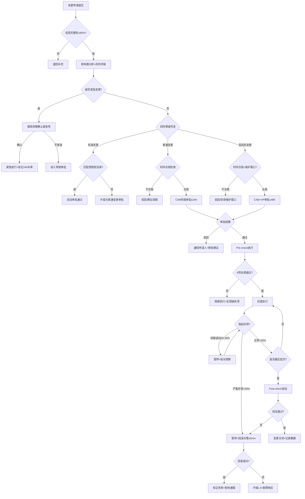

# 变更管理标准操作规程 (SOP)

## 1. 概述

本SOP定义了生产环境变更管理的标准操作流程，适用于所有对生产环境造成影响的变更活动，包括代码发布、配置变更、数据库变更、基础设施变更和安全变更。本流程遵循ITIL变更管理最佳实践，旨在实现变更的标准化、可追溯、可回滚，在保障系统稳定性的前提下支撑业务快速迭代。

**核心目标**：变更成功率≥99.5%，变更导致故障比例≤5%，紧急变更占比≤10%。

---

## 2. RACI 责任矩阵

| 流程步骤 | 变更评估Agent | 变更审批Agent | 变更执行Agent | 变更分析Agent | 变更申请人 | CAB成员 | VP/管理层 |
|---------|:---:|:---:|:---:|:---:|:---:|:---:|:---:|
| 变更申请提交 | I | I | I | - | R/A | - | - |
| 影响面分析 | R/A | I | I | - | C | - | - |
| 风险评级 | R/A | I | - | C | I | - | - |
| 回滚方案审核 | R/A | - | C | - | R | - | - |
| 审批路由确定 | I | R/A | - | - | I | I | - |
| 标准变更自动审批 | - | R/A | I | - | I | - | - |
| CAB审批 | C | R | - | - | I | A | - |
| VP审批 | C | R | - | - | I | C | A |
| 紧急变更放行 | I | R/A | I | - | R | - | I |
| 变更日历管控 | - | R/A | I | - | I | - | - |
| Pre-check执行 | - | - | R/A | - | C | - | - |
| 灰度发布执行 | - | - | R/A | - | I | - | - |
| 实时监控 | - | - | R/A | - | I | - | - |
| 回滚决策 | - | - | R/A | - | C | - | I(高风险) |
| Post-check验证 | - | - | R/A | - | C | - | - |
| 变更关闭 | - | - | R/A | - | A | - | - |
| 紧急变更补审 | C | R/A | - | - | R | A | - |
| 数据统计分析 | C | C | C | R/A | - | - | I |
| 健康度报告 | - | - | - | R/A | - | - | I |
| 持续改进建议 | C | C | C | R/A | - | I | A |

> R=负责执行, A=最终审批, C=咨询/协助, I=知会通知

---

## 3. SOP-1: 变更申请与评估

### 3.1 触发条件
- 任何人员或系统提交生产环境变更申请
- CI/CD流水线触发的自动化发布（需匹配标准变更目录）
- 故障修复产生的紧急变更需求
- 安全漏洞修复产生的变更需求

### 3.2 执行步骤

```
步骤1: 变更申请提交
├── 输入: 变更申请表(变更内容/类型/影响范围/执行计划/回滚方案)
├── 验证: 必填字段完整性检查(完整性≥95%)
├── 异常: 信息不完整→退回补充，明确缺失项
└── 输出: 完整的变更工单(状态:待评估)

步骤2: 影响面分析 (≤10分钟)
├── 输入: 变更工单 + CMDB服务拓扑 + 调用链数据
├── 执行: 变更评估Agent执行服务依赖分析
│   ├── 查询直接影响服务
│   ├── 追溯间接影响(≤3层)
│   ├── 量化影响用户数和交易量
│   └── 检测与其他变更的冲突
├── 异常: CMDB数据缺失→标记为"影响面不确定"，提升风险等级
└── 输出: 影响面评估报告(含影响服务列表/用户量/交易量/冲突检测)

步骤3: 风险评级 (自动计算+人工确认)
├── 输入: 影响面评估 + 变更类型 + 团队历史数据
├── 执行: 变更评估Agent计算风险评分
│   ├── 多维因子加权计算
│   ├── 应用附加规则(核心链路×1.3/不可逆×1.5)
│   └── 输出风险等级判定
├── 人工确认: 评分临界值±5分范围内需人工确认
└── 输出: 风险评级报告(标准/普通/高风险/极高风险)

步骤4: 回滚方案审核
├── 输入: 变更申请中的回滚方案
├── 执行: 变更评估Agent验证回滚方案
│   ├── 完整性检查(8项必备内容)
│   ├── 可行性验证(工具/版本/权限就绪)
│   ├── 时效性验证(≤变更时间50%)
│   └── 风险评估(回滚本身的副作用)
├── 异常: 方案不完整或不可行→退回修改，明确缺失/问题项
└── 输出: 回滚方案审核意见(通过/待完善/不通过)
```

### 3.3 质量检查点

| 检查项 | 标准 | 度量方式 | 责任方 |
|--------|------|---------|--------|
| 变更描述完整性 | ≥95%字段填写 | 系统自动检查 | 变更申请人 |
| 回滚方案覆盖率 | 100%变更有回滚方案 | 系统强制 | 变更申请人 |
| 影响面评估准确率 | ≥85% | 事后回测(变更失败时影响面是否预估到) | 变更评估Agent |
| 评估时效 | ≤30分钟(含自动+人工确认) | 工单时间戳 | 变更评估Agent |

### 3.4 异常处理

| 异常场景 | 处理方式 |
|---------|---------|
| CMDB数据不完整 | 标记"影响面不确定"，自动提升一个风险等级 |
| 历史数据不足(新团队) | 使用行业平均值，标记"参考置信度低" |
| 评估结果有争议 | 升级至CAB集体讨论决定 |
| 同时影响多个核心服务 | 自动判定为高风险，建议拆分为多个小变更 |

---

## 4. SOP-2: 变更审批

### 4.1 触发条件
- 变更评估完成，风险等级已确定
- 紧急变更申请（跳过常规评估，走快速通道）

### 4.2 执行步骤

```
步骤1: 审批路由确定
├── 输入: 风险评级结果 + 变更类型 + 紧急标记
├── 执行: 变更审批Agent确定审批路径
│   ├── 标准变更→匹配预授权目录→自动审批
│   ├── 普通变更→CAB轮值审批
│   ├── 高风险变更→CAB + VP审批
│   └── 紧急变更→值班经理放行 + 24h补审
└── 输出: 审批路径确认(审批人/时效/约束)

步骤2: 合规性检查
├── 输入: 变更计划时间 + 变更日历 + 冻结期配置
├── 执行: 变更审批Agent执行时间合规检查
│   ├── 周五/节假日前禁令检查
│   ├── 维护窗口合规性(高风险变更)
│   ├── 并行变更数量限制(同窗口≤2个高风险)
│   └── 变更冻结期检查(大促前7天)
├── 异常: 不合规→驳回或建议改期，给出可用时间
└── 输出: 合规检查结果(通过/不通过+原因+建议)

步骤3: 审批执行
├── 标准变更: 系统自动通过，记录匹配的预授权条目
├── CAB审批:
│   ├── 通知CAB轮值审批人(含变更摘要和评估报告)
│   ├── 审批时效: ≤24h(工作日)
│   ├── 超时处理: 50%时效预警→100%时效升级至CAB组长
│   └── 审批意见记录(通过/驳回+原因/有条件通过)
├── VP审批:
│   ├── CAB通过后转VP审批
│   ├── 审批时效: ≤48h
│   └── 超时升级至CTO
└── 紧急变更:
    ├── 值班经理确认紧急性后放行
    ├── 记录放行人+放行原因+关联事件
    └── 自动创建24h补审工单

步骤4: 审批结果通知
├── 通过: 通知变更执行Agent和申请人，排入执行日历
├── 驳回: 通知申请人，附驳回原因和修改建议
├── 有条件通过: 列出需满足的条件，条件达成后自动转为通过
└── 记录审批完成时间(用于时效统计)
```

### 4.3 质量检查点

| 检查项 | 标准 | 度量方式 | 责任方 |
|--------|------|---------|--------|
| 审批超时率 | ≤5% | 超时工单数/总审批数 | 变更审批Agent |
| 合规拦截准确率 | 100% | 无合规违规变更通过审批 | 变更审批Agent |
| 紧急变更补审完成率 | 100% | 24h内完成补审 | 变更审批Agent |
| 审批人资质匹配率 | 100% | 审批人职级与要求匹配 | 变更审批Agent |

### 4.4 异常处理

| 异常场景 | 处理方式 |
|---------|---------|
| CAB全员不可用 | 自动升级至运维总监审批 |
| 审批人利益冲突(自己审批自己的变更) | 自动路由至其他CAB成员 |
| 紧急变更频率过高(>3次/天) | 触发报警，评估是否存在滥用 |
| 审批后执行窗口已过期(>7天未执行) | 审批失效，需重新审批 |

---

## 5. SOP-3: 变更执行

### 5.1 触发条件
- 变更审批通过且在有效期内
- 当前时间在审批允许的执行窗口内
- 执行人确认开始执行

### 5.2 执行步骤

```
步骤1: Pre-check执行 (8项必检)
├── 输入: 变更工单 + 系统当前状态
├── 执行: 变更执行Agent逐项检查
│   ├── [1] 审批状态确认 → 有效期内、流程完整
│   ├── [2] 回滚方案就绪 → 脚本可用、版本可获取
│   ├── [3] 监控大盘已打开 → 核心大盘显示正常
│   ├── [4] 相关方通知完成 → 通知记录确认
│   ├── [5] 执行人复核人就位 → 在线确认
│   ├── [6] 依赖服务正常 → 上下游健康检查通过
│   ├── [7] 资源余量充足 → CPU/内存/磁盘满足需求
│   └── [8] 脚本工具就绪 → MD5/SHA校验通过
├── 异常: 任何一项未通过→阻断执行，反馈缺失项
└── 输出: Pre-check报告(全部通过/部分未通过+详情)
     └── Pre-check结果有效期: 30分钟

步骤2: 灰度执行 (至少3个批次)
├── 批次1: 1%流量放量
│   ├── 执行变更部署/配置生效
│   ├── 即时健康检查(30秒内)
│   ├── 短期观察(1-5分钟)
│   └── 稳定验证(5-15分钟)
├── 批次2: 10%流量放量
│   ├── (同上观察流程)
│   └── 重点关注: 性能指标是否线性增长
├── 批次3: 50%流量放量
│   ├── (同上观察流程)
│   └── 重点关注: 下游服务是否承受住
├── 批次4: 100%全量放量
│   └── 全量后持续观察15分钟
└── 每批次通过条件:
    ├── 错误率增幅 < 2×基线
    ├── P99响应时间 < 3×基线
    ├── 成功率下降 < 1%
    └── 各项指标稳定5分钟以上

步骤3: 实时监控 (核心指标5秒粒度)
├── 监控指标: 错误率/响应时间(P50/P95/P99)/QPS/CPU/内存
├── 基线对比: 实时计算偏离度
├── 告警规则:
│   ├── 黄色: 偏离基线20-30% → 暂停放量，延长观察
│   ├── 红色: 偏离基线>30% → 暂停放量，启动回滚评估
│   └── 紫色: 核心功能不可用 → 立即回滚
└── 输出: 每分钟指标摘要 + 异常告警

步骤4: 异常判定与回滚决策 (≤5分钟)
├── 触发条件: 监控告警红色/紫色级别
├── 决策框架:
│   ├── 立即回滚: 核心交易影响 / 数据异常 / 安全问题
│   ├── 暂停评估: 非核心影响 / 趋势不确定 / 可能自愈
│   └── 继续: 确认非变更引起的噪声
├── 回滚执行:
│   ├── 执行回滚方案
│   ├── 回滚时间≤变更时间50%
│   ├── 回滚后验证指标回归基线
│   └── 回滚失败→升级L3 + 触发故障响应
└── 输出: 回滚决策报告 / 回滚执行记录

步骤5: Post-check验证 (5项必验)
├── [1] 核心功能可用性验证 → 关键接口调用成功
├── [2] 性能指标正常 → 响应时间/错误率回归基线±10%
├── [3] 错误日志检查 → 无新增异常ERROR模式
├── [4] 关联服务检查 → 上下游服务无级联影响
├── [5] 变更目标达成 → 变更预期效果确认
├── 异常: 验证未通过→评估影响，决定回滚或容忍
└── 输出: Post-check验证报告
```

### 5.3 质量检查点

| 检查项 | 标准 | 度量方式 | 责任方 |
|--------|------|---------|--------|
| Pre-check执行率 | 100% | 有Pre-check记录的变更/应执行的变更 | 变更执行Agent |
| 灰度策略覆盖率 | ≥90% | 灰度执行的变更/应灰度的变更 | 变更执行Agent |
| 变更成功率 | ≥99.5% | 成功变更/已执行变更总数 | 变更执行Agent |
| 回滚决策时效 | ≤5分钟 | 异常确认到回滚决策的时间 | 变更执行Agent |
| 回滚成功率 | ≥99% | 回滚成功数/回滚总次数 | 变更执行Agent |
| Post-check执行率 | 100% | 有Post-check的变更/已完成变更 | 变更执行Agent |

### 5.4 异常处理

| 异常场景 | 处理方式 |
|---------|---------|
| Pre-check超过30分钟未全部通过 | 重新评估是否继续，可能需要改期 |
| 灰度过程中指标轻微波动(20-30%) | 暂停放量，延长观察至15分钟 |
| 回滚方案执行失败 | 立即升级L3专家 + 触发故障响应流程 |
| Post-check发现轻微问题但不影响核心 | 记录问题，创建后续修复工单 |
| 变更执行超过预估时间50% | 评估是否继续或回滚 |

---

## 6. SOP-4: 变更回滚

### 6.1 触发条件
- 灰度监控触发回滚告警
- Post-check验证失败且影响核心功能
- 上下游团队报告因变更导致的异常
- 执行人/复核人判断需要回滚

### 6.2 执行步骤

```
步骤1: 回滚决策 (异常确认后≤5分钟)
├── 评估异常严重程度
├── 确认异常与变更的因果关系
├── 做出决策: 回滚 / 暂停观察 / 继续
└── 记录决策依据和决策人

步骤2: 回滚执行 (≤变更时间50%)
├── 通知相关方即将回滚
├── 按回滚方案逐步执行
├── 实时监控回滚过程
└── 记录每步执行结果

步骤3: 回滚验证
├── 确认版本/配置已恢复到变更前
├── 验证核心指标恢复基线(±10%)
├── 检查数据一致性
└── 确认用户功能恢复

步骤4: 影响通报 (≤15分钟)
├── 通知业务方和管理层
├── 说明影响范围和持续时间
├── 给出后续处理计划
└── 如影响面大→触发故障响应流程
```

### 6.3 质量检查点

| 检查项 | 标准 | 度量方式 | 责任方 |
|--------|------|---------|--------|
| 回滚决策时效 | ≤5分钟 | 异常确认到决策的时间 | 变更执行Agent |
| 回滚执行时效 | ≤变更时间50% | 回滚执行时间/变更执行时间 | 变更执行Agent |
| 回滚成功率 | ≥99% | 一次回滚成功数/回滚总数 | 变更执行Agent |
| 回滚后无二次故障 | 100% | 回滚后24h内无关联新故障 | 变更执行Agent |
| 影响通报时效 | ≤15分钟 | 回滚完成到通知发出的时间 | 变更执行Agent |

---

## 7. 决策树



---

## 8. KPI 指标体系

### 8.1 核心指标

| 指标名称 | 定义 | 目标值 | 计算周期 | 数据来源 |
|---------|------|--------|---------|---------|
| 变更成功率 | 成功变更数/已执行变更总数×100% | ≥99.5% | 月 | 变更工单系统 |
| 变更导致故障比例 | 变更引发故障数/已执行变更总数×100% | ≤5% | 月 | 故障工单关联 |
| 平均审批时长(普通) | 审批通过时间-提交时间的平均值 | ≤24h | 月 | 工单时间戳 |
| 紧急变更占比 | 紧急变更数/总变更数×100% | ≤10% | 月 | 变更工单类型 |
| 回滚成功率 | 回滚成功数/回滚总次数×100% | ≥99% | 季 | 执行记录 |
| 变更窗口利用率 | 窗口内变更时长/可用窗口总时长×100% | 60-80% | 月 | 执行日历 |
| Pre-check执行率 | 执行Pre-check的变更/应执行的变更×100% | 100% | 月 | 执行记录 |
| 标准变更预授权覆盖率 | 标准变更数/总变更数×100% | ≥40% | 季 | 审批记录 |

### 8.2 效率指标

| 指标名称 | 目标值 | 预警阈值 |
|---------|--------|---------|
| 影响面评估时效 | ≤10分钟 | >15分钟 |
| 审批超时率 | ≤5% | >8% |
| 变更交付周期(从申请到执行完成) | 标准变更≤1h, 普通≤48h | - |
| 回滚决策时效 | ≤5分钟 | >8分钟 |

### 8.3 质量指标

| 指标名称 | 目标值 | 预警阈值 |
|---------|--------|---------|
| 影响面评估准确率 | ≥85% | <80% |
| 风险等级判定准确率 | ≥90% | <85% |
| 合规拦截准确率 | 100% | <100% |
| 紧急变更补审完成率 | 100% | <100% |

---

## 9. 定期分析与持续改进

### 9.1 分析周期

| 分析类型 | 频率 | 责任方 | 输出物 |
|---------|------|--------|--------|
| 变更执行周报 | 每周 | 变更分析Agent | 周度指标快报 |
| 健康度月报 | 每月 | 变更分析Agent | 月度健康度报告 |
| 预授权目录评审 | 每月 | 变更分析Agent + CAB | 目录更新建议 |
| 风险模式分析 | 每季 | 变更分析Agent | 高风险模式报告 |
| 成熟度评估 | 每半年 | 变更分析Agent | 成熟度评估报告 |

### 9.2 改进闭环流程

```
发现问题(指标偏离/故障复盘/反馈)
    → 分析根因
    → 制定改进方案(SMART原则)
    → 实施改进
    → 效果验证(≥1个月观察期)
    → 固化为标准(更新SOP/预授权目录/评估模型)
```

---

## 10. 附录

### 10.1 变更风险分级标准

| 等级 | 定义 | 审批要求 | 执行约束 |
|------|------|---------|---------|
| 标准变更 | 预授权的低风险常规操作 | 自动审批 | 无特殊限制 |
| 普通变更 | 一般性变更，需审批 | CAB审批(≤24h) | 非周五/节假日 |
| 高风险变更 | 影响面大或不可逆 | CAB+VP审批(≤48h) | 仅维护窗口 |
| 紧急变更 | 故障修复/安全应急 | 先放行后补审 | 无时间限制 |

### 10.2 维护窗口定义

| 窗口 | 时间 | 说明 |
|------|------|------|
| 常规窗口 | 周二/周四 22:00-06:00 | 高风险变更默认窗口 |
| 扩展窗口 | 其他工作日 22:00-06:00 | 需额外审批 |
| 禁止窗口 | 周五全天、节假日前一天、冻结期 | 仅紧急变更可执行 |

### 10.3 Pre-check清单模板

1. ☐ 审批状态：已通过，有效期至____
2. ☐ 回滚方案：脚本已上传，目标版本v____可获取
3. ☐ 监控大盘：____等__个核心大盘已打开
4. ☐ 通知完成：____等__个团队已确认知晓
5. ☐ 人员就位：执行人____，复核人____
6. ☐ 依赖正常：__个上下游服务健康检查通过
7. ☐ 资源充足：CPU余量___%, 内存余量___%, 磁盘余量___%
8. ☐ 工具就绪：制品校验通过，配置已确认
