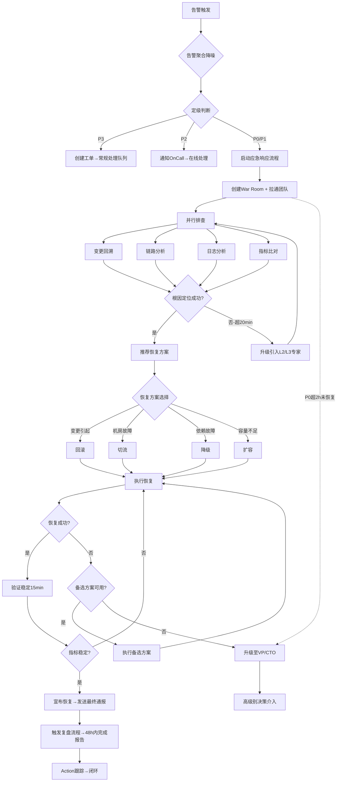

# 故障响应标准操作流程 (SOP)

## 1. 概述

本SOP定义了生产环境故障从告警触发到复盘闭环的全生命周期标准操作流程。适用于P0-P3所有等级的故障事件处理，核心目标是将MTTR（平均恢复时间）控制在SLA约束范围内，同时确保响应过程规范、可追溯、可复盘。

### 1.1 适用范围
- 生产环境所有故障事件（含性能劣化、服务不可用、数据异常、依赖故障）
- 所有OnCall团队和参与故障响应的工程师
- 7×24小时全时段覆盖

### 1.2 故障等级定义

| 等级 | 定义 | 响应时效 | 恢复时效 | 通报频率 |
|------|------|----------|----------|----------|
| P0 | 全站不可用/核心交易链路中断 | ≤5分钟 | ≤4小时 | 每30分钟 |
| P1 | 核心功能不可用/影响>10%用户 | ≤15分钟 | ≤2小时 | 每1小时 |
| P2 | 非核心功能异常/影响<10%用户 | ≤30分钟 | ≤8小时 | 恢复时通报 |
| P3 | 轻微问题/单点异常 | ≤2小时 | 下个工作日 | 无需通报 |

---

## 2. RACI职责矩阵

| 流程步骤 | 告警分诊Agent | 故障指挥Agent | 根因分析Agent | 复盘报告Agent | OnCall工程师 | 管理层 |
|----------|:---:|:---:|:---:|:---:|:---:|:---:|
| 告警接收与聚合 | **R/A** | I | - | - | I | - |
| 告警定级 | **R/A** | C | - | - | C | - |
| 告警路由通知 | **R/A** | I | - | - | I | I |
| 应急流程启动 | I | **R/A** | I | - | I | I |
| War Room创建 | - | **R/A** | I | - | I | I |
| 排查任务分配 | - | **R/A** | C | - | I | - |
| 变更回溯分析 | - | I | **R/A** | - | C | - |
| 链路追踪分析 | - | I | **R/A** | - | C | - |
| 日志分析 | - | I | **R/A** | - | C | - |
| 恢复方案推荐 | - | C | **R/A** | - | C | - |
| 恢复决策审批 | - | **R/A** | C | - | I | C(P0) |
| 恢复操作执行 | - | I | C | - | **R/A** | - |
| 恢复验证 | - | **R/A** | C | - | R | - |
| 进展通报 | - | **R/A** | C | - | I | I |
| 升级决策 | - | **R/A** | C | - | I | I |
| 故障关闭宣告 | - | **R/A** | I | I | I | I |
| 时间线重建 | - | C | C | **R/A** | C | - |
| 5-Why分析 | - | C | C | **R/A** | C | - |
| 影响面量化 | - | C | - | **R/A** | C | - |
| 复盘报告撰写 | - | C | C | **R/A** | C | I |
| 改进Action跟踪 | - | - | - | **R/A** | I | I |

> R=Responsible（执行者）, A=Accountable（问责者）, C=Consulted（咨询者）, I=Informed（知悉者）

---

## 3. SOP-1: 告警响应流程

### 3.1 触发条件
- 任何监控系统（Prometheus/Zabbix/云监控/APM/用户反馈）产生的告警事件

### 3.2 操作步骤

```
步骤1: 告警接收 [时效≤1分钟]
├── 动作: 从告警通道实时接收原始告警
├── 执行者: 告警分诊Agent
├── 输出: 标准化告警事件
└── 异常处理: 告警通道中断 → 切换备用通道 + 通知运维团队检修

步骤2: 告警聚合降噪 [时效≤2分钟]
├── 动作:
│   ├── 5分钟滑动窗口聚合
│   ├── 服务拓扑关联分析
│   ├── 重复告警抑制
│   └── 告警风暴检测（>50条/5min）
├── 执行者: 告警分诊Agent
├── 输出: 聚合后的故障事件（数量通常降低80-95%）
└── 异常处理: 拓扑数据不可用 → 降级为纯时间窗口聚合

步骤3: 故障定级 [时效≤2分钟]
├── 动作:
│   ├── 影响面评估（用户数/功能/数据）
│   ├── 定级矩阵匹配
│   ├── 加权因子调整（高峰期/恶化趋势）
│   └── 输出定级结果及依据
├── 执行者: 告警分诊Agent
├── 输出: P0/P1/P2/P3定级结果 + 定级依据
└── 异常处理: 信息不足无法定级 → 按偏高级别处理 + 标记"待确认"

步骤4: 路由通知 [时效≤1分钟]
├── 动作:
│   ├── 查询OnCall排班确定通知目标
│   ├── 按等级选择通知渠道（P0:电话+IM | P1:电话+IM | P2:IM | P3:工单）
│   ├── 发送通知并启动确认计时器
│   └── P0/P1: 同时启动应急响应流程
├── 执行者: 告警分诊Agent
├── 输出: 通知发送确认 + 响应确认等待
└── 异常处理: OnCall未响应(P0>5min/P1>15min) → 自动升级至L2
```

### 3.3 质量检查点

| 指标 | 目标值 | 度量方式 |
|------|--------|----------|
| 告警准确率 | ≥90% | 聚合后事件中真实故障占比 |
| 告警噪声比 | ≤30% | 被过滤的噪声告警 / 总告警 |
| P0漏报率 | =0 | 事后确认为P0但未正确定级的数量 |
| 告警-定级时效 | ≤5分钟 | 从首条告警到定级完成的时间 |
| OnCall响应率 | ≥95% | 在规定时间内确认响应的比例 |

---

## 4. SOP-2: 应急响应流程

### 4.1 触发条件
- 告警分诊Agent定级为P0或P1的故障事件

### 4.2 操作步骤

```
步骤1: 应急启动 [时效≤5分钟]
├── 动作:
│   ├── 创建War Room（命名: [P0/P1] 故障简述 - 日期时间）
│   ├── 拉通必要参与方（OnCall/领域专家/业务TL）
│   ├── 发布群公告（故障摘要/当前状态/角色分工）
│   └── 发出首次通报
├── 执行者: 故障指挥Agent
├── 输出: War Room创建完成 + 首次通报发出
└── 异常处理: IM系统不可用 → 使用电话会议桥接

步骤2: 团队拉通与分工 [时效≤10分钟]
├── 动作:
│   ├── 确认各排查方向的负责人
│   ├── 分配具体排查任务（变更回溯/日志分析/链路追踪/指标分析）
│   ├── 确认排查人员已就位
│   └── 建立信息同步机制（每10分钟在群内同步进展）
├── 执行者: 故障指挥Agent
├── 输出: 任务分配确认表
└── 异常处理: 关键人员不可达 → 启动备份人员 + 升级通知

步骤3: 并行排查 [时效≤30分钟(P0)]
├── 动作:
│   ├── 方向1: 变更回溯（检查24h内所有变更）
│   ├── 方向2: 调用链分析（定位异常节点）
│   ├── 方向3: 日志检索（错误模式匹配）
│   ├── 方向4: 指标比对（异常时间点的指标变化）
│   └── 每个方向10分钟内给出初步结论
├── 执行者: 根因分析Agent + OnCall工程师
├── 输出: 各方向排查结论
└── 异常处理: 所有方向均无线索(>20min) → 升级引入L2专家

步骤4: 恢复决策 [时效≤5分钟]
├── 动作:
│   ├── 汇总排查结论确定根因（或最可能原因）
│   ├── 生成恢复方案（含风险评估和预计时间）
│   ├── P0方案需故障指挥官审批
│   └── 确认恢复执行计划
├── 执行者: 故障指挥Agent（决策）+ 根因分析Agent（方案）
├── 输出: 确认的恢复方案 + 执行计划
└── 异常处理: 根因不明确 → 先止血（降级/限流）再继续排查

步骤5: 恢复执行与验证 [时效视方案而定]
├── 动作:
│   ├── 按方案步骤执行恢复操作
│   ├── 实时监控核心指标变化
│   ├── 验证标准: 核心指标恢复至基线±10%
│   ├── 观察稳定期: 恢复后持续观察15分钟确认稳定
│   └── 若恢复失败 → 执行备选方案
├── 执行者: OnCall工程师（执行）+ 故障指挥Agent（监督验证）
├── 输出: 恢复确认 或 备选方案启动
└── 异常处理: 恢复失败 → 5分钟内启动备选方案；所有方案失败 → 升级至L3/VP

步骤6: 故障关闭 [时效≤10分钟]
├── 动作:
│   ├── 确认所有核心指标恢复正常
│   ├── 在War Room发布恢复确认
│   ├── 发送最终通报（含影响摘要和后续安排）
│   ├── 标记故障工单状态为"已恢复"
│   └── 触发复盘流程（48h内完成复盘）
├── 执行者: 故障指挥Agent
├── 输出: 最终通报 + 复盘触发
└── 异常处理: 恢复后10分钟内复发 → 重新进入排查流程（不关闭）
```

### 4.3 进展通报机制

| 通报类型 | 频率 | 受众 | 内容要点 |
|----------|------|------|----------|
| 首次通报 | 启动后10min内 | 全员 | 故障概述、影响面、团队安排 |
| 定时通报 | P0每30min / P1每60min | 管理层+技术 | 进展、下一步、预计恢复时间 |
| 状态变更通报 | 即时 | 全员 | 发现根因/开始恢复/恢复成功 |
| 最终通报 | 恢复后10min内 | 全员 | 恢复确认、影响总结、后续安排 |

### 4.4 质量检查点

| 指标 | 目标值 | 度量方式 |
|------|--------|----------|
| P0响应时间 | ≤5分钟 | 告警确认到War Room创建 |
| 团队拉通时效 | ≤10分钟 | War Room创建到核心人员就位 |
| 进展通报覆盖率 | 100% | 按频率应发通报数 vs 实际发出数 |
| 恢复验证通过率 | 100% | 宣布恢复后无立即复发 |
| MTTR-P0 | ≤30分钟 | 从告警到恢复确认的时间 |
| MTTR-P1 | ≤2小时 | 从告警到恢复确认的时间 |

---

## 5. SOP-3: 根因分析流程

### 5.1 触发条件
- 故障指挥Agent分配排查任务后启动
- 适用于所有P0/P1故障，P2/P3按需执行

### 5.2 操作步骤

```
步骤1: 变更回溯 [时效≤10分钟]
├── 动作:
│   ├── 检索故障前24小时内所有变更记录
│   ├── 分析时间相关性（变更完成→故障出现的时间差）
│   ├── 分析影响面匹配度（变更服务 vs 故障服务）
│   ├── 检查变更内容（高风险代码修改/配置变更）
│   └── 输出变更关联分析结论
├── 执行者: 根因分析Agent
├── 输出: 变更关联度评估（确认/高度可疑/可能/排除）
└── 异常处理: 变更管理系统不可用 → 人工查询发布记录

步骤2: 调用链分析 [时效≤10分钟]
├── 动作:
│   ├── 采集异常Trace样本（20-50条）
│   ├── 分析调用链拓扑，定位异常节点
│   ├── 识别故障传播路径（从根源到表面）
│   ├── 对比正常Trace和异常Trace的差异
│   └── 定位具体的异常服务和接口
├── 执行者: 根因分析Agent
├── 输出: 异常节点定位 + 故障传播路径
└── 异常处理: APM数据缺失 → 通过日志和指标间接推断

步骤3: 日志分析 [时效≤10分钟]
├── 动作:
│   ├── 检索受影响服务的ERROR/FATAL日志
│   ├── 识别错误模式（新增错误/突增/级联）
│   ├── 分析错误堆栈定位代码位置
│   ├── 通过RequestID关联跨服务日志
│   └── 确定错误首次出现时间
├── 执行者: 根因分析Agent
├── 输出: 错误模式分析 + 代码定位
└── 异常处理: 日志量过大超时 → 缩小时间范围 + 增加过滤条件

步骤4: 历史模式比对 [时效≤5分钟]
├── 动作:
│   ├── 检索知识库中相似的历史故障
│   ├── 比对当前故障特征与历史模式的匹配度
│   ├── 如匹配到已知模式，获取历史解决方案
│   └── 评估历史方案的适用性
├── 执行者: 根因分析Agent
├── 输出: Top5相似历史故障 + 历史解决方案（如有匹配）
└── 异常处理: 知识库无匹配 → 标记为新类型故障

步骤5: 综合研判与方案输出 [时效≤5分钟]
├── 动作:
│   ├── 汇总各排查方向的结论
│   ├── 确定最终根因判断（含置信度评分）
│   ├── 生成恢复方案建议（含多方案对比）
│   ├── 评估各方案风险和恢复时间
│   └── 输出结构化的根因分析报告
├── 执行者: 根因分析Agent
├── 输出: 根因分析报告 + 恢复方案推荐
└── 异常处理: 置信度低(无法确定根因) → 推荐先止血方案 + 继续深度排查
```

### 5.3 质量检查点

| 指标 | 目标值 | 度量方式 |
|------|--------|----------|
| 根因定位准确率 | ≥80% | 复盘确认的根因 vs 排查时的结论 |
| P0平均定位时间 | ≤30分钟 | 从开始排查到确认根因 |
| 恢复方案可执行率 | ≥95% | 推荐方案能成功执行的比例 |
| 变更回溯覆盖率 | 100% | 24h内变更全部被检索 |
| 知识库匹配率 | ≥30% | 能匹配到历史相似故障的比例 |

---

## 6. SOP-4: 复盘报告流程

### 6.1 触发条件
- 所有P0/P1故障恢复后自动触发
- P2故障按需触发（连续发生或影响较大时）
- 触发后48小时内必须完成

### 6.2 操作步骤

```
步骤1: 时间线整理 [时效≤4小时]
├── 动作:
│   ├── 采集多源数据（告警/聊天/操作日志/通报记录）
│   ├── 标准化为时间线条目（精确到分钟）
│   ├── 按时序排列并划分阶段
│   ├── 计算各阶段耗时
│   └── 标注关键里程碑和决策点
├── 执行者: 复盘报告Agent
├── 输出: 完整故障时间线
└── 异常处理: 记录缺失 → 通过参与者访谈补充

步骤2: 影响面量化 [时效≤4小时]
├── 动作:
│   ├── 确定影响时间窗口
│   ├── 统计受影响用户数/交易数
│   ├── 估算业务损失金额
│   ├── 评估SLA消耗情况
│   └── 分维度统计（地域/功能/时段）
├── 执行者: 复盘报告Agent
├── 输出: 影响面量化报告
└── 异常处理: 业务数据获取困难 → 基于监控数据估算 + 标注"待精确确认"

步骤3: 5-Why根因分析 [时效≤8小时]
├── 动作:
│   ├── 从技术直接原因开始逐层追溯
│   ├── 至少分析3条因果链（发生/检测/恢复）
│   ├── 每层追问至少3层（推荐5层）
│   ├── 每层附带证据支撑
│   └── 区分直接原因和系统性根因
├── 执行者: 复盘报告Agent（协同根因分析Agent + 相关工程师）
├── 输出: 5-Why分析树
└── 异常处理: 某些层级证据不足 → 标注"待确认" + 安排后续验证

步骤4: 改进措施制定 [时效≤8小时]
├── 动作:
│   ├── 基于5-Why各层级制定对应改进措施
│   ├── 分类: 短期止血(1周)/中期加固(1月)/长期预防(1季度)
│   ├── 每个Action指定Owner和Deadline
│   ├── 定义验收标准
│   └── 控制总数在5-8个
├── 执行者: 复盘报告Agent（协同相关Team Lead确认Owner）
├── 输出: Action列表
└── 异常处理: 无法确定Owner → 升级至部门负责人分配

步骤5: 报告评审与发布 [时效≤48小时内完成]
├── 动作:
│   ├── 组装完整复盘报告
│   ├── 参与者Review确认事实准确性
│   ├── 管理层审阅
│   ├── 发布至故障知识库
│   └── 开启Action跟踪
├── 执行者: 复盘报告Agent
├── 输出: 正式复盘报告 + Action跟踪启动
└── 异常处理: 事实争议 → 组织复盘会议当面讨论

步骤6: Action跟踪闭环 [持续至所有Action完成]
├── 动作:
│   ├── 按频率跟进各Action进度
│   ├── 逾期提醒和升级
│   ├── 完成验证
│   └── 输出Action完成率统计
├── 执行者: 复盘报告Agent
├── 输出: Action跟踪报表
└── 异常处理: Action长期阻塞 → 评估是否调整方案或分拆
```

### 6.3 质量检查点

| 指标 | 目标值 | 度量方式 |
|------|--------|----------|
| 报告完成时效 | ≤48小时 | 从故障恢复到报告发布 |
| 时间线完整度 | ≥95% | 关键节点无遗漏 |
| 5-Why深度 | ≥3层 | 因果链追溯层数 |
| Action SMART合规率 | 100% | 每个Action符合SMART原则 |
| Action完成率 | ≥90% | 在Deadline内完成的比例 |
| 同类故障重复率 | 季度下降≥50% | 同一根因再次引发故障 |

---

## 7. 决策树



---

## 8. 升级机制

### 8.1 自动升级触发条件

| 条件 | 升级目标 | 升级动作 |
|------|----------|----------|
| OnCall 5分钟未响应(P0) | L2领域专家 | 电话通知 + War Room邀请 |
| OnCall 15分钟未响应(P1) | L2领域专家 | 电话通知 |
| 排查20分钟无进展(P0) | L2/L3架构师 | 电话通知 + 技术升级 |
| P0恢复超30分钟 | 部门总监 | 通报 + 请求资源支持 |
| P0恢复超2小时 | VP/CTO | 通报 + 重大决策 |
| 恢复方案全部失败 | L3 + VP | 电话会议 + 全局决策 |

### 8.2 降级条件
- 定级后排查发现实际影响面小于预估 → 可降级处理
- 降级需要故障指挥官审批并在时间线中记录原因

---

## 9. KPI指标体系

### 9.1 核心指标

| 指标名称 | 目标值 | 统计周期 | 数据来源 |
|----------|--------|----------|----------|
| MTTR (P0) | ≤30分钟 | 月度 | 故障工单系统 |
| MTTR (P1) | ≤2小时 | 月度 | 故障工单系统 |
| MTTA (P0) | ≤5分钟 | 月度 | 告警系统 |
| 故障SLA达成率 | ≥99% | 月度 | 故障工单系统 |
| 告警准确率 | ≥90% | 周度 | 告警分析报表 |
| 告警噪声比 | ≤30% | 周度 | 告警分析报表 |
| 根因定位准确率 | ≥80% | 月度 | 复盘报告 |
| 复盘按时完成率 | 100% | 月度 | 复盘系统 |
| Action闭环率 | ≥90% | 季度 | Action跟踪系统 |
| 同类故障重复率 | 季度降≥30% | 季度 | 故障知识库 |

### 9.2 过程指标

| 指标名称 | 目标值 | 用途 |
|----------|--------|------|
| War Room创建时效 | ≤5分钟 | 评估应急启动速度 |
| 进展通报准时率 | 100% | 评估信息同步质量 |
| 参与人员就位时效 | ≤10分钟 | 评估团队响应能力 |
| 恢复方案决策时效 | ≤5分钟 | 评估决策效率 |
| 知识库沉淀率 | 100% P0/P1故障 | 评估知识管理 |

---

## 10. 异常场景处理

### 10.1 告警风暴
- 定义：5分钟内相关告警>50条
- 处理：激活告警风暴模式 → 仅关注根源告警 → 批量抑制级联告警 → 待根源恢复后批量清除

### 10.2 夜间/节假日故障
- OnCall值班制度7×24覆盖
- 夜间P2及以下不电话通知（避免打扰）
- 节假日P0/P1响应标准不变

### 10.3 多故障并发
- 优先处理高等级故障
- 若资源冲突，P0优先征用所有必要资源
- 多个P0并发 → 按业务影响大小排序 + 立即升级至VP统一协调

### 10.4 故障复发
- 恢复宣布后30分钟内复发 → 重新进入排查流程，不重新定级
- 恢复宣布后24小时内复发 → 视为同一故障，复盘中需重点分析恢复方案有效性
- 超过24小时后复发 → 视为新故障，但复盘中需关联分析

---

## 11. 持续改进机制

### 11.1 月度故障回顾会
- 频率：每月第一周
- 参与者：运维团队全员 + 相关开发TL
- 内容：月度故障趋势、Top故障分析、Action执行情况、流程优化议题

### 11.2 季度故障预防评估
- 分析季度内故障类型分布和趋势
- 评估Action落地后的效果（同类故障是否减少）
- 识别新的系统性风险并制定预防计划
- 更新告警规则和巡检项目

### 11.3 年度SLA回顾
- 各服务年度可用性统计
- 故障MTTR趋势分析
- 与行业基准对标
- 制定下一年度改进目标
