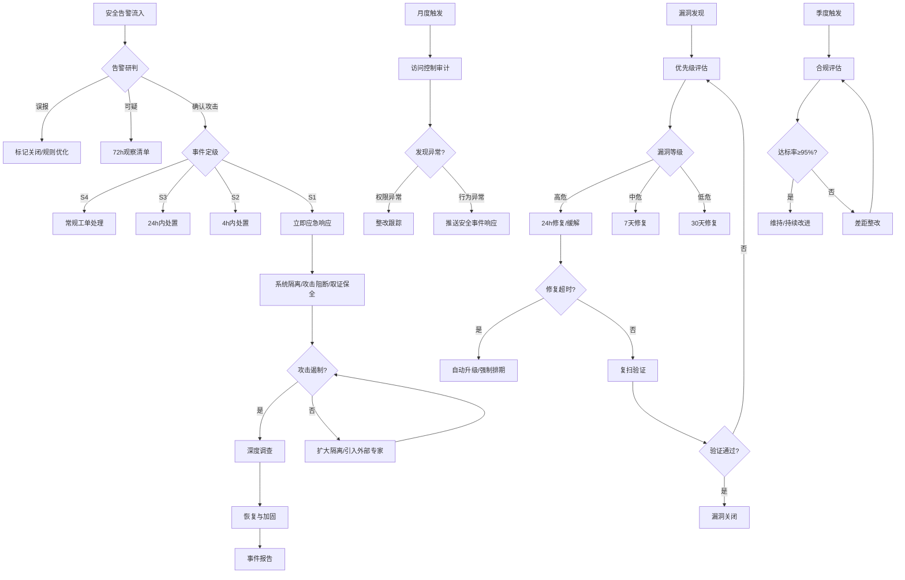

# 安全运维标准操作规程 (Security Operations SOP)

## 1. 文档概述

本SOP定义了安全运维体系的四大核心流程：安全事件响应、漏洞全生命周期管理、访问控制审计、合规持续验证。适用于所有等保2.0三级及以上系统的安全运营工作。

### 适用范围
- 所有生产环境安全事件的检测和响应
- 所有系统和应用的漏洞管理
- 所有特权账号和访问控制的审计管理
- 等保2.0合规的持续验证和评测准备

### 关键角色定义
| 角色 | 职责 | 代表Agent |
|------|------|-----------|
| 安全事件响应者 | 告警研判、应急处置协调 | security-event-agent |
| 漏洞管理者 | 漏洞评估、修复跟踪 | vulnerability-management-agent |
| 访问控制审计者 | 权限审计、特权管控 | access-control-agent |
| 合规审计者 | 合规验证、整改跟踪 | compliance-audit-agent |
| CISO | 安全决策、事件升级接收人 | 人工 |
| 资产Owner | 负责具体系统的漏洞修复 | 人工 |

---

## 2. RACI 责任矩阵

| 流程步骤 | 安全事件响应Agent | 漏洞管理Agent | 访问控制审计Agent | 合规审计Agent | CISO | 资产Owner |
|----------|:-:|:-:|:-:|:-:|:-:|:-:|
| **安全事件响应** |||||||
| 告警接收与关联分析 | R/A | - | - | - | I | - |
| 威胁研判与定级 | R/A | - | C | - | I(S1/S2) | - |
| 应急处置协调 | R/A | - | - | - | A(S1) | C |
| 取证保全 | R | - | - | - | A(S1) | C |
| 事件报告编写 | R | - | - | I | A | I |
| **漏洞管理** |||||||
| 漏洞发现与整合 | - | R/A | - | I | - | - |
| 优先级评估 | C | R/A | - | - | I(高危) | C |
| 修复方案制定 | - | R/A | - | - | - | C |
| 修复执行 | - | C | - | - | - | R/A |
| 复扫验证 | - | R/A | - | - | - | I |
| **访问控制审计** |||||||
| 特权账号清单核对 | - | - | R/A | I | I | C |
| 权限合理性审查 | - | - | R/A | I | - | C |
| 密码策略合规检查 | - | - | R/A | I | - | - |
| 异常行为检测 | C | - | R/A | - | I(高危) | - |
| 审计报告输出 | - | - | R/A | C | I | I |
| **合规持续验证** |||||||
| 控制项基线检查 | - | I | I | R/A | I | C |
| 差距分析 | - | C | C | R/A | I | - |
| 整改计划制定 | - | C | C | R/A | A | R |
| 证据收集 | C | C | C | R/A | - | C |
| 等保复评准备 | I | C | C | R/A | A | C |

> R=Responsible(执行)  A=Accountable(问责)  C=Consulted(咨询)  I=Informed(知会)

---

## 3. SOP-1: 安全事件响应流程

### 3.1 流程目标
确保所有安全事件在SLA时间内得到有效处置，最小化业务影响和数据损失。

### 3.2 触发条件
- SIEM/SOC平台产生安全告警
- WAF/IDS/HIDS/EDR检测到异常行为
- 外部安全情报通报受影响
- 内部人员举报可疑活动
- 日常巡检Scope推送的安全相关异常

### 3.3 流程步骤

#### 步骤1：告警接收与关联分析（SLA: ≤15分钟完成研判）
**执行者**：安全事件响应Agent
**动作**：
1. 接收多源告警数据（WAF/IDS/HIDS/EDR/SIEM）
2. 执行告警去重和富化（补充资产信息、威胁情报）
3. 基于时间窗口和网络拓扑进行告警关联
4. 映射到MITRE ATT&CK框架分析攻击TTP

**输出**：关联分析结果、初步研判报告
**质量检查点**：
- 研判完成时间≤15分钟
- 关联分析覆盖±30分钟时间窗口
- 威胁情报查询覆盖率100%

#### 步骤2：威胁研判与事件定级
**执行者**：安全事件响应Agent
**动作**：
1. 综合时间/空间/行为维度判定告警真伪
2. 确认为攻击的，确定攻击类型和影响范围
3. 按照S1-S4标准执行事件分级
4. 给出置信度评分

**输出**：研判结论（确认攻击/可疑/误报）、事件等级
**决策树**：
```
研判结论?
├── 误报 → 标记关闭 + 反馈规则优化建议 → 流程结束
├── 可疑 → 加入72小时观察清单 → 持续监控
└── 确认攻击 → 事件定级
    ├── S4(低风险) → 创建工单 → 常规处理（24h）
    ├── S3(中风险) → 通知安全工程师 → 24h内处置
    ├── S2(高风险) → 4h内处置 → 通知安全负责人
    └── S1(严重) → 立即启动应急响应 → 1h内上报CISO
```

**质量检查点**：
- S1事件1小时内上报率 = 100%
- 误报标记反馈率≥90%
- 研判置信度评分与实际结果吻合率≥85%

#### 步骤3：应急处置（S1/S2事件）
**执行者**：安全事件响应Agent
**动作**：
1. 创建安全事件工单（SEC-YYYYMMDD-序号）
2. 建立应急通信群，拉通安全团队和受影响系统Owner
3. 协调执行即时处置：
   - 网络隔离（ACL阻断，保持系统运行）
   - 攻击源封禁（IP/域名/端口）
   - 取证现场保留（日志快照/内存dump/磁盘镜像）
4. S1事件≤1小时内上报CISO

**输出**：事件工单、处置动作记录、CISO通报
**异常处理**：
- 攻击持续/横向移动发现 → 扩大隔离范围 → 考虑引入外部安全专家
- 涉及数据泄露 → 评估泄露范围 → 评估是否触发72小时通知义务
- 无法确定影响范围 → 保守隔离 → 逐步缩小范围

**质量检查点**：
- 隔离操作≤15分钟完成
- 取证现场完整性（关键日志无缺失）
- 处置动作全部有记录可追溯

#### 步骤4：深度调查
**执行者**：安全事件响应Agent
**动作**：
1. 攻击链还原（入侵路径/利用漏洞/横向移动/持久化机制）
2. 数据泄露范围评估（泄露数据类型/数量/敏感级别）
3. 受影响资产完整清单确认
4. 攻击者画像（技术水平/动机/是否为APT）

**输出**：深度调查报告

#### 步骤5：恢复与加固
**执行者**：安全事件响应Agent + 资产Owner
**动作**：
1. 清除攻击者的所有持久化机制（后门/Webshell/计划任务/异常账号）
2. 修复被利用的漏洞
3. 加固安全配置
4. 验证清除完整性（复查确认无残留）
5. 逐步恢复系统服务

**输出**：恢复确认报告、加固措施清单

#### 步骤6：事件报告（SLA: 48小时内）
**执行者**：安全事件响应Agent
**动作**：
1. 编写结构化事件报告：
   - 事件概述（时间/类型/影响）
   - 时间线（精确到分钟）
   - 技术分析（攻击向量/利用漏洞/攻击链）
   - 影响评估（数据/业务/合规影响）
   - 处置过程记录
   - 改进建议（监控/防护/流程）
2. 报告提交CISO审核
3. 改进Action录入跟踪系统

**输出**：安全事件报告、改进Action清单
**质量检查点**：
- 报告完成时效≤48h
- 报告质量评分≥4/5
- 改进Action有明确Owner和Deadline

---

## 4. SOP-2: 漏洞管理流程

### 4.1 流程目标
确保所有漏洞在规定时效内得到修复或有效缓解，组织暴露面持续收敛。

### 4.2 触发条件
- 每周定期漏洞扫描完成
- 安全情报订阅推送新漏洞通告
- 季度渗透测试报告交付
- 安全事件中发现被利用的漏洞

### 4.3 流程步骤

#### 步骤1：漏洞发现与整合
**执行者**：漏洞管理Agent
**动作**：
1. 导入自动化扫描结果（Nessus/OpenVAS）
2. 整合安全情报（CNVD/CVE/厂商通告）
3. 纳入渗透测试发现
4. 执行漏洞去重（基于CVE/CWE/资产指纹）
5. 确认漏洞真实性（排除扫描误报）

**输出**：确认的漏洞清单
**质量检查点**：
- 扫描结果24h内完成整合
- 去重准确率≥95%
- 高危漏洞情报4h内完成确认

#### 步骤2：优先级评估
**执行者**：漏洞管理Agent
**动作**：
1. CVSS评分采集
2. 资产重要性查询（CMDB）
3. 可利用性评估（PoC/EXP/在野利用状态）
4. 暴露面分析（互联网/内网/隔离环境）
5. 计算综合优先级得分
6. 攻击链分析（多漏洞组合路径）

**输出**：优先级排序的漏洞清单、修复SLA时间表
**决策树**：
```
综合优先级得分?
├── 高危(CVSS≥9.0或在野利用) → 24h内修复或缓解
├── 中危(CVSS 7.0-8.9) → 7天内修复
├── 低危(CVSS 4.0-6.9) → 30天内修复
└── 信息级(CVSS<4.0) → 纳入季度优化计划
```

#### 步骤3：修复方案制定
**执行者**：漏洞管理Agent
**动作**：
1. 确定可用修复选项（补丁/配置加固/虚拟补丁/网络隔离）
2. 评估各方案的兼容性风险和业务影响
3. 确定推荐方案和回退方案
4. 评估修复是否需要维护窗口
5. 确定修复Owner和Deadline
6. 通过变更管理Scope提交变更申请

**输出**：修复计划（含方案/Owner/Deadline/风险评估）
**异常处理**：
- 无可用补丁 → 实施虚拟补丁+网络隔离 → 持续跟踪厂商补丁
- 修复影响业务连续性 → 实施缓解措施 → 等待维护窗口正式修复
- 资产Owner拒绝修复 → 风险接受流程 → CISO审批

#### 步骤4：修复执行跟踪
**执行者**：漏洞管理Agent + 资产Owner
**动作**：
1. 跟踪修复进度（每日检查高危/每周检查中危）
2. 对接近Deadline未修复的发出提醒
3. 超时未修复触发升级：
   - 第1次超时（+24h）→ 邮件提醒Owner
   - 第2次超时（+48h）→ 升级至Team Lead
   - 第3次超时（+7天）→ 升级至CISO
4. 评估是否需要临时缓解措施

**输出**：修复进度看板、升级记录
**质量检查点**：
- 高危漏洞24h修复率≥95%
- 中危漏洞7天修复率≥90%
- 超时升级及时率100%

#### 步骤5：修复验证
**执行者**：漏洞管理Agent
**动作**：
1. 对已修复的漏洞执行复扫验证
2. 确认漏洞已被有效修复（非仅标记关闭）
3. 验证修复未引入新问题（回归检查）
4. 验证通过 → 关闭漏洞
5. 验证失败 → 重新开放 → 回到步骤3

**输出**：验证报告、漏洞关闭确认
**质量检查点**：
- 修复验证覆盖率 = 100%
- 漏洞重开率≤5%

---

## 5. SOP-3: 访问控制审计流程

### 5.1 流程目标
确保组织的访问控制体系持续符合最小权限原则和等保合规要求，特权账号管理无遗漏。

### 5.2 触发条件
- 月度定期审计触发（每月第一个工作日）
- 人事变动事件（离职/调岗/入职）
- 安全事件中发现的权限相关问题
- 等保复评前的专项审计

### 5.3 流程步骤

#### 步骤1：特权账号清单核对
**执行者**：访问控制审计Agent
**动作**：
1. 从各系统（AD/LDAP/Linux/数据库/云平台）提取当前特权账号
2. 与已维护的特权账号清单进行比对
3. 标注新增的未记录特权账号（需确认合法性）
4. 标注已删除但清单未更新的废弃记录
5. 验证每个特权账号有明确的Owner和用途说明

**输出**：特权账号清单差异报告
**质量检查点**：
- 特权账号清单准确率 = 100%
- 未记录特权账号 = 0（发现即整改）

#### 步骤2：权限合理性审查
**执行者**：访问控制审计Agent
**动作**：
1. 检查是否存在权限过大（超出工作所需）
2. 检查是否存在职责分离冲突
3. 检查离职人员账号是否及时停用
4. 检查调岗人员旧权限是否回收
5. 检查长期未使用（>90天）的特权账号

**输出**：权限异常清单
**决策树**：
```
发现异常类型?
├── 离职账号未停用 → 立即停用(24h内) → 高优先级整改
├── 权限过大 → 通知Owner确认 → 7天内完成权限收缩
├── 职责分离冲突 → 评估风险 → 30天内调整
├── 长期未使用 → Owner确认是否需要 → 7天内处理
└── 未授权的新增特权 → 推送给安全事件响应Agent → 威胁研判
```

#### 步骤3：密码策略合规检查
**执行者**：访问控制审计Agent
**动作**：
1. 检查特权账号最后密码修改时间（90天轮换策略）
2. 标注即将过期（15天内）和已过期的账号
3. 对已过期账号执行强制轮换
4. 验证密码复杂度满足要求（≥16位/多类字符）
5. 检查MFA启用状态

**输出**：密码合规状态报告、轮换执行记录
**质量检查点**：
- 密码过期账号 = 0（零容忍）
- MFA覆盖率：核心系统100%
- 轮换合规率目标100%

#### 步骤4：异常行为分析
**执行者**：访问控制审计Agent
**动作**：
1. 分析非工作时间的特权操作日志
2. 检测异地登录（Impossible Travel）
3. 监控批量数据导出行为
4. 检测暴力破解尝试
5. 高风险异常推送给安全事件响应Agent

**输出**：异常行为告警、风险评分
**质量检查点**：
- 异常检测覆盖所有特权账号
- 高风险异常推送时效≤15分钟

#### 步骤5：审计报告与整改跟踪
**执行者**：访问控制审计Agent
**动作**：
1. 汇总审计发现生成月度审计报告
2. 为每个发现项指定整改Owner和Deadline
3. 跟踪上期审计整改项的执行情况
4. 计算权限合规率和趋势变化
5. 将IAM合规数据提交给合规审计Agent

**输出**：月度访问控制审计报告、整改跟踪表
**质量检查点**：
- 离职账号24h内停用率 = 100%
- 审计发现整改闭环率≥95%

---

## 6. SOP-4: 合规持续验证流程

### 6.1 流程目标
维持等保2.0三级合规状态的持续有效性，确保年度复评一次通过率≥95%。

### 6.2 触发条件
- 季度定期合规评估（每季度第一周）
- 法规/标准更新发布
- 等保复评前90天启动预审
- 重大安全事件后的合规影响评估
- 新系统上线前的合规验收

### 6.3 流程步骤

#### 步骤1：控制项清单梳理
**执行者**：合规审计Agent
**动作**：
1. 确认当前等保2.0三级控制项基线（240+项）
2. 检查是否有法规更新需要调整基线
3. 确认检查范围内的系统清单
4. 区分技术控制项和管理控制项
5. 确定自动化检查项和人工检查项

**输出**：本次评估的控制项清单和检查计划

#### 步骤2：技术控制项自动化检查
**执行者**：合规审计Agent
**动作**：
1. 执行自动化合规扫描（覆盖≥70%技术控制项）
2. 检查维度：
   - 安全通信网络：TLS配置/加密强度/证书有效期
   - 安全区域边界：防火墙策略/IDS状态/恶意代码防护
   - 安全计算环境：身份鉴别/访问控制/安全审计/入侵防范/数据保护
   - 安全管理中心：集中管控/日志集中
3. 收集检查证据（配置截图/扫描报告）

**输出**：自动化检查结果、技术证据
**质量检查点**：
- 自动化检查覆盖率≥70%
- 检查结果误报率≤5%

#### 步骤3：管理控制项人工验证
**执行者**：合规审计Agent
**动作**：
1. 验证安全管理制度文档的完整性和时效性
2. 验证安全组织机构的合规性
3. 检查安全人员管理（背景调查/保密协议/安全培训）
4. 验证安全建设管理（方案设计/产品采购/工程实施/测试验收）
5. 验证安全运维管理（环境管理/变更管理/备份恢复/事件处置）

**输出**：管理控制项验证结果、管理类证据

#### 步骤4：差距分析与整改计划
**执行者**：合规审计Agent
**动作**：
1. 汇总所有检查结果，标注达标/部分达标/不达标
2. 对不达标项分析差距原因
3. 评估差距风险等级（高/中/低）
4. 制定整改计划（每个项目含Owner/Deadline/验收标准）
5. 整改中的技术实施通过变更管理Scope执行

**输出**：差距分析报告、整改计划、合规状态仪表盘
**决策树**：
```
差距严重程度?
├── 高风险不达标 → 30天内整改 → CISO督办
├── 中风险不达标 → 60天内整改 → 安全负责人跟踪
├── 低风险不达标 → 90天内整改 → 常规跟踪
└── 部分达标 → 评估是否影响复评 → 制定提升计划
```

**质量检查点**：
- 合规达标率≥95%
- 高风险差距30天内关闭率≥100%
- 整改Action完成率≥90%

#### 步骤5：等保复评准备（年度，评测前90天启动）
**执行者**：合规审计Agent
**动作**：
1. 执行全量合规自查（所有控制项）
2. 收集整理全套证据材料
3. 对不合规项执行冲刺整改
4. 准备评测场地和配合人员安排
5. 进行内部预审（模拟评测流程）
6. 正式评测配合和问题答复
7. 评测后整改（如有）

**输出**：等保评测材料包、预审报告、评测结论
**质量检查点**：
- 等保复评一次通过率≥95%
- 证据材料完整率100%
- 预审自查覆盖率100%

---

## 7. 决策树总览



---

## 8. KPI 指标体系

### 8.1 安全事件响应指标
| 指标 | 目标值 | 计算方式 | 统计周期 |
|------|--------|----------|----------|
| S1事件响应时间 | ≤1小时 | 从确认到CISO上报的时间 | 每事件 |
| S2事件处置时间 | ≤4小时 | 从确认到遏制完成的时间 | 每事件 |
| 告警研判时效 | ≤15分钟 | 从告警接收到研判结论的时间 | 每告警 |
| 安全事件误报率 | ≤10% | 误报数/总研判数 | 月度 |
| 事件报告完成率 | 100% | 48h内完成报告/S1+S2事件数 | 月度 |
| 取证完整率 | 100% | 完整取证事件/需取证事件 | 每事件 |

### 8.2 漏洞管理指标
| 指标 | 目标值 | 计算方式 | 统计周期 |
|------|--------|----------|----------|
| 高危漏洞24h修复率 | ≥95% | 24h内修复的高危漏洞/高危漏洞总数 | 月度 |
| 中危漏洞7天修复率 | ≥90% | 7天内修复的中危漏洞/中危漏洞总数 | 月度 |
| 修复验证覆盖率 | 100% | 执行复扫的漏洞/已修复漏洞 | 月度 |
| 漏洞重开率 | ≤5% | 验证失败重开数/关闭数 | 月度 |
| 漏洞积压数 | 环比下降 | 超SLA未修复的漏洞数 | 月度 |

### 8.3 访问控制指标
| 指标 | 目标值 | 计算方式 | 统计周期 |
|------|--------|----------|----------|
| 特权账号清单准确率 | 100% | 已记录/实际存在 | 月度 |
| 密码轮换合规率 | 100% | 合规账号数/特权账号总数 | 月度 |
| 离职账号停用时效 | ≤24h | 从离职到账号停用的时间 | 每事件 |
| 权限审计覆盖率 | 100% | 已审计系统/应审计系统 | 月度 |
| 异常行为检出率 | 持续提升 | 检出的真实异常/总异常 | 季度 |

### 8.4 合规管理指标
| 指标 | 目标值 | 计算方式 | 统计周期 |
|------|--------|----------|----------|
| 等保合规达标率 | ≥95% | 达标控制项/总控制项 | 季度 |
| 自动化检查覆盖率 | ≥70% | 自动化检查项/技术控制项 | 季度 |
| 整改Action完成率 | ≥90% | 按时完成数/总Action数 | 季度 |
| 等保复评一次通过率 | ≥95% | 历史通过次数/历史评测次数 | 年度 |
| 安全设备日志完整率 | ≥99.9% | 完整日志天数/应有天数 | 月度 |
| 法规变更响应时效 | ≤7天 | 发布到影响评估完成的时间 | 每事件 |

---

## 9. 异常处理与升级机制

### 9.1 升级矩阵
| 场景 | 第一级处理 | 第一次升级(15min) | 第二次升级(1h) | 最终升级(2h) |
|------|-----------|-------------------|----------------|--------------|
| S1安全事件 | 安全事件响应Agent | 安全Team Lead | CISO | CTO/CEO |
| 高危漏洞超时未修复 | 漏洞管理Agent提醒 | 资产Owner Team Lead | 安全负责人 | CISO |
| 离职账号未及时停用 | 访问控制审计Agent | IT管理员 | IT负责人 | CISO |
| 合规高危差距 | 合规审计Agent | 整改Owner | 安全负责人 | CISO |

### 9.2 例外处理
- **漏洞风险接受**：当修复成本极高或可能导致核心业务中断时，Owner可申请风险接受，需CISO书面审批，并实施补偿控制措施，每90天复评一次。
- **密码轮换例外**：服务账号因系统限制无法自动轮换的，需记录在例外清单，实施补偿控制（如限制访问来源），每季度评估是否可消除例外。
- **合规N/A项**：因组织特性确实不适用的控制项，需要有明确的书面说明和CISO审批。

---

## 10. 跨Scope协作要点

| 协作场景 | 本Scope角色 | 协作Scope | 协作内容 |
|----------|------------|-----------|----------|
| 安全事件导致业务中断 | 安全处置协调 | 故障响应 | 安全信息提供+攻击遏制 |
| 系统隔离操作 | 发起隔离需求 | 变更管理 | 紧急变更执行 |
| 安全漏洞修复 | 制定修复方案 | 变更管理 | 变更审批和执行 |
| 安全相关异常告警 | 接收并研判 | 日常巡检与监控 | 异常发现推送 |
| 日志保留验证 | 验证合规性 | 日常巡检与监控 | 日志保留策略执行 |
| 变更安全审查 | 提供安全评估 | 变更管理 | 安全合规确认 |
