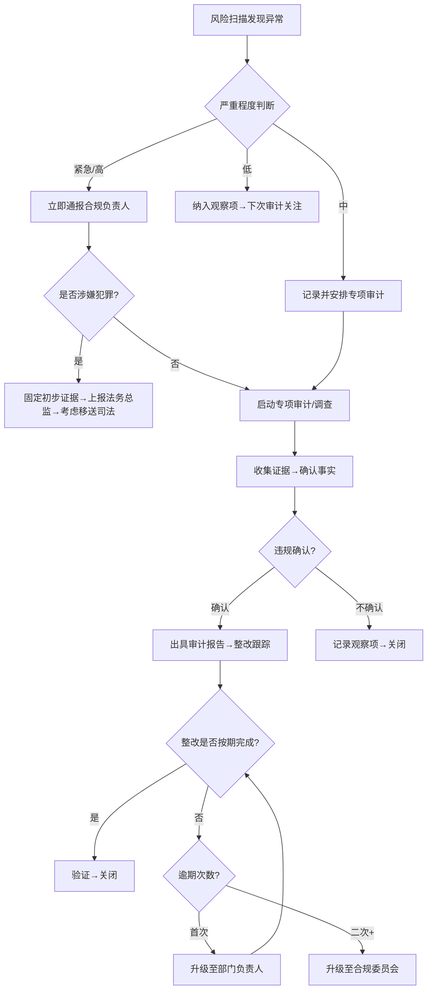
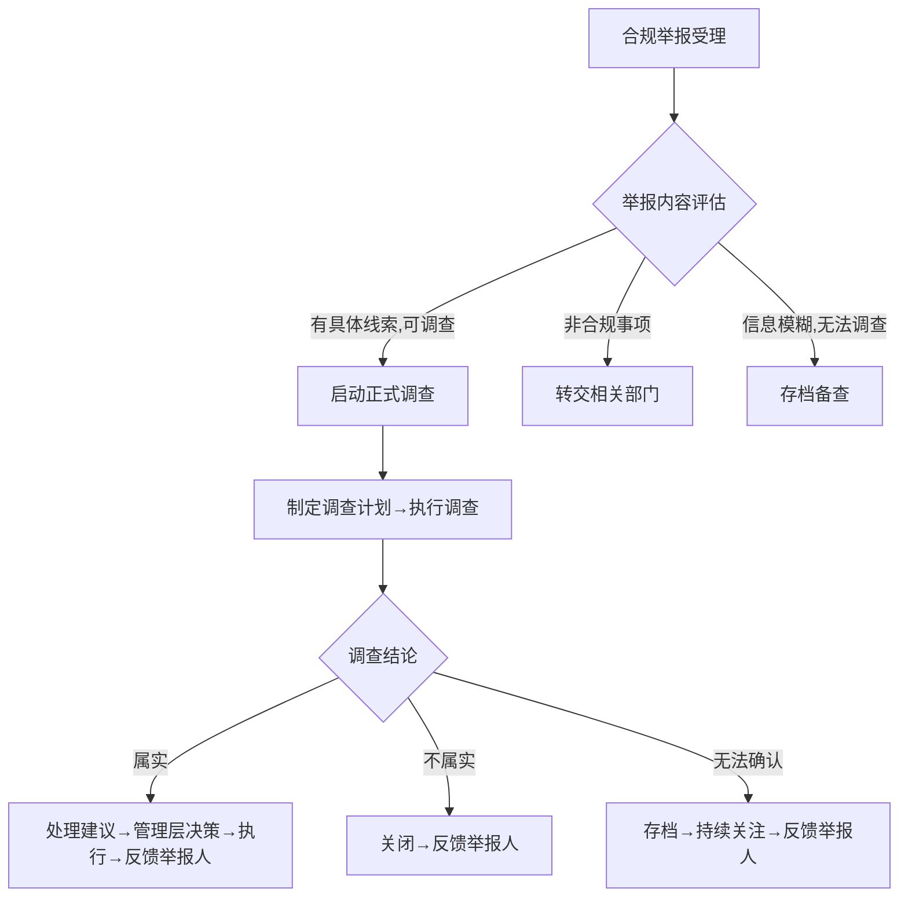

# 合规审计标准操作规程 (SOP)

## 1. 文档信息

| 项目 | 内容 |
|------|------|
| 文档编号 | SOP-CA-001 |
| 版本 | V1.0 |
| 适用范围 | 企业合规审计全流程 |
| 参照标准 | ISO 37301合规管理体系、IIA内部审计准则 |
| 核心周期 | 年度合规PDCA循环 |

---

## 2. RACI职责矩阵

| 流程步骤 | 合规风险扫描引擎 | 合规审计执行官 | 合规制度架构师 | 合规培训督导 | 合规委员会/管理层 | 被审计部门 |
|----------|:-:|:-:|:-:|:-:|:-:|:-:|
| P1-年度风险评估 | **R** | C | C | I | **A** | C |
| P2-审计计划编制 | C | **R** | I | I | **A** | I |
| P3-审计通知下达 | I | **R/A** | I | I | I | I |
| P4-资料收集 | I | **R** | I | I | I | **A** |
| P5-风险导向检查 | C | **R/A** | I | I | I | C |
| P6-证据固定 | I | **R/A** | I | I | I | I |
| P7-问题确认 | I | **R** | I | I | I | **A**(确认事实) |
| P8-报告编写 | I | **R/A** | C | I | I | C(意见) |
| P9-整改跟踪 | I | **R** | C(制度修订) | C(培训) | **A**(重大事项) | **R**(执行整改) |
| P10-制度更新 | **R**(触发) | C | **R/A** | C | A(审批) | C |
| P11-培训执行 | I | C(提供重点) | **R**(内容) | **R/A**(执行) | I | R(参训) |
| P12-年度合规报告 | C | **R** | C | C | **A** | I |

> R=Responsible(负责执行), A=Accountable(最终负责/审批), C=Consulted(咨询), I=Informed(知会)

---

## 3. 流程详细说明

### P1 - 年度合规风险评估

**触发条件：** 每年Q1启动（1月第二周），或重大法规变更/合规事件触发临时评估

**执行动作：**
1. 合规风险扫描引擎全面扫描企业合规风险暴露面
2. 收集各业务部门的风险自评问卷
3. 分析外部环境变化（监管趋势、行业处罚案例、法规变更）
4. 运用5×5风险矩阵（可能性×影响）评估各领域风险等级
5. 生成风险热力图和TOP 10风险清单
6. 编制年度合规风险评估报告

**输出物：**
- 合规风险评估报告
- 风险热力图
- 风险登记册（含风险等级：高/中/低）
- 审计资源配置建议

**质量标准：**
- 评估覆盖率 = 100%（所有合规领域）
- Q1结束前（3月31日）完成
- 经合规委员会审批确认

**异常处理：**
- 评估过程中发现紧急风险：立即启动专项预警，不等待评估报告完成
- 业务部门未按时返回自评问卷：升级至其分管领导，限期3个工作日提交
- 评估结论存在重大分歧：提交合规委员会裁定

---

### P2 - 审计计划编制

**触发条件：** P1风险评估完成后5个工作日内

**执行动作：**
1. 基于风险等级确定审计频次：
   - 高风险：每半年审计一次
   - 中风险：每年审计一次
   - 低风险：每两年审计一次（轮换）
2. 确定各审计项目的类型、范围、时间窗口
3. 分配审计资源（人员、预算）
4. 预留15-20%资源用于计划外专项审计
5. 编制年度审计计划书

**输出物：**
- 年度合规审计计划书
- 季度审计排期表
- 审计资源分配表

**质量标准：**
- 高风险领域100%安排审计
- 计划须经合规委员会审批
- 4月15日前完成并发布

**异常处理：**
- 审计资源不足以覆盖所有高风险领域：优先级排序+外部审计资源补充方案
- 计划审批被要求修改：5个工作日内完成调整并重新提交

---

### P3 - 审计通知下达

**触发条件：** 按审计计划排期，具体审计项目启动前5个工作日

**执行动作：**
1. 编制正式审计通知书，明确：
   - 审计目的和范围
   - 审计时间安排
   - 审计团队成员
   - 被审计部门配合要求
   - 需提供的资料清单
2. 经合规负责人签发
3. 送达被审计部门负责人
4. 确认联络人和沟通机制

**输出物：**
- 审计通知书（正式文件）
- 资料需求清单
- 审计沟通联络表

**质量标准：**
- 通知提前5个工作日下达（不少于）
- 资料清单具体明确，无歧义

**异常处理：**
- 被审计部门提出时间冲突：协商调整，但不得推迟超过10个工作日
- 涉及专项审计（突发事件触发）：可缩短通知期至2个工作日

---

### P4 - 资料收集

**触发条件：** 审计通知下达后

**执行动作：**
1. 被审计部门按资料清单准备文件
2. 3个工作日内完成资料提交
3. 审计团队接收并进行完整性检查
4. 资料不完整时发出补充通知
5. 初步文档审阅，标记疑点和关注领域

**输出物：**
- 资料接收确认单
- 资料完整性检查记录
- 初步审阅笔记（疑点标记）

**质量标准：**
- 资料清单项目100%获取
- 3个工作日内完成收集

**异常处理：**
- 被审计部门未按时提交：1个工作日内发出催办通知，逾期2天升级至管理层
- 部分资料以保密为由拒绝提供：评估合理性，必要时由合规委员会协调

---

### P5 - 风险导向检查

**触发条件：** 资料收集完成

**执行动作：**
1. 按审计检查清单逐项核查
2. 每项标注结果：合规 / 部分合规 / 不合规 / 不适用
3. 执行控制测试（模拟交易/审批验证控制有效性）
4. 执行穿行测试（选取样本追踪完整流程）
5. 人员访谈（关键岗位合规意识和制度执行情况）
6. 数据分析（交易数据、日志数据的异常模式）
7. 记录所有发现并关联证据

**输出物：**
- 填写完毕的审计检查清单
- 控制测试结果记录
- 访谈记录
- 数据分析报告
- 初步发现清单

**质量标准：**
- 检查清单覆盖率100%（所有适用项目）
- 每项发现至少有一项证据支撑
- 审计发现准确率≥95%

**异常处理：**
- 检查过程中发现重大违规（高风险）：立即口头通报合规负责人，48小时内书面报告
- 被审计部门不配合访谈：记录不配合情况，作为审计发现之一

---

### P6 - 证据固定

**触发条件：** 与P5同步执行，贯穿审计现场工作全程

**执行动作：**
1. 收集证据类型：文件证据、数据证据、访谈记录、观察记录
2. 证据编号（CA-[年份]-[项目号]-[序号]）
3. 记录证据来源、获取时间、提供人
4. 评估证据三性：充分性、相关性、可靠性
5. 证据原件/复印件标注和保管
6. 建立证据索引与审计发现的对应关系
7. 整理审计工作底稿

**输出物：**
- 编号归档的证据文件
- 证据索引表
- 审计工作底稿

**质量标准：**
- 每项审计发现至少有2项独立证据支撑
- 证据链完整可追溯
- 工作底稿当天整理完毕

**异常处理：**
- 证据存在矛盾：扩大取证范围，交叉验证
- 关键证据灭失风险：立即固定电子副本，必要时申请证据保全

---

### P7 - 问题确认

**触发条件：** 现场检查和证据固定基本完成

**执行动作：**
1. 整理所有初步审计发现
2. 与被审计部门召开事实确认会
3. 逐项沟通审计发现：说明事实→出示证据→听取解释
4. 记录被审计部门的解释和申辩
5. 评估申辩的合理性：
   - 申辩成立：调整或撤销发现
   - 申辩部分成立：修正事实描述
   - 申辩不成立：维持发现并记录分歧
6. 形成双方确认的事实清单

**输出物：**
- 审计事实确认会纪要
- 被审计部门书面意见
- 经确认的审计发现清单

**质量标准：**
- 所有发现均经被审计部门确认（事实层面）
- 申辩处理有理有据

**异常处理：**
- 事实层面无法达成一致：标注"存在争议"并在报告中反映双方观点
- 被审计部门拒绝确认：记录拒绝情况，仍可在报告中列示（注明未确认）

---

### P8 - 报告编写

**触发条件：** P7问题确认完成后

**执行动作：**
1. 按FCIA格式编写审计报告：
   - **Finding(发现)**：客观描述不合规事实
   - **Cause(原因)**：根本原因分析（5-Why）
   - **Impact(影响)**：风险影响评估和量化
   - **Action(建议)**：整改建议和时限
2. 审计发现按风险等级排序：
   - 高风险：立即停止+48小时上报+专项调查
   - 中风险：15天整改+管理层通报
   - 低风险：30天整改
3. 编写执行摘要（一页）
4. 总体合规评价（合规/基本合规/不合规）
5. 内部质量复核
6. 5个工作日内出具正式报告

**输出物：**
- 合规审计报告正文
- 执行摘要（一页版）
- 整改跟踪表
- 审计评级结论

**质量标准：**
- 5个工作日内出具
- 每项发现有证据编号支撑
- 法条引用准确率100%
- 建议具体可操作

**异常处理：**
- 高风险发现：不等报告完成，发现时立即上报（口头+书面跟进）
- 报告质量复核发现问题：退回修改，不得带问题发出

---

### P9 - 整改跟踪

**触发条件：** 审计报告正式发出后

**执行动作：**
1. 被审计部门5个工作日内提交整改方案
2. 审计执行官审核整改方案的充分性和可行性
3. 确认整改责任人、计划完成日期
4. 按整改时限定期跟进：
   - 高风险项：每3天跟进一次
   - 中风险项：每周跟进一次
   - 低风险项：到期前5天跟进
5. 整改完成后进行验证（复核证据或跟踪审计）
6. 验证通过则关闭，未通过则要求继续整改或升级

**输出物：**
- 整改方案确认书
- 整改进度跟踪表（实时更新）
- 整改验证报告
- 逾期升级通知（如需）

**质量标准：**
- 整改关闭率≥90%（年度内）
- 高风险项不得逾期
- 逾期未整改须在3个工作日内升级

**异常处理：**
- 整改方案不充分：退回重新制定（1次机会）
- 整改逾期：升级至被审计部门分管领导
- 二次逾期：升级至合规委员会
- 整改措施无效（问题重现）：重新定级并制定加强方案

---

### P10 - 制度更新循环

**触发条件：** 法规变更 / 审计发现制度缺陷 / 业务模式变化

**执行动作：**
1. 合规风险扫描引擎识别触发事件
2. 合规制度架构师评估影响范围和制度修订需求
3. 编写制度修订方案（新旧对照）
4. 征求相关部门意见（5个工作日）
5. 修订稿审批发布
6. 通知培训督导更新培训材料
7. 更新法规-制度映射表

**输出物：**
- 制度修订影响评估报告
- 制度修订稿（含对照表）
- 审批记录
- 培训材料更新通知

**质量标准：**
- 法规变更后30天内完成制度修订
- 修订内容与法规要求完全对应
- 无与其他制度的冲突

**异常处理：**
- 法规存在模糊条款无法确定修订方向：标注"待法规解释明确"并设置临时控制措施
- 制度修订涉及重大业务影响：提交合规委员会决策，可设过渡期

---

### P11 - 合规培训执行

**触发条件：** 按年度培训计划执行 / 制度更新后30天内 / 新员工入职30天内

**执行动作：**
1. 培训督导按月度计划安排培训
2. 发送培训通知并确认参训人员
3. 执行培训交付（线上/线下/混合）
4. 组织培训考核
5. 追踪未参训和未通过人员的补训/补考
6. 收集培训反馈
7. 记录培训档案

**输出物：**
- 培训签到记录
- 考核成绩表
- 培训效果评估报告
- 个人培训档案更新

**质量标准：**
- 培训覆盖率 = 100%（含补训）
- 关键岗位考试通过率≥95%
- 新员工入职30天内完成首次培训
- 制度更新后30天内完成对应培训

**异常处理：**
- 部门参训率低：升级至部门负责人，纳入部门合规考核
- 关键岗位二次补考未通过：启动岗位适配评估
- 培训满意度低于3.5/5.0：分析原因并调整培训方式

---

### P12 - 年度合规报告

**触发条件：** 每年12月（年度结束前）

**执行动作：**
1. 汇总全年审计发现和整改情况
2. 分析合规风险趋势变化
3. 评估合规体系运行有效性
4. 汇总合规培训执行数据
5. 统计合规KPI达成情况
6. 提出下年度改进建议
7. 编制年度合规报告提交合规委员会

**输出物：**
- 年度合规报告
- KPI达成情况表
- 下年度改进建议书

**质量标准：**
- 12月31日前完成并提交
- 数据准确、分析深入、建议可行
- 经合规委员会审议通过

**异常处理：**
- 数据统计存在缺失：标注并说明原因，同时推动数据收集机制改善

---

## 4. 决策树

---

## 5. KPI指标体系

### 核心指标

| 指标名称 | 计算公式 | 目标值 | 监控频率 | 责任人 |
|----------|----------|--------|----------|--------|
| 合规风险评估覆盖率 | 已评估领域数/应评估领域总数×100% | 100% | 年度 | 合规风险扫描引擎 |
| 审计计划执行完成率 | 已完成审计数/计划审计数×100% | ≥95% | 季度 | 合规审计执行官 |
| 审计发现准确率 | (总发现数-误判数)/总发现数×100% | ≥95% | 每次审计 | 合规审计执行官 |
| 整改关闭率 | 已关闭发现数/总发现数×100% | ≥90%(年度) | 月度 | 合规审计执行官 |
| 平均整改关闭时间 | Σ(关闭日期-报告日期)/关闭数 | 高≤7天,中≤15天,低≤30天 | 月度 | 合规审计执行官 |
| 法规变更响应时效 | 法规发布到制度修订完成的天数 | ≤30天 | 每次触发 | 合规制度架构师 |
| 培训覆盖率 | 已完成培训人数/应培训人数×100% | 100% | 月度 | 合规培训督导 |
| 关键岗位考试通过率 | 通过人数/参考人数×100% | ≥95% | 每次考核 | 合规培训督导 |
| 举报处理时限达标率 | 按时完成数/总举报数×100% | 100% | 每次举报 | 合规审计执行官 |
| 合规事件发生率 | 合规事件数/业务交易数×100% | 同比下降≥15% | 季度 | 合规风险扫描引擎 |
| 监管处罚次数 | 年度内受到的合规类处罚次数 | 0 | 年度 | 全体 |

### 过程指标

| 指标名称 | 目标值 | 说明 |
|----------|--------|------|
| 审计通知提前期 | ≥5工作日 | 定期审计 |
| 资料提交时效 | ≤3工作日 | 被审计部门 |
| 报告出具时效 | ≤5工作日 | 现场结束后 |
| 新员工培训及时率 | 入职30天内 | 100%覆盖 |
| 风险预警响应时间 | 紧急≤48h,高≤5天 | 预警发出后 |

---

## 6. 质量检查点（Quality Gates）

| 检查点 | 位置 | 检查内容 | 通过标准 | 不通过处理 |
|--------|------|----------|----------|------------|
| QG1 | P1完成后 | 风险评估覆盖度和方法论 | 覆盖100%合规领域 | 返回补充评估 |
| QG2 | P2完成后 | 审计计划与风险匹配度 | 高风险100%覆盖 | 调整计划 |
| QG3 | P5完成后 | 检查清单完成度和证据充分性 | 清单100%填写+证据关联 | 补充检查 |
| QG4 | P8出具前 | 报告质量复核 | FCIA格式完整+引用准确 | 退回修改 |
| QG5 | P9验证时 | 整改有效性验证 | 问题未重现+控制有效 | 重新整改 |
| QG6 | P11完成后 | 培训效果验证 | 通过率≥95% | 安排补训补考 |

---

## 7. 跨模块协作接口

### 与合同审查模块
- **输入**：合同中的反贿赂条款标准 → 审计检查中验证合同执行合规性
- **输出**：审计发现合同执行违规 → 反馈合同管理模块加强管控

### 与知识产权管理模块
- **输入**：开源软件License合规要求 → 纳入IT合规审计范围
- **输出**：商业秘密保护审计结论 → 指导IP保护制度优化

### 与外部监管
- **触发**：收到监管检查通知 → 启动应急流程
- **流程**：通知接收→成立应对小组→资料准备→陪同检查→后续整改

---

## 8. 文档和记录保存要求

| 文档类型 | 保存期限 | 保管部门 | 保密等级 |
|----------|----------|----------|----------|
| 审计报告 | 10年 | 合规部 | 机密 |
| 审计工作底稿 | 10年 | 合规部 | 机密 |
| 整改跟踪记录 | 5年（关闭后起算） | 合规部 | 内部 |
| 培训记录 | 5年 | 合规部/HR | 内部 |
| 举报调查档案 | 永久 | 合规部 | 绝密 |
| 风险评估报告 | 5年 | 合规部 | 机密 |
| 制度文件（含历史版本） | 永久 | 合规部 | 内部 |
