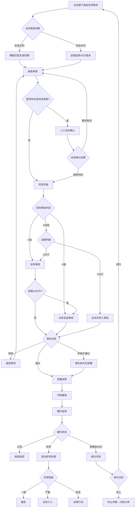

# 合同审查与管理标准操作程序 (SOP)

## 1. 目的与范围

### 1.1 目的
本SOP规范企业合同从需求发起到终止归档的全生命周期管理流程，确保合同审查质量、控制法律风险、保障企业权益，同时兼顾业务效率需求。

### 1.2 适用范围
- 适用于企业所有对外商事合同（采购、销售、技术开发、服务、投资、租赁、保密协议等）
- 适用于合同金额在任何范围的合同（不同金额对应不同审批层级）
- 劳动合同适用本SOP的签署和归档环节，审查环节按劳动合同专项SOP执行

### 1.3 法律依据
- 《中华人民共和国民法典》合同编
- 《中华人民共和国电子签名法》
- 《中华人民共和国公司法》
- 企业内部《合同管理办法》
- 企业内部《印章管理制度》

---

## 2. RACI职责矩阵

| 流程步骤 | 业务部门 | 合同起草助手 | 条款审查专家 | 风控评估师 | 履约管理员 | 法务负责人 | 法务总监 |
|----------|---------|-------------|-------------|-----------|-----------|-----------|---------|
| P1-需求受理 | R(发起) | A(受理) | I | I | I | - | - |
| P2-模板匹配与初稿生成 | C(确认) | R(执行) | I | - | - | - | - |
| P3-条款审查 | I | C(澄清) | R(执行) | I | - | A(监督) | - |
| P4-交叉验证 | - | - | R(主审) | R(复核) | - | A(指定) | - |
| P5-风险评级 | I | - | C(输入) | R(执行) | I | A(确认) | I(>C级) |
| P6-法律意见书出具 | I | - | C(支持) | R(编写) | I | A(审签) | I(重大) |
| P7-审批流转 | R(业务审批) | - | - | C(答疑) | - | R(法务审核) | R(总监审核) |
| P8-签署管控 | C(配合) | - | - | - | R(执行) | A(监督) | - |
| P9-归档建档 | C(确认) | I | - | - | R(执行) | A(监督) | - |
| P10-履约监控 | R(执行) | - | - | C(评估) | R(监控) | A(决策) | I(重大) |
| P11-到期管理 | R(决策) | C(续约起草) | - | C(重评) | R(执行) | A(确认) | - |

> R=Responsible(执行)，A=Accountable(负责)，C=Consulted(咨询)，I=Informed(知会)

---

## 3. 流程步骤详细说明

### P1 - 需求受理

**触发条件：** 业务部门通过OA系统提交《合同需求申请表》

**时效要求：** 收到需求后2小时内确认受理并完成分类

**执行动作：**
1. 接收业务部门提交的合同需求（含交易要素表）
2. 核验需求信息完整性（必填项检查：交易对手、标的、金额、期限）
3. 判定合同类型（标准/非标）和紧急程度
4. 分配处理优先级（紧急→当日处理；普通→按队列处理）
5. 发送受理确认和预计完成时间

**输出物：**
- 《需求受理确认单》（含合同需求编号、分类结果、预计时效）

**异常处理：**
- 需求信息不完整→2小时内反馈业务部门补充，暂停计时
- 需求涉及法律禁止事项→拒绝受理并说明原因

---

### P2 - 模板匹配与初稿生成

**触发条件：** P1完成需求受理和分类

**时效要求：** 标准合同4小时内；非标合同24小时内

**执行动作：**
1. **标准合同路径：**
   - 从模板库匹配最适配模板（匹配度≥90%）
   - 填充交易要素到模板对应位置
   - 根据合同金额自动调整条款严格度
   - 生成初稿并标注版本号（V1.0）

2. **非标合同路径：**
   - 分析非标原因（新业务模式/特殊条款/对方版本）
   - 如为对方版本→直接进入P3审查环节
   - 如需定制起草→基于最近似模板进行改造
   - 非标条款逐条标注★标记并说明偏离原因

**输出物：**
- 合同初稿文本（含版本标记和非标条款标注）
- 《模板使用说明》（标准合同）或《非标条款说明》（非标合同）

**异常处理：**
- 无适配模板且为全新合同类型→标记为"新模板需求"，升级至法务负责人决定是否优先开发模板
- 非标条款超过30%→建议评估是否应新建专项模板

---

### P3 - 条款审查

**触发条件：** 合同初稿生成完成或收到对方版本合同

**时效要求：** 标准合同4小时内；非标合同1-3个工作日

**执行动作：**
1. 对合同进行结构化拆解（按标准条款体系分类）
2. 逐条对照标准模板进行偏差分析
3. **五大必审条款深度审查：**
   - ☐ 违约责任：对等性、违约金比例合理性、责任限额
   - ☐ 知识产权归属：权利边界、许可范围、改进成果归属
   - ☐ 保密义务：范围合理性、期限适当性、违约金
   - ☐ 争议解决：仲裁/诉讼选择、管辖有效性、准据法
   - ☐ 不可抗力：范围列举、通知义务、后果处理
4. 每个偏差条款标注风险等级（高🔴/中🟡/低🟢）
5. 对高/中风险条款编写修改建议和替代条款
6. 完成审查报告

**输出物：**
- 《合同审查意见表》（逐条意见、风险标注、修改建议）
- 修改建议的替代条款文本（方案A/B/C）

**异常处理：**
- 发现可能违法条款→立即标注高风险，通知法务负责人
- 涉及专业领域超出能力范围（如税务、海关）→标注"需专项外部意见"

**质量检查点：**
- ✅ 五大必审条款覆盖率 = 100%（零遗漏）
- ✅ 每个风险标注均附法律依据
- ✅ 高风险条款均有替代条款文本

---

### P4 - 交叉验证

**触发条件：** 合同金额>100万元，或风险评级预判为C/D级

**时效要求：** P3完成后4小时内启动，8小时内完成

**执行动作：**
1. 法务负责人指定第二名审查人员（资历≥主审）
2. 第二审查人独立审阅合同和主审的审查意见
3. 重点验证：高风险标注是否准确、是否有遗漏风险点
4. 双人讨论达成一致意见
5. 如存在分歧→升级至法务负责人仲裁

**输出物：**
- 《交叉验证确认表》（复核人签字确认）
- 如有分歧：分歧记录和最终裁定

**异常处理：**
- 复核人与主审意见重大分歧→法务负责人组织会议讨论并最终裁定

---

### P5 - 风险评级

**触发条件：** P3条款审查完成（必要时P4交叉验证完成后）

**时效要求：** 收到审查结果后4小时内完成评级

**执行动作：**
1. 汇集条款审查结果、交易对手信用评估、历史履约数据
2. 按四维度评分矩阵进行量化评分：
   - 条款风险（25分）
   - 交易对手风险（25分）
   - 交易结构风险（25分）
   - 履约风险（25分）
3. 根据总分确定风险等级：
   - A级（85-100分）：低风险
   - B级（70-84分）：较低风险
   - C级（55-69分）：中等风险
   - D级（<55分）：高风险
4. 确定对应审批层级

**输出物：**
- 《合同风险评级报告》（含各维度评分和综合评级）
- 审批层级确认

**异常处理：**
- 评级为D级→必须附具详细的拒绝理由或前提条件
- 存在"一票否决"情形（如违法条款）→直接评D级不论总分

---

### P6 - 法律意见书出具

**触发条件：** P5风险评级完成

**时效要求：** 标准意见2个工作日内；专项分析5个工作日内

**执行动作：**
1. 确定意见书类型（标准审查/专项分析/可行性论证）
2. 编写法律意见书：
   - 基本情况概述
   - 条款审查结论汇总
   - 交易对手风险评估
   - 整体风险评级及依据
   - 核心风险点分析（概率×影响评估）
   - 风险缓释建议
   - 签署建议与注意事项
3. 附法律依据引用（精确到条款号）
4. 法务负责人审签

**输出物：**
- 正式《法律意见书》（编号、签章）
- 意见摘要（一段话概括，便于管理层快速理解）

**异常处理：**
- 涉及新法域或专业领域→标注"建议补充外部法律意见"
- 法务负责人审签不通过→退回修改并说明原因

**质量检查点：**
- ✅ 法条引用准确率 = 100%
- ✅ 结论明确无歧义
- ✅ 分析逻辑链完整

---

### P7 - 审批流转

**触发条件：** P6法律意见书出具完成

**时效要求：**
- 业务负责人审批：2个工作日内
- 法务审核：3个工作日内
- 法务总监审核：5个工作日内

**执行动作：**
1. 根据风险评级和金额确定审批路径：
   - A/B级 + 金额<50万 → 业务负责人审批
   - C级 或 金额≥50万 → 增加法务审核环节
   - D级 或 金额≥200万 → 增加法务总监审核环节
2. 通过OA系统发起审批流
3. 附全套审查材料（合同文本、审查意见、风险评级、法律意见书）
4. 审批人做出决定：通过/驳回/附条件通过

**输出物：**
- OA审批记录（审批人、时间、决定、意见）

**异常处理：**
- 审批驳回→记录驳回原因，返回P2或P3修改后重新提交
- 附条件通过→条件落实后补充确认
- 审批超时→系统自动催办，超3天未处理升级至上级

---

### P8 - 签署管控

**触发条件：** P7审批全部通过

**时效要求：** 审批通过后5个工作日内完成签署

**执行动作：**
1. 验证签署主体和授权代表：
   - 我方：授权人、授权范围、印章类型确认
   - 对方：授权委托书验证、印章一致性核对
2. 选择签署方式：
   - 电子签：创建签署任务→发送邀请→监控进度→完成确认
   - 纸质签：打印→我方用印→快递→对方签署→寄回→核验
3. 签署完成确认（双方签章齐全、无篡改）
4. 电子存档（24小时内完成扫描上传）

**输出物：**
- 签署完成的合同正本
- 《签署过程记录表》

**异常处理：**
- 签署逾期5天→第一次提醒
- 签署逾期10天→升级至业务负责人
- 对方拒签→记录原因并反馈业务部门
- 发现签署版本与审批版本不一致→立即终止并报告

**质量检查点：**
- ✅ 签署主体与合同约定一致
- ✅ 授权代表在权限范围内
- ✅ 扫描归档24小时内完成

---

### P9 - 归档建档

**触发条件：** P8签署完成

**时效要求：** 签署完成后24小时内完成台账录入

**执行动作：**
1. 建立合同台账记录：
   - 基础信息录入（编号、名称、类型、对手、金额、日期）
   - 关键节点设置（付款日、交付日、验收日、到期日）
   - 风险标记和监控重点设置
   - 关联关系建立（主合同、补充协议、关联订单）
2. 文档归档：
   - 签署原件（电子版/扫描件）
   - 审批流程记录
   - 法律意见书
   - 谈判往来记录
3. 确认归档完整性

**输出物：**
- 合同台账记录（结构化数据）
- 归档完整性确认单

**异常处理：**
- 文件不完整→限期24小时内补齐
- 台账信息与合同不一致→立即更正

**质量检查点：**
- ✅ 归档完整率 = 100%
- ✅ 台账准确率 ≥ 99%
- ✅ 录入时效 ≤ 24小时

---

### P10 - 履约监控（持续性）

**触发条件：** P9归档完成后自动启动，持续至合同终止

**监控频率：** 关键节点到期前预警（7-14天），日常周检

**执行动作：**
1. 按设定节点自动发出预警提醒
2. 定期确认履约状态（正常/预警/异常）
3. 异常处理：
   - 一般逾期（≤15天）→催告对方并记录
   - 严重逾期（>15天）→升级至法务评估违约责任
   - 对方明确无法履行→启动违约处理子流程
4. 月度生成履约监控报告

**输出物：**
- 预警通知
- 月度履约监控报告
- 异常事件处理记录

**异常处理：**
- 发现违约→评估违约程度→确定应对策略（催告/索赔/解除）
- 对方破产/吊照→紧急法务评估→启动债权保全

---

### P11 - 到期管理

**触发条件：** 合同到期前60天

**时效要求：** 到期前30天完成续约/终止决定

**执行动作：**
1. 发出到期预警通知
2. 收集续约评估信息（业务需求、履约表现、市场条件）
3. 形成续约/终止建议
4. 执行决定：
   - 续约→触发P1（新一轮合同流程）
   - 终止→发送终止通知→尾款结算→资料退还→归档
5. 合同终止后设置保存期限（终止后10年）

**输出物：**
- 《到期评估报告》
- 续约/终止决定确认
- 终止通知函（如终止）
- 最终归档确认

---

## 4. 决策树

---

## 5. KPI指标与质量检查点

### 5.1 效率指标

| 指标名称 | 目标值 | 统计周期 | 责任人 |
|----------|--------|----------|--------|
| 标准合同审查时效 | ≤1个工作日 | 月度 | 条款审查专家 |
| 非标合同审查时效 | ≤3-5个工作日 | 月度 | 条款审查专家 |
| 需求受理响应时间 | ≤2小时 | 月度 | 合同起草助手 |
| 法律意见书出具时效 | 标准≤2天/专项≤5天 | 月度 | 风控评估师 |
| 审查时效达标率 | ≥90% | 月度 | 法务负责人 |

### 5.2 质量指标

| 指标名称 | 目标值 | 统计周期 | 责任人 |
|----------|--------|----------|--------|
| 必审条款覆盖率 | = 100% | 每单 | 条款审查专家 |
| 风险标注准确率 | ≥95% | 季度（抽检） | 法务负责人 |
| 法条引用准确率 | = 100% | 每单 | 风控评估师 |
| 归档完整率 | = 100% | 月度 | 履约管理员 |
| 台账准确率 | ≥99% | 季度 | 履约管理员 |

### 5.3 风控指标

| 指标名称 | 目标值 | 统计周期 | 责任人 |
|----------|--------|----------|--------|
| 合同纠纷发生率 | ≤1%（签署合同数） | 年度 | 法务总监 |
| 模板使用率 | ≥70% | 季度 | 合同起草助手 |
| 履约异常预警及时率 | ≥95% | 月度 | 履约管理员 |
| 到期续约/终止处理及时率 | ≥98% | 月度 | 履约管理员 |
| D级合同签署比例 | ≤5% | 季度 | 法务总监 |

### 5.4 质量检查清单

每份合同必须通过以下检查点方可进入下一环节：

- [ ] **P3出口检查**：五大必审条款全覆盖、风险标注有依据、修改建议含具体文本
- [ ] **P5出口检查**：四维度评分完整、评级结论与分数对应、审批路径正确
- [ ] **P6出口检查**：法条引用经核实、结论明确、法务负责人签字
- [ ] **P8出口检查**：主体一致、授权有效、版本一致、扫描归档
- [ ] **P9出口检查**：台账信息完整准确、关键节点已设置、文档归档齐全

---

## 6. 异常场景处理指引

### 6.1 审批驳回处理
- 记录驳回原因和修改要求
- 根据驳回意见修改合同/调整条款
- 修改完成后重新进入P3审查环节
- 最多允许2次驳回重审，第3次驳回需法务总监介入决策

### 6.2 对方不接受修改
- 第1轮：提供方案B（折中方案）
- 第2轮：提供方案C（底线方案）
- 第3轮（最后）：评估是否接受对方条件，出具风险接受意见
- 超过3轮未达成一致→建议终止谈判或升级至法务总监决策

### 6.3 签署逾期
- 5个工作日→系统自动提醒相关人员
- 10个工作日→升级至业务负责人
- 15个工作日→升级至法务负责人评估是否终止交易
- 30个工作日仍未签署→视为对方放弃，建议终止流程

### 6.4 紧急合同处理
- 定义：业务紧急且已获得法务总监书面授权的加急合同
- 流程压缩：P2+P3合并为4小时，P5+P6合并为4小时
- 前提条件：合同金额<100万且为标准合同类型
- 事后补充：紧急流程完成后5个工作日内补充完整审查材料

---

## 7. 持续改进机制

### 7.1 月度回顾
- 统计各项KPI达成情况
- 分析未达标项的根本原因
- 制定下月改进措施

### 7.2 季度优化
- 审查高频修改条款→反馈至模板更新
- 分析审查中发现的新风险模式→更新审查规则
- 评估SOP执行中的瓶颈环节→流程优化

### 7.3 年度评审
- 法规变化对SOP的影响评估
- 全年合同纠纷案例复盘
- SOP版本升级（如需）
- 培训计划制定
