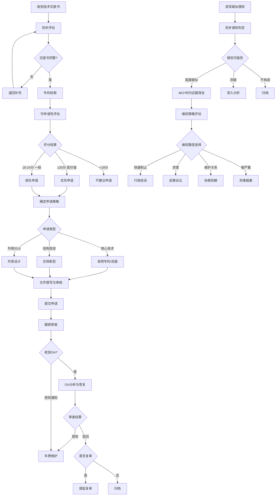

# 知识产权管理标准操作规程（SOP）

## 1. 文档信息

| 项目 | 内容 |
|------|------|
| 文档编号 | SOP-IP-001 |
| 版本 | v1.0 |
| 适用范围 | 企业知识产权全生命周期管理 |
| 涵盖业务 | 专利申请管理、商标注册管理、IP资产运维、侵权应对 |
| 关键法规依据 | 《专利法》《商标法》《著作权法》《反不正当竞争法》《专利审查指南》 |

---

## 2. RACI职责矩阵

| 流程步骤 | 专利战略分析师 | IP资产运维管理员 | IP维权应对专家 | 法务总监 | 研发部门 | 业务部门 |
|----------|:---:|:---:|:---:|:---:|:---:|:---:|
| **专利申请流程** | | | | | | |
| 技术交底书提交 | I | I | - | - | R | - |
| 专利检索分析 | R | I | - | - | C | - |
| 可申请性评估 | R | - | - | A | C | - |
| 申请策略制定 | R | C | - | A | I | - |
| 申请文件撰写/审核 | R | - | - | A | C | - |
| 申请提交与跟踪 | C | R | - | I | - | - |
| 审查意见答复 | R | C | - | A | C | - |
| 授权维护（年费） | I | R | - | - | - | - |
| **商标注册流程** | | | | | | |
| 注册需求确认 | - | R | - | I | - | C |
| 近似检索与风险评估 | - | R | - | A | - | I |
| 申请提交 | - | R | - | I | - | - |
| 驳回复审/异议答辩 | - | R | - | A | - | - |
| 续展管理 | - | R | - | - | - | I |
| **侵权应对流程** | | | | | | |
| 侵权监控 | C | I | R | - | - | - |
| 侵权确认与技术比对 | R | - | R | I | C | - |
| 证据保全 | - | - | R | A | - | - |
| 维权策略制定 | C | C | R | A | - | I |
| 维权执行与跟踪 | - | - | R | A | - | I |
| **被控侵权应对** | | | | | | |
| 紧急风险评估 | R | C | R | A | C | I |
| 不侵权分析/无效检索 | R | - | C | A | C | - |
| 防御策略制定 | C | - | R | A | C | I |
| 设计规避方案 | R | - | C | A | R | - |
| **IP资产运维** | | | | | | |
| 台账维护与更新 | I | R | I | - | - | - |
| 时限监控与提醒 | I | R | I | I | - | - |
| IP资产报告编制 | C | R | C | A | - | I |

> R=Responsible(负责执行) A=Accountable(最终决策) C=Consulted(咨询) I=Informed(通知)

---

## 3. 专利申请管理SOP

### P1 - 技术交底书受理

**触发条件**：研发部门提交技术交底书

**执行动作**：
1. 接收技术交底书并登记（编号、提交人、技术领域、提交日期）
2. 检查交底书完整性（技术方案描述、技术效果、与现有技术的区别、附图）
3. 不完整的退回补充，完整的分配给专利战略分析师
4. 3个工作日内完成初步评估反馈

**输出**：技术交底书受理确认函、初步评估意见

**异常处理**：
- 交底书内容不清晰 → 与发明人沟通补充，最多2次补充机会
- 涉及国家秘密技术 → 暂停常规流程，启动保密审查

**质量检查点**：受理确认时效≤1个工作日，初步评估时效≤3个工作日

---

### P2 - 专利检索

**触发条件**：技术交底书通过初步审查

**执行动作**：
1. 分析技术方案确定检索主题（核心技术特征提取）
2. 制定检索策略（数据库≥3个，检索式≥5组）
3. 执行检索并筛选相关文献
4. 对高相关文献进行详细对比分析
5. 出具检索报告

**输出**：专利检索报告（含检索策略、对比文件清单、相关度评级）

**异常处理**：
- 检索发现高度相关文献（X类对比文件）→ 评估是否需要修改技术方案后再评估
- 技术方案过于基础无法有效检索 → 与发明人讨论明确创新点

**质量检查点**：
- 检索数据库覆盖≥3个 ✓
- 检索式数量≥5组 ✓
- 检索报告完整性（所有必要章节齐全）✓

---

### P3 - 可申请性评估

**触发条件**：检索报告出具完成

**执行动作**：
1. 基于检索结果进行新颖性评估（是否有单篇文献公开全部技术特征）
2. 创造性评估（区别技术特征是否显而易见）
3. 实用性评估（技术方案是否可实施）
4. 采用评分制（每项满分10分，总分≥18分为可申请）
5. 给出评估结论：高价值（≥25分）/ 一般价值（18-24分）/ 不建议（<18分）

**输出**：可申请性评估报告（含三性评分和评估依据）

**决策点**：
- 高价值（≥25分）→ 优先申请，进入P4
- 一般价值（18-24分）→ 排队申请，进入P4
- 不建议（<18分）→ 反馈研发部门并归档

**异常处理**：
- 评分边界情况（17-18分）→ 组织专家评审会讨论决定
- 研发部门对"不建议"结论有异议 → 安排复评（不同分析师）

---

### P4 - 申请策略确定

**触发条件**：可申请性评估通过（≥18分）

**执行动作**：
1. 确定专利类型：发明/实用新型/外观设计/双报策略
2. 确定申请路径：国内直接申请/巴黎公约/PCT
3. 设计权利要求层次：独立权利要求覆盖范围 + 从属权利要求限缩层次
4. 评估说明书支持充分性
5. 估算申请费用和时间线
6. 出具《专利申请策略书》

**输出**：专利申请策略书

**异常处理**：
- 核心技术即将公开 → 启动加急流程（压缩至3天完成策略）
- 涉及多个创新点 → 评估是否分案申请

**质量检查点**：独立权利要求确实覆盖核心技术方案，从属权利要求≥5项

---

### P5 - 文件撰写与审核

**触发条件**：申请策略书审批通过

**执行动作**：
1. 决定撰写方式：内部撰写 / 委托代理机构
2. 撰写/指导撰写专利申请文件（说明书、权利要求书、摘要、附图）
3. 内部技术审核（发明人确认技术方案描述准确性）
4. 内部法律审核（权利要求层次设计合理性、撰写规范性）
5. 修改完善至终稿

**输出**：完整的专利申请文件包

**异常处理**：
- 代理机构撰写质量不达标 → 退回修改并记录质量问题
- 发明人补充了新技术特征 → 评估是否影响策略，必要时返回P4

**质量检查点**：
- 独立权利要求覆盖核心技术方案 ✓
- 从属权利要求≥5项 ✓
- 说明书对每项权利要求均有充分支持 ✓
- 附图清晰标注符合规范 ✓

---

### P6 - 提交与跟踪

**触发条件**：申请文件通过内部审核

**执行动作**：
1. 通过电子申请系统提交申请文件
2. 获取申请号并录入IP资产台账
3. 缴纳申请费（含实审请求费，如适用）
4. 设置后续时限监控点（公开日、实审日、OA答复期限等）
5. 每月更新状态台账

**输出**：申请受理通知书、台账登记记录

**异常处理**：
- 形式审查不合格 → 在通知期限内补正
- 费用缴纳失败 → 立即排查并重新缴纳

---

### P7 - 审查意见答复（OA答复）

**触发条件**：收到审查意见通知书

**执行动作**：
1. 24小时内录入系统并通知专利战略分析师
2. 计算答复法定期限并设置提醒
3. 15日内完成OA分析（审查意见解读、对比文件分析）
4. 制定答复策略（争辩/修改/组合）
5. 撰写意见陈述书和修改后的权利要求（如需要）
6. 内部审核后在法定期限前15天提交答复

**输出**：OA分析报告、意见陈述书、修改文件

**异常处理**：
- 审查意见涉及新的对比文件 → 可能需要补充检索
- 第三次OA仍未授权 → 评估是否申请面询或考虑复审
- 期限即将届满但答复未完成 → 申请延期（如允许）

**质量检查点**：
- OA分析15日内完成 ✓
- 答复提交法定期限达标率=100% ✓
- 答复逻辑与前次保持一致 ✓

---

### P8 - 授权维护

**触发条件**：收到授权通知/年费到期提醒

**执行动作**：
1. 收到授权通知 → 缴纳授权登记费 → 获取专利证书 → 更新台账
2. 年费管理：
   - 提前90天：列入待办清单
   - 提前60天：正式提醒，确认缴费预算
   - 提前30天：紧急提醒，确认已执行
   - 完成缴费后更新台账
3. 定期评估专利维持价值（是否继续缴费或主动放弃）

**输出**：专利证书归档、年费缴纳凭证、维持/放弃建议

**异常处理**：
- 年费逾期 → 6个月宽限期内缴纳滞纳金恢复
- 超过宽限期 → 专利权终止，评估恢复可能性
- 专利被提无效宣告 → 通知专利战略分析师和IP维权应对专家

---

## 4. 商标注册管理SOP

### T1 - 需求确认与策略制定

**触发条件**：业务部门提出商标注册需求

**执行动作**：
1. 确认商标要素（文字/图形/组合/其他）
2. 确定指定商品/服务类别（核心类/关联类/防御类）
3. 确定注册地域和优先级
4. 制定注册策略（分开注册vs组合注册）

**输出**：商标注册策略书

---

### T2 - 近似检索与风险评估

**触发条件**：注册策略确认后

**执行动作**：
1. 在商标局数据库执行近似检索
2. 覆盖范围：同类+关联类别，相同+近似标识
3. 分析检索结果，评估通过率
4. 给出风险等级：高风险（通过率<30%）/中风险（30-60%）/低风险（>60%）
5. 高风险建议修改商标或调整策略

**输出**：近似检索报告、通过率评估、策略建议

**质量检查点**：检索范围覆盖同类和关联类别 ✓

---

### T3 - 申请提交与流程跟踪

**触发条件**：风险评估通过，决定申请

**执行动作**：
1. 准备申请材料（商标图样、申请人信息、商品/服务清单）
2. 通过电子系统提交申请
3. 获取受理通知书，录入台账
4. 每月跟踪审查进度

**输出**：受理通知书、台账记录

---

### T4 - 异常处理（驳回/异议）

**触发条件**：收到驳回通知或异议通知

**执行动作**：
- **驳回处理**：
  1. 分析驳回理由（绝对理由/引证商标）
  2. 评估复审成功率
  3. 决策：复审/放弃/修改后重新申请
  4. 复审→15日内提交复审申请
- **异议处理**：
  1. 分析异议理由
  2. 准备答辩材料（使用证据、知名度证据）
  3. 30日内提交答辩书

**输出**：复审/答辩文件

**异常处理**：引证商标可撤三 → 先提撤三再复审（组合策略）

---

### T5 - 注册成功与续展管理

**触发条件**：收到注册公告/续展到期提醒

**执行动作**：
1. 注册成功 → 领取注册证 → 入台账 → 设置续展提醒
2. 续展管理：有效期满前12个月提醒 → 6个月前办理续展
3. 持续使用证据积累（年度归档一次）

**输出**：商标注册证归档、续展凭证

---

## 5. 侵权应对SOP

### E1 - 侵权发现与初步判定

**触发条件**：监控系统/人工巡查/举报发现疑似侵权

**执行动作**：
1. 记录侵权线索（时间、渠道、侵权方、涉嫌行为）
2. 临时证据固定（截图、录屏）
3. 初步技术比对（全面覆盖原则）
4. 确认侵权可能性等级：高度疑似/可能/存疑

**输出**：侵权线索登记表、初步判定意见

**质量检查点**：侵权发现到上报≤24小时 ✓

---

### E2 - 证据保全（48小时内启动）

**触发条件**：初步判定为"高度疑似侵权"或"可能侵权"

**执行动作**：
1. 确认侵权后48小时内启动证据保全
2. 选择保全方式（公证取证/时间戳存证/行政取证）
3. 执行保全（公证员全程见证/系统自动存证）
4. 检查证据链完整性
5. 证据归档和保管

**输出**：公证书/存证证书、证据清单

**质量检查点**：48小时启动率=100% ✓

---

### E3 - 维权策略评估

**触发条件**：证据保全完成

**执行动作**：
1. 权利稳定性评估（被无效风险）
2. 侵权确定性评估（证据充分性）
3. 成本收益分析（维权费用 vs 预期赔偿/商业价值）
4. 商业关系评估（与侵权方是否有合作关系）
5. 制定维权策略方案（推荐路径+备选方案）
6. 提交管理层审批

**输出**：维权策略建议书

**决策点**：
- 管理层批准行政投诉 → 进入E4a
- 管理层批准民事诉讼 → 进入E4b
- 管理层批准协商和解 → 进入E4c
- 管理层决定不维权 → 记录原因并归档

---

### E4a - 行政投诉执行

**执行动作**：准备投诉材料 → 提交执法部门 → 配合调查 → 获取处理结果

### E4b - 民事诉讼执行

**执行动作**：委托律师 → 起诉立案 → 举证 → 开庭 → 判决 → 执行

### E4c - 协商和解执行

**执行动作**：发出律师函 → 谈判 → 达成和解协议 → 签署 → 执行监督

---

### E5 - 结案归档

**触发条件**：维权行动结束（判决生效/和解协议签署/行政决定下达）

**执行动作**：
1. 整理全部案件材料
2. 记录案件结果和经验教训
3. 更新侵权数据库
4. 评估是否需要持续监控该侵权方
5. 归档保存（不少于10年）

**输出**：结案报告、案件归档

---

## 6. 被控侵权应对SOP

### D1 - 紧急响应（72小时内）

**触发条件**：收到侵权指控（警告函/起诉状/行政通知）

**执行动作**：
1. 登记并评估紧急程度
2. 24小时内通知法务总监和相关部门
3. 收集对方权利信息和指控详情
4. 72小时内出具初步风险评估
5. 决定是否需要暂停相关产品/服务

**输出**：紧急风险评估报告

---

### D2 - 深度分析（1-2周内）

**触发条件**：紧急响应完成

**执行动作**：
1. 对方权利有效性检索（寻找无效证据）
2. 我方产品/技术与对方权利要求的详细比对
3. 可能的抗辩事由梳理
4. 评估各种防御策略的可行性和成本

**输出**：侵权比对分析报告、防御策略方案

---

### D3 - 策略执行

**触发条件**：防御策略获得管理层批准

**执行动作**：
- 不侵权主张 → 回函/答辩
- 无效宣告 → 提交无效请求
- 设计规避 → 研发团队执行
- 协商许可 → 启动谈判
- 组合策略 → 多路径并行

**输出**：按策略执行的各类文件和行动

---

## 7. 决策树

---

## 8. KPI指标与质量检查点

### 核心KPI指标

| 指标 | 目标值 | 统计周期 | 责任人 |
|------|--------|----------|--------|
| 专利授权率 | ≥70% | 年度 | 专利战略分析师 |
| OA答复时效达标率 | 100% | 月度 | 专利战略分析师 |
| 年费/续展缴纳及时率 | 100% | 月度 | IP资产运维管理员 |
| 商标注册成功率 | ≥80% | 年度 | IP资产运维管理员 |
| 侵权证据保全48小时启动率 | 100% | 每案 | IP维权应对专家 |
| IP台账准确率 | ≥99% | 季度 | IP资产运维管理员 |
| 维权案件胜诉/和解达成率 | ≥75% | 年度 | IP维权应对专家 |
| IP资产年度增长率 | ≥15% | 年度 | 全团队 |
| 技术交底书评估时效（3工作日） | ≥95% | 月度 | 专利战略分析师 |
| 检索报告5工作日完成率 | ≥90% | 月度 | 专利战略分析师 |

### 质量检查清单

| 检查点 | 标准 | 频率 | 检查方式 |
|--------|------|------|----------|
| 检索报告完整度 | 数据库≥3个，检索式≥5组 | 每份报告 | 自查+抽查 |
| OA答复时限 | 法定期限前15天完成 | 每件OA | 系统自动监控 |
| 年费缴纳 | 逾期率=0 | 每月统计 | 系统提醒+人工确认 |
| 侵权证据保全 | 确认后48小时内启动 | 每案 | 时间记录审计 |
| IP台账准确率 | ≥99% | 季度盘点 | 抽样对照官方数据 |
| 商标近似检索覆盖 | 同类+关联类全覆盖 | 每次检索 | 审核检索范围记录 |
| 维权策略审批 | >10万预算需管理层批准 | 每案 | 审批流程记录 |

---

## 9. 时限管理速查表

| 事项 | 法定期限 | 内部提前量 | 宽限/恢复期 |
|------|----------|-----------|-------------|
| 发明专利首次OA答复 | 4个月 | 提前15天 | 可延期2个月（缴费） |
| 发明专利后续OA答复 | 2个月 | 提前15天 | 可延期2个月（缴费） |
| 专利年费缴纳 | 授权日对应月份 | 提前90天 | 6个月宽限期（缴滞纳金） |
| 商标驳回复审 | 15日 | 收到即处理 | 无宽限 |
| 商标异议答辩 | 30日 | 收到后5日内启动 | 无宽限 |
| 商标续展 | 期满前12个月至期满后6个月 | 提前12个月 | 6个月宽展期（缴宽展费） |
| PCT进入国家阶段 | 优先权日起30个月 | 提前3个月 | 个别国家31个月 |
| 巴黎公约优先权 | 12个月（发明/实用新型） | 提前2个月 | 恢复优先权（部分国家） |
| 侵权证据保全启动 | 确认后48小时 | 立即启动 | 无宽限（证据可能灭失） |
| 被控侵权紧急响应 | 72小时内初步评估 | 收到即响应 | 诉讼答辩期15日 |

---

## 10. 异常处理与升级机制

### 升级矩阵

| 异常类型 | 第一响应 | 升级条件 | 升级对象 | 响应时限 |
|----------|----------|----------|----------|----------|
| 年费逾期 | IP资产运维管理员 | 逾期发生 | 法务总监 | 24小时 |
| 核心专利被无效 | 专利战略分析师 | 收到无效决定 | 法务总监+CTO | 48小时 |
| 重大侵权发现 | IP维权应对专家 | 涉案金额>100万 | 法务总监+CEO | 24小时 |
| 被控侵权（诉讼） | IP维权应对专家 | 收到起诉状 | 法务总监 | 24小时 |
| 专利代理质量问题 | 专利战略分析师 | 连续2次不达标 | 法务总监 | 1周 |
| 台账数据严重错误 | IP资产运维管理员 | 影响权利状态判断 | 全团队 | 24小时 |

### 应急预案

1. **核心技术泄露/提前公开**：立即评估申请紧迫性 → 加急提交临时申请 → 事后调查泄露原因
2. **大规模侵权（多方/多地）**：成立专项维权小组 → 优先处理主要侵权方 → 制定系统维权方案
3. **系统性时限管理失败**：切换至人工+系统双重管控模式 → 全面排查未处理时限 → 系统修复
