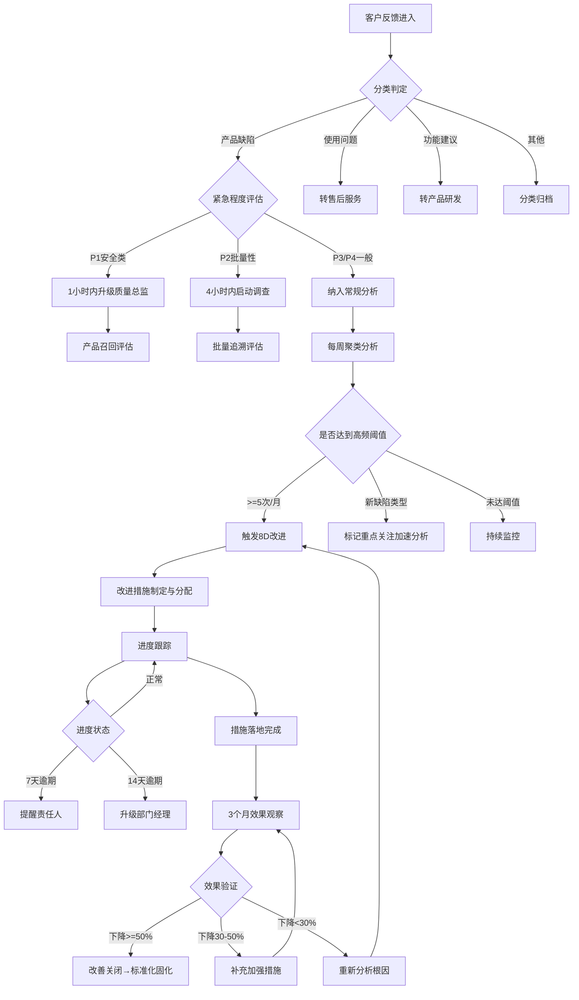

# 客户反馈与产品改进 标准作业程序（SOP）

## 文件信息
- 文件编号：SOP-CF-000
- 版本：V1.0
- 适用范围：客户反馈与产品改进全流程
- 关联体系：ISO 9001:2015 第8.2.1条（客户沟通）、第10.2条（不合格和纠正措施）

---

## 1. 目的与范围

### 1.1 目的
建立从客户声音（VOC）采集到产品/工艺改进落地验证的标准化闭环流程，确保客户反馈被系统性地采集、分析、改善并验证效果，持续提升产品质量和客户满意度。

### 1.2 适用范围
- 所有渠道的客户反馈（投诉、退货、售后工单、经销商报告、社交媒体）
- 所有产品线的缺陷分析和改进活动
- B2B客户（OEM/代工）的质量索赔和批次追溯

### 1.3 关键术语
| 术语 | 定义 |
|------|------|
| VOC | Voice of Customer，客户声音 |
| 8D | Eight Disciplines，8步问题解决方法 |
| 高频缺陷 | 同类投诉>=5次/月 |
| 批次追溯 | 通过批次号反向追踪生产过程所有信息 |
| 基线数据 | 改善前的投诉数量/率，用于效果对比 |

---

## 2. RACI职责矩阵

| 流程步骤 | 反馈采集与分类Agent | 缺陷模式分析Agent | 改进跟踪与效果验证Agent | 质量经理 | 质量总监 | 生产/工程部门 |
|----------|:---:|:---:|:---:|:---:|:---:|:---:|
| 多渠道反馈采集 | R | - | - | A | - | - |
| 反馈结构化处理 | R | - | - | A | - | - |
| 智能分类与标注 | R | C | - | A | - | - |
| 紧急程度评估 | R | - | - | A | I | - |
| 安全类缺陷升级 | R | - | - | A | R | I |
| 缺陷聚类分析 | C | R | - | A | I | - |
| 批次/工艺关联 | - | R | - | A | - | C |
| TOP5缺陷报告 | - | R | I | A | I | I |
| 8D触发决策 | - | R | I | A | I | I |
| 改进措施分配 | - | C | I | R | A | R |
| 进度跟踪管理 | - | - | R | A | I | C |
| 逾期升级处理 | - | - | R | R | A | I |
| 效果观察监控 | I | C | R | A | - | - |
| 统计显著性验证 | - | C | R | A | - | - |
| 效果判定与关闭 | - | - | R | A | I | I |
| 标准化固化 | - | - | I | A | - | R |
| 月度VOC报告 | C | C | R | A | I | I |

**说明：R=负责执行 A=最终审批 C=需要咨询 I=需要通知**

---

## 3. SOP-CF-001 客户反馈采集与分类流程

### 3.1 流程概述
将多渠道、多格式的客户反馈数据统一采集、去重、结构化处理并分类，为后续分析提供高质量的数据输入。

### 3.2 触发条件
- 定时触发：每日09:00和15:00自动执行采集
- 事件触发：新渠道接入、采集异常恢复后

### 3.3 详细步骤

#### 步骤1：渠道数据采集
- **动作**：连接各渠道系统API，拉取上次采集时间戳之后的新增数据
- **渠道清单**：客诉系统(CRM)、退货单(ERP)、售后工单、经销商报告(邮件/Portal)、社交媒体
- **输出**：各渠道原始数据集
- **异常处理**：
  - 渠道连接失败 → 自动重试3次（间隔5分钟）→ 仍失败则记录异常并通知IT运维
  - 数据量异常（>历史均值3倍）→ 标记异常待人工确认

#### 步骤2：数据去重
- **动作**：基于多维度规则执行去重
- **规则**：同一客户+同一产品SN+7天窗口=同一反馈；同批次+语义相似度>85%=合并
- **输出**：去重后的反馈记录（保留关联关系）
- **异常处理**：去重后数据量骤降>50% → 检查去重规则是否过于激进

#### 步骤3：结构化提取
- **动作**：NLP提取关键字段（产品型号/SN/批次号/缺陷描述/严重程度/频率）
- **输出**：结构化反馈记录
- **质量标准**：提取准确率>=90%（月度抽检）
- **异常处理**：字段缺失>3项 → 标记"信息不完整"并触发补全请求

#### 步骤4：智能分类
- **动作**：按四级分类体系分类，输出置信度评分
- **分类体系**：产品缺陷/使用问题/功能建议/其他
- **输出**：分类结果+置信度
- **异常处理**：置信度<80% → 进入人工复核队列

#### 步骤5：紧急程度评估
- **动作**：对产品缺陷类评估紧急程度（P1-P4）
- **输出**：紧急等级标记
- **关键规则**：
  - P1（安全类）→ 1小时内升级到质量总监
  - P2（批量性）→ 4小时内通知质量经理
- **异常处理**：P1判定后5分钟无确认 → 自动升级到更高层级

#### 步骤6：分发
- **动作**：将分类后的反馈分发到对应后续流程
- **路由规则**：
  - 产品缺陷 → 缺陷模式分析Agent
  - P1/P2 → 同时推送质量管理Scope
  - 使用问题 → 售后服务团队
  - 功能建议 → 产品研发部门

### 3.4 质量检查点
| 检查项 | 标准 | 检查频率 | 责任人 |
|--------|------|----------|--------|
| 渠道采集完整性 | >=99% | 每日 | 反馈采集Agent |
| 结构化提取准确率 | >=90% | 每月抽检50条 | 质量经理 |
| 产品缺陷24h批次关联 | 100%完成 | 每日 | 反馈采集Agent |
| 安全类缺陷1h升级 | 100%达标 | 每次发生 | 质量总监确认 |

### 3.5 KPI指标
- 反馈数据采集完整性 >=99%
- 结构化提取准确率 >=90%
- 安全类缺陷1h升级率 100%
- 日均处理时效 <4小时（从采集到分类完成）

---

## 4. SOP-CF-002 缺陷模式分析流程

### 4.1 流程概述
对结构化后的缺陷反馈进行聚类分析，识别高频缺陷模式，关联生产批次和工艺参数，为改善决策提供数据驱动的方向指引。

### 4.2 触发条件
- 定时触发：每周一执行周度聚类分析
- 事件触发：P1/P2缺陷需即时分析；同类投诉单日新增>=3条

### 4.3 详细步骤

#### 步骤1：数据汇总与预处理
- **动作**：汇总分析窗口内（滚动4周）的产品缺陷类反馈数据
- **输出**：清洗后的分析数据集
- **异常处理**：数据量<30条 → 扩展分析窗口至8周

#### 步骤2：缺陷聚类分析
- **动作**：文本语义聚类（DBSCAN算法），识别缺陷模式簇
- **输出**：聚类结果（簇标签/成员数量/代表性描述）
- **质量标准**：聚类内相似度>80%，聚类间区分度明显
- **异常处理**：聚类效果差（silhouette<0.3）→ 调整参数或改用层次聚类

#### 步骤3：批次关联分析
- **动作**：将缺陷聚类与生产批次/工艺参数/设备状态进行关联
- **数据源**：MES系统（生产记录）、SCADA/IoT（工艺参数/设备状态）
- **方法**：卡方检验判断关联显著性
- **输出**：关联分析矩阵（缺陷×因素×显著性）
- **质量标准**：缺陷-批次关联准确率>=85%
- **异常处理**：无法获取生产数据 → 标记"待关联"并通知MES管理员

#### 步骤4：趋势判定与阈值检查
- **动作**：对每个缺陷模式判定趋势（新增/恶化/稳定/改善），检查是否达到高频阈值
- **高频阈值**：同类投诉>=5次/月
- **输出**：趋势状态+是否触发8D
- **异常处理**：新出现的缺陷类型即使未达阈值 → 标记重点关注

#### 步骤5：报告生成与改进触发
- **动作**：生成TOP5缺陷模式周报；对达到阈值的缺陷触发8D
- **输出**：周度报告（分发给质量经理/生产经理/工程经理）+ 8D工单
- **时效要求**：高频缺陷识别后48小时内触发8D
- **异常处理**：8D触发后24小时无人接收 → 升级到质量经理

### 4.4 质量检查点
| 检查项 | 标准 | 检查频率 | 责任人 |
|--------|------|----------|--------|
| TOP5报告按时生成 | 每周一09:00前 | 每周 | 缺陷模式分析Agent |
| 缺陷-批次关联准确率 | >=85% | 每月抽检 | 质量经理 |
| 高频缺陷48h触发8D | 100%执行 | 每次达到阈值 | 缺陷模式分析Agent |
| 分析结论有数据支撑 | 100% | 每份报告 | 质量经理审核 |

### 4.5 KPI指标
- 缺陷-批次关联准确率 >=85%
- 高频缺陷8D触发率 100%
- 周报按时生成率 100%
- 新缺陷类型识别时效 <=48小时

---

## 5. SOP-CF-003 改善效果验证流程

### 5.1 流程概述
对已落地的改进措施进行为期3个月的效果观察和量化验证，确保改善真正产生了预期效果，并将有效措施标准化固化。

### 5.2 触发条件
- 改进措施被责任人标记为"已完成落地"时自动启动
- 观察期结束（3个月）时触发最终判定

### 5.3 详细步骤

#### 步骤1：基线数据确认
- **动作**：记录改进前3个月的同类投诉月均数量/率作为基线
- **输出**：基线数据记录（含产量归一化）
- **质量标准**：基线数据完整，无缺失月份
- **异常处理**：历史数据不完整 → 尽可能补全，标注数据质量风险

#### 步骤2：观察期启动
- **动作**：设定3个月观察期起止日期；配置同类投诉自动统计规则
- **输出**：观察期任务卡（含监控规则配置）
- **异常处理**：改善措施实际未完全落地 → 暂停观察期，待确认后重启

#### 步骤3：月度效果评估（每月执行）
- **动作**：统计当月同类投诉数量/率，对比基线计算变化幅度
- **输出**：月度效果跟踪数据点
- **异常处理**：
  - 投诉突然回升（>基线水平）→ 发出回弹预警，通知责任人排查
  - 外部因素干扰（如客户停产）→ 标注并记录

#### 步骤4：最终效果判定（观察期结束）
- **动作**：执行统计显著性检验（泊松/比例检验），输出效果判定
- **判定标准**：
  - 达标：下降>=50% 且 p<0.05 且 无回弹趋势
  - 部分有效：下降30-50%
  - 未达标：下降<30%
  - 无效：无下降或上升
- **输出**：效果验证报告
- **异常处理**：统计检验功效不足（样本量太小）→ 延长观察期1个月

#### 步骤5：后续处理
- **达标**：通知责任部门30天内完成标准化文件更新 → 改善关闭 → 设置6个月回访
- **未达标**：输出原因分析 → 建议后续动作（加强/重新分析）→ 保持任务开放
- **输出**：关闭/延续决定 + 后续行动计划

### 5.4 质量检查点
| 检查项 | 标准 | 检查频率 | 责任人 |
|--------|------|----------|--------|
| 基线数据记录完整 | 100%任务有基线 | 每次启动 | 改进跟踪Agent |
| 观察期数据连续性 | 无中断>2周 | 每月 | 改进跟踪Agent |
| 效果判定有统计支撑 | 100% | 每次判定 | 质量经理审核 |
| 达标后30天标准化 | 100%按时完成 | 每次达标 | 生产/工程部门 |

### 5.5 KPI指标
- 改善效果达标率（下降>=50%）>=80%
- 改善措施按时关闭率 >=85%
- 客户反馈→改进落地周期 <=45天
- 月度VOC报告按时生成率 100%

---

## 6. 决策树

---

## 7. 异常处理矩阵

| 异常场景 | 识别方式 | 处理措施 | 升级条件 | 时效要求 |
|----------|----------|----------|----------|----------|
| 安全类缺陷 | 分类+紧急评估 | 立即升级质量总监，冻结同批次产品 | 5分钟无确认→自动升级VP | 1小时内 |
| 批量性问题 | 同批次3+客户反馈 | 启动批量追溯，评估影响范围 | 影响>100台→升级GM | 24小时内 |
| 8D超期未关闭 | 日常进度检查 | 30天未关闭→升级质量经理 | 45天仍未关闭→升级质量总监 | 按升级规则 |
| 改善效果回弹 | 观察期月度监控 | 重新打开任务，排查回弹原因 | 回弹至基线水平→重启8D | 48小时内 |
| 采集渠道中断 | 渠道健康检查 | 3次重试→通知IT运维 | 中断>4小时→升级IT经理 | 30分钟内 |
| 数据关联失败 | 批次查询无结果 | 标记待关联，人工协助查询 | 48小时仍无法关联→通知MES管理员 | 48小时内 |

---

## 8. KPI指标汇总与目标

| 指标名称 | 目标值 | 计算公式 | 统计周期 | 数据来源 |
|----------|--------|----------|----------|----------|
| 反馈数据采集完整性 | >=99% | 实际采集条数/渠道源总条数×100% | 每日 | 采集日志 |
| 安全类缺陷1h升级率 | 100% | 1小时内完成升级的P1数量/P1总数×100% | 每次 | 升级记录 |
| 缺陷-批次关联准确率 | >=85% | 抽检正确关联数/抽检总数×100% | 每月 | 抽检结果 |
| 高频缺陷8D触发率 | 100% | 已触发8D数/达到阈值数×100% | 每月 | 8D记录 |
| 客户反馈→改进落地周期 | <=45天 | 改善完成日-首次反馈日 | 每项 | 改进看板 |
| 改善效果达标率 | >=80% | 验证达标数/完成验证总数×100% | 每季度 | 验证报告 |
| 改善措施按时关闭率 | >=85% | 按时关闭数/应关闭总数×100% | 每月 | 改进看板 |
| 月度VOC报告按时生成 | 100% | 按时发布数/应发布数×100% | 每月 | 报告记录 |

---

## 9. 跨Scope协作接口

### 9.1 与质量管理Scope的接口
| 协作场景 | 数据流向 | 触发条件 | 接口人 |
|----------|----------|----------|--------|
| 安全类缺陷升级 | 本Scope → 质量管理 | P1级缺陷识别 | 质量异常处理专家 |
| 8D流程触发 | 本Scope → 质量管理 | 高频缺陷达阈值 | 质量异常处理专家 |
| 8D进展反馈 | 质量管理 → 本Scope | 8D状态变更 | 改进跟踪Agent |
| 改善效果数据 | 本Scope → 质量管理 | 月度报告 | 质量改进策略师 |

### 9.2 与IoT与产线优化Scope的接口
| 协作场景 | 数据流向 | 触发条件 | 接口人 |
|----------|----------|----------|--------|
| 生产过程数据查询 | IoT → 本Scope | 批次关联分析 | IoT数据监控分析师 |
| 工艺参数关联 | IoT → 本Scope | 缺陷模式分析 | 产线效率优化Agent |
| 工艺调整建议 | 本Scope → IoT | 分析结论确认 | 产线效率优化Agent |

---

## 10. 文件变更记录

| 版本 | 日期 | 变更内容 | 变更人 |
|------|------|----------|--------|
| V1.0 | 初始发布 | 新建文件 | 系统生成 |
