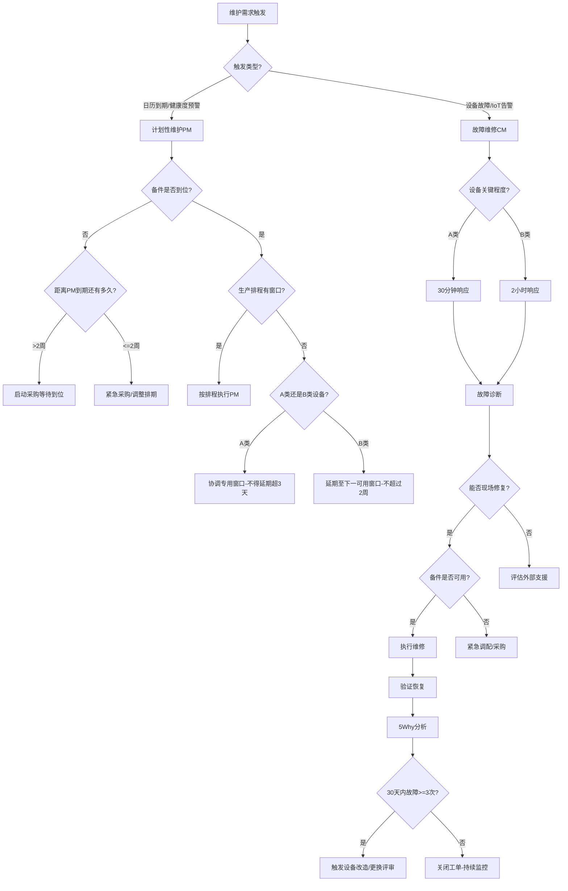
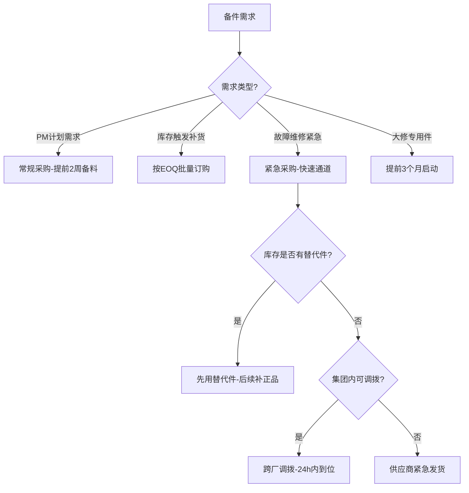

# 设备维护管理标准作业程序（SOP）

## 文件编号：SOP-EM
## 版本：V1.0
## 适用范围：设备预防性维护、故障维修、备件管理、OEE分析全流程

---

## 一、RACI矩阵

| 流程步骤 | 维护计划调度员 | 故障诊断与维修专家 | 备件管理专员 | 操作工 | 维护经理 | 生产部门 |
|---------|:---:|:---:|:---:|:---:|:---:|:---:|
| **SOP-EM-001 预防性维护** |
| PM计划生成 | R/A | C | C | I | A | C |
| 备件可用性确认 | C | I | R/A | - | I | - |
| 停机窗口协调 | R | - | - | I | C | A |
| PM执行 | C | R | C | A | I | I |
| 维护结果记录 | C | R/A | I | C | I | - |
| PM执行率跟踪 | R/A | I | I | - | I | - |
| **SOP-EM-002 故障维修** |
| 故障报修 | I | I | I | R | I | A |
| 响应到场 | C | R/A | I | I | I | I |
| 故障诊断 | I | R/A | C | C | I | - |
| 维修执行 | I | R/A | C | C | I | I |
| 5Why根因分析 | C | R/A | C | C | A | C |
| 预防措施制定 | R | R/A | C | I | A | C |
| **SOP-EM-003 备件管理** |
| 需求预测 | C | C | R/A | - | I | - |
| 采购协调 | I | I | R/A | - | C | - |
| 入库验收 | - | - | R/A | - | I | - |
| 出库管理 | I | C | R/A | - | - | - |
| 库存盘点 | - | - | R/A | - | A | - |
| 呆滞件处置 | - | C | R | - | A | - |

> R=负责执行, A=最终问责, C=咨询参与, I=知会通报

---

## 二、SOP-EM-001 预防性维护执行流程

### 2.1 流程目标
确保设备按照维护标准定期保养，PM按时完成率>=95%，维护后设备恢复最佳运行状态。

### 2.2 流程步骤

#### 步骤1：PM计划生成
- **触发条件**：每月1日自动触发（月度PM）/ 每季度首月1日触发（季度PM）/ 设备健康度<70分触发（临时PM）
- **执行动作**：
  1. 维护计划调度员获取当期需PM的设备清单（A类月度、B类季度）
  2. 匹配各设备的PM标准作业清单（checklist）
  3. 估算工时和备件需求
  4. 生成初始PM计划表
- **输出物**：月度/季度PM计划表（含设备/项目/工时/备件/人员）
- **质量检查点**：
  - ✅ 是否覆盖所有到期设备
  - ✅ PM项目是否匹配最新版checklist
  - ✅ 是否考虑设备健康度评分调整优先级
- **异常处理**：设备台账数据不完整→暂缓该设备PM并标记，通知维护经理补充数据

#### 步骤2：备件可用性确认
- **触发条件**：PM计划生成后24小时内
- **执行动作**：
  1. 备件管理专员接收PM备件需求清单
  2. 逐项核对当前库存是否满足需求
  3. 不足的备件标记并启动采购
  4. 反馈备件确认结果给维护计划调度员
- **输出物**：备件确认报告（全部到位/部分缺件清单/预计到位时间）
- **质量检查点**：
  - ✅ 关键备件是否100%确认
  - ✅ 缺件的预计到位时间是否早于PM计划日期
- **异常处理**：关键备件缺失且采购周期>2周→调整PM排期或寻找替代件→升级维护经理决策

#### 步骤3：停机窗口协调
- **触发条件**：备件确认完成后
- **执行动作**：
  1. 维护计划调度员向生产部门提交停机申请（提前1周）
  2. 协商可用时间窗口（优先利用换线/周末/计划停产）
  3. 确认最终PM排程
  4. 通知相关人员（技工/操作工/生产调度）
- **输出物**：确认的维护排程表
- **质量检查点**：
  - ✅ A类设备PM是否安排在白班（资源充足时段）
  - ✅ 停机窗口是否预留足够余量（预计工时×1.2）
- **异常处理**：生产排程冲突无法协调→利用夜班/周末窗口→仍无法安排则A类设备延期不超过3天（需主管审批）

#### 步骤4：执行维护
- **触发条件**：到达计划PM日期，停机窗口开始
- **执行动作**：
  1. 维修技工到现场，确认设备停机并执行LOTO
  2. 按PM checklist逐项执行维护作业
  3. 对关键部位执行定量检测（振动值/温度/间隙/磨损量）
  4. 记录每项维护的实际状态和检测数据
  5. 完成所有checklist项目
- **输出物**：PM工单完成记录（含checklist签署和检测数据）
- **质量检查点**：
  - ✅ PM checklist项目100%完成（不允许部分完成提交）
  - ✅ 关键部位定量检测数据已记录（非仅"正常"主观判断）
  - ✅ LOTO程序正确执行和解除
- **异常处理**：维护中发现额外缺陷→记录并评估是否需要额外维修→紧急问题立即处理，非紧急纳入下次PM或单独安排

#### 步骤5：测试验证与恢复生产
- **触发条件**：PM checklist全部完成
- **执行动作**：
  1. 解除LOTO，启动设备试运行
  2. 验证设备运行参数在标准范围内
  3. 进行首件生产验证（如适用）
  4. 确认设备状态正常后交还生产
- **输出物**：设备恢复确认记录
- **质量检查点**：
  - ✅ 试运行参数（振动/温度/精度）在标准范围内
  - ✅ 首件质量合格
  - ✅ 操作工确认设备可正常使用
- **异常处理**：试运行不合格→立即排查原因→修复后重新验证→仍不合格升级故障诊断专家

#### 步骤6：工单关闭与档案更新
- **触发条件**：设备恢复生产确认
- **执行动作**：
  1. 完善PM工单信息（实际工时/消耗备件/检测数据）
  2. 更新设备维护档案（本次PM完成日期）
  3. 更新备件消耗记录
  4. PM工单关闭
- **输出物**：已关闭的PM工单、更新的设备档案
- **质量检查点**：
  - ✅ 工单信息完整无缺失字段
  - ✅ 备件消耗与出库记录一致

---

## 三、SOP-EM-002 故障维修流程

### 3.1 流程目标
快速恢复故障设备运行能力，A类设备响应时间<=30分钟，B类<=2小时。每次故障完成5Why根因分析，MTTR持续优化。

### 3.2 流程步骤

#### 步骤1：故障报修
- **触发条件**：操作工发现设备异常 / IoT系统发出设备告警
- **执行动作**：
  1. 操作工执行紧急停机（如有安全风险）
  2. 描述故障现象（异音/振动/精度/报警代码）
  3. 提交故障报修工单（设备编号/故障现象/紧急程度/发现时间）
  4. 系统自动判定设备关键程度（A/B类）并启动响应时间计时
- **输出物**：故障报修工单
- **质量检查点**：
  - ✅ 报修信息是否完整（设备编号/现象/时间）
  - ✅ 设备关键程度是否正确标识
  - ✅ 计时是否立即开始
- **异常处理**：IoT告警但操作工未确认→系统自动升级到班组长→5分钟无响应升级到维护主管

#### 步骤2：响应到场
- **触发条件**：故障工单生成
- **执行动作**：
  1. 系统派单给当班维修技工（按技能匹配和就近原则）
  2. 维修技工确认接单并前往现场
  3. 记录到场时间（验证响应时间达标）
  4. 故障诊断与维修专家同步接收故障信息开始远程预诊断
- **输出物**：响应确认记录（含到场时间）
- **质量检查点**：
  - ✅ A类设备响应时间<=30分钟
  - ✅ B类设备响应时间<=2小时
- **异常处理**：当班技工无法及时响应→自动呼叫备班人员→仍无法满足则启动外部应急支援

#### 步骤3：故障诊断
- **触发条件**：维修技工到场
- **执行动作**：
  1. 现场确认故障现象和安全状态
  2. 故障诊断与维修专家基于故障信息提供诊断建议（决策树）
  3. 维修技工按诊断路径逐步排查
  4. 确定故障原因和所需维修方案
  5. 评估所需备件和预计修复时间
- **输出物**：故障诊断结论、维修方案
- **质量检查点**：
  - ✅ 是否参考了知识库历史案例
  - ✅ 诊断结论是否有证据支撑
  - ✅ 是否评估了所需备件可用性
- **异常处理**：现场无法确定故障原因→升级到高级技工/设备工程师→考虑联系设备厂家技术支持

#### 步骤4：维修执行
- **触发条件**：故障原因确定，维修方案明确
- **执行动作**：
  1. 确认LOTO安全程序执行
  2. 向备件管理专员申领所需备件（关联CM工单号）
  3. 按维修方案执行修复操作
  4. 记录维修过程（拆装步骤/更换部件/调整参数）
- **输出物**：维修过程记录
- **质量检查点**：
  - ✅ LOTO执行确认
  - ✅ 备件出库关联工单号
  - ✅ 维修操作符合设备维修规范
- **异常处理**：所需备件库存无货→备件管理专员启动紧急采购/跨工厂调拨→评估临时修复方案（能否先恢复部分功能）

#### 步骤5：测试验证
- **触发条件**：维修操作完成
- **执行动作**：
  1. 解除LOTO
  2. 设备空运行测试
  3. 验证设备参数恢复标准范围（对比维修前后数据）
  4. 负载测试/首件生产验证
  5. 确认故障消除，设备恢复正常
- **输出物**：维修验证合格记录
- **质量检查点**：
  - ✅ 设备参数在标准范围内
  - ✅ 故障现象完全消除（非间歇性恢复）
  - ✅ MTTR记录（从报修到恢复的总时间）
- **异常处理**：验证不通过→重新排查→必要时升级或联系外部支援

#### 步骤6：5Why根因分析
- **触发条件**：设备恢复生产后72小时内（必做）
- **执行动作**：
  1. 故障诊断与维修专家组织5Why分析（含维修技工/操作工）
  2. 从直接原因逐层追问到根本原因
  3. 制定纠正措施（消除根因）和预防措施（防止复发）
  4. 评估是否需要调整PM计划（增加检查项/缩短PM周期）
  5. 更新故障知识库
- **输出物**：5Why分析报告、纠正/预防措施清单
- **质量检查点**：
  - ✅ 5Why是否追问到系统/流程层面（非停留在"人为失误"）
  - ✅ 每层Why是否有事实/数据支撑
  - ✅ 措施是否有明确责任人和完成时间
  - ✅ 是否评估了PM计划调整需求
- **异常处理**：根因无法在72小时内确定→标记为"开放调查"→每周跟踪进展→30天仍未关闭升级维护经理

#### 步骤7：工单关闭与改善跟踪
- **触发条件**：5Why分析完成且措施制定
- **执行动作**：
  1. 完善CM工单所有信息
  2. 设定措施验证里程碑
  3. 评估是否触发设备升级评审（30天内故障>=3次）
  4. 关闭故障工单
- **输出物**：已关闭CM工单、改善跟踪任务
- **质量检查点**：
  - ✅ 工单信息完整
  - ✅ 30天内故障>=3次的设备是否已触发评审

---

## 四、SOP-EM-003 备件库存管理流程

### 4.1 流程目标
关键备件可用率100%，紧急采购比例<10%，年度盘点差异率<2%，备件库存周转率>=2次/年。

### 4.2 流程步骤

#### 步骤1：需求预测
- **触发条件**：月度PM计划发布后5天内 / 季度库存策略评审
- **执行动作**：
  1. 汇总PM计划的备件需求（计划性消耗）
  2. 分析历史12个月故障消耗数据（非计划性消耗）
  3. 综合预测未来1-3个月备件总需求
  4. 对比当前库存识别缺口
- **输出物**：备件需求预测报告、采购建议清单
- **质量检查点**：
  - ✅ 预测是否覆盖计划性和非计划性双维度
  - ✅ 紧急需求（提前期不足）是否标注

#### 步骤2：库存监控与补货
- **触发条件**：实时监控（每日自动检查）/ 出库后自动触发
- **执行动作**：
  1. 对比各备件当前库存与安全库存/再订货点
  2. 低于再订货点→生成补货信号
  3. 低于安全库存→紧急缺件告警
  4. 生成采购请求并提交供应链Scope
- **输出物**：库存状态报告、采购请求单
- **质量检查点**：
  - ✅ 库存数据实时准确
  - ✅ 告警是否在1小时内发出
  - ✅ A类设备备件断档是否立即升级

#### 步骤3：采购与到货
- **触发条件**：补货信号/紧急采购需求
- **执行动作**：
  1. 确认采购类型（常规/紧急）和审批路径
  2. 提交采购请求至供应链管理Scope
  3. 跟踪订单状态（确认/生产/发货/到货）
  4. 延迟预警和催货
- **输出物**：采购跟踪记录
- **质量检查点**：
  - ✅ 紧急采购2小时内提交请求
  - ✅ 到货延迟>3天是否启动替代方案

#### 步骤4：入库管理
- **触发条件**：备件到货
- **执行动作**：
  1. 数量核对（实收 vs 采购订单）
  2. 质量验收（外观/规格/合格证书）
  3. 系统入账更新库存
  4. 物理上架（标记库位号）
- **输出物**：入库验收记录
- **质量检查点**：
  - ✅ 实收数量与订单一致
  - ✅ 规格型号正确
  - ✅ 库存数据即时更新

#### 步骤5：出库管理
- **触发条件**：维修技工领料申请（必须关联工单号）
- **执行动作**：
  1. 验证工单号有效性（PM工单/CM工单）
  2. 确认领用人和备件信息
  3. 物理发料
  4. 系统扣减库存
  5. 检查是否触发补货点
- **输出物**：出库记录（关联工单号）
- **质量检查点**：
  - ✅ 出库必须关联有效工单号
  - ✅ 库存数据即时更新
  - ✅ 触发补货时是否即时响应

#### 步骤6：盘点与优化
- **触发条件**：月度循环盘点 / 年度全面盘点
- **执行动作**：
  1. 按ABC分类确定盘点频率（A类月盘/B类季盘/C类年盘）
  2. 实物盘点与系统数据对比
  3. 差异分析和原因调查
  4. 调账处理（经审批）
  5. 识别呆滞备件并制定处置计划
  6. 季度评审库存参数合理性
- **输出物**：盘点报告、差异处理记录、呆滞件处置方案
- **质量检查点**：
  - ✅ 盘点差异率<2%
  - ✅ 差异金额>5000元是否查明原因
  - ✅ 呆滞件（180天无动态）是否有处置计划
  - ✅ 库存周转率是否>=2次/年

---

## 五、决策树

### 5.1 维护类型决策树

### 5.2 备件采购决策树

---

## 六、KPI指标与质量检查点

### 6.1 核心KPI

| KPI指标 | 目标值 | 计算方法 | 监控频率 | 责任角色 |
|---------|--------|----------|----------|----------|
| A类设备OEE | >=85% | 可用率×性能率×良品率 | 每日 | 维护计划调度员 |
| B类设备OEE | >=75% | 可用率×性能率×良品率 | 每日 | 维护计划调度员 |
| PM按时完成率 | >=95% | 按时完成PM数/计划PM总数 | 每月 | 维护计划调度员 |
| 故障响应达标率 | >=98% | 达标响应数/总故障数 | 每月 | 故障诊断与维修专家 |
| MTBF | 持续提升 | 总运行时间/故障次数 | 每月 | 故障诊断与维修专家 |
| MTTR | 持续下降 | 总维修时间/故障次数 | 每月 | 故障诊断与维修专家 |
| 非计划停机占比 | <=5% | 非计划停机时间/总可用时间 | 每月 | 维护计划调度员 |
| 备件库存周转率 | >=2次/年 | 年消耗金额/平均库存金额 | 每季度 | 备件管理专员 |
| 紧急采购比例 | <10% | 紧急采购次数/总采购次数 | 每月 | 备件管理专员 |
| 5Why分析按时完成率 | >=95% | 72h内完成数/故障总数 | 每月 | 故障诊断与维修专家 |

### 6.2 质量检查点汇总

| 检查点 | 所属流程 | 检查标准 | 检查频率 | 不达标处理 |
|--------|----------|----------|----------|------------|
| PM checklist 100%完成 | PM执行 | 无遗漏项 | 每次PM | 退回重做 |
| 关键部位定量数据 | PM执行 | 振动/温度/间隙有数值记录 | 每次PM | 补充测量 |
| LOTO执行确认 | PM/CM执行 | 维修前锁定/维修后解除 | 每次维修 | 立即停止作业 |
| 响应时间达标 | 故障维修 | A类30min/B类2h | 每次故障 | 原因分析+改善 |
| 5Why追问深度 | 根因分析 | 至少追问到系统/流程层面 | 每次故障 | 退回补充分析 |
| 备件出库关联工单 | 备件管理 | 100%关联 | 每次出库 | 24h内补录 |
| 盘点差异率 | 库存盘点 | <2% | 月度/年度 | 差异调查 |

---

## 七、异常升级机制

| 异常情况 | 一级响应 | 升级条件 | 二级响应 | 最终升级 |
|----------|----------|----------|----------|----------|
| A类设备故障 | 当班维修技工(30min) | 1h未恢复 | 设备工程师+厂家支援 | 维护总监(2h) |
| PM执行率<90% | 维护计划调度员分析原因 | 连续2月<90% | 维护经理专项改善 | 运营总监 |
| 同设备30天故障>=3次 | 故障诊断专家专项分析 | 确认需改造/更换 | 设备改造评审会 | 投资审批 |
| 关键备件断档 | 备件管理专员紧急采购 | 48h无法到位 | 跨厂调拨+临时方案 | 供应链总监 |
| 安全事件 | 立即停机+急救 | 任何人身伤害 | 安全主管+管理层 | 总经理 |

---

## 八、跨Scope协作接口

| 协作场景 | 本Scope角色 | 对接Scope | 对接角色 | 数据/信息流 |
|----------|-------------|-----------|----------|-------------|
| 设备健康度获取 | 维护计划调度员 | IoT与产线优化 | IoT数据监控分析师 | 设备健康度评分→PM优先级调整 |
| 异常告警接收 | 故障诊断与维修专家 | IoT与产线优化 | IoT数据监控分析师 | 设备异常告警→故障预诊断 |
| 预测性维护建议 | 维护计划调度员 | IoT与产线优化 | 预测性维护分析师 | RUL预测→PM计划提前安排 |
| 备件采购协调 | 备件管理专员 | 供应链管理 | 采购计划专员 | 采购请求→订单执行 |
| 设备相关质量异常 | 故障诊断与维修专家 | 质量管理 | 质量异常处理专家 | 质量异常→设备排查 |
| 排产协调 | 维护计划调度员 | IoT与产线优化 | 产线效率优化Agent | 维护窗口→排产调整 |
