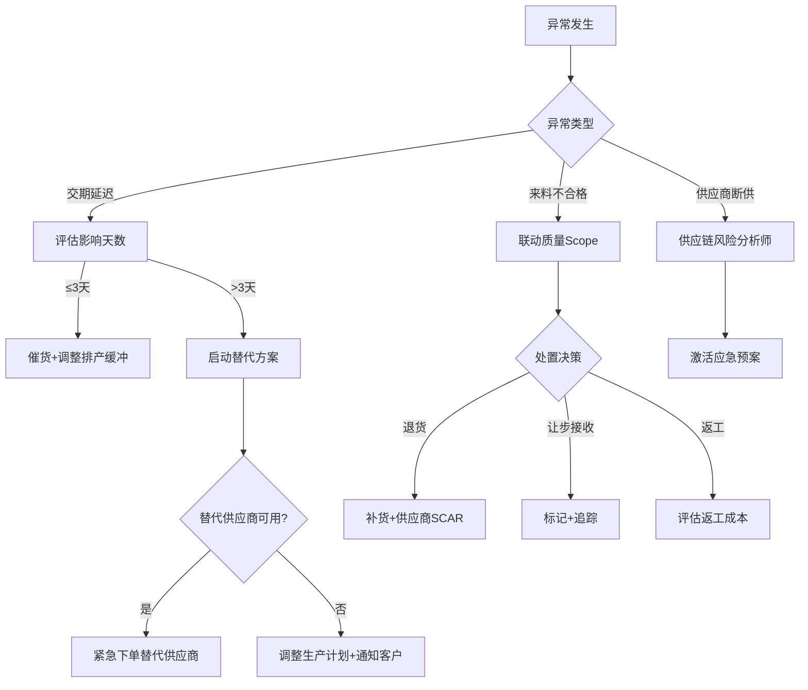
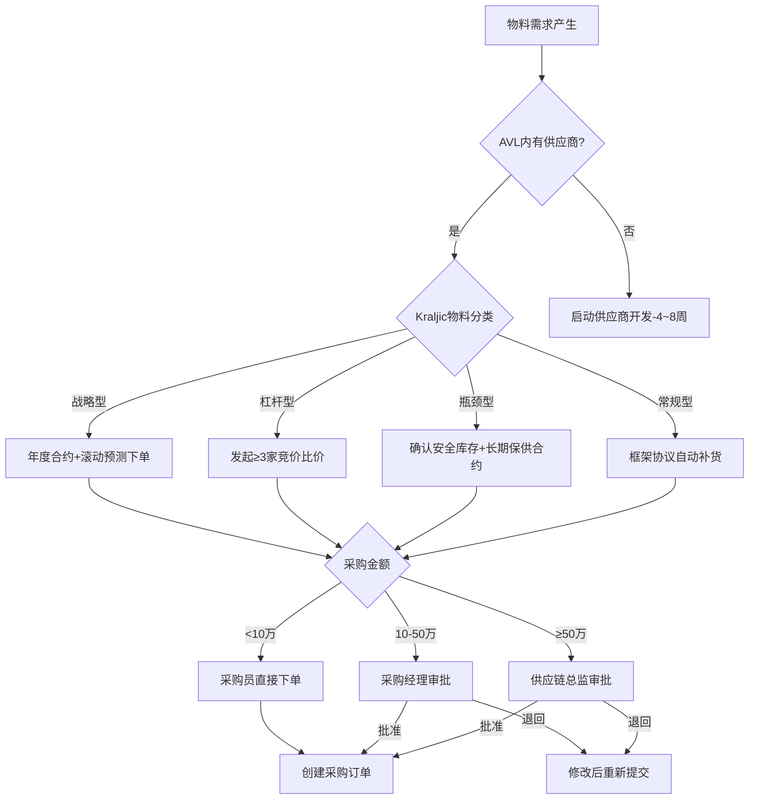
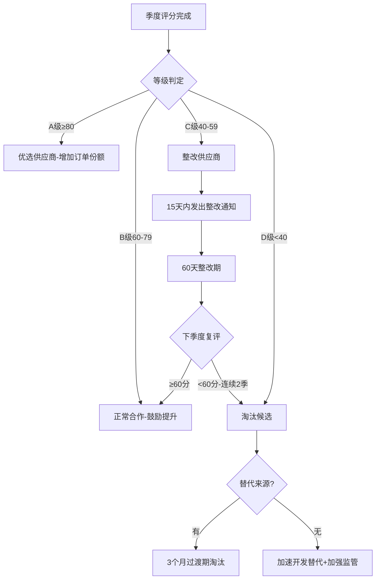

# 供应链管理标准作业程序（SOP）

## 文档信息
- 文档编号：SOP-SCM-2024
- 版本：V1.0
- 适用范围：制造业供应链管理全流程
- 关键指标：准时交付率≥95%、原材料库存周转率≥6次/年、采购成本节降率≥3%/年

---

## 一、总体流程架构

供应链管理包含三大核心流程和一个支撑流程：
1. **SOP-SC-001**：采购请购与审批流程（日常执行）
2. **SOP-SC-002**：供应商评估与管理流程（季度执行）
3. **SOP-SC-003**：库存盘点与优化流程（月度执行）
4. **SOP-SC-004**：供应链风险管理流程（持续执行）

---

## 二、RACI责任矩阵

| 流程步骤 | 采购计划专员 | 供应商关系管理专员 | 库存管理专员 | 供应链风险分析师 | 采购经理 | 供应链总监 |
|---------|:---:|:---:|:---:|:---:|:---:|:---:|
| **SOP-SC-001 采购请购与审批** |||||||
| 需求接收与分析 | R/A | I | C | I | I | - |
| 供应商选择与匹配 | R | C | I | C | I | - |
| 报价比较与谈判 | R | C | - | I | A | - |
| 审批流转（<10万） | R/A | - | - | - | I | - |
| 审批流转（10-50万） | R | - | - | - | A | I |
| 审批流转（≥50万） | R | - | - | - | C | A |
| 订单下达与确认 | R/A | I | I | - | I | - |
| 订单执行跟踪 | R | C | I | I | I | - |
| 交期异常处理 | R | C | C | C | A | I |
| **SOP-SC-002 供应商评估** |||||||
| 季度数据采集 | C | R | C | C | I | - |
| 四维度评分计算 | I | R/A | I | I | I | - |
| 等级判定 | I | R | - | C | A | I |
| 整改通知发出 | I | R | - | - | A | I |
| 淘汰流程启动 | I | R | C | C | C | A |
| 新供应商开发 | C | R/A | - | C | I | I |
| 现场审核执行 | I | R | - | C | A | I |
| **SOP-SC-003 库存管理** |||||||
| 库存水位监控 | I | - | R/A | I | - | - |
| 补货信号生成 | C | - | R | - | I | - |
| 安全库存调整建议 | C | C | R | C | A | - |
| 循环盘点执行 | - | - | R/A | - | I | - |
| 差异分析与调账 | - | - | R | - | A | I |
| 呆滞物料识别 | - | - | R | - | I | - |
| 呆滞物料处置决策 | C | C | R | - | A | I |
| **SOP-SC-004 风险管理** |||||||
| 风险信号监控 | I | C | I | R/A | - | I |
| 风险评估与分级 | I | C | C | R/A | I | I |
| 应急预案制定 | C | C | C | R | A | I |
| 压力测试执行 | C | C | C | R/A | I | A |
| 应急预案激活 | C | C | C | R | C | A |

> R=Responsible(执行), A=Accountable(审批), C=Consulted(咨询), I=Informed(知会)

---

## 三、SOP-SC-001：采购请购与审批流程

### 3.1 流程概述
将物料需求转化为采购订单的端到端流程，确保需求满足的同时遵循合规性要求（AVL匹配、分级审批、Kraljic策略）。

### 3.2 触发条件
- MRP运算完成后产生计划订单（周度/月度）
- 库存降至再订货点触发补货信号
- 生产计划变更产生新增/调整需求
- 紧急需求（插单/试产/售后备件）

### 3.3 详细步骤

#### 步骤1：需求接收与分析
- **执行者**：采购计划专员
- **动作**：
  1. 接收MRP计划订单或补货信号
  2. 校验需求数量：对比MRP运算逻辑（毛需求-库存-在途=净需求）
  3. 合并时间窗口内同一物料多次需求
  4. 标注需求紧急程度（正常/加急/特急）
  5. 确认物料的Kraljic分类
- **输出**：经验证的采购需求清单
- **质量检查点**：
  - ✅ 需求数量是否与MRP/安全库存计算一致
  - ✅ 是否扣除在途库存避免重复采购
  - ✅ 紧急需求是否有合理的业务依据
- **异常处理**：
  - 需求数据异常（负数/极大值）→ 退回计划部门核实
  - 物料编码无效 → 联系工程确认BOM准确性

#### 步骤2：供应商选择与匹配
- **执行者**：采购计划专员
- **动作**：
  1. 从AVL中筛选该物料的合格供应商
  2. 按Kraljic分类匹配采购策略：
     - 战略型 → 匹配年度合约供应商，按预测下单
     - 杠杆型 → 发起比价流程（≥3家报价）
     - 瓶颈型 → 确认保供合约和安全库存
     - 常规型 → 框架协议自动匹配
  3. 检查关键物料多源要求（≥2家供应商）
  4. 参考供应商绩效评分确定推荐顺序
- **输出**：供应商匹配方案（含报价/交期/策略依据）
- **质量检查点**：
  - ✅ 是否从AVL中选择供应商（禁止AVL外采购）
  - ✅ 关键物料是否满足多源要求
  - ✅ Kraljic策略匹配是否正确
- **异常处理**：
  - AVL内无合格供应商 → 触发供应商开发流程（SOP-SC-002）
  - 仅一家供应商但属关键物料 → 标注单源风险，同步触发备选开发

#### 步骤3：报价比较与审批准备
- **执行者**：采购计划专员
- **动作**：
  1. 汇总供应商报价（杠杆型物料需≥3家比价）
  2. 编制比价分析表（单价/MOQ/交期/付款条件/历史价格对比）
  3. 计算总采购金额，确定审批层级：
     - <10万：采购员可直接下单
     - 10-50万：提交采购经理审批
     - ≥50万：提交供应链总监审批
  4. 准备审批材料（需求依据+比价结果+推荐意见）
- **输出**：审批申请单（含比价表和推荐意见）
- **质量检查点**：
  - ✅ 审批层级是否符合金额权限要求
  - ✅ 比价是否充分（杠杆型≥3家）
  - ✅ 推荐理由是否有数据支撑

#### 步骤4：审批流转
- **执行者**：采购经理/供应链总监（按金额）
- **动作**：
  1. 审核需求合理性和采购策略
  2. 审核供应商选择和价格合理性
  3. 做出批准/退回/要求补充说明的决定
  4. 审批结果反馈给采购计划专员
- **输出**：审批结果
- **时效要求**：常规3个工作日内，紧急24小时内
- **异常处理**：
  - 审批超时 → 系统自动提醒 → 超3天升级到上级
  - 审批退回 → 分析退回原因 → 修改后重新提交

#### 步骤5：订单下达与确认
- **执行者**：采购计划专员
- **动作**：
  1. 审批通过后在ERP中创建采购订单（PO）
  2. 发送PO给供应商
  3. 要求供应商3个工作日内确认交期
  4. 供应商确认交期 vs 需求日期对比
  5. 确认一致 → 关闭确认环节；交期晚于需求 → 进入异常处理
- **输出**：已确认的采购订单
- **质量检查点**：
  - ✅ 订单交期是否满足生产需求日期
  - ✅ 订单数量/单价/规格是否与审批一致
  - ✅ 供应商是否在3天内确认

#### 步骤6：订单执行跟踪
- **执行者**：采购计划专员
- **动作**：
  1. 每日巡检活跃PO状态
  2. 对临近交期（7天内）的订单进行重点跟踪
  3. 到货后联动IQC执行来料检验
  4. 检验合格 → 入库 → PO关闭
  5. 更新供应商交期达成率数据
- **输出**：订单状态报告、OTD达成率
- **质量检查点**：
  - ✅ 采购订单准时关闭率≥92%
  - ✅ 到货后24小时内完成IQC送检

### 3.4 异常处理路径

---

## 四、SOP-SC-002：供应商评估与管理流程

### 4.1 流程概述
季度性供应商绩效评估和全生命周期管理流程，通过客观的数据化评分驱动供应商持续改善或有序退出。

### 4.2 触发条件
- 季度末（每年3/6/9/12月最后一周）
- 新供应商试用期满
- 重大质量/交期事件后的临时评估
- 供应商年度合约续签前

### 4.3 详细步骤

#### 步骤1：季度数据采集
- **执行者**：供应商关系管理专员
- **动作**：
  1. 从IQC系统提取来料批次检验数据（合格率/不良率/SCAR记录）
  2. 从ERP提取交货记录（OTD达成率/确认响应时间）
  3. 汇总成本相关数据（年度降价执行/报价竞争力/隐性成本）
  4. 收集服务评价（技术支持/沟通配合/产能弹性）— 多人打分取均值
  5. 校验数据完整性和准确性
- **输出**：供应商评分原始数据表
- **质量检查点**：
  - ✅ 数据来源是否客观（系统数据为主，人工评分为辅）
  - ✅ 样本量是否充足（季度交货≥3次）
  - ✅ 服务维度是否多人参与评分（≥3人）

#### 步骤2：四维度评分计算
- **执行者**：供应商关系管理专员
- **动作**：
  1. 质量维度（40%权重）= 来料合格率×0.6 + SCAR响应×0.2 + 改善有效性×0.2
  2. 交期维度（30%权重）= OTD×0.7 + 确认响应×0.15 + 承诺准确率×0.15
  3. 成本维度（20%权重）= 降价配合×0.5 + 报价竞争力×0.3 + 隐性成本×0.2
  4. 服务维度（10%权重）= 技术支持×0.4 + 沟通配合×0.3 + 产能弹性×0.3
  5. 综合得分 = Q×0.4 + D×0.3 + C×0.2 + S×0.1
- **输出**：供应商评分卡（明细+总分）
- **质量检查点**：
  - ✅ 权重计算是否准确（质量40%交期30%成本20%服务10%）
  - ✅ 各子项评分是否有数据依据
  - ✅ 计算逻辑是否正确（可复核）

#### 步骤3：等级判定与趋势分析
- **执行者**：供应商关系管理专员
- **动作**：
  1. 按分数段判定等级：A≥80 / B:60-79 / C:40-59 / D<40
  2. 对比上季度评分，标注趋势（↑↓→）
  3. 标记连续两季度低分（<60）的供应商
  4. 分析评分变化的主要原因
- **输出**：供应商等级判定结果

#### 步骤4：结果沟通与行动触发
- **执行者**：供应商关系管理专员
- **动作**：
  1. A/B级供应商：发送评分结果+鼓励函
  2. C级供应商（<60分）：
     - 15个工作日内发出正式整改通知
     - 明确问题点、改善目标和完成时限（通常60天）
     - 安排整改辅导会议
  3. D级供应商或连续两季度C级：
     - 确认其所供物料是否有替代来源
     - 有替代 → 启动淘汰流程（3个月过渡期）
     - 无替代 → 加强监管+加速开发替代
  4. 评分结果同步给采购计划专员（影响订单分配）
- **输出**：整改通知书/淘汰决策/改善计划
- **质量检查点**：
  - ✅ 低分供应商是否在15天内收到正式整改通知
  - ✅ 淘汰供应商的物料是否有替代来源确认
  - ✅ 整改目标是否具体可量化

### 4.4 新供应商开发子流程

| 阶段 | 时间 | 动作 | 通过标准 |
|------|------|------|---------|
| 寻源 | 1周 | 市场调研、候选筛选 | ≥3家候选 |
| 初审 | 1周 | 资质审查、能力评估 | 基本门槛通过 |
| 现场审核 | 1-2周 | QSA现场审核 | 审核评分≥70 |
| 试用 | 3-6个月 | 小批量试用考核 | 3批次以上合格 |
| 准入 | 1周 | AVL准入审批 | 多方会签通过 |

---

## 五、SOP-SC-003：库存盘点与优化流程

### 5.1 流程概述
通过月度循环盘点确保账实相符，通过库存优化分析持续降低库存成本同时保障供应。

### 5.2 触发条件
- 每月最后一周（月度循环盘点）
- 库存差异金额>5000元（触发专项调查）
- 库存周转率连续下降（触发优化分析）
- 呆滞物料金额超标（触发处置评审）

### 5.3 详细步骤

#### 步骤1：月度循环盘点
- **执行者**：库存管理专员
- **动作**：
  1. 按ABC分类制定盘点计划：A类每月盘点，B类每季度，C类每半年
  2. 生成盘点清单（物料/库位/系统数量）
  3. 组织仓库人员执行实盘
  4. 录入实盘结果，系统自动对比生成差异报告
- **输出**：盘点差异报告
- **质量检查点**：
  - ✅ 账实相符率≥99%
  - ✅ A类物料100%纳入本月盘点

#### 步骤2：差异分析与调账
- **执行者**：库存管理专员
- **动作**：
  1. 对差异物料分析原因（收发错误/计量误差/盗损/系统bug）
  2. 差异金额≤5000元：标准调账流程处理
  3. 差异金额>5000元：必须查明原因，提交调查报告
  4. 制定防再发措施
- **输出**：差异原因分析报告、调账凭证
- **质量检查点**：
  - ✅ 差异金额>5000元是否查明原因
  - ✅ 调账是否经过审批
  - ✅ 是否制定防再发措施

#### 步骤3：呆滞物料识别与处置
- **执行者**：库存管理专员
- **动作**：
  1. 筛选180天无出库动态的物料
  2. 分析呆滞原因并制定处置方案
  3. 提交处置方案评审：
     - 报废金额<1万：部门经理审批
     - 报废金额1-5万：总监审批
     - 报废金额>5万：总经理审批
  4. 执行处置并核销账面
- **输出**：呆滞物料处置方案、审批记录
- **质量检查点**：
  - ✅ 呆滞物料（180天无动态）是否有处置计划
  - ✅ 处置方案是否经济合理
  - ✅ 审批层级是否正确

#### 步骤4：库存周转率分析
- **执行者**：库存管理专员
- **动作**：
  1. 月度计算各品类周转率
  2. 对比目标值：原材料≥6次/年，成品≥12次/年
  3. 对周转率未达标品类分析原因
  4. 提出改善建议（调整安全库存/优化批量/消化呆滞）
- **输出**：月度库存周转率报告
- **质量检查点**：
  - ✅ 库存周转率是否达标
  - ✅ 周转率下降物料是否有分析和改善计划

---

## 六、SOP-SC-004：供应链风险管理流程

### 6.1 流程概述
持续监控供应链风险信号，进行分级评估和早期预警，维护应急预案并定期压力测试，确保供应链在突发事件下的快速恢复能力。

### 6.2 触发条件
- 每日自动风险信号扫描（常态化）
- 突发事件发生（地震/疫情/供应商事故）
- 季度压力测试执行
- 半年度应急预案Review

### 6.3 详细步骤

#### 步骤1：风险信号监控
- **执行者**：供应链风险分析师
- **动作**：
  1. 监控大宗商品价格波动（日频）
  2. 扫描供应商舆情和工商信息变更（日频）
  3. 监控物流通道状态和运力信息（日频）
  4. 跟踪汇率变动和政策法规变化（周频）
  5. 关注供应商所在区域气象/地质预警（实时）
- **输出**：风险信号日报/周报
- **质量检查点**：
  - ✅ 所有关键物料供应商覆盖监控
  - ✅ 价格波动>5%触发关注，>10%触发行动

#### 步骤2：风险评估与分级
- **执行者**：供应链风险分析师
- **动作**：
  1. 对识别的风险信号进行影响评估
  2. 计算风险值 = 发生概率(1-5) × 影响程度(1-5)
  3. 分级：一级(≥15)紧急/二级(10-14)重要/三级(<10)关注
  4. 高风险信号4小时内完成评估并通知stakeholder
- **输出**：风险评估报告、预警通知
- **时效要求**：一级风险4小时内报告，二级24小时内报告

#### 步骤3：应急预案管理
- **执行者**：供应链风险分析师
- **动作**：
  1. 为每个关键物料维护供应中断应急预案
  2. 预案内容：替代供应商/替代物料/库存覆盖天数/切换时间
  3. 半年度验证预案有效性
  4. 风险事件发生时按预案执行
- **输出**：应急预案文档、验证记录
- **质量检查点**：
  - ✅ 关键物料100%有应急预案
  - ✅ 预案半年度更新验证
  - ✅ 库存覆盖天数 > 替代方案切换时间

#### 步骤4：压力测试
- **执行者**：供应链风险分析师
- **动作**：
  1. 每季度执行一次供应链压力测试
  2. 设定测试情景（单一断供/区域中断/需求突增/价格暴涨）
  3. 模拟分析各情景下的影响（停产天数/成本增加/客户影响）
  4. 评估供应链韧性评分
  5. 识别薄弱环节并提出改善建议
- **输出**：压力测试报告、韧性评分、改善路线图
- **质量检查点**：
  - ✅ 测试情景覆盖历史事件和潜在极端情景
  - ✅ 薄弱环节有明确改善责任和时间表

---

## 七、决策树

### 7.1 采购决策树

### 7.2 供应商管理决策树

---

## 八、KPI指标与质量控制

### 8.1 核心KPI

| 指标 | 目标值 | 计算方式 | 监控频率 | 责任Agent |
|------|--------|---------|---------|-----------|
| 准时交付率(OTD) | ≥95% | 按时到货订单数/总订单数 | 月度 | 采购计划专员 |
| 原材料库存周转率 | ≥6次/年 | 年消耗金额/平均库存金额 | 月度 | 库存管理专员 |
| 成品库存周转率 | ≥12次/年 | 年销售成本/平均成品库存 | 月度 | 库存管理专员 |
| 采购成本节降率 | ≥3%/年 | (去年单价-今年单价)/去年单价 | 季度 | 采购计划专员 |
| 供应商评分合格率 | ≥90% | 评分≥60供应商数/总评分数 | 季度 | 供应商关系管理专员 |
| 关键物料多源覆盖率 | 100% | 有≥2家供应商的关键物料/全部关键物料 | 季度 | 供应商关系管理专员 |
| 账实相符率 | ≥99% | 盘点无差异SKU数/盘点总SKU数 | 月度 | 库存管理专员 |
| 采购订单准时关闭率 | ≥92% | 准时关闭PO数/应关闭PO数 | 月度 | 采购计划专员 |

### 8.2 过程质量检查点汇总

| 检查点 | 频率 | 标准 | 未达标处理 |
|--------|------|------|-----------|
| 采购建议与MRP一致性 | 每次 | 数量偏差<5% | 退回核实 |
| AVL供应商选择合规 | 每次 | 100%从AVL选择 | 驳回+升级 |
| 审批层级正确性 | 每次 | 100%合规 | 退回+通报 |
| 订单交期满足需求 | 每次 | 确认交期≤需求日期 | 触发异常处理 |
| 供应商评分数据完整性 | 季度 | 数据覆盖率≥95% | 补充数据后重算 |
| 整改通知及时性 | 季度 | 15天内发出 | 责任追踪 |
| 盘点账实相符率 | 月度 | ≥99% | 差异调查+整改 |
| 呆滞物料处置率 | 月度 | 90天内处置完成≥80% | 升级评审 |

---

## 九、跨Scope协作接口

| 协作场景 | 本Scope输出 | 对接Scope | 对接方输出 |
|---------|------------|----------|-----------|
| 来料检验 | 到货通知+送检申请 | 质量管理 | 检验结果（合格/不合格） |
| 供应商质量评分 | 供应商交付数据 | 质量管理 | IQC合格率+SCAR数据 |
| 生产计划联动 | 物料齐套确认 | IoT与产线优化 | 排产计划+物料消耗预测 |
| 客户影响评估 | 供应中断影响分析 | 客户反馈 | 客户优先级+交期承诺 |
| 设备备件协同 | 备件采购执行 | 设备维护 | 备件需求计划 |

---

## 十、文档版本控制

| 版本 | 日期 | 变更内容 | 审核人 |
|------|------|---------|--------|
| V1.0 | 2024-01 | 初始版本发布 | 供应链总监 |
