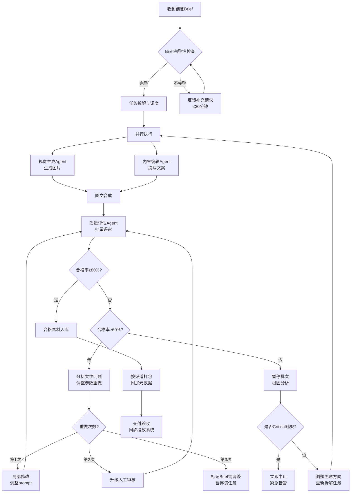

# 创意生产与内容创作 — 标准作业流程（SOP）

## 1. 概述

本SOP定义了AI驱动的创意生产全流程标准，覆盖从创意需求受理到素材交付的端到端流程。适用于批量广告素材（图片、文案、图文合成件）的规模化生产场景，目标实现单图<30秒、批量100+素材的高效产出，同时确保品牌合规通过率≥95%、质量合格率≥80%。

---

## 2. RACI矩阵

| 流程步骤 | 创意总监Agent | 视觉生成Agent | 内容编辑Agent | 质量评估Agent | 人工管理者 |
|----------|:---:|:---:|:---:|:---:|:---:|
| SOP-1 创意需求受理 | **R/A** | I | I | I | C |
| SOP-2 任务拆解与调度 | **R/A** | I | I | - | I |
| SOP-3 视觉素材生成 | C | **R/A** | I | - | - |
| SOP-4 文案撰写与翻译 | C | - | **R/A** | - | - |
| SOP-5 图文合成 | C | C | **R/A** | - | - |
| SOP-6 质量评估与合规检查 | I | I | I | **R/A** | - |
| SOP-7 不合格处理与重做 | **R/A** | R | R | C | I |
| SOP-8 素材交付与入库 | **R/A** | - | - | C | I |
| SOP-9 异常处理与告警 | **R** | I | I | I | **A** |

> R=Responsible（执行者）, A=Accountable（负责人）, C=Consulted（咨询方）, I=Informed（知会方）

---

## 3. 详细流程步骤

### SOP-1: 创意需求受理

**触发条件：** 收到新的创意需求Brief（来自营销团队、投放系统或上游Scope）

**执行动作：**
1. 创意总监Agent接收Brief并执行完整性验证
2. 检查以下必填项是否齐备：
   - ✅ 品牌指南（Logo文件 + 色彩体系 + 字体清单 + 品牌调性说明）
   - ✅ 受众画像（目标人群特征、消费场景）
   - ✅ 渠道规格（平台列表 + 广告位类型 + 尺寸要求）
   - ✅ 语言要求（目标语言列表 + 是否需要文化适配）
   - ✅ 数量与排期（素材数量 + 变体数量 + 交付截止时间）
3. 对可选但建议提供的信息进行标记：
   - 参考素材/竞品参考
   - 历史高效素材数据
   - 禁忌项说明

**输出物：**
- Brief完整性验证报告
- 缺失项反馈请求（如有）

**异常处理：**
- Brief缺失关键信息 → 30分钟内发送补充请求，附带缺失影响说明
- Brief信息矛盾（如品牌调性与参考图风格冲突）→ 标注矛盾点并请求澄清
- Brief需求超出系统能力（如需真人视频拍摄）→ 说明能力边界并建议替代方案

**时效要求：** Brief验证≤10分钟，缺失反馈≤30分钟

---

### SOP-2: 任务拆解与调度

**触发条件：** Brief验证通过（所有必填项齐备）

**执行动作：**
1. 分析素材类型需求，拆解为独立任务：
   - 视觉生成任务（产品图/场景图/主图）
   - 文案撰写任务（标题/正文/CTA × 语言数 × 变体数）
   - 图文合成任务（视觉+文案合成最终稿）
2. 设定任务优先级（P0/P1/P2/P3）
3. 构建任务依赖关系DAG
4. 规划并发批次（单批次≤50，总批次按优先级排序）
5. 向视觉生成Agent和内容编辑Agent下发任务指令

**输出物：**
- 结构化任务清单（JSON格式）
- 批次执行计划
- 预估完成时间线

**异常处理：**
- 任务总量超过500 → 自动拆分为多个批次，标注优先级执行顺序
- 交付时间过紧 → 评估可行性，建议减少变体数或缩减渠道覆盖

**时效要求：** 任务拆解≤5分钟

---

### SOP-3: 视觉素材生成

**触发条件：** 收到创意总监Agent的视觉生成任务指令

**执行动作：**
1. 解析任务指令中的风格方向、目标尺寸、品牌色彩
2. 构建图像生成Prompt（结构化Prompt工程）
3. 设置生成参数（分辨率≥2048px、guidance scale、steps等）
4. 执行图像生成
5. 生成后自检（AI伪影、色彩偏差、构图合理性）
6. 自检不通过 → 自动调整prompt重试（最多2次自我迭代）
7. 生成A/B变体（控制单一变量）
8. 输出素材及完整元数据

**输出物：**
- 生成图片文件（多尺寸版本）
- 元数据记录（prompt/seed/style_tags/variant_label）
- 自检报告

**异常处理：**
- 单张生成超时（>30秒）→ 降低steps参数重试一次，仍超时则标记失败上报
- 生成结果严重偏离Brief → 分析prompt问题，向创意总监反馈需要更明确的风格指引
- 生成模型不可用 → 切换备用模型，记录降级状态

**时效要求：** 单张图片≤30秒，批量50张≤10分钟

**KPI指标：**
- 生成成功率≥95%
- 自检通过率≥70%（减少质量评估环节压力）
- 单张平均耗时≤25秒

---

### SOP-4: 文案撰写与翻译

**触发条件：** 收到创意总监Agent的文案任务指令

**执行动作：**
1. 解析文案Brief（核心卖点、目标受众、品牌调性、目标情感）
2. 按AIDA模型撰写源语言文案（标题+正文+CTA）
3. 生成3-5个文案变体（差异化维度：情感/策略/语气）
4. 执行广告法合规自检
5. 对目标语言列表执行本地化（文化重创作而非逐字翻译）
6. 验证各渠道字符长度限制
7. 输出结构化文案数据

**输出物：**
- 结构化文案输出（headline/body/cta × 变体数 × 语言数）
- 合规自检报告
- 本地化适配说明

**异常处理：**
- 品牌术语无官方译法 → 标注"需确认翻译"并提供2-3个建议
- 文案长度超出渠道限制 → 自动改写缩短版本（保持核心信息）
- 目标语言为小语种 → 标注confidence_score，低于7分建议人工review

**时效要求：** 单语言单变体文案≤15秒，批量100条文案≤5分钟

---

### SOP-5: 图文合成

**触发条件：** 对应的视觉素材和文案均已生成完成

**执行动作：**
1. 匹配视觉素材与对应文案（按task_id关联）
2. 确认排版规范（字体/字号/颜色/位置）
3. 执行文案叠加渲染
4. Logo标准化放置
5. 安全区域验证
6. 文字可读性检查（对比度≥4.5:1）
7. 输出最终合成件

**输出物：**
- 最终可投放素材文件（PNG/JPG）
- 排版规格说明（字体/坐标/颜色代码）
- 合成质量自检结果

**异常处理：**
- 文案过长导致排版拥挤 → 自动调整字号或建议文案缩减
- 文字与背景对比度不足 → 添加半透明底色条或文字投影
- 视觉素材未预留足够文案区域 → 反馈给视觉生成Agent建议重新构图

**时效要求：** 单件合成≤10秒

---

### SOP-6: 质量评估与合规检查

**触发条件：** 收到待评估素材（来自视觉生成、文案撰写或图文合成环节）

**执行动作：**
1. **品牌合规5项检查**（一票否决制）：
   - Logo使用规范 ✓/✗
   - 主色调符合度 ✓/✗
   - 字体规范 ✓/✗
   - 安全区预留 ✓/✗
   - 分辨率达标 ✓/✗
2. **视觉质量评分**（1-10分，4维度加权）：
   - 清晰度（25%）
   - 构图质量（25%）
   - 美观度（25%）
   - AI伪影（25%）
3. **文案质量评审**（如适用）：
   - 语法语义（30%）
   - 情感匹配（20%）
   - 广告法合规（30%）
   - 商业说服力（20%）
4. 输出评估报告

**输出物：**
- 素材评分报告（逐项评分+综合分）
- 合规检查清单结果
- 问题列表和改进建议
- 批次汇总统计

**质量关卡标准：**
- 品牌合规：5项全通过
- 视觉质量：综合分≥7.0（单项≤3分一票否决）
- 文案质量：综合分≥7.0（广告法Critical一票否决）

**异常处理：**
- 品牌合规Critical违规（Logo缺失/错误）→ 立即触发紧急告警，中止该批次
- 批次合格率<60% → 暂停批次，触发创意方向review
- 评估模型响应异常 → 队列等待重试，超过1分钟上报

**时效要求：** 单素材评估≤5秒，批量100件≤3分钟

**KPI指标：**
- 批次合格率≥80%
- 品牌合规通过率≥95%
- 评估一致性（同素材多次评估差异<0.5分）

---

### SOP-7: 不合格处理与重做

**触发条件：** 质量评估结果为fail或conditional_pass需修改

**执行动作：**

**第一次不合格：**
1. 分析不合格原因
2. 生成具体修改指令（精确到参数级别）
3. 调整prompt参数/排版参数
4. 重新生成/合成
5. 重新提交质量评估

**第二次不合格：**
1. 分析重复失败的模式
2. 判断是参数问题还是方向问题
3. 如是参数问题 → 更大幅度调整后重试
4. 如是方向问题 → 升级人工审核，请求方向指导
5. 通知人工管理者

**第三次不合格：**
1. 标记为"Brief需求调整"
2. 生成问题诊断报告（包含3次尝试的详细记录）
3. 暂停该任务的自动重做
4. 等待人工决策（调整Brief/更换参考/放弃该方向）

**输出物：**
- 重做指令（含具体修改参数）
- 失败原因分析
- 问题诊断报告（第三次不合格时）

**异常处理：**
- 重做任务积压 → 优先处理高优先级任务，低优先级可延后
- 同一问题在多个任务中出现 → 识别为系统性问题，暂停相似任务统一修复

**时效要求：** 重做决策≤30秒，重做执行时效同原任务

---

### SOP-8: 素材交付与入库

**触发条件：** 批次中所有素材完成质量评估（合格+已处理的不合格）

**执行动作：**
1. 汇总本批次最终产出：
   - 合格素材列表
   - 条件通过素材列表（附注意事项）
   - 未解决的不合格素材列表（含原因）
2. 按渠道规格分类打包
3. 附加素材元数据：
   - 版本号（v1/v2...）
   - 变体标签（A/B/C）
   - 适用受众标签
   - 适用渠道
   - 生成参数（用于复现）
   - 有效期/过期时间
4. 执行交付完整性验收（对照原始Brief逐项确认）
5. 同步至投放系统素材库

**输出物：**
- 素材交付包（按渠道/受众/语言组织）
- 交付清单与完整性验收报告
- 批次执行总结报告

**异常处理：**
- 交付不完整（部分素材仍在重做中）→ 先交付已完成部分，标注待补充项和预计时间
- 投放系统对接失败 → 本地存储+重试，通知技术团队

**时效要求：** 交付打包≤5分钟，系统同步≤1分钟

---

### SOP-9: 异常处理与紧急告警

**触发条件：** 各环节检测到的异常情况

**异常类型与处理方案：**

| 异常类型 | 严重等级 | 自动处理 | 人工介入 |
|----------|----------|----------|----------|
| 单任务超时 | Low | 重试1次+降参数 | 否 |
| 批量任务超时风险 | Medium | 降级策略执行 | 通知 |
| 品牌合规Critical违规 | Critical | 中止批次 | 必须 |
| 生成模型不可用 | High | 切换备用模型 | 通知 |
| 批次合格率<60% | High | 暂停批次 | 通知 |
| 投诉/法务风险素材 | Critical | 立即下架标记 | 必须 |

**告警升级机制：**
- Level 1（自动处理）：系统自动执行预设恢复策略
- Level 2（通知人工）：自动处理+发送通知，人工可选择介入
- Level 3（人工必须介入）：自动采取保守措施（暂停/中止）+强制等待人工决策

---

## 4. 决策树

---

## 5. KPI指标与质量检查点

### 核心KPI

| 指标 | 目标值 | 测量频率 | 告警阈值 |
|------|--------|----------|----------|
| 单图生成速度 | ≤30秒 | 每任务 | >45秒 |
| 单视频生成速度 | ≤5分钟 | 每任务 | >8分钟 |
| 批量任务吞吐量 | 100+素材/批次 | 每批次 | <50素材/批次 |
| 质量评估合格率 | ≥80% | 每批次 | <70% |
| 品牌合规通过率 | ≥95% | 每批次 | <90% |
| 素材重新生成率 | <20% | 每日 | >30% |
| Brief到交付端到端时长 | 视批量而定 | 每批次 | 超出预估50% |
| 多语言覆盖率 | 140+语言 | 每月 | 新增语言失败 |

### 质量检查点（Quality Gates）

| 检查点 | 位置 | 检查内容 | 通过条件 |
|--------|------|----------|----------|
| QG-1 | Brief受理后 | Brief完整性 | 所有必填项齐备 |
| QG-2 | 视觉生成后 | 生成自检 | 无明显AI伪影、色彩不偏离 |
| QG-3 | 文案撰写后 | 合规自检 | 无广告法违规词 |
| QG-4 | 图文合成后 | 排版检查 | 文字可读、安全区合规 |
| QG-5 | 正式评估 | 全维度评审 | 品牌合规5项全过+质量分≥7 |
| QG-6 | 交付前 | 完整性验收 | 对照Brief全部需求已满足 |

---

## 6. 与其他Scope的协同接口

| 协同方向 | 对接Scope | 数据流 | 频率 |
|----------|-----------|--------|------|
| 输出→ | 广告投放优化 | 合格素材包+元数据 | 每次交付 |
| 输入← | 广告投放优化 | 素材效果反馈（CTR/CVR） | 每日 |
| 输入← | 数据洞察智能 | 竞品创意趋势、爆款方向 | 每周 |
| 输出→ | 用户获客 | 个性化营销素材 | 按需 |

---

## 7. 持续优化机制

1. **素材效果回流**：投放后的CTR/CVR数据反馈，用于优化创意方向（高CTR素材特征 → 指导后续Brief方向）
2. **评估标准校准**：每月对比质量评分与实际投放效果的相关性，调整评分权重
3. **prompt模板迭代**：积累高分素材的prompt，建立风格模板库
4. **合规规则更新**：跟踪广告法规变化，及时更新合规检查规则库
5. **异常模式学习**：将处理过的异常案例转化为预防规则
