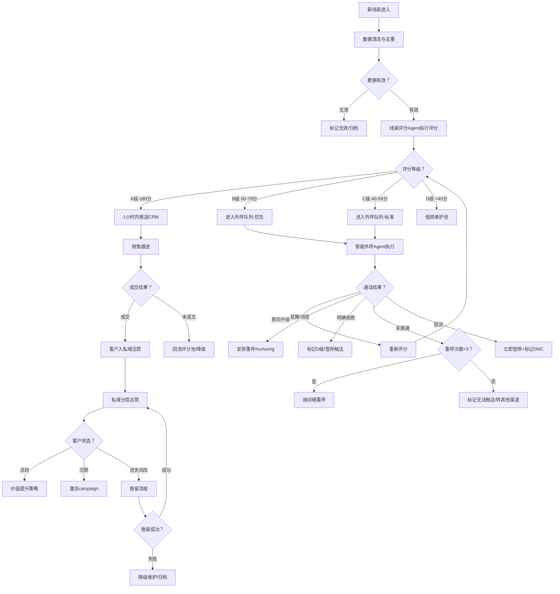

# 用户获客与智能外呼 - 标准作业程序（SOP）

## 1. 概述

本SOP定义了用户获客与智能外呼业务Scope的完整操作流程标准，覆盖从线索接入、评分分级、外呼触达、私域运营到流失预警的全链路。所有Agent和人工角色需严格按照本SOP执行，确保获客效率最大化和客户体验一致性。

**适用范围**：智能外呼Agent、线索评分Agent、私域运营Agent及相关协作人员
**版本**：v1.0
**关键目标**：日处理10000+外呼、A级线索1小时内分配率>95%、获客成本CAC环比降低5%

---

## 2. RACI责任矩阵

| 流程步骤 | 智能外呼Agent | 线索评分Agent | 私域运营Agent | 销售团队 | 运营主管 |
|---------|:---:|:---:|:---:|:---:|:---:|
| SOP-1 线索接入与清洗 | I | R/A | I | I | C |
| SOP-2 智能外呼执行 | R/A | C | I | I | C |
| SOP-3 A级线索流转 | I | R/A | I | R | C |
| SOP-4 流失预警处理 | C | C | R/A | I | C |
| SOP-5 评分模型验证 | I | R/A | C | I | A |
| SOP-6 获客成本核算 | C | C | C | I | R/A |

> R=Responsible(执行者) A=Accountable(负责人) C=Consulted(咨询方) I=Informed(知会方)

---

## 3. SOP-1：线索接入与清洗

### 触发条件
- 新线索从以下渠道进入系统：广告投放（表单填写/咨询点击）、官网（注册/浏览深度触发）、活动（报名/签到）、第三方数据源
- 触发频率：实时流式处理

### 执行步骤

**Step 1.1 数据接收与去重（≤5分钟）**
1. 接收原始线索数据（姓名、手机号、公司、来源渠道、表单内容）
2. 手机号格式校验（11位数字、区号验证）
3. 去重检查：与存量线索库匹配（手机号+公司名联合去重）
4. 重复线索处理：更新已有记录的来源渠道和最新行为时间戳

**Step 1.2 数据质量清洗（≤10分钟）**
1. 空号检测：通过号码状态接口验证号码有效性
2. 虚假信息识别：姓名乱码、公司名不合法、明显测试数据
3. 黑名单过滤：历史投诉客户、DNC名单、竞品间谍排除
4. 字段标准化：公司名统一（去除"有限公司"等后缀差异）、地域标准化

**Step 1.3 初始评分（≤15分钟）**
1. 基于可用数据执行线索评分模型
2. 输出ABCD四级评分
3. 标记数据完整度（完整/部分缺失/仅有手机号）

**Step 1.4 入库与路由**
1. 写入线索数据库，附带评分、来源、时间戳
2. 根据评分结果触发对应流转路径（见决策树）

### 输出
- 清洗后的结构化线索记录
- 初始评分和级别标签
- 无效线索过滤报告（过滤率追踪）

### KPI指标
| 指标 | 目标值 | 监控频率 |
|------|--------|---------|
| 新线索处理时效 | ≤30分钟 | 实时 |
| 去重准确率 | >99% | 每日 |
| 无效线索识别率 | >95% | 每日 |
| 数据完整度 | >80%字段填充 | 每周 |

### 异常处理
- **线索暴增（>3倍日均）**：启动排队机制，优先处理表单类高意向来源，低优先来源延迟处理
- **数据源故障**：标记中断时段，系统恢复后补充拉取，通知运营主管
- **大量无效线索**：同一渠道无效率>50%时告警，暂停该渠道接入并排查原因

---

## 4. SOP-2：智能外呼执行标准

### 触发条件
- 线索评分完成后，B/C级线索进入外呼队列
- 流失预警触发的挽留外呼任务
- 运营主管手动安排的批量外呼任务

### 执行步骤

**Step 2.1 外呼准备**
1. 从外呼队列获取待拨名单（按优先级排序：B级>C级，近期活跃>久未互动）
2. 加载对应话术模板（初筛/深度沟通/挽留/回访）
3. 检查拨打时间窗口（工作日9:00-21:00，午休12:00-14:00降低频率）
4. 确认每个号码的历史通话记录和重呼状态

**Step 2.2 通话执行**
1. 发起呼叫，接通后进入开场白
2. 初筛通话（≤3分钟）：
   - 确认身份和需求方向
   - 快速判断意向级别
   - 决定是否进入深度沟通
3. 深度沟通（≤8分钟）：
   - 需求详细探测
   - 产品/服务价值传递
   - 异议处理
   - 意向确认和下一步约定
4. 实时意图识别并切换话术分支

**Step 2.3 通话后处理**
1. 自动生成通话摘要（≤10秒）
2. 输出意向标签和情感评分
3. 更新客户记录
4. 触发线索评分更新
5. 安排下一步动作（重呼/分配销售/入私域/标记D级）

**Step 2.4 重呼策略执行**
| 未接通次数 | 下次拨打间隔 | 动作 |
|:---------:|:-----------:|------|
| 第1次 | 2小时后 | 自动重呼 |
| 第2次 | 6小时后 | 自动重呼 |
| 第3次 | 24小时后 | 最后一次尝试 |
| 第4次(仍未接) | - | 标记"无法触达"，转短信/其他渠道 |

### 输出
- 每通通话的结构化摘要
- 意向标签和评分更新信号
- 日度外呼执行报告

### KPI指标
| 指标 | 目标值 | 监控频率 |
|------|--------|---------|
| 日外呼处理量 | ≥10000通 | 每日 |
| 接通率 | ≥45% | 每日 |
| 有效对话率（接通后≥30秒） | ≥65% | 每日 |
| 意向升级率 | ≥15% | 每周 |
| 投诉率 | <0.1% | 实时 |
| 平均通话时长 | 2-5分钟 | 每日 |

### 异常处理
- **投诉率超标（≥0.1%）**：立即暂停当前批次外呼 → 分析投诉原因（话术问题/频率过高/目标错误）→ 调整后经运营主管确认重启
- **接通率骤降（<30%）**：检查号码质量和拨打时段，可能需要调整外呼时间窗口
- **系统过载**：降低并发数，优先保证通话质量而非数量

---

## 5. SOP-3：A级线索流转

### 触发条件
- 线索评分达到A级（≥80分）
- 包含：新线索直接评为A级、外呼后意向升级到A级

### 执行步骤

**Step 3.1 分配决策（≤5分钟）**
1. 确认线索已达A级评分标准（至少2个维度同时达标）
2. 查询CRM销售团队当前负载和匹配规则
3. 执行分配逻辑：行业匹配 > 地域匹配 > 负载均衡 > 轮询
4. 如有历史沟通记录，优先分配原对接销售

**Step 3.2 CRM推送与确认（≤10分钟）**
1. 调用CRM API推送完整线索包（基本信息+评分明细+通话摘要+行为轨迹）
2. 发送分配通知（CRM系统通知+企微消息+短信备选）
3. 等待系统回执确认推送成功
4. 记录分配时间戳

**Step 3.3 SLA监控**
1. 启动1小时倒计时
2. T+15分钟：检查销售是否查看
3. T+30分钟：未查看则发送二次提醒
4. T+45分钟：升级通知销售主管
5. T+60分钟：SLA超时 → 自动转分配 + 告警记录

**Step 3.4 结果回流**
1. 销售跟进后在CRM中更新状态（已联系/方案沟通/报价/成交/丢单）
2. 成交/丢单结果回流线索评分Agent用于模型验证
3. 丢单原因分析：评分是否准确？丢单是评分问题还是销售问题？

### 输出
- CRM中的线索分配记录（含时间戳和责任人）
- SLA达标/超时报告
- 销售跟进结果回流数据

### KPI指标
| 指标 | 目标值 | 监控频率 |
|------|--------|---------|
| 1小时内分配率 | >95% | 实时 |
| 销售首次响应时间 | <30分钟 | 每日 |
| A级线索转化率 | >30% | 每两周 |
| SLA超时率 | <5% | 每日 |
| 分配成功率（系统回执） | >99% | 实时 |

### 异常处理
- **CRM系统不可用**：线索写入本地缓存队列 + 即刻告警运营主管 + 系统恢复后5分钟内完成批量推送
- **目标销售无法接收**（休假/离职/满载）：自动路由到同组备选人 + 通知销售主管
- **线索信息缺失关键字段**：仍按时效分配 + 标注"信息待补充" + 销售首次联系时补全

---

## 6. SOP-4：流失预警处理

### 触发条件
- 流失预测模型输出高风险客户（流失概率>70%）
- 预警提前量：7天
- 每日凌晨模型运行完成后输出预警名单

### 执行步骤

**Step 4.1 预警接收与评估（当日9:00前）**
1. 接收当日流失预警客户名单
2. 按P0/P1/P2优先级分类
3. 分析流失驱动因子（价格/体验/竞品/自然衰退）
4. 评估总LTV at Risk（当批次）

**Step 4.2 挽留方案制定（24小时内）**
1. P0客户：逐一制定个性化挽留方案
   - 确定优惠策略（专属折扣/积分加赠/免费升级）
   - 选择触达渠道组合（企微1v1+电话+短信）
   - 撰写个性化话术
2. P1客户：按流失原因分组制定模板方案
3. P2客户：统一Push+短信模板触达

**Step 4.3 挽留执行（48小时内首次触达）**
1. P0客户：
   - 企微发送关怀消息（Day 0）
   - 安排外呼关怀电话（Day 0-1，协调智能外呼Agent）
   - 发放专属优惠（同步）
2. P1客户：
   - Push通知+短信组合（Day 0）
   - 定向优惠页面（Day 1）
   - 无响应则3天后二次触达
3. P2客户：
   - 批量Push触达（Day 0）
   - 无响应标记为低优先维护

**Step 4.4 效果追踪（30天观察期）**
1. 触达后7天：统计首次响应率
2. 触达后14天：统计回购/回流率
3. 触达后30天：最终判定挽回成功/失败
4. 成功标准：30天内产生新购买或恢复高频互动

### 输出
- 每日流失预警报告（含LTV at Risk和优先级分布）
- 挽留方案文档（P0逐一、P1/P2分组）
- 挽留效果追踪报表

### KPI指标
| 指标 | 目标值 | 监控频率 |
|------|--------|---------|
| 预警准确率（真实流失/预警流失） | >70% | 每月 |
| P0客户挽回成功率 | >25% | 每月 |
| 整体挽回成功率 | >15% | 每月 |
| 方案制定时效 | <24小时 | 每日 |
| 首次触达时效 | <48小时 | 每日 |
| 挽留ROI | >3:1 | 每月 |

### 异常处理
- **预警量暴增（>2倍日均）**：检查是否为系统问题或真实批量流失事件，后者需升级运营主管启动专项分析
- **挽回率持续下降**：检查流失原因是否发生结构性变化，调整挽留策略或预警模型
- **客户对挽留触达表示反感**：立即停止该客户的后续触达，加入排除名单

---

## 7. SOP-5：评分模型验证

### 触发条件
- 每两周定期验证（周一执行）
- 紧急验证：A级线索转化率连续3天低于20%

### 执行步骤

**Step 5.1 数据收集**
1. 提取验证周期内所有已评分线索及其评分记录
2. 关联CRM中的最终转化结果（成交/未成交/进行中）
3. 排除仍在销售跟进中的线索（尚未有最终结果）
4. 样本量检查：各级别≥50条方可进行有效验证

**Step 5.2 准确率计算**
1. A级实际转化率计算（目标>30%）
2. D级实际转化率计算（目标<5%）
3. 整体排序精度（AUC）计算
4. 各级别覆盖率分析

**Step 5.3 漂移判定**
1. 与上一验证周期对比
2. 偏差>10%判定为漂移
3. 连续2期偏差>5%也判定为漂移趋势
4. 分析漂移原因（数据质量/市场变化/渠道结构变化）

**Step 5.4 调优决策**
1. 无漂移：记录验证通过，维持当前模型
2. 轻度漂移：微调评分阈值或特征权重
3. 严重漂移：启动模型重训练流程+AB测试方案
4. 所有调整需经运营主管确认后生效

### 输出
- 模型验证报告（含各级别转化率、AUC、漂移分析）
- 调优建议和执行方案（如需）
- 模型变更记录

### KPI指标
| 指标 | 目标值 | 监控频率 |
|------|--------|---------|
| A级线索转化率 | >30% | 每两周 |
| D级线索转化率 | <5% | 每两周 |
| AUC评分 | >0.75 | 每两周 |
| 验证按时执行率 | 100% | 每两周 |

### 异常处理
- **样本量不足**：延长验证周期或合并两期数据，不可在小样本上做模型调整决策
- **AUC骤降（>15%）**：紧急排查数据源异常、是否有脏数据污染，暂停模型输出A级分配直到问题定位

---

## 8. SOP-6：获客成本核算

### 触发条件
- 每周一固定执行（统计上周数据）
- 紧急核算：单日CAC超过月均150%时即时触发

### 执行步骤

**Step 6.1 数据汇集**
1. 各渠道广告花费数据（来自投放Scope）
2. 外呼系统运营成本（通信费+系统费）
3. 各渠道带来的成交客户数
4. 私域运营成本（内容制作+工具费+优惠补贴）

**Step 6.2 CAC分渠道计算**
1. 各渠道CAC = 该渠道总花费 / 该渠道成交客户数
2. 综合CAC = 总获客支出 / 总新增成交客户数
3. 环比变化计算（与上周对比）
4. 同比变化计算（与去年同期对比，如有）

**Step 6.3 分析与决策**
1. CAC环比≤-5%：达标，维持当前策略
2. CAC环比-5%~+10%：正常波动，记录观察
3. CAC环比>+10%：触发渠道策略审视
   - 定位成本上升的渠道
   - 分析原因（竞争加剧/转化率下降/无效流量增加）
   - 制定优化方案（调整渠道比例/优化转化路径/暂停高成本渠道）

**Step 6.4 LTV/CAC比值核算**
1. 计算客户平均LTV（基于历史数据）
2. LTV/CAC比值（目标>3:1）
3. 比值<2:1时发出盈利模型告警

### 输出
- 周度获客成本报告（含分渠道CAC、LTV/CAC）
- 成本异常告警（如触发）
- 渠道优化建议

### KPI指标
| 指标 | 目标值 | 监控频率 |
|------|--------|---------|
| CAC环比变化 | ≤-5%（持续降低） | 每周 |
| LTV/CAC比值 | >3:1 | 每周 |
| 核算及时性 | 每周一12:00前完成 | 每周 |
| 渠道成本异常发现时效 | <24小时 | 每日 |

### 异常处理
- **数据源缺失**：标记不完整时段，使用可用数据估算+明确标注估算偏差
- **CAC异常飙升**：立即通知运营主管，紧急审查高成本渠道是否需暂停

---

## 9. 决策树

---

## 10. 质量检查点

| 检查点 | 检查内容 | 频率 | 责任人 |
|--------|---------|------|--------|
| Q1 | 线索清洗质量（无效标记准确率抽检） | 每日 | 线索评分Agent |
| Q2 | 外呼话术合规性（录音抽检10通/日） | 每日 | 运营主管 |
| Q3 | A级线索分配时效（SLA达标率） | 实时 | 线索评分Agent |
| Q4 | 外呼投诉率监控 | 实时 | 智能外呼Agent |
| Q5 | 流失预警方案制定时效（24h内） | 每日 | 私域运营Agent |
| Q6 | 评分模型准确率 | 每两周 | 线索评分Agent |
| Q7 | CAC周度核算完整性 | 每周 | 运营主管 |
| Q8 | 客户触达频率合规（未超限） | 每日 | 私域运营Agent |

---

## 11. 跨Scope协作接口

| 协作方向 | 数据/指令内容 | 频率 | 接口方式 |
|---------|-------------|------|---------|
| 投放Scope → 本Scope | 新线索数据（表单/咨询/注册） | 实时 | 事件流 |
| 本Scope → 投放Scope | 高转化用户画像（Lookalike种子） | 每周 | 批量推送 |
| 本Scope → 数据洞察Scope | 线索漏斗数据、LTV数据 | 每日 | 数据同步 |
| 创意Scope → 本Scope | 个性化营销素材 | 按需 | API调用 |
| 本Scope → 销售CRM | A级线索推送 | 实时 | API调用 |
| 销售CRM → 本Scope | 跟进结果回流 | 实时 | Webhook |

---

## 12. 持续改进机制

1. **周度复盘**：每周五回顾本周KPI达标情况，识别瓶颈环节
2. **月度优化**：每月评估评分模型、外呼话术、运营策略的效果，制定下月改进计划
3. **季度战略审视**：结合CAC趋势和LTV变化，评估获客策略方向是否需要调整
4. **事件驱动改进**：每次红色告警事件（投诉超标/系统故障/SLA严重超时）需在24小时内完成根因分析并输出改进措施
