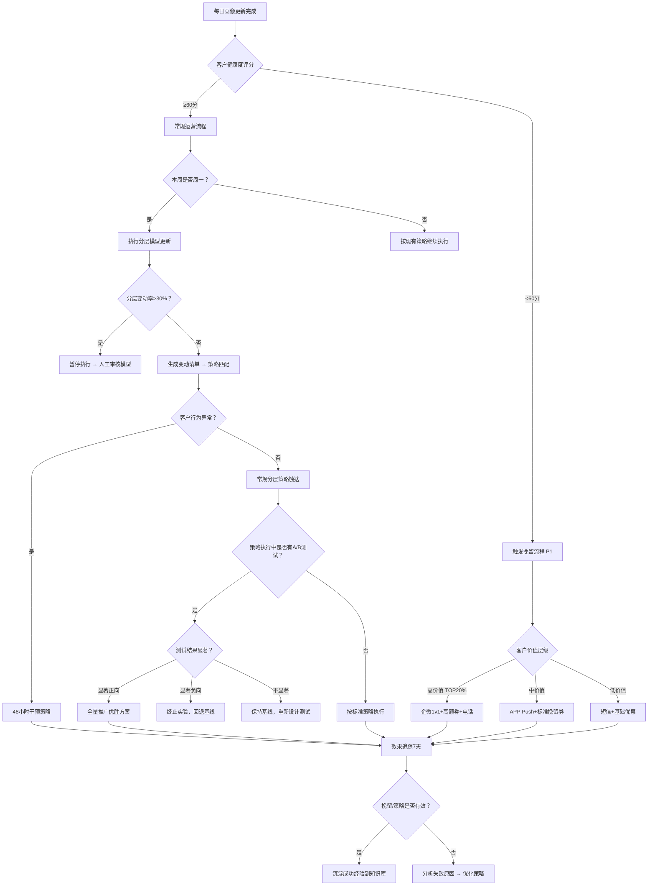

# 客户运营标准操作流程 (SOP)

## 一、概述

本SOP定义了客户运营域的核心业务流程标准，覆盖客户画像更新、分层策略执行、知识库运维和洞察报告生成四大流程。所有流程遵循"数据驱动、自动优先、质量闭环"三大原则，确保客户运营的系统性、时效性和可量化性。

**适用范围**：客户运营域全体成员（客户洞察分析师、生命周期管理师、知识库运营师）
**版本**：v1.0
**生效日期**：即日起执行

---

## 二、RACI职责矩阵

| 流程步骤 | 客户洞察分析师 | 生命周期管理师 | 知识库运营师 | 运营主管 |
|----------|:---:|:---:|:---:|:---:|
| **SOP-1 客户画像更新** | | | | |
| 多源数据采集与清洗 | R/A | I | I | I |
| 跨渠道ID统一识别 | R/A | I | I | C |
| 标签体系计算与更新 | R/A | I | I | I |
| 健康度评分计算 | R/A | C | I | I |
| 画像质量检查与输出 | R/A | I | I | C |
| **SOP-2 分层策略执行** | | | | |
| 分层模型运算 | R/A | I | I | I |
| 变动客户清单生成 | R | A | I | I |
| 策略方案匹配 | C | R/A | I | C |
| 多渠道触达执行 | I | R/A | C | I |
| 策略效果追踪 | C | R/A | I | I |
| A/B测试结论判定 | C | R/A | I | C |
| **SOP-3 知识库运维** | | | | |
| 交互记录扫描提取 | I | I | R/A | I |
| 知识去重与结构化 | I | I | R/A | I |
| 知识审核入库 | I | C | R/A | C |
| 全量有效性审查 | I | I | R/A | C |
| 知识检索优化 | I | I | R/A | I |
| **SOP-4 洞察报告生成** | | | | |
| 周数据汇总 | R/A | I | I | I |
| 趋势/异常/机会分析 | R/A | C | C | I |
| 报告草稿生成 | R/A | I | I | I |
| 报告审核发布 | R | I | I | A |

> R=Responsible(执行者) A=Accountable(负责人) C=Consulted(咨询) I=Informed(知会)

---

## 三、SOP-1 客户画像更新流程

### 3.1 流程目标
确保客户画像数据的完整性、准确性和时效性，支撑下游分层和策略执行。

### 3.2 触发条件
- **定时触发**：每日凌晨02:00启动T+1批量更新
- **事件触发**：客户产生关键行为（下单/退款/投诉/注册）时即时刷新
- **手动触发**：运营主管指定特定客户群强制更新

### 3.3 详细步骤

| 步骤 | 动作 | 输入 | 输出 | 时限 | 责任人 |
|------|------|------|------|------|--------|
| 1.1 | 多源数据拉取（交易/行为/社交/客服/线下） | 数据源API配置 | 原始数据集 | 02:00-03:00 | 客户洞察分析师 |
| 1.2 | 数据清洗与异常过滤 | 原始数据集 | 清洗后数据 | 03:00-03:30 | 客户洞察分析师 |
| 1.3 | 跨渠道ID-Mapping执行 | 清洗后数据+ID规则库 | 统一客户ID映射表 | 03:30-04:00 | 客户洞察分析师 |
| 1.4 | 多维标签计算 | 统一数据+标签规则 | 更新后的标签集 | 04:00-05:00 | 客户洞察分析师 |
| 1.5 | 健康度评分刷新 | 标签数据+行为数据 | 客户健康度评分 | 05:00-05:30 | 客户洞察分析师 |
| 1.6 | 质量校验 | 更新结果 | 质量报告 | 05:30-06:00 | 客户洞察分析师 |

### 3.4 质量检查点

| 指标 | 目标值 | 检测方法 | 异常处置 |
|------|--------|----------|----------|
| 标签覆盖率 | ≥98% | 空标签客户数/总客户数 | 排查数据源缺失，补充采集 |
| 跨渠道ID匹配率 | ≥95% | 成功匹配数/可匹配总数 | 模糊匹配人工复核 |
| 数据更新完成率 | 100% | 成功更新数/计划更新数 | 重试失败任务，超3次人工介入 |
| 健康度评分覆盖率 | ≥99% | 有评分客户数/活跃客户数 | 检查评分模型输入缺失 |

### 3.5 异常处理

- **数据源不可用**：等待15分钟重试，3次失败后使用上一日数据标记"数据延迟"，通知运维修复
- **跨渠道数据冲突**：以最近一次实名交易数据为准，标记"待人工核实"
- **计算超时（超过06:00未完成）**：分批执行，优先更新高价值客户；通知运营主管

---

## 四、SOP-2 分层策略执行流程

### 4.1 流程目标
确保客户分层结果及时转化为运营动作，策略覆盖100%目标客户，触达到达率≥90%。

### 4.2 触发条件
- **定期触发**：每周一07:00自动运行分层模型
- **预警触发**：客户健康度<60分时实时触发挽留流程
- **异常触发**：检测到客户行为异常（消费骤降/活跃度骤降）

### 4.3 详细步骤

| 步骤 | 动作 | 输入 | 输出 | 时限 | 责任人 |
|------|------|------|------|------|--------|
| 2.1 | 执行分层模型运算 | 最新画像数据 | 分层结果+变动清单 | 07:00-08:00 | 客户洞察分析师 |
| 2.2 | 输出分层变动报告 | 本期vs上期分层 | 升降级客户清单 | 08:00-08:30 | 客户洞察分析师 |
| 2.3 | 策略方案匹配 | 变动清单+策略库 | 每个客户群的策略方案 | 08:30-10:00 | 生命周期管理师 |
| 2.4 | 触达内容个性化 | 策略方案+客户画像 | 个性化触达内容 | 10:00-11:00 | 生命周期管理师 |
| 2.5 | 多渠道触达执行 | 触达内容+渠道配置 | 触达执行日志 | 11:00-18:00 | 生命周期管理师 |
| 2.6 | 策略效果监控 | 执行日志+响应数据 | 日/周效果报告 | 持续追踪 | 生命周期管理师 |

### 4.4 关键决策点

```
[分层结果产出]
    │
    ├─── 客户健康度 < 60分？
    │       ├── 是 → 触发P1挽留流程（4小时内首次触达）
    │       │       ├── 高价值客户 → 企微1v1 + 专属高额券 + 电话关怀
    │       │       └── 普通客户 → APP Push + 标准挽留券
    │       └── 否 → 进入常规运营流程
    │
    ├─── 客户行为异常（消费骤降/活跃骤降）？
    │       ├── 是 → 标记预警，48小时内执行干预策略
    │       └── 否 → 按分层常规策略执行
    │
    └─── A/B测试结果判定
            ├── 统计显著（p<0.05）且效果正向 → 全量推广优胜方案
            ├── 统计显著且效果负向 → 立即终止实验组
            └── 不显著 → 回退基线方案，调整变量重新设计测试
```

### 4.5 质量检查点

| 指标 | 目标值 | 检测方法 | 异常处置 |
|------|--------|----------|----------|
| 策略覆盖率 | 100% | 已分配策略客户数/分层变动客户总数 | 检查未覆盖客户原因，补充策略 |
| 触达到达率 | ≥90% | 成功到达数/发送总数 | 切换备选渠道重试 |
| 策略匹配时效 | ≤2小时 | 分层产出到策略匹配完成时间 | 升级通知，启用默认策略兜底 |
| 触达当日完成率 | 100% | 当日完成触达数/计划触达数 | 未完成部分次日优先执行 |

### 4.6 异常处理

- **分层模型输出异常（变动率>30%）**：暂停策略执行，人工审核模型
- **渠道发送失败**：自动切换备选渠道；全渠道不可用时暂缓触达并报警
- **客户投诉触达骚扰**：立即停止该客户所有触达，标记"静默期90天"

---

## 五、SOP-3 知识库运维流程

### 5.1 流程目标
维持知识库准确率≥95%、检索命中率≥85%，确保运营团队始终基于最新知识服务客户。

### 5.2 触发条件
- **每日增量**：每日14:00自动启动
- **每周全量**：每周五09:00启动全量审查
- **事件触发**：收到行为模式变化信号/产品变更通知/用户反馈不准确

### 5.3 详细步骤

#### 每日增量更新流程

| 步骤 | 动作 | 输入 | 输出 | 时限 | 责任人 |
|------|------|------|------|------|--------|
| 3.1 | 扫描24h新增交互记录 | 客服/社群/投诉数据源 | 候选知识条目列表 | 14:00-15:00 | 知识库运营师 |
| 3.2 | NLP提取+语义去重 | 候选列表+现有知识库 | 去重后新条目 | 15:00-16:00 | 知识库运营师 |
| 3.3 | 结构化整理+标注 | 去重后条目 | 标准化知识条目 | 16:00-17:00 | 知识库运营师 |
| 3.4 | 质量审核（自动+人工） | 标准化条目 | 入库/拒绝决策 | 17:00-18:00 | 知识库运营师 |
| 3.5 | 入库生效+日志发布 | 通过审核的条目 | 更新日志 | 18:00 | 知识库运营师 |

#### 每周全量审查流程

| 步骤 | 动作 | 输入 | 输出 | 时限 | 责任人 |
|------|------|------|------|------|--------|
| 3.6 | 全库时效性扫描 | 知识库全量+有效期配置 | 过期/即将过期清单 | 周五09:00-10:00 | 知识库运营师 |
| 3.7 | 准确性抽样验证 | 使用频率排名Top100 | 准确性评估报告 | 周五10:00-12:00 | 知识库运营师 |
| 3.8 | 淘汰/修正执行 | 评估报告 | 更新后的知识库 | 周五14:00-16:00 | 知识库运营师 |
| 3.9 | 知识质量报告输出 | 审查结果汇总 | 周度质量报告 | 周五17:00前 | 知识库运营师 |

### 5.4 质量检查点

| 指标 | 目标值 | 检测方法 | 异常处置 |
|------|--------|----------|----------|
| 知识库准确率 | ≥95% | 抽样审核正确率 | 启动紧急修正，频率加倍 |
| 检索命中率 | ≥85% | 有结果检索/总检索 | 启动检索优化专项 |
| 审核确认率 | ≥80% | 通过条目/提交条目 | 优化提取模型，降低噪音 |
| 日增量更新及时率 | 100% | 是否在18:00前完成 | 超时条目延至次日优先处理 |

### 5.5 异常处理

- **知识条目语义重复**：自动合并相似条目（相似度>0.85），保留最新版本
- **用户反馈不准确**：24小时内完成定向审计和修正
- **合规/法律相关知识**：不可自动入库，必须人工审核确认
- **准确率低于90%**：触发紧急整改模式，审计频率加倍直至恢复

---

## 六、SOP-4 洞察报告生成流程

### 6.1 流程目标
每周自动生成高质量客户洞察报告，数据准确性100%，分析覆盖趋势/异常/建议三要素。

### 6.2 触发条件
- **周报**：每周日20:00自动启动
- **月报**：每月最后一天20:00自动启动
- **专项**：运营主管指定主题时手动触发

### 6.3 详细步骤

| 步骤 | 动作 | 输入 | 输出 | 时限 | 责任人 |
|------|------|------|------|------|--------|
| 4.1 | 全量数据采集汇总 | 各系统API | 本周数据汇总 | 周日20:00-22:00 | 客户洞察分析师 |
| 4.2 | 核心指标计算 | 汇总数据 | 指标计算结果 | 周日22:00-23:00 | 客户洞察分析师 |
| 4.3 | 趋势分析 | 历史+本期指标 | 趋势分析模块 | 周日23:00-24:00 | 客户洞察分析师 |
| 4.4 | 异常检测 | 基线数据+本期数据 | 异常检测模块 | 周一00:00-02:00 | 客户洞察分析师 |
| 4.5 | 机会识别与建议生成 | 分析结果 | 机会&建议模块 | 周一02:00-04:00 | 客户洞察分析师 |
| 4.6 | 报告组装与数据校验 | 各模块内容 | 完整报告草稿 | 周一04:00-06:00 | 客户洞察分析师 |
| 4.7 | 审核确认与发布 | 报告草稿 | 正式报告 | 周一09:00-10:00 | 运营主管 |

### 6.4 质量检查点

| 指标 | 目标值 | 检测方法 | 异常处置 |
|------|--------|----------|----------|
| 数据准确性 | 100% | 抽样≥20个指标与源系统核对 | 定位差异原因，修正后重新生成 |
| 分析覆盖度 | 含趋势+异常+建议三要素 | 内容完整性检查 | 补充缺失模块 |
| 报告按时率 | 100% | 周一10:00前完成发布 | 超时30分钟内升级通知 |
| 建议可行性 | ≥80% | 管理层评审反馈 | 优化建议生成模型 |

### 6.5 异常处理

- **数据源延迟/缺失**：标注数据状态为"部分数据延迟"，先发布可用部分，后续补充完整版
- **重大异常发现**：不等周报，立即生成紧急预警通知推送给相关干系人
- **报告审核不通过**：2小时内修正并重新提交，标注修改说明

---

## 七、KPI指标体系

### 7.1 核心KPI

| 指标 | 目标值 | 监控频率 | 负责人 |
|------|--------|----------|--------|
| 客户LTV提升率 | 月环比≥3% | 月度 | 全团队 |
| 客户流失率 | 月度≤5% | 月度 | 生命周期管理师 |
| 跨渠道识别准确率 | ≥95% | 每日 | 客户洞察分析师 |
| 健康度预警准确率 | ≥75% | 周度 | 客户洞察分析师 |
| 触达策略转化率 | ≥8% | 周度 | 生命周期管理师 |
| 知识库准确率 | ≥95% | 周度 | 知识库运营师 |
| 洞察报告按时率 | 100% | 周度 | 客户洞察分析师 |

### 7.2 过程指标

| 指标 | 目标值 | 说明 |
|------|--------|------|
| 画像更新完成时间 | ≤06:00（凌晨批量） | T+1批量更新截止时间 |
| 策略匹配响应时间 | ≤2小时 | 分层产出到策略就绪 |
| 挽留首次触达时间 | P1≤4小时 / P2≤24小时 | 预警到首次触达 |
| 知识日增量完成时间 | ≤18:00 | 当日知识提取审核完成 |
| A/B测试结论输出时间 | ≤3天 | 测试到期到结论发布 |

---

## 八、决策树



---

## 九、跨域协作接口

### 9.1 向上游输入（本域接收）
- 来自**综合运营域-决策加速器**：全局运营策略方向指引
- 来自**会员运营域-会员增长引擎**：会员活跃度和流失数据

### 9.2 向下游输出（本域提供）
- 向**电商运营域-流量投放操盘手**：客户画像数据用于精准人群定向
- 向**会员运营域-会员增长引擎**：客户分层基础数据
- 向**综合运营域-决策加速器**：客户核心指标数据

### 9.3 双向协作
- 与**会员运营域-社交内容策划师**：共享客户洞察知识和内容趋势
- 与**电商运营域-店铺运营管家**：客户FAQ和产品知识共享维护

---

## 十、持续改进机制

1. **周度复盘**：每周一下午回顾上周各SOP执行情况，识别瓶颈和改进机会
2. **月度优化**：每月评估KPI达成情况，调整流程参数和阈值
3. **季度迭代**：每季度重新评估SOP适用性，引入新技术/工具升级流程
4. **即时反馈**：任何SOP执行中发现的问题即时记录，72小时内完成流程修订
