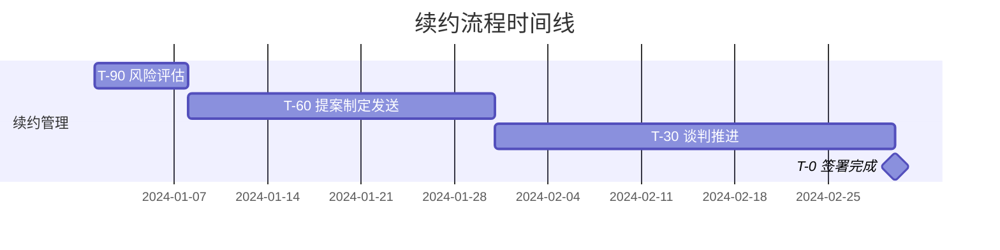

# 客户成功标准操作流程 (Customer Success SOP)

## 一、流程概述

本SOP覆盖SaaS企业客户成功管理的五大核心流程：客户交接与实施、健康度监控、续约管理、客户互动与满意度管理、客户流失复盘。目标是将年化客户流失率控制在10%以下，净收入留存率（NDR）提升至110%以上，续约率>90%。

---

## 二、RACI矩阵

| 流程步骤 | 客户交接实施官 | 客户健康度管理师 | 续约增购策略师 | 客户互动协调员 | CSM经理 | VP/高管 |
|---------|:---:|:---:|:---:|:---:|:---:|:---:|
| **交接流程** |
| 接收签约通知 | R | I | I | I | A | - |
| 交接文档编制 | R | I | - | - | A | - |
| 交接会议执行 | R | C | - | - | A | - |
| 实施计划制定 | R | I | - | - | A | - |
| 实施进度追踪 | R | - | - | - | A | I |
| 上线验收 | R | C | - | - | A | - |
| TTV达成确认 | R | C | I | - | A | I |
| **健康度监控** |
| 月度评分更新 | I | R | I | C | A | - |
| 绿色客户管理 | - | R | C | C | I | - |
| 黄色客户关注计划 | - | R | I | C | A | - |
| 红色客户挽回计划 | C | R | C | C | A | I |
| 流失预测模型维护 | - | R | C | - | A | - |
| **续约管理** |
| T-90续约风险评估 | - | C | R | - | A | I |
| T-60续约提案制定 | - | C | R | - | A | - |
| T-30续约谈判 | - | - | R | - | A | C |
| 续约签署推动 | - | - | R | - | A | C |
| 增购机会识别 | I | C | R | C | I | - |
| 增购提案与推进 | - | - | R | - | A | - |
| **客户互动** |
| 互动节奏规划 | - | C | - | R | A | - |
| QBR准备与执行 | - | C | C | R | A | C |
| NPS调查执行 | - | C | - | R | A | - |
| 客户投诉升级 | C | C | - | R | A | C |
| 高层互访协调 | - | - | C | R | A | R |
| **流失复盘** |
| 流失根因分析 | C | R | C | C | A | I |
| 改进措施制定 | C | R | C | C | A | A |
| 月度流失分析会 | I | R | C | C | A | I |

> **R**=负责执行 **A**=最终审批 **C**=需要咨询 **I**=需要通知

---

## 三、SOP-1：客户交接时效与质量规范

### 3.1 触发条件
- 合同签署完成，系统接收到签约完成通知

### 3.2 时效要求
| 节点 | 时限 | 衡量方式 |
|------|------|---------|
| 签约到交接任务创建 | 4小时内 | 系统自动创建时间 |
| 交接信息收集完成 | 3个工作日内 | 信息完整度≥90% |
| 交接会议完成 | 5个工作日内 | 会议纪要生成时间 |
| 客户首次联系 | 交接完成后1个工作日 | CSM欢迎邮件发送时间 |
| 实施计划输出 | 交接完成后3个工作日 | 计划文档签字时间 |

### 3.3 交接文档标准
交接文档必须包含以下五大模块（缺一不可）：

1. **客户背景**：公司名称、行业、规模、发展阶段、核心业务
2. **商务条件**：合同金额、期限、付款方式、折扣情况、特殊条款
3. **期望与承诺**：销售过程中的所有承诺清单（功能/服务/时间线）
4. **决策人信息**：
   - Executive Sponsor（最终决策人）
   - Champion（内部推动者）
   - Day-to-day Contact（日常对接人）
   - Technical Contact（技术对接人）
5. **技术环境**：现有IT系统、集成需求、数据迁移需求、安全要求

### 3.4 验收标准
- 交接文档完整度≥90%（各字段填写完整率）
- 销售和CSM双方签字确认
- 无遗留争议问题

### 3.5 异常处理
| 异常情况 | 处理方式 | 升级路径 |
|---------|---------|---------|
| 交接信息不完整 | 退回销售，24小时内补全 | 超24小时未补全→销售经理 |
| 销售对承诺有争议 | 三方会议对齐（销售+CSM+经理） | 无法达成一致→VP裁定 |
| CSM资源不足 | CSM经理协调资源或调整分配 | 无可用CSM→临时由经理兼任 |
| 超5天未完成交接 | 自动升级至CSM总监 | 影响客户满意度→VP介入 |

---

## 四、SOP-2：健康度评分规范

### 4.1 评分周期与覆盖率
- **评分频率**：每月1次（每月前5个工作日完成）
- **覆盖率要求**：100%活跃客户
- **模型校准**：每季度1次（Q+1第1个月完成）

### 4.2 评分模型

| 维度 | 权重 | 子指标 | 评分规则 |
|------|------|--------|---------|
| 产品使用 | 35% | 登录频率 | DAU/MAU>20%=满分，<5%=0分 |
| | | 功能覆盖度 | 使用功能/购买功能>70%=满分 |
| | | 活跃用户占比 | 活跃用户/license>60%=满分 |
| 支持体验 | 25% | 工单趋势 | 环比下降=加分，上升=减分 |
| | | CSAT评分 | >4.5=满分，<3.0=0分 |
| | | 未关闭工单 | 0个=满分，>5个=0分 |
| 商务关系 | 25% | 付款及时性 | DSO<30天=满分，>90天=0分 |
| | | 沟通频率 | 达到Tier标准=满分 |
| | | 关键人变动 | 无变动=满分，Champion离职=0分 |
| 满意度 | 15% | NPS分数 | ≥9=满分，≤6=0分 |
| | | NPS趋势 | 上升=加分，下降=减分 |

### 4.3 三色分级标准
- **绿色（健康）**：综合分≥70分
- **黄色（关注）**：综合分50-69分
- **红色（风险）**：综合分<50分

### 4.4 分级触发动作

#### 绿色客户
- 保持月度check-in节奏
- 关注增购机会信号
- 可作为案例和推荐来源

#### 黄色客户
- 增加touchpoint至双周一次
- 制定4周关注改善计划
- 识别分数下滑的主要驱动因子
- 4周后复评：提升→绿色，持续→深入分析，恶化→升级为红色

#### 红色客户
- **48小时内**制定挽回计划
- 挽回计划必含：根因分析、行动项、负责人、时间线、成功标准
- CSM经理必须审批并参与执行
- 评估是否需要高层互访
- 2周后首次复评

### 4.5 模型校准流程
1. 每季度末统计实际流失客户
2. 回溯流失前3个月的健康度评分
3. 分析评分是否有效预测了流失（召回率目标>70%）
4. 调整维度权重和子指标阈值
5. CSM总监审批新版模型参数

---

## 五、SOP-3：续约流程检查点

### 5.1 续约时间线



### 5.2 各阶段检查点

| 时间点 | 必须完成的事项 | 验收标准 | 责任人 |
|--------|--------------|---------|--------|
| T-90 | 续约风险评估 | 评估报告输出，风险等级确定 | 续约增购策略师 |
| T-75 | 续约策略确定 | 策略经CSM经理审批 | 续约增购策略师 |
| T-60 | 续约提案发送 | 客户确认收到提案 | 续约增购策略师 |
| T-45 | 客户反馈收集 | 记录客户意向和异议 | 续约增购策略师 |
| T-30 | 进入签署流程 | 商务条件双方达成一致 | 续约增购策略师 |
| T-15 | 合同签署推动 | 合同文本双方确认 | 续约增购策略师 |
| T-0 | 签署完成 | 合同签署归档 | 续约增购策略师 |

### 5.3 续约策略决策树

```
续约风险评估完成
├── 低风险（评分≥70）
│   ├── 使用深度高 → 推动升级续约（推荐更高版本）
│   ├── 使用稳定 → 标准续约（原条件续约）
│   └── 有增购信号 → 续约+增购打包方案
├── 中风险（评分50-69）
│   ├── 价格敏感 → 优惠续约（多年签折扣/赠送增值服务）
│   ├── 使用不深 → 制定使用提升计划+续约
│   └── 关系薄弱 → 安排高层互访后续约
└── 高风险（评分<50）
    ├── 有明确竞品威胁 → VP层面紧急介入+差异化方案
    ├── 客户业务变化 → 方案调整/降级续约保底
    └── 产品/服务不满 → 先解决问题，再谈续约（可能延期）
```

### 5.4 续约逾期管理
- T-0未签署：每日催促，CSM经理介入
- T+15未签署：服务暂停预警通知客户
- T+30未签署：按合同条款执行（可能暂停服务）
- **逾期率目标**：<5%

### 5.5 异常处理
| 异常情况 | 处理方式 | 升级路径 |
|---------|---------|---------|
| 客户表达不续约 | 24小时内启动挽留流程 | CSM经理→VP→CEO |
| 续约伴随降级 | 分析原因，评估接受/协商 | 超过30%降级→VP审批 |
| 涨价条款触发 | 提前沟通+价值佐证+灵活方案 | 客户强烈反对→VP决策 |
| T-30未达成一致 | 升级谈判，引入高层资源 | CSM总监+VP协同推进 |

---

## 六、SOP-4：NPS执行规范

### 6.1 调研频率与时间
- **全量调查**：每半年1次（建议3月和9月执行）
- **触发式调查**：上线后30天、续约后7天
- **间隔要求**：同一客户两次调研间隔≥5个月

### 6.2 执行标准
| 指标 | 目标 | 底线 |
|------|------|------|
| 响应率 | >40% | ≥30% |
| 分析报告输出 | 回收截止后3天 | 5天 |
| Detractor回访 | 48小时内 | 72小时 |
| 改进行动制定 | 1周内 | 2周 |

### 6.3 分级跟进规则
- **Promoter (9-10分)**：感谢→请求推荐/案例→标记为增购潜力客户
- **Passive (7-8分)**：了解可提升点→制定小优化→目标转为Promoter
- **Detractor (0-6分)**：48小时内CSM经理回访→根因分析→改善计划→2周跟进

### 6.4 NPS分数阈值行动
- NPS≥60：维持当前策略，提炼最佳实践
- NPS 40-59：正常，关注趋势变化
- NPS<40：触发专项改善计划，CSM经理主导

---

## 七、SOP-5：客户流失复盘

### 7.1 复盘触发
- 每个确认流失的客户必须在流失确认后10个工作日内完成根因分析

### 7.2 流失根因分类
| 根因类别 | 子类 | 典型表现 |
|---------|------|---------|
| 产品问题 | 功能缺失/性能不足/稳定性差 | 高频工单、功能请求未满足 |
| 服务问题 | 响应慢/专业度不够/沟通不畅 | CSAT低、投诉记录多 |
| 价格问题 | 性价比不满/竞品更便宜 | 续约时强烈议价 |
| 竞品替代 | 功能更强/关系更深/行业更懂 | 提及竞品、POC对比 |
| 客户业务变化 | 裁员/转型/被收购/预算削减 | 使用量大幅下降 |

### 7.3 复盘报告模板
1. 客户基础信息（ARR、合同期限、行业、CSM）
2. 流失时间线（从健康到流失的关键事件）
3. 根因分析（主因+辅因）
4. 预警信号回顾（是否有信号被忽略）
5. 可改进措施（如果重来可以做什么不同）
6. 系统性建议（是否反映了共性问题需要组织层面解决）

### 7.4 月度流失分析会
- **频率**：每月1次（月末最后一周）
- **参会**：CSM经理、全体CSM、产品经理（可选）
- **议程**：本月流失客户逐个review→模式识别→系统性问题讨论→改进措施确认
- **输出**：月度流失分析报告、改进action list

---

## 八、KPI指标体系

### 8.1 核心KPI

| 指标 | 目标值 | 预警值 | 计算公式 |
|------|--------|--------|---------|
| 客户流失率(Logo) | <10%/年 | >8%/年 | 流失客户数/期初客户数 |
| 收入流失率(Revenue) | <7%/年 | >5%/年 | 流失收入/期初ARR |
| NDR(净收入留存率) | >110% | <105% | (期初ARR-流失+增购+涨价)/期初ARR |
| 续约率 | >90% | <85% | 续约客户数/到期客户数 |
| TTV达成率 | >80% | <70% | 30天内达成TTV客户/新上线客户 |
| NPS | ≥40 | <30 | (Promoter%-Detractor%)×100 |

### 8.2 过程指标

| 指标 | 目标值 | 衡量频率 |
|------|--------|---------|
| 交接5天完成率 | >95% | 月度 |
| 健康度评分覆盖率 | 100% | 月度 |
| 红色客户48h计划产出率 | 100% | 实时 |
| 续约逾期率 | <5% | 月度 |
| NPS响应率 | >40% | 半年度 |
| Detractor 48h回访率 | 100% | 实时 |
| 互动计划完成率 | >90% | 月度 |
| 增购率 | >20%/年 | 季度 |

### 8.3 质量检查点

| 检查项 | 频率 | 检查人 | 标准 |
|--------|------|--------|------|
| 交接文档质量 | 每单 | CSM经理 | 五大模块完整且准确 |
| 健康度评分准确性 | 季度 | CSM总监 | 与实际流失对比，召回率>70% |
| 续约提案质量 | 每单 | CSM经理 | 含价值回顾+方案+价格+行动 |
| QBR材料质量 | 每次 | CSM经理 | 数据准确、洞察有价值 |
| 流失复盘完整性 | 每单 | CSM总监 | 根因明确、建议可行 |

---

## 九、跨Scope协作接口

### 9.1 与报价与合同Scope的接口
- **输入**：签约完成通知、合同详情
- **输出**：续约报价请求、增购报价请求
- **SLA**：签约通知4小时内接收确认

### 9.2 与线索与商机管理Scope的接口
- **输出**：大额增购商机转交（金额>年合同额50%）
- **SLA**：商机信息24小时内完成转交

### 9.3 与销售数据分析Scope的接口
- **输出**：续约结果数据、流失数据、健康度趋势数据
- **SLA**：数据实时同步（<1小时延迟）

---

## 十、持续改进机制

1. **月度Review**：CSM团队月会review各项KPI达成情况
2. **季度校准**：健康度模型校准、续约策略效果分析
3. **半年度升级**：SOP更新、最佳实践沉淀、工具优化
4. **年度战略**：客户成功策略对齐公司年度目标
