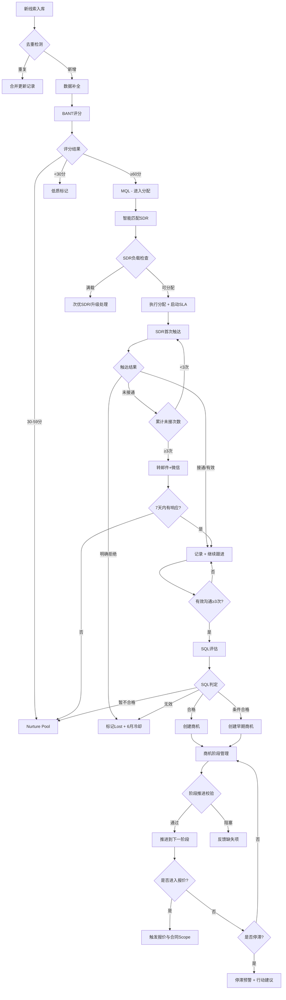

# 线索与商机管理标准操作流程 (SOP)

## 1. 流程概述

本SOP定义了从多渠道线索采集到商机推进至报价阶段的完整销售前端流程标准。涵盖线索处理、评分分级、智能分配、SDR跟进、SQL转化判定和商机阶段管理六大环节。流程目标是在保证线索质量的前提下最大化响应速度，将MQL到SQL转化率提升至20%以上。

---

## 2. RACI矩阵

| 流程步骤 | 线索采集处理师 | 线索分配调度员 | SDR跟进教练 | 商机推进管理师 | 销售经理 | 营销团队 |
|----------|:---:|:---:|:---:|:---:|:---:|:---:|
| 多渠道线索采集 | R/A | - | - | - | - | C |
| 数据清洗去重 | R/A | - | - | - | - | I |
| 工商数据补全 | R | - | - | - | A | - |
| BANT自动评分 | R/A | I | - | - | - | - |
| 线索分级(MQL/Nurture/低质) | R | I | - | - | A | I |
| MQL智能分配 | - | R/A | I | - | C | - |
| 4小时SLA监控 | - | R/A | I | - | I | - |
| 线索回收重分配 | - | R/A | I | - | I | - |
| 首次触达执行 | - | I | R/A | - | - | - |
| 个性化话术生成 | - | - | R/A | - | - | - |
| 沟通记录与跟进 | - | - | R/A | - | I | - |
| SQL资质评估 | - | - | R | - | A | - |
| 商机创建 | - | - | R | A | I | - |
| 商机阶段校验 | - | - | - | R/A | I | - |
| 停滞预警与干预 | - | - | - | R | A | - |
| Pipeline Review材料 | - | - | - | R/A | C | - |
| Nurture计划制定 | - | - | R/A | - | I | C |
| 渠道质量反馈 | R | - | - | - | I | A |

> R=Responsible(执行) A=Accountable(审批) C=Consulted(咨询) I=Informed(知会)

---

## 3. 详细流程步骤

### SOP-1：线索采集与处理

#### 触发条件
- 官网表单提交、内容下载完成、Webinar注册
- 展会线索批量导入、合作伙伴线索推送
- 转介绍线索手动录入

#### 执行动作

**步骤1.1 数据接收与标准化（<2分钟）**
- 接收原始线索数据
- 执行字段映射和格式标准化
- 验证必填字段完整性（公司名、联系人、联系方式至少一种）

**步骤1.2 去重检测（<3分钟）**
- 执行三重匹配：邮箱精确匹配 → 公司名+手机号模糊匹配 → 跨渠道行为匹配
- 重复线索：合并记录，保留最新互动，更新来源标签
- 疑似重复：标记人工复核队列
- 新增线索：继续后续流程

**步骤1.3 数据补全（<5分钟）**
- 调用工商信息API获取企业数据（行业/规模/融资）
- 补全联系人职位层级信息
- 计算数据完整度分数

**步骤1.4 BANT自动评分（<5分钟）**
- 按Budget/Authority/Need/Timeline四维度打分
- 记录每维度评分依据
- 生成评分置信度标注

#### 输出物
- 标准化线索记录（含评分）
- 去重处理报告
- 数据质量标签（A/B/C级）

#### 异常处理
- API调用失败：使用降级策略，跳过补全环节，标记"待补全"，不阻塞后续流程
- 数据严重不完整（缺少公司名和联系方式）：拒绝入库，反馈渠道方补充
- 批量导入超5000条：分批处理，每批1000条，总时效按比例放宽

#### 时效要求
- 单条线索：采集到处理完成 ≤ 15分钟
- 批量导入：≤ 15分钟/千条

---

### SOP-2：线索分级与路由

#### 触发条件
- 线索评分完成

#### 执行动作

**步骤2.1 分级判定**
- ≥60分 → MQL，进入分配队列
- 30-59分 → Nurture Pool，进入培育序列
- <30分 → 低质线索，标记无效，统计渠道数据

**步骤2.2 MQL分配（<30分钟内完成）**
- 提取线索维度特征（行业/区域/规模/产品意向）
- 加载SDR能力模型和当前负载
- 执行多维匹配算法
- 确定最优SDR并执行分配
- 启动4小时SLA计时

**步骤2.3 Nurture分层**
- 评估线索长期价值，确定培育层级（A/B/C）
- 制定初始nurture计划
- 设置定期review提醒

#### 输出物
- 分级结果记录
- 分配决策记录（含匹配理由）
- SLA计时器启动确认
- Nurture计划文档

#### 异常处理
- 所有匹配SDR均满载：触发容量预警，升级销售经理手动分配
- VIP线索无匹配SDR在线：优先级最高通知主管，15分钟内指定人员
- 评分模型异常（如某渠道评分集中在同一分段）：标记模型异常，通知运营review

#### 时效要求
- 评分完成到分配完成 ≤ 30分钟
- 分配完成到首次触达 ≤ 4小时

---

### SOP-3：SDR跟进与沟通

#### 触发条件
- MQL线索分配到SDR
- SLA倒计时启动

#### 执行动作

**步骤3.1 首次触达准备（<30分钟）**
- 获取线索背景和分配说明
- 生成个性化触达话术（电话/邮件/微信）
- 确定首选触达渠道和时间窗口

**步骤3.2 首次触达执行（SLA 4小时内）**
- 按计划执行首次触达
- 记录触达结果（接通/未接/邮件已发/微信已加）
- 更新SLA状态为"已触达"

**步骤3.3 后续跟进（每次间隔24-48小时）**
- 基于上次沟通结果调整策略
- 执行多渠道跟进序列
- 每次沟通后更新记录（客户反馈摘要+下一步计划）
- 累计有效沟通次数

**步骤3.4 未接通处理**
- 电话未接3次 → 转为邮件+微信触达
- 邮件+微信无响应7天 → 标记回收，进入nurture pool
- 客户明确拒绝 → 标记Lost，记录原因，设6个月冷却期

#### 输出物
- 沟通记录（含客户反馈摘要和下一步计划）
- 触达结果统计
- 线索状态更新

#### 异常处理
- SLA即将超时（剩余1小时）：系统自动提醒SDR + 通知主管
- SLA已超时：记录违规，通知销售经理，如2小时内仍无跟进则自动回收重分配
- 客户投诉骚扰：立即停止跟进，标记"请勿联系"，通知销售运营处理

#### 时效要求
- 分配到首次触达 ≤ 4小时
- 跟进间隔 24-48小时
- 每条MQL至少3次跟进尝试

---

### SOP-4：SQL转化判定

#### 触发条件
- 累计3次有效沟通完成
- 或客户主动表达强购买意向（可提前评估）

#### 执行动作

**步骤4.1 沟通信息汇总**
- 收集全部沟通记录
- 提取客户明确表达的BANT信息
- 区分"客户明确表达" vs "SDR推断"

**步骤4.2 BANT深度评估**
- Budget：是否有明确预算/预算是否匹配
- Authority：是否识别决策人/是否已接触
- Need：是否有明确痛点/是否与产品匹配
- Timeline：是否有明确时间计划/是否有驱动因素

**步骤4.3 SQL判定**
- ≥3维度正面 → SQL合格，创建商机
- 2维度正面 → 条件SQL，可创建早期商机
- <2维度正面 → 暂不合格，转入nurture计划
- 明确无机会 → 标记关闭

**步骤4.4 商机创建（如合格）**
- 填写必填字段：客户名称/预计金额/预计日期/阶段/关键联系人
- 填写MEDDIC要素（至少3项）
- 制定初步赢单策略
- 通知商机推进管理师接管

#### 输出物
- SQL评估报告（含各维度评估依据）
- 商机创建记录（如合格）
- Nurture计划（如暂不合格）
- 关闭原因记录（如无效）

#### 异常处理
- 有效沟通不足3次但客户强需求：需SDR主管审批后可提前创建商机
- 评估结果有争议（SDR认为合格，标准判定不合格）：升级到销售经理裁决
- 战略客户特殊处理：即使BANT不完全满足，可标记"战略商机"创建

#### 时效要求
- 3次有效沟通后48小时内完成SQL评估
- SQL评估通过后24小时内创建商机

---

### SOP-5：商机阶段推进管理

#### 触发条件
- 新商机创建
- 销售请求推进商机阶段
- 商机停滞超过阈值

#### 执行动作

**步骤5.1 商机创建校验**
- 验证必填字段完整率（100%）
- 验证MEDDIC填写情况（≥3项）
- 确认初始阶段设置（"初步接触"）
- 启动阶段停留计时

**步骤5.2 阶段推进校验**
- 识别目标阶段进入条件
- 逐项验证当前数据是否满足
- 通过 → 允许推进，更新阶段，重启计时
- 未通过 → 阻塞推进，反馈缺失项和补充建议
- 阶段跳跃 → 标记异常，需销售经理审批

**步骤5.3 停滞监控**
- 每日扫描全部活跃商机
- 超过阶段平均时长1.5倍 → 黄色预警（通知Owner）
- 超过2倍 → 红色预警（通知Owner + 销售经理）
- 生成停滞原因分析和行动建议

**步骤5.4 Pipeline Review准备**
- 每周四生成下周Review材料
- 包含：商机状态汇总、风险标注、预测变化、行动建议
- 分发给参会者提前准备

**步骤5.5 商机交接（进入报价阶段）**
- 商机通过"方案演示"阶段校验
- 确认Economic Buyer已接触、方案已确认
- 触发报价与合同Scope的流程启动
- 记录交接时间和状态

#### 输出物
- 阶段校验报告
- 停滞预警记录（含行动建议）
- 周度Pipeline Review材料
- 商机健康度看板
- 跨Scope交接记录

#### 异常处理
- 客户决策链变更（关键人离职/重组）：标记风险，评估是否需回退阶段
- 商机金额大幅变更（>50%）：触发异常预警，需销售经理确认
- 批量商机丢失（同一客户/行业）：触发系统性风险分析，通知销售VP

#### 时效要求
- 阶段推进校验 ≤ 2小时响应
- 停滞预警 ≤ 24小时内发出（达到阈值后）
- Pipeline Review材料：会议前1天完成

---

## 4. 决策树

---

## 5. KPI指标与质量检查点

### 核心KPI

| 指标 | 目标值 | 测量频率 | 责任角色 |
|------|--------|----------|----------|
| 线索处理时效 | ≤15分钟 | 实时 | 线索采集处理师 |
| 去重准确率 | >98% | 月度 | 线索采集处理师 |
| 数据补全率 | >85% | 周度 | 线索采集处理师 |
| 分配决策时效 | ≤30分钟 | 实时 | 线索分配调度员 |
| 4小时SLA达标率 | >90% | 日度 | 线索分配调度员 |
| 线索回收率 | <10% | 周度 | 线索分配调度员 |
| SDR人均日有效外呼量 | ≥30次 | 日度 | SDR跟进教练 |
| MQL→SQL转化率 | >20% | 月度 | SDR跟进教练 |
| 商机必填字段完整率 | 100% | 实时 | 商机推进管理师 |
| 停滞预警准确率 | >85% | 月度 | 商机推进管理师 |
| Pipeline Review准时率 | 100% | 周度 | 商机推进管理师 |
| 各阶段转化率 | 对比行业基准 | 月度 | 全团队 |

### 质量检查点

| 检查点 | 检查内容 | 频率 | 责任人 |
|--------|----------|------|--------|
| Q1-数据质量 | 去重准确率、补全率、评分分布合理性 | 周度 | 销售运营 |
| Q2-评分校准 | 评分与实际转化率相关性分析 | 月度 | 销售运营 |
| Q3-SLA合规 | 超时事件分析、系统性原因识别 | 周度 | 销售经理 |
| Q4-跟进质量 | 沟通记录完整性、话术有效性 | 双周 | SDR主管 |
| Q5-商机合规 | 阶段推进合理性、MEDDIC完整度 | 周度 | 销售经理 |
| Q6-流程优化 | 瓶颈识别、时效偏差分析、流程迭代 | 月度 | 销售VP |

---

## 6. 跨Scope协作接口

### 上游（输入）
- **营销团队**：提供多渠道线索原始数据、内容资产用于nurture

### 下游（输出）
- **报价与合同Scope**：商机进入报价阶段时传递商务需求信息
- **销售数据分析Scope**：实时提供漏斗数据（线索量/MQL/SQL/商机变化）

### 反馈回路
- **客户成功Scope**：老客户增购线索回流处理
- **销售数据分析Scope**：异常预警反向驱动策略调整

---

## 7. 定期评审与优化

| 评审类型 | 频率 | 参与者 | 评审内容 |
|----------|------|--------|----------|
| 日度早会 | 每日 | SDR团队 | 昨日跟进情况、今日计划 |
| 周度Review | 每周 | 销售经理+全团队 | Pipeline盘点、停滞商机处理 |
| 月度复盘 | 每月 | 销售VP+运营 | 转化率分析、流程优化、评分校准 |
| 季度战略 | 每季度 | 管理层 | 目标调整、资源配置、系统升级 |
