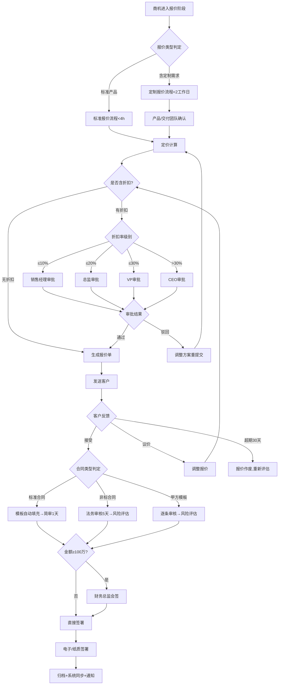

# 报价与合同管理标准操作流程（SOP）

## 1. 文档信息

| 项目 | 内容 |
|------|------|
| 文档编号 | SOP-QC-001 |
| 适用范围 | 报价与合同管理全流程 |
| 版本 | V1.0 |
| 生效日期 | 发布即生效 |
| 审批人 | 销售VP / 法务总监 |

---

## 2. RACI 职责矩阵

| 流程步骤 | 报价配置专家 | 折扣审批管控师 | 合同起草审核师 | 合同风险分析师 | 销售经理 | 法务团队 | 财务总监 |
|----------|:---:|:---:|:---:|:---:|:---:|:---:|:---:|
| 需求信息采集 | R | - | - | - | A | - | - |
| 产品方案配置 | R/A | - | - | - | C | - | - |
| 定价计算 | R/A | C | - | - | I | - | - |
| 报价单生成 | R/A | - | - | - | I | - | - |
| 折扣审批路由 | I | R/A | - | - | C | - | - |
| 审批决策支持 | - | R | - | - | - | - | - |
| 审批时效监控 | - | R/A | - | - | I | - | - |
| 合同类型判定 | I | - | R/A | - | C | - | - |
| 合同草稿生成 | - | - | R/A | - | I | - | - |
| 非标条款标记 | - | - | R | - | I | C | - |
| 法务深度审核 | - | - | C | I | I | R/A | - |
| 风险评估 | - | - | C | R/A | I | C | - |
| 条款协商管理 | - | - | R/A | C | C | C | - |
| 财务总监会签 | - | - | I | - | I | - | R/A |
| 合同签署 | - | - | R/A | - | C | - | - |
| 归档与系统同步 | - | - | R/A | - | I | - | I |

> R=执行 A=批准 C=咨询 I=通知

---

## 3. 流程详细步骤

### SOP-1：报价响应流程

#### 触发条件
- 商机进入"报价阶段"（由商机推进管理师触发）
- 客户主动提出报价请求
- 续约客户的新增/升级报价需求

#### 执行步骤

**步骤1.1：需求信息确认**
- 检查商机记录中的需求完整性
- 必须确认项：客户公司信息、联系人、产品需求清单、用户规模、预期上线时间、预算区间
- 如信息不完整，2小时内联系销售人员补全
- 输出：需求确认清单（完整/待补全）

**步骤1.2：报价类型判定**
- 标准报价：所有需求可由标准产品目录满足
- 定制报价：含定制开发需求或非标准产品组合
- 判定标准：定制开发工作量>0 或 需跨部门确认可行性 → 定制报价

**步骤1.3：产品方案配置**
- 标准报价：从产品目录直接配置，验证兼容性
- 定制报价：协调产品/交付团队确认可行性和成本估算
- 生成1-3个推荐方案（如适用）
- 输出：产品配置方案

**步骤1.4：定价计算**
- 查询标准目录价
- 应用适用的折扣规则（批量/捆绑/年框）
- 计算折扣率，判断是否需要审批
- 计算毛利率，检查是否低于红线
- 输出：定价计算结果

**步骤1.5：报价单生成与发送**
- 填充报价单模板（所有必填项）
- 内部校审（金额计算、条款完整性）
- 生成PDF版本
- 发送客户并记录
- 输出：正式报价单

#### 时效要求
| 报价类型 | SLA | 升级阈值 |
|----------|-----|----------|
| 标准报价 | 4小时 | 超6小时升级至销售经理 |
| 定制报价 | 2个工作日 | 超3个工作日升级至销售总监 |
| 报价修改 | 2小时 | 超4小时升级至销售经理 |

#### 异常处理
- 产品下架：通知销售人员推荐替代产品，不使用下架产品报价
- 价格本更新中：使用当前有效价格本，标注"价格可能调整"
- 客户信息缺失：标记为"草稿"状态，不正式发送

---

### SOP-2：折扣审批管控流程

#### 触发条件
- 报价单含折扣且折扣率>0%
- 报价修改导致折扣率变化
- 年框协议外的额外折扣申请

#### 执行步骤

**步骤2.1：折扣率计算与层级判定**
- 综合折扣率 = (总目录价 - 总报价) / 总目录价 × 100%
- 层级判定：≤10% → 销售经理 | ≤20% → 总监 | ≤30% → VP | >30% → CEO
- 检查年框协议：协议内折扣无需逐次审批

**步骤2.2：折扣原因记录**
- 必须选择折扣原因分类：
  - 竞争压力（需附竞品报价参考）
  - 批量采购（需附采购量证明）
  - 战略客户（需附客户战略价值说明）
  - 年框协议（需附协议编号）
  - 渠道合作（需附渠道政策）
- 折扣原因为空的申请自动驳回

**步骤2.3：决策辅助信息准备**
- 客户LTV预测和历史贡献
- 竞品价格区间参考
- 同类交易历史折扣水平
- 本季度折扣预算使用进度
- 客户累计年度折扣比率
- 输出：决策辅助包（30分钟内完成）

**步骤2.4：审批追踪与催办**
| 时间节点 | 动作 |
|----------|------|
| T+0 | 审批请求发送 |
| T+4h | 未审批则第一次催办 |
| T+6h | 第二次催办（升级预警） |
| T+8h | 自动升级至上级代审 |

**步骤2.5：结果处理**
- 通过：更新报价单折扣信息，通知报价配置专家
- 驳回：记录驳回原因，通知销售人员提供调整指导
- 有条件通过：记录条件，确认销售人员接受后生效

#### 质量检查点
- [ ] 每笔折扣有明确的折扣原因记录
- [ ] 月度折扣率监控：超过计划值15%触发专项review
- [ ] 单客户累计折扣不超过年度报价的30%
- [ ] 折扣审批超时率<5%

#### 异常处理
- 审批人休假：自动路由至代理审批人
- 连续3单折扣>20%：触发异常折扣预警，通知销售总监review
- 单客户累计折扣达到25%：预警通知，达到30%自动锁定需VP特批

---

### SOP-3：合同起草与审核流程

#### 触发条件
- 客户确认接受报价
- 续约合同到期前需要新合同
- 合同变更需要补充协议

#### 执行步骤

**步骤3.1：合同类型判定**
- 标准合同：使用我方模板，无非标条款需求
- 非标合同：需要修改标准条款或增加特殊条款
- 甲方模板：客户要求使用其合同模板

**步骤3.2：合同草稿生成**
- 标准合同：选择对应模板 → 自动填充商务信息 → 生成草稿
- 非标合同：选择模板 → 填充信息 → 标记非标条款位置 → 生成草稿
- 甲方模板：接收客户模板 → 结构化解析 → 对照底线清单
- 输出：合同草稿 + 非标条款清单

**步骤3.3：审核流程执行**

| 合同类型 | 审核流程 | SLA |
|----------|----------|-----|
| 标准合同 | 内部简审（合同审核师自审） | 1个工作日 |
| 非标合同 | 法务深度审核 + 风险评估 | 5个工作日 |
| 甲方模板 | 逐条审核 + 风险评估 + 管理层确认 | 视复杂度 |

**步骤3.4：法务审核管理**
- 提交法务时附审核要点说明
- 法务审核必须出具书面意见：
  - 通过：可直接进入签署流程
  - 有条件通过：列明需修改条款，修改后无需重审
  - 不通过：列明不通过原因和风险说明
- 追踪法务审核进度，3天未回复催办

**步骤3.5：风险评估（非标/甲方模板）**
- 将标记的风险条款提交合同风险分析师
- 评估五维度风险（付款/交付/IP/数据安全/商业）
- 输出风险评级和缓释建议
- 高风险合同需管理层确认风险接受

#### 质量检查点
- [ ] 法务审核出具书面意见（100%覆盖）
- [ ] 非标条款附风险等级和建议措施
- [ ] 所有修改留痕可追溯
- [ ] 标准合同占比≥80%

---

### SOP-4：合同签署与归档流程

#### 触发条件
- 合同审核通过
- 条款协商达成一致
- 所有内部审批完成

#### 执行步骤

**步骤4.1：签署前置检查**
- 确认审核状态：已通过/有条件通过的条件已满足
- 金额检查：≥100万 → 触发财务总监会签
- 签署授权确认：双方签署人的授权范围覆盖合同金额
- 合同文本最终确认：与协商最终版一致

**步骤4.2：财务总监会签（≥100万）**
- 会签请求提交，附合同摘要和财务影响分析
- 会签审核内容：
  - 收入确认方式是否合规
  - 回款计划是否合理
  - 对季度收入预测的影响
- 会签意见记录并归入合同审批档案
- SLA：3个工作日内完成会签

**步骤4.3：签署执行**
- 电子签署（优先）：
  - 发起签署请求（e签宝/法大大）
  - 设置签署顺序
  - 追踪签署进度（3天未签催签）
- 纸质签署：
  - 打印正本（至少2份）
  - 内部盖章
  - 寄送客户
  - 追踪回收

**步骤4.4：归档入库**
- 签署完成24小时内归档
- 归档索引必填字段：
  - 合同编号（唯一）
  - 客户名称
  - 合同类型
  - 合同金额（含税/不含税）
  - 签约日期
  - 合同起止日期
  - 销售负责人
  - 付款条件摘要
- 电子合同直接入库
- 纸质合同：扫描（300dpi+）后入库

**步骤4.5：系统同步与通知**
- CRM系统：更新商机为"已签约"，录入合同编号和金额
- 通知客户成功团队：启动客户交接流程
- 通知财务团队：录入合同台账，设置回款提醒
- 设置到期提醒：到期前90天触发续约流程

#### 质量检查点
- [ ] ≥100万合同财务总监会签率100%
- [ ] 会签意见包含收入确认方式和回款计划确认
- [ ] 合同编号唯一，无重复
- [ ] 归档后24小时内完成CRM同步
- [ ] 纸质合同扫描件清晰可辨认

#### 异常处理
- 客户签署超期（>7天）：升级至销售经理跟进
- 签署后发现文本错误：作废重签，不做涂改
- 签署后客户要求变更：评估影响 → 签订补充协议（不修改原合同）
- 归档同步失败：手动补录，记录异常原因

---

### SOP-5：报价有效期与合同变更管理

#### 触发条件
- 报价单接近有效期（到期前7天提醒）
- 客户提出合同变更需求
- 市场价格重大调整影响已发报价

#### 执行步骤

**步骤5.1：报价有效期管理**
- 有效期默认30天
- 到期前7天：通知销售人员跟进客户决策
- 到期当天：报价单标记为"已过期"
- 如需延期：重新评估价格后出具新版报价（新编号）

**步骤5.2：合同变更管理**
- 评估变更影响范围（金额/期限/范围/条款）
- 轻微变更（不涉及金额和核心条款）：补充协议简审流程
- 重大变更（涉及金额>10%或核心条款）：等同新合同审核流程
- 补充协议必须引用原合同编号并明确变更内容

---

## 4. 决策树

---

## 5. KPI 指标体系

### 效率指标
| 指标 | 目标值 | 预警阈值 | 计算方式 |
|------|--------|----------|----------|
| 标准报价响应时间 | <4小时 | >6小时 | 需求确认到报价发送的时间 |
| 定制报价响应时间 | <2工作日 | >3工作日 | 需求确认到报价发送的时间 |
| 报价修改响应时间 | <2小时 | >4小时 | 收到修改需求到新版发送的时间 |
| 折扣审批完成时间 | <4小时/级 | >8小时/级 | 审批发起到结果回复的时间 |
| 合同审核周期（标准） | 3工作日 | >5工作日 | 草稿生成到审核通过的时间 |
| 合同审核周期（非标） | 5工作日 | >8工作日 | 草稿生成到审核通过的时间 |
| 签署到归档时间 | <24小时 | >48小时 | 签署完成到归档入库的时间 |

### 质量指标
| 指标 | 目标值 | 预警阈值 | 计算方式 |
|------|--------|----------|----------|
| 报价到签约转化率 | >40% | <30% | 已签约报价数/总报价数 |
| 平均折扣率 | 15-20% | >25% | 总折扣金额/总目录价 |
| 标准合同占比 | >80% | <70% | 标准合同数/总合同数 |
| 折扣审批超时率 | <5% | >10% | 超时审批数/总审批数 |
| ≥100万会签覆盖率 | 100% | <100% | 已会签数/应会签数 |
| 合同归档及时率 | >95% | <90% | 24h内归档数/总签约数 |
| 报价单一次通过率 | >85% | <75% | 无需修改的报价数/总报价数 |

### 风控指标
| 指标 | 目标值 | 预警阈值 | 计算方式 |
|------|--------|----------|----------|
| 月度折扣率偏差 | ≤15% | >15% | (实际折扣率-计划折扣率)/计划折扣率 |
| 单客户年度累计折扣率 | <30% | >25% | 客户年度总折扣/年度总报价 |
| 高风险条款签署前解决率 | >90% | <80% | 已解决的高风险条款/总高风险条款 |
| 合同争议发生率 | <3% | >5% | 发生争议的合同数/总合同数 |

---

## 6. 跨Scope协作接口

### 上游接口（输入）
| 来源Scope | 触发事件 | 传递信息 | SLA |
|-----------|----------|----------|-----|
| 线索与商机管理 | 商机进入报价阶段 | 客户信息、需求清单、预算范围、决策人 | 实时 |
| 客户成功 | 续约报价需求 | 现有合同信息、续约条件、升降级需求 | 4小时内 |

### 下游接口（输出）
| 目标Scope | 触发事件 | 传递信息 | SLA |
|-----------|----------|----------|-----|
| 客户成功 | 合同签署完成 | 合同详情、商务条件、承诺清单、交付时间线 | 签署后24小时 |
| 销售数据分析 | 报价/签约事件 | 报价金额、折扣率、签约金额、审批数据 | 实时同步 |

---

## 7. 附录

### 折扣原因分类编码表
| 编码 | 类别 | 要求附加材料 |
|------|------|-------------|
| DR-01 | 竞争压力 | 竞品报价参考或客户反馈记录 |
| DR-02 | 批量采购 | 采购量说明或采购计划 |
| DR-03 | 战略客户 | 客户战略价值说明 |
| DR-04 | 年框协议 | 协议编号和条款引用 |
| DR-05 | 渠道合作 | 渠道政策和返佣说明 |
| DR-06 | 其他 | 详细说明（需总监确认） |

### 合同编号规则
格式：CT-YYYY-BU-XXXX
- CT：合同标识
- YYYY：年份
- BU：业务线代码（如SaaS/PS/HW）
- XXXX：四位序号（年度内递增）

### 报价单编号规则
格式：QT-YYYYMMDD-XXX
- QT：报价标识
- YYYYMMDD：日期
- XXX：当日序号
