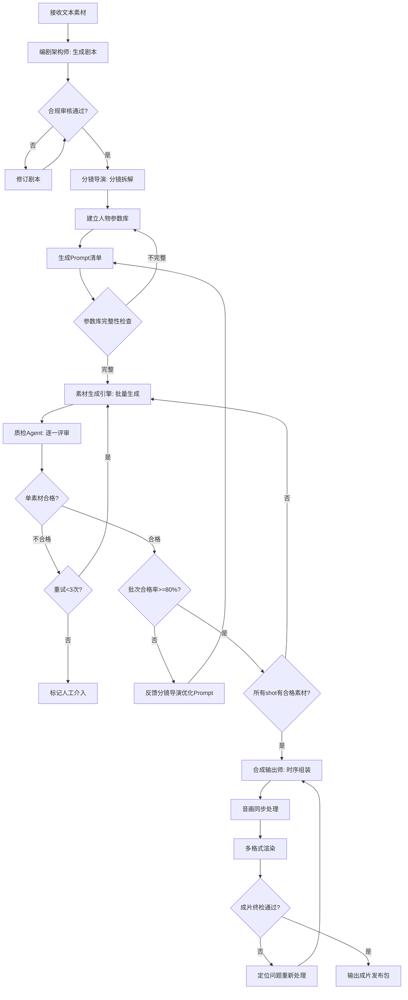

# 端到端视频生成 - 标准操作规程 (SOP)

## 1. 概述

本SOP定义了从文本素材输入到可发布视频成片输出的完整生产流程标准。适用于AI短剧工业化生产场景，覆盖"编剧→导演→拍摄→合成"四大生产阶段。目标是实现2分钟短视频在2小时内完成全流程，同时确保人物一致性>=0.85、抽卡合格率>=80%的质量标准。

---

## 2. RACI 职责矩阵

| 流程步骤 | 编剧架构师 | 分镜导演 | 素材生成引擎 | 质量检测官 | 合成输出师 |
|----------|:----------:|:--------:|:------------:|:----------:|:----------:|
| 输入接收与类型识别 | R/A | I | I | I | I |
| 剧本生成 | R/A | I | - | - | - |
| 平台合规预审 | R/A | C | - | I | - |
| 剧本修订 | R/A | C | - | C | - |
| 分镜拆解 | C | R/A | I | I | I |
| 人物参数库建立 | I | R/A | I | C | - |
| Prompt工程 | - | R/A | I | C | - |
| 并发任务调度 | - | I | R/A | I | - |
| 素材生成执行 | - | - | R/A | I | - |
| 一致性质检 | - | C | I | R/A | - |
| 画面质量质检 | - | - | I | R/A | - |
| 内容合规质检 | - | - | I | R/A | - |
| 重新生成决策 | - | C | R | A | - |
| 抽卡合格率监控 | - | I | I | R/A | - |
| Prompt优化反馈 | - | R | I | A | - |
| 时间线组装 | - | C | - | - | R/A |
| 音画同步处理 | - | - | - | - | R/A |
| 转场设计 | - | C | - | - | R/A |
| 多格式渲染 | - | - | - | - | R/A |
| 成片质量终检 | - | - | - | R/A | C |

> R=Responsible(执行), A=Accountable(负责), C=Consulted(咨询), I=Informed(知会)

---

## 3. 流程详细步骤

### 阶段一：编剧阶段

#### SOP-1: 输入接收与剧本生成

**触发条件**: 收到文本素材（小说/剧本/brief）和生产任务单（含目标平台、时长、集数要求）

**执行动作**:
1. 编剧架构师接收输入素材，识别文本类型（小说/剧本/brief/IP素材）
2. 解析任务需求：目标平台、时长、风格、集数
3. 提取核心故事元素：人物、冲突、情节走向
4. 进行结构化拆解，生成符合标准的剧本JSON
5. 设计钩子体系（前3秒+每15秒+片尾）
6. 标注情绪曲线和对白

**输出物**:
- 结构化剧本JSON文件
- 剧本概要报告（角色数、场次数、时长估算、钩子数）

**质量检查点**:
- [ ] 场次数量合理（2分钟视频：4-8个场次）
- [ ] 对白密度合规（8-15句/2分钟）
- [ ] 钩子间隔≤15秒
- [ ] 情绪曲线有起伏（至少2次明显情绪变化）
- [ ] 总时长估算偏差<±10%

**异常处理**:
- 输入文本过短（<500字）：请求补充素材或降低目标时长
- 输入文本含敏感内容：标记风险点，建议替代方案
- 目标平台规格冲突：以最严格的平台标准为准

---

#### SOP-2: 平台合规审核

**触发条件**: 剧本生成完成

**执行动作**:
1. 加载目标平台的合规规则库
2. 对剧本全文进行内容安全扫描
3. 检查平台特有规则（如抖音不可出现竞品品牌）
4. 评估结构合规性（时长、声明要求等）
5. 生成合规报告

**输出物**:
- 合规检查报告（含风险评级和修改建议）
- 通过/不通过判定

**质量检查点**:
- [ ] 高危风险项为0
- [ ] 平台规范合规率100%
- [ ] 所有中危项已标注修改建议

**异常处理**:
- 高危违规：必须修改后重新提交
- 中危违规：附修改建议，执行SOP-1的修订分支
- 多平台冲突：按最严格标准修改，或生成平台差异化版本

**决策点**: 剧本是否通过合规审核？
- ✅ 通过 → 进入阶段二
- ❌ 不通过 → 返回SOP-1进行修订（最多3次迭代）
- ⚠️ 3次仍不通过 → 标记为人工介入

---

### 阶段二：导演阶段

#### SOP-3: 分镜拆解与参数库建立

**触发条件**: 剧本通过合规审核

**执行动作**:
1. 分镜导演接收结构化剧本
2. 逐场次进行镜头拆解（3-8秒/镜头）
3. 为每个镜头定义景别、运镜、角度、环境
4. 建立人物一致性参数库（每角色>=5个锚点）
5. 为每个镜头编写AI生成Prompt
6. 验证相邻镜头的连贯性

**输出物**:
- 完整分镜脚本JSON（含shots数组）
- 人物参数库JSON（含character_profiles）
- Prompt清单（每个shot对应正面+负面Prompt）

**质量检查点**:
- [ ] 每个角色>=5个一致性锚点
- [ ] 提示词规范度评分>=0.9
- [ ] 所有镜头有完整的景别/运镜/环境描述
- [ ] 相邻镜头光照/色调连贯
- [ ] Prompt为英文且包含正面+负面描述
- [ ] 镜头总时长=剧本目标时长±5%

**异常处理**:
- 角色过多（>4个）：建议编剧精简角色
- 场景切换过频：合并相似场景减少生成复杂度
- Prompt过长（>200 tokens）：精简并保留核心特征

---

### 阶段三：拍摄阶段（AI生成）

#### SOP-4: 并发素材生成

**触发条件**: 分镜脚本和Prompt清单就绪

**执行动作**:
1. 素材生成引擎解析生成任务清单
2. 构建任务依赖图（参考图→融合图→视频）
3. 按优先级排序并分配到API端点
4. 启动三级流水线并发执行
5. 实时监控任务进度和错误率
6. 对失败任务执行重试策略

**输出物**:
- 生成的全部素材文件（图像/视频/音频）
- 任务执行报告（成功率/延迟/资源利用率）
- 素材元数据清单

**质量检查点**:
- [ ] 并发任务成功率>=95%
- [ ] 单次批量生成超时率<5%
- [ ] 所有shot都有对应的生成素材
- [ ] 素材文件完整可用（无损坏/截断）

**异常处理**:
- API超时：等待5s→30s→120s指数退避重试
- API故障：切换备选模型（Runway→可灵→Pika）
- 资源不足：进入排队等待，通知上游预期延迟
- 3次重试仍失败：标记人工介入

---

#### SOP-5: 质量检测与重试循环

**触发条件**: 素材生成完成（逐个提交，不等整批）

**执行动作**:
1. 质检Agent接收生成素材
2. 执行人物一致性评分（对比参数库）
3. 执行画面质量评分（清晰度/构图/光影）
4. 执行内容合规检测（一票否决制）
5. 执行情绪匹配度评估
6. 生成质检报告并做出处置决策
7. 维护批次合格率统计

**输出物**:
- 每个素材的质检报告
- 合格素材清单（移交合成阶段）
- 不合格素材的重新生成指令
- 批次合格率统计面板

**质量检查点**:
- [ ] 人物一致性评分>=0.85
- [ ] 画面质量评分>=0.8
- [ ] 内容合规通过率=100%
- [ ] 情绪匹配度>=0.8
- [ ] 批次抽卡合格率>=80%

**决策树**:
```
素材质检
├── 合规检测
│   ├── 不通过 → 立即重新生成（修改Prompt排除违规元素）
│   └── 通过 → 继续评分
├── 一致性评分
│   ├── >=0.85 → PASS
│   ├── 0.75-0.84 → MARGINAL（可接受但非最优）
│   └── <0.75 → FAIL → 触发重新生成
├── 画面质量
│   ├── >=0.8 → PASS
│   └── <0.8 → FAIL → 触发重新生成
└── 最终决策
    ├── 所有维度PASS → 移交合成阶段
    ├── 有MARGINAL → 通过但记录
    └── 任一FAIL → 重新生成（最多3次）
        └── 3次仍FAIL → 反馈分镜导演优化Prompt / 标记人工介入
```

**异常处理**:
- 连续3+次同角色一致性不达标：向分镜导演反馈系统性Prompt问题
- 批次合格率<80%：触发预警，暂停生成，等待Prompt优化
- 合规检测有疑似误报：标记人工复核，不自动放行

---

### 阶段四：合成阶段

#### SOP-6: 素材合成与输出

**触发条件**: 所有shot的素材均通过质检

**执行动作**:
1. 合成输出师核验素材完整性
2. 按分镜脚本时序排列素材
3. 设计并添加转场效果
4. 执行音画同步对齐
5. 混缩背景音乐和音效
6. 按目标平台规格进行多版本渲染
7. 执行成片质量终检

**输出物**:
- 多版本成片文件（按平台规格）
- 合成报告（时间线详情/技术参数）
- 封面图
- 发布包

**质量检查点**:
- [ ] 音画同步误差<100ms
- [ ] 转场自然度评分>=0.85
- [ ] 无黑帧/花屏/音频爆裂
- [ ] 成片时长偏差<±5%
- [ ] 所有平台版本规格100%合规
- [ ] 文件完整可播放

**异常处理**:
- 素材缺失：向质检Agent请求补充，暂停合成等待
- 音画偏差>100ms：微调音频起始点或调整视频速度
- 渲染失败：检查资源和参数，降低码率重试
- 成片终检不通过：定位问题片段，请求该片段重新生成

---

## 4. 效率KPI指标

| 指标 | 目标值 | 告警阈值 | 测量方式 |
|------|--------|----------|----------|
| 端到端生产耗时 | <2小时/2分钟视频 | >2.5小时 | 从任务创建到成片输出的时间差 |
| 人物一致性评分 | >=0.85 | <0.80 | 所有分镜的平均一致性评分 |
| 抽卡合格率（首次通过率）| >=80% | <70% | 首次生成即通过质检的比例 |
| 并发处理能力 | 180视频+360图像 | 利用率<60% | 同时执行的生成任务数 |
| 重试率 | <20% | >30% | 需要重新生成的素材占比 |
| 成片一次通过率 | >=90% | <80% | 无需人工干预的成片比例 |
| 日产量 | >=10部/天 | <5部/天 | 按全流程计算的日完成数 |
| 并发任务成功率 | >=95% | <90% | API调用成功比例 |
| 合规通过率 | 100% | <100% | 内容合规检测通过率 |

---

## 5. 质量关卡（Quality Gates）

### Gate 1: 剧本关
- 位置：编剧阶段完成后
- 条件：合规审核通过 + 结构完整性验证通过
- 不通过后果：返回编剧修订

### Gate 2: 分镜关
- 位置：分镜拆解完成后
- 条件：参数库完整（每角色>=5锚点）+ Prompt规范度>=0.9
- 不通过后果：返回分镜导演补充

### Gate 3: 素材关
- 位置：每个素材生成后
- 条件：一致性>=0.85 + 质量>=0.8 + 合规=100%
- 不通过后果：触发重新生成

### Gate 4: 批次关
- 位置：整批素材生成后
- 条件：抽卡合格率>=80% + 所有shot有合格素材
- 不通过后果：暂停流程，Prompt优化后重新生成

### Gate 5: 成片关
- 位置：合成输出后
- 条件：音画同步<100ms + 无技术缺陷 + 规格合规
- 不通过后果：定位问题素材重新合成

---

## 6. 决策流程图（Mermaid）



---

## 7. 交接协议

### 编剧→分镜导演
- 交接物：结构化剧本JSON
- 必含字段：scenes[]、character_list[]、emotion标注
- 验证方式：分镜导演确认剧本可执行性

### 分镜导演→素材生成引擎
- 交接物：分镜脚本JSON + Prompt清单 + 人物参数库
- 必含字段：shots[]（含prompt_positive/negative）、character_profiles[]
- 验证方式：生成引擎确认所有任务可解析

### 素材生成引擎→质检Agent
- 交接物：生成的素材文件 + 元数据
- 必含信息：task_id、shot_ref、model_used、file_path
- 验证方式：文件可访问且格式正确

### 质检Agent→合成输出师
- 交接物：已通过质检的素材清单
- 必含信息：每个shot的合格素材路径、质检评分
- 验证方式：合成师确认所有shot有对应素材

### 质检Agent→分镜导演（反馈回路）
- 交接物：质量问题报告 + 优化建议
- 触发条件：同角色连续3+次不达标 或 批次合格率<80%
- 验证方式：分镜导演确认收到并计划优化

---

## 8. 版本记录

| 版本 | 日期 | 变更内容 |
|------|------|----------|
| v1.0 | 2024-01-01 | 初始版本，覆盖完整四阶段流程 |
