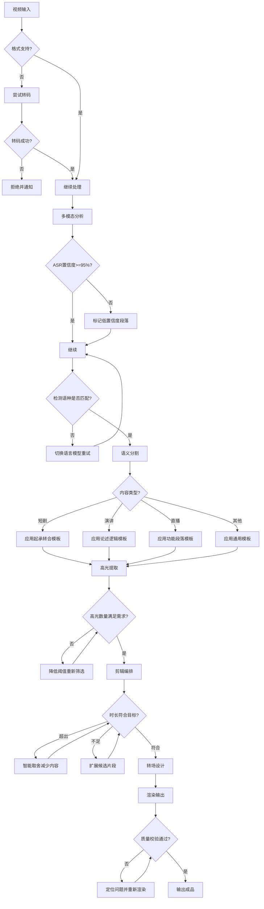

# 智能视频剪辑系统（VIE）标准操作规程

## 1. 概述

### 1.1 目的
本SOP规范了VIE（Video Intelligence Editor）智能视频剪辑系统的端到端操作流程，确保从视频输入到成片输出的全链路质量可控、效率可量化、异常可追踪。

### 1.2 适用范围
- 短剧投放素材批量制作（每部剧产出20-50条投放素材）
- 活动/演讲视频精华提取
- 直播回放高光时刻自动剪辑
- 长视频智能拆条为系列短视频

### 1.3 核心KPI指标

| 指标 | 目标值 | 监控频率 |
|------|--------|----------|
| ASR转写准确率 | >=95% | 每批次抽检 |
| OCR识别准确率 | >=90% | 每批次抽检 |
| 语义分割准确率 | >=95% | 每批次抽检 |
| 高光评分与人工判断相关系数 | >=0.8 | 每周校准 |
| 剪辑时长误差 | 正负5%以内 | 每次输出 |
| 上下文连贯性评分 | >=0.85 | 每次输出 |
| 1小时视频端到端处理时间 | 小于10分钟 | 每次执行 |
| 月批量处理能力 | >=100部短剧 | 月度统计 |
| 人工微调率 | 小于20% | 月度统计 |

---

## 2. RACI矩阵

| 流程步骤 | 多模态分析师 | 语义分割师 | 高光提取师 | 剪辑编排师 | 人工审核员 |
|----------|:----------:|:----------:|:----------:|:----------:|:----------:|
| 视频输入验证 | R/A | I | I | I | C |
| ASR语音转写 | R/A | I | I | I | C |
| OCR帧文字识别 | R/A | I | I | I | C |
| 视觉内容分析 | R/A | I | I | I | I |
| 音频分析 | R/A | I | I | I | I |
| 语义图谱构建 | R/A | C | C | I | I |
| 语义边界检测 | C | R/A | I | I | C |
| 叙事结构分析 | C | R/A | C | C | I |
| 分段评分 | I | R/A | C | C | I |
| 高光时刻检测 | C | C | R/A | I | C |
| 情绪高潮分析 | C | I | R/A | I | I |
| 钩子片段识别 | I | I | R/A | C | C |
| 智能内容选择 | I | C | C | R/A | C |
| 叙事节奏编排 | I | I | C | R/A | C |
| 转场设计 | I | I | I | R/A | I |
| 渲染输出 | I | I | I | R/A | A |
| 最终质量验收 | I | I | I | C | R/A |

> R=Responsible（执行者）, A=Accountable（负责人）, C=Consulted（咨询者）, I=Informed（知会者）

---

## 3. 详细操作流程

### SOP-1：视频输入验证

#### 触发条件
- 收到新的视频剪辑任务请求
- 批量任务中每个视频文件进入处理队列时

#### 执行动作
1. **格式验证**：确认视频格式为支持的类型（MP4/MOV/AVI/MKV/WebM）
2. **完整性校验**：验证文件无损坏（检查文件头/尾标记、关键帧完整性）
3. **元数据提取**：读取时长、分辨率、帧率、编码格式、音轨信息
4. **资源预估**：根据视频时长和分辨率计算预期处理时间和资源需求
5. **任务参数确认**：确认剪辑目标（目标时长、用途、输出平台、产出数量）

#### 输出产物
- 视频验证报告（通过/不通过+原因）
- 资源预估报告（预计处理时间、存储需求）
- 任务配置确认单

#### 异常处理
| 异常情况 | 处理方式 |
|----------|----------|
| 视频格式不支持 | 尝试自动转码为MP4后重新验证；转码失败则拒绝并通知提交者 |
| 文件损坏 | 拒绝处理，返回错误详情和修复建议 |
| 视频时长超过4小时 | 自动切分为30分钟片段，标记为分片处理模式 |
| 音轨缺失 | 标记为无音频模式，跳过ASR管线，仅执行视觉分析 |

#### 质量检查点
- [ ] 视频格式在支持列表中
- [ ] 文件完整性校验通过
- [ ] 音视频轨道均可正常解码
- [ ] 任务参数完整且合理

---

### SOP-2：多模态分析

#### 触发条件
- SOP-1视频输入验证通过

#### 执行动作
1. **ASR管线启动**：执行语音转文字+说话人分离+情感标注
2. **OCR管线启动**：执行关键帧采样+文字检测+文字识别
3. **视觉分析管线启动**：执行场景识别+人物检测追踪+动作识别+表情分析
4. **音频分析管线启动**：执行背景音乐检测+音效识别+静音标记
5. **时间轴对齐**：将四条管线输出按毫秒精度对齐到统一时间轴
6. **语义图谱组装**：将对齐后的数据组装为结构化语义图谱

#### 输出产物
- 视频语义图谱JSON文件
- 分析质量报告（各管线置信度统计）
- 低置信度段落清单（标记需人工校验的片段）

#### 异常处理
| 异常情况 | 处理方式 |
|----------|----------|
| ASR置信度低于95%（批次平均） | 标记低置信度段落，不阻塞流程，在输出中注明质量风险 |
| 语种与预期不符 | 自动切换对应语种的ASR模型重新处理该段落 |
| 视觉分析GPU超时 | 降级为CPU模式重试，接受更长处理时间 |
| 多管线同时失败 | 暂停当前任务，触发系统健康检查，通知运维 |

#### 质量检查点
- [ ] ASR转写平均置信度>=95%
- [ ] OCR识别平均置信度>=90%
- [ ] 时间轴对齐误差小于500ms
- [ ] 语义图谱覆盖率>=98%（无大段空白）
- [ ] 低置信度段落占比小于10%

---

### SOP-3：语义分割

#### 触发条件
- SOP-2多模态分析完成，语义图谱已生成

#### 执行动作
1. **内容类型判定**：基于语义图谱特征判断视频类型（短剧/演讲/直播/综艺）
2. **分割策略选择**：根据内容类型加载对应的分割策略模板
3. **多信号边界检测**：融合文本主题、视觉场景、说话人、音频、情绪五维信号检测分割点
4. **边界精修**：将候选边界精修到语义自然断点
5. **叙事结构分析**：识别整体叙事框架（起承转合/论点论据/环节划分）
6. **分段评分**：对每个分段进行重要性评级（1-5星）

#### 输出产物
- 带时间戳的分段列表（含主题摘要、情绪基调、重要性评级）
- 叙事结构概览报告
- 张力曲线数据
- 需人工确认的低置信度边界清单

#### 异常处理
| 异常情况 | 处理方式 |
|----------|----------|
| 内容类型识别置信度低于0.7 | 同时运行多个模板，选择分割质量最高的方案 |
| 分段数量异常（过多/过少） | 调整最小/最大时长参数重新分割 |
| 存在非线性叙事 | 标注时间线关系，仍按物理时间线分割但添加逻辑关联标记 |
| 语义图谱数据不完整 | 回调多模态分析师补充分析缺失段落 |

#### 质量检查点
- [ ] 分割边界与实际内容边界匹配率>=95%
- [ ] 无遗漏的重要分割点（抽检验证）
- [ ] 最小分段时长>=3秒
- [ ] 每个分段的主题摘要清晰可理解
- [ ] 叙事结构识别结果合理

---

### SOP-4：高光提取

#### 触发条件
- SOP-3语义分割完成

#### 执行动作
1. **多维度高光信号扫描**：检测情绪峰值、叙事转折、精彩对白、视觉冲击
2. **高光片段范围确定**：以信号峰值为中心扩展至语义自然边界
3. **综合评分计算**：按5维加权公式计算0-100综合评分
4. **钩子片段专项识别**：针对投放场景识别3秒钩子候选
5. **高光分类与标签**：标注类型（可多标签）和吸引力描述
6. **数量充足性验证**：检查高光数量是否满足任务需求

#### 输出产物
- 高光片段清单（含评分、分类、描述）
- 钩子片段Top-N推荐列表
- 统计摘要报告

#### 异常处理
| 异常情况 | 处理方式 |
|----------|----------|
| 高光数量不足任务需求 | 逐步降低评分阈值（80到70到60），在输出中说明降档 |
| 高光过于集中在某一时段 | 强制分散采样，确保时间分布均匀度>=0.6 |
| 所有高光评分偏低（低于60） | 标记源内容高光密度低，建议人工确认 |
| 检测到大量相似高光 | 执行去重，保留每组最高分的代表片段 |

#### 质量检查点
- [ ] 高光评分与人工判断相关系数>=0.8（定期校准）
- [ ] 钩子片段前3秒吸引力评分>=80
- [ ] 高光片段均为自包含（可独立理解）
- [ ] 类型分布合理（非全部同类型）
- [ ] 无重复/高相似度片段

---

### SOP-5：剪辑编排

#### 触发条件
- SOP-4高光提取完成
- 已明确剪辑任务参数（目标时长、用途、平台、产出数量）

#### 执行动作
1. **智能内容选择**：在目标时长约束下选择最优内容子集
2. **叙事节奏编排**：根据用途确定片段排列顺序和节奏曲线
3. **开头钩子确定**：为每条素材确定最强钩子片段作为开头
4. **转场设计**：为每个拼接点设计合适的转场方式
5. **时长微调**：确保最终时长在目标正负5%以内
6. **批量差异化**（如适用）：确保多条素材之间内容差异度>=0.6

#### 输出产物
- 剪辑决策文档（EDL - Edit Decision List）
- 时间戳映射表（成片时间与原始时间的双向映射）
- 节奏曲线和注意力预估报告
- 批量产出差异度矩阵（如适用）

#### 异常处理
| 异常情况 | 处理方式 |
|----------|----------|
| 编排后时长超出目标+5% | 删除最低评分片段或压缩过渡段落，重新计算时长 |
| 编排后时长不足目标-5% | 扩展候选范围，纳入更多分段内容 |
| 上下文连贯性评分低于0.85 | 调整片段顺序或插入过渡片段修复连贯性 |
| 批量差异度低于0.6 | 通过不同钩子+不同结尾组合扩展差异化 |
| 注意力曲线有严重低谷 | 在低谷处替换为更高吸引力的片段 |

#### 质量检查点
- [ ] 最终时长在目标正负5%以内
- [ ] 上下文连贯性评分>=0.85
- [ ] 所有转场点位于语义自然断点
- [ ] 开头3秒钩子吸引力评分>=80
- [ ] 无内容跳跃（因果关系完整）
- [ ] 批量素材间内容差异度>=0.6

---

### SOP-6：渲染输出

#### 触发条件
- SOP-5剪辑编排完成，EDL已生成

#### 执行动作
1. **渲染任务配置**：解析EDL，确定输出规格矩阵
2. **视频轨道组装**：按EDL精确裁切和拼接源视频片段
3. **转场特效渲染**：渲染所有转场效果
4. **音频处理**：音频裁切+转场处理+音量标准化
5. **编码输出**：按目标格式和规格进行编码
6. **质量校验**：检测黑帧/花屏/音频异常
7. **时间戳映射表附加**：将映射表嵌入或作为附件输出

#### 输出产物
- 渲染成片文件（可能多个规格版本）
- 技术质量报告
- 时间戳映射表文件
- 封面缩略图

#### 异常处理
| 异常情况 | 处理方式 |
|----------|----------|
| 渲染过程中检测到花屏 | 定位问题帧，关键帧对齐后重新渲染该段 |
| 音频爆裂/削波 | 降低该段音量5dB后重新混音 |
| 输出文件大小异常 | 调整码率参数重新编码 |
| GPU显存溢出 | 切换为分段渲染模式（先渲染各段再拼接） |
| 编码器错误 | 切换备选编码器重试 |

#### 质量检查点
- [ ] 无黑帧/花屏/音频爆裂
- [ ] 文件格式/分辨率/码率符合目标规格
- [ ] 音量标准化在-14正负1 LUFS
- [ ] 时间戳映射表完整且准确
- [ ] 文件可正常播放（头尾均正常）

---

## 4. 决策树

---

## 5. 效率标准

### 5.1 处理时间基准

| 视频时长 | 分析阶段 | 分割+高光 | 编排+渲染 | 端到端总计 |
|----------|----------|-----------|-----------|-----------|
| 15分钟 | 小于2分钟 | 小于1分钟 | 小于1分钟 | 小于4分钟 |
| 30分钟 | 小于3分钟 | 小于2分钟 | 小于1.5分钟 | 小于6.5分钟 |
| 60分钟 | 小于5分钟 | 小于3分钟 | 小于2分钟 | 小于10分钟 |
| 120分钟 | 小于10分钟 | 小于5分钟 | 小于3分钟 | 小于18分钟 |

### 5.2 批量处理能力

| 场景 | 目标产能 | 并发度 |
|------|----------|--------|
| 单部短剧转投放素材 | 20-50条/小时 | 5并发 |
| 日处理量 | >=5部短剧 | 根据资源动态调整 |
| 月处理量 | >=100部短剧 | 持续运行 |

---

## 6. 质量校准机制

### 6.1 定期校准计划

| 校准项目 | 频率 | 方法 | 负责人 |
|----------|------|------|--------|
| ASR准确率校准 | 每周 | 随机抽取5%转写结果人工复核 | 人工审核员 |
| 语义分割校准 | 每两周 | 抽取10个分割结果人工评判边界准确性 | 人工审核员 |
| 高光评分校准 | 每周 | 对比人工标注的高光与系统识别结果 | 人工审核员 |
| 剪辑满意度追踪 | 每月 | 统计人工微调率和修改幅度 | 剪辑编排师 |

### 6.2 持续优化触发条件

| 触发条件 | 优化动作 |
|----------|----------|
| ASR准确率连续3天低于93% | 检查音频预处理管线，考虑模型更新 |
| 语义分割准确率下降超过3个百分点 | 分析失败案例，更新分割策略权重 |
| 高光评分相关系数低于0.75 | 重新标注训练数据，更新评分模型 |
| 人工微调率超过30% | 分析高频修改模式，针对性优化编排策略 |
| 端到端处理时间超标 | 性能剖析，优化瓶颈管线 |

---

## 7. 批量任务管理

### 7.1 短剧批量投放素材生产流程

1. **任务接收**：接收短剧视频文件 + 产出需求（N条 x 目标时长 x 平台）
2. **全量分析**：对完整短剧执行一次完整的多模态分析（复用分析结果）
3. **全量分割和高光标注**：一次性识别所有高光片段
4. **批量编排**：基于高光池批量生成N条差异化投放素材
5. **批量渲染**：并行渲染所有素材 x 所有规格版本
6. **批量校验**：自动质检+抽检人工验收
7. **批量交付**：打包所有成品+时间戳映射表+质量报告

### 7.2 失败隔离机制

- 批量任务中单个视频处理失败不阻塞整体流程
- 失败的视频标记为待重试或需人工介入
- 批量任务完成时输出成功/失败/待处理三类清单
- 支持对失败视频单独重试，无需重新运行整个批次

---

## 8. 与其他Scope的协作接口

### 8.1 从端到端视频生成Scope接收输入
- 接收AI生成的完整短剧视频
- 可复用生成阶段的剧本结构信息加速语义分割
- 格式约定：MP4, H.264, 1080p, AAC音频

### 8.2 向多语种视频分发Scope输出
- 输出剪辑成片 + 时间戳映射表
- 共享ASR转写结果（避免下游重复分析）
- 共享语义图谱中的OCR文字信息
- 格式约定：统一的元数据JSON Schema
