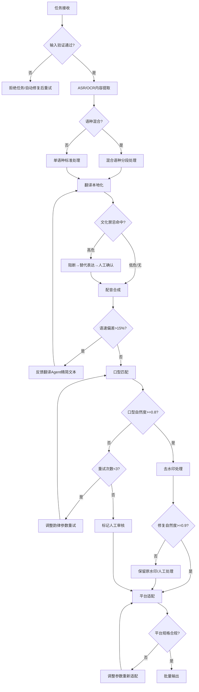

# 多语种视频分发标准操作流程 (SOP)

## 1. 流程概述

本SOP定义了将中文视频（或其他源语种视频）高质量转化为多语种版本并适配多平台分发的完整操作流程。覆盖从任务接收、内容提取、翻译本地化、配音合成、口型匹配、去水印处理、平台适配到批量输出的全链路。

**适用范围**：短剧出海、跨境电商视频、教育内容国际化、企业宣传片多市场分发
**核心目标**：实现50+视频×5+语种×3+平台的矩阵式高质量产出，24小时内完成
**质量底线**：翻译术语准确率>=90%、配音MOS>=3.8、口型自然度>=0.8、去水印自然度>=0.9、平台合规率100%

---

## 2. RACI矩阵

| 流程步骤 | 翻译本地化师 | 配音合成师 | 分发适配师 | 上游系统/人工 |
|---------|:----------:|:---------:|:---------:|:----------:|
| 任务接收与验证 | I | I | R | A |
| ASR/OCR内容提取 | C | I | R | I |
| 语种混合检测 | R | I | I | C |
| 多语种翻译 | R | I | I | A |
| 文化禁忌检测 | R | I | I | A |
| 术语表应用 | R | I | I | C |
| 配音合成 | C | R | I | I |
| 语速匹配调节 | C | R | I | I |
| 口型匹配对齐 | I | R | I | I |
| 去水印处理 | I | I | R | C |
| 多平台规格适配 | I | I | R | I |
| 字幕烧制 | C | I | R | I |
| 音视频最终合成 | I | C | R | I |
| 批量任务管理 | I | I | R | A |
| 质量验收 | C | C | R | A |

> R=Responsible(执行), A=Accountable(决策), C=Consulted(咨询), I=Informed(通知)

---

## 3. 详细流程步骤

### 步骤1：任务接收与输入验证

**触发条件**：收到视频分发任务请求（包含视频文件+目标语种列表+目标平台列表）

**执行动作**：
1. 验证视频文件可处理性：
   - 编码格式检查（支持H.264/H.265/VP9/AV1）
   - 时长统计（单视频上限60分钟）
   - 画质评估（分辨率>=720p）
   - 音频轨道完整性检查
2. 验证任务配置合法性：
   - 目标语种是否在支持列表内（15+种语言）
   - 目标平台是否在支持列表内
   - 批量数量是否在系统承载范围内
3. 识别原始视频语种（通过ASR初步识别）

**输出产物**：
- 任务验证报告（通过/不通过+具体原因）
- 资源预估报告（预计耗时、存储需求）

**异常处理**：
- 不支持的编码格式 → 自动转码后重新验证
- 视频文件损坏 → 拒绝任务并返回错误详情
- 目标语种不支持 → 跳过该语种并告警通知

**质量检查点（SOP-1）**：
- ✅ 视频编码格式支持性确认
- ✅ 视频时长在处理范围内
- ✅ 原始语种识别准确性确认（置信度>=0.9）
- ✅ 所有目标语种/平台在支持列表中

---

### 步骤2：内容提取（ASR + OCR）

**触发条件**：任务通过输入验证

**执行动作**：
1. ASR语音转文字：
   - 执行全文语音识别（支持多说话人分离）
   - 生成带时间戳的转写文本
   - 标注每段文本的情感（喜/怒/哀/乐/中性）
   - 计算置信度（低于95%的段落标记）
2. OCR画面文字识别：
   - 逐帧扫描画面文字区域
   - 识别字幕、标题、画中文字
   - 记录文字出现的帧范围和位置
3. 语种混合检测：
   - 分析ASR结果中的语种分布
   - 标记语种切换边界

**输出产物**：
- ASR转写文件（JSON格式，含时间戳+说话人+情感+置信度）
- OCR识别文件（JSON格式，含位置+帧范围+文字内容）
- 语种分布报告

**异常处理**：
- ASR置信度整体偏低（<90%）→ 切换语言模型重试
- 无法识别的语种 → 标记为"未知语种"需人工确认
- 视频无音频轨道 → 跳过ASR，仅执行OCR

---

### 步骤3：翻译本地化

**触发条件**：内容提取完成

**执行动作**：
1. 加载自定义术语表
2. 对ASR文本执行多语种翻译（按目标语种列表逐一执行）
3. 翻译过程中应用术语表强制匹配
4. 执行文化禁忌检测（全量扫描）
5. 对命中文化禁忌的内容生成替代表达建议
6. 为翻译文本添加情感标注和断句标记
7. 计算各语种的翻译文本长度比率（用于预判语速问题）

**输出产物**：
- 多语种翻译文件（每种语种一份，含时间轴映射）
- 文化禁忌检测报告
- 术语匹配报告（命中率统计）
- 语速风险预警列表

**异常处理**：
- 术语表命中率<90% → 标记低命中段落需人工校验
- 文化高危禁忌命中 → 阻断流程，必须处理后才能继续
- 翻译文本长度异常（>150%源文本）→ 预警可能的语速问题

**质量检查点（SOP-2）**：
- ✅ 术语表命中率>=90%
- ✅ 文化禁忌检测覆盖率100%
- ✅ 翻译流畅度抽检评分>=4.0/5.0
- ✅ 所有段落均已翻译（无遗漏）

---

### 步骤4：配音合成

**触发条件**：翻译本地化完成（或收到翻译Agent的修订版本）

**执行动作**：
1. 为每种目标语种选择TTS引擎和音色
2. 设置情感参数（基于翻译文本中的情感标注）
3. 执行语音合成
4. 语速匹配检查：
   - 计算配音时长与原始片段时长的偏差
   - 偏差<=15% → 通过微调rate参数校正
   - 偏差>15% → 反馈翻译Agent进行文本精简
5. MOS评分评估

**输出产物**：
- 多语种配音音频文件（每种语种一套，按片段分割）
- 配音质量报告（MOS评分、语速偏差、情感匹配度）
- 语速冲突反馈清单（如有）

**异常处理**：
- 某语种TTS模型不可用 → 跳过该语种并告警
- MOS评分<3.5 → 自动重试（最多3次，调整参数后重新合成）
- 语速冲突无法通过参数调节解决 → 反馈翻译Agent缩短文本

**质量检查点（SOP-3）**：
- ✅ MOS评分>=3.8（批次平均）
- ✅ 语速与原声偏差<15%
- ✅ 情感一致性评分>=0.8
- ✅ 无爆音/杂音/断续等音质缺陷

---

### 步骤5：口型匹配

**触发条件**：配音合成完成且通过质量检查

**执行动作**：
1. 提取视频中人脸关键点数据（口部区域）
2. 对配音音频进行音素分解
3. 生成Viseme时间序列
4. 执行配音与口型的时间轴对齐（DTW算法）
5. 评估口型自然度

**输出产物**：
- 口型对齐后的配音音频（可能经过微时移调整）
- 口型匹配质量报告（自然度评分、延迟数据）

**异常处理**：
- 无人脸的片段 → 跳过口型匹配，仅保证语速匹配
- 口型自然度<0.8 → 调整配音韵律参数重试（最多3次）
- 口型自然度<0.6且重试无效 → 标记为"需人工审核"

**质量检查点（SOP-4）**：
- ✅ 口型自然度>=0.8
- ✅ 音画延迟<200ms
- ✅ 无明显的音画不同步感

---

### 步骤6：去水印处理

**触发条件**：视频中检测到水印（可与步骤3-5并行执行）

**执行动作**：
1. 自动检测水印位置和类型
2. 选择修复策略（颜色插值/AI Inpainting/视频修复）
3. 执行水印去除和区域修复
4. 评估修复自然度

**输出产物**：
- 去水印后的视频文件
- 水印检测报告（位置、类型、数量）
- 修复质量报告（各区域自然度评分）

**异常处理**：
- 水印面积过大（>20%画面）→ 建议人工处理
- 修复自然度<0.9 → 尝试替代修复策略
- 修复自然度<0.7 → 保留原始水印区域，标记人工处理

**质量检查点（SOP-5）**：
- ✅ 水印检测召回率>=95%
- ✅ 修复区域自然度>=0.9
- ✅ 修复区域无明显伪影
- ✅ 帧间一致性（无闪烁）

---

### 步骤7：多平台规格适配

**触发条件**：去水印处理完成 + 配音/口型匹配完成

**执行动作**：
1. 查询各目标平台的规格要求
2. 执行画幅智能裁切（如需要）
3. 执行分辨率/码率/编码格式转换
4. 字幕烧制（按平台样式规范）
5. 音视频合成（配音音轨+处理后视频）
6. 封面图生成

**输出产物**：
- 每个平台版本的视频文件
- 平台合规检查报告
- 封面图文件

**异常处理**：
- 裁切导致主体丢失 → 调整裁切策略（切换为letterbox模式）
- 文件大小超过平台限制 → 降低码率重新编码
- 时长超过平台限制 → 标记告警（不自动截断）

**质量检查点（SOP-6）**：
- ✅ 各平台规格100%合规（分辨率/时长/文件大小/编码）
- ✅ 智能裁切后主体完整
- ✅ 字幕渲染正确（位置/样式/RTL方向）
- ✅ 音画同步无偏差

---

### 步骤8：批量输出与分发包生成

**触发条件**：所有视频×语种×平台的处理任务完成（或达到超时阈值）

**执行动作**：
1. 汇总所有完成的任务结果
2. 按标准命名规范组织输出文件
3. 生成完整的元数据清单
4. 生成批量任务摘要报告
5. 打包生成分发包

**输出产物**：
- 结构化的分发包（所有视频×语种×平台版本）
- 元数据清单（JSON格式）
- 批量任务报告（成功率/失败项/质量统计/耗时统计）

**异常处理**：
- 超时未完成 → 强制汇总当前已完成结果，未完成项标记
- 失败率过高（>10%）→ 生成诊断报告并告警
- 存储空间不足 → 增量输出+清理临时文件

**质量检查点（SOP-7）**：
- ✅ 50视频×5语种×3平台的矩阵任务<24小时完成
- ✅ 整体成功率>=95%
- ✅ 所有输出文件命名规范
- ✅ 元数据清单完整无缺失

---

## 4. 决策树

---

## 5. KPI指标体系

### 核心质量指标

| 指标 | 目标值 | 测量方式 | 检查频率 |
|------|--------|----------|----------|
| 翻译术语准确率 | >=90% | 术语表匹配率统计 | 每任务 |
| 翻译流畅度 | >=4.0/5.0 | 人工抽检评分 | 每周抽检10% |
| 配音MOS评分 | >=3.8 | 自动MOS评估模型 | 每段音频 |
| 口型匹配自然度 | >=0.8 | Viseme对齐评估 | 每段视频 |
| 去水印修复自然度 | >=0.9 | SSIM/LPIPS评估 | 每处水印 |
| 平台规格合规率 | 100% | 自动规格校验 | 每个输出文件 |

### 效率指标

| 指标 | 目标值 | 测量方式 | 检查频率 |
|------|--------|----------|----------|
| 单视频端到端耗时 | <30分钟(2分钟视频) | 时间戳计算 | 每视频 |
| 批量矩阵完成时间 | <24小时(750任务) | 批次计时 | 每批次 |
| 批量成功率 | >=95% | 成功数/总数 | 每批次 |
| 语速冲突率 | <20% | 冲突数/总段落数 | 每任务 |
| 重试率 | <15% | 重试数/总任务数 | 每批次 |

### 覆盖指标

| 指标 | 目标值 | 测量方式 | 检查频率 |
|------|--------|----------|----------|
| 支持语种数 | >=15 | 系统能力清单 | 月度 |
| 文化禁忌检测覆盖率 | 100% | 扫描段落/总段落 | 每任务 |
| 水印检测召回率 | >=95% | 人工抽检确认 | 月度抽检 |

---

## 6. 异常处理总则

### 可恢复异常（自动处理）
- 网络超时 → 自动重试3次，间隔60秒
- TTS引擎临时不可用 → 等待5分钟后重试
- 单段MOS不达标 → 调整参数重新合成
- 文件写入失败 → 检查磁盘空间后重试

### 不可恢复异常（需人工介入）
- 目标语种无TTS模型支持 → 跳过并告警
- 文化高危禁忌无法自动处理 → 阻断等待人工确认
- 口型匹配多次重试仍不达标 → 标记人工审核
- 去水印修复严重不自然 → 保留原水印等待人工处理

### 批量任务容错原则
- **隔离原则**：单视频失败不阻塞整批任务
- **降级原则**：某语种不可用时跳过该语种，其他语种继续
- **汇总原则**：超时后强制汇总当前结果，未完成项明确标记
- **告警原则**：失败率>10%时触发告警通知

---

## 7. 流程版本信息

| 字段 | 值 |
|------|-----|
| SOP版本 | v1.0 |
| 适用系统 | 多语种视频分发系统 |
| 创建日期 | 2024-01-01 |
| 审核状态 | 已批准 |
| 下次审核 | 2024-04-01 |
