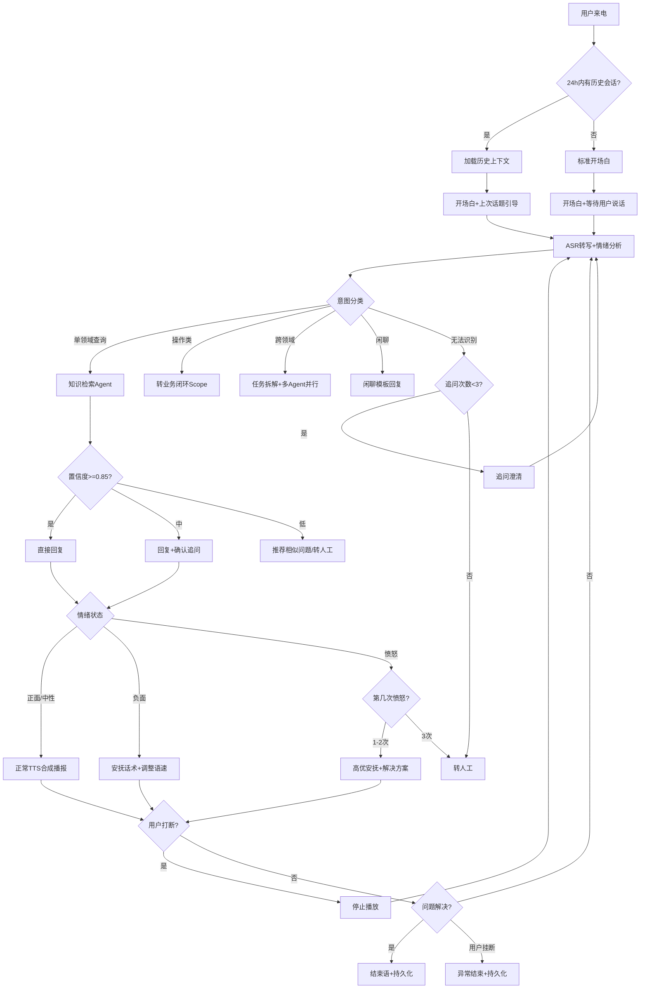

# 智能语音客服标准操作流程 (SOP)

## 1. 概述

本SOP定义了智能语音客服系统从通话接入到结束的全流程标准操作规范。覆盖语音处理、意图识别、知识检索、情绪管理、自然打断、质检监控等核心环节，确保系统在500ms端到端延迟约束内提供高质量的客户服务体验。

---

## 2. RACI矩阵

| 流程步骤 | 对话编排引擎 | 情绪感知引擎 | 知识检索Agent | 质检分析Agent | 外部系统 |
|----------|:----------:|:----------:|:----------:|:----------:|:--------:|
| SOP-1 通话接入与上下文加载 | R/A | I | I | I | C |
| SOP-2 语音识别与转写 | A | C | I | I | R |
| SOP-3 情绪实时分析 | I | R/A | - | C | - |
| SOP-4 意图识别与路由 | R/A | C | I | I | - |
| SOP-5 知识检索与答案生成 | A | - | R | C | C |
| SOP-6 自然打断处理 | R/A | I | - | I | C |
| SOP-7 情绪响应与升级 | R | A | - | C | C |
| SOP-8 TTS合成与播报 | R/A | C | - | I | R |
| SOP-9 实时质检监控 | C | C | - | R/A | I |
| SOP-10 会话结束与持久化 | R/A | I | I | R | C |

> R=Responsible(执行者), A=Accountable(负责人), C=Consulted(被咨询), I=Informed(被通知)

---

## 3. 详细流程步骤

### SOP-1 通话接入与上下文加载

**触发条件**：用户来电信号到达系统（SIP INVITE / WebRTC Offer / WebSocket连接请求）

**执行动作**：
1. 协议识别：判断接入渠道（电话/WebRTC/WebSocket），加载对应音频编解码配置
2. 会话建立：分配session_id，创建对话状态机实例，初始化为SESSION_INIT状态
3. 用户识别：通过来电号码/用户Token识别用户身份
4. 历史上下文检查：查询该用户24小时内是否有历史会话
   - 有历史会话 → 加载上下文摘要，在开场白中提及（"您好，上次您咨询了XX问题..."）
   - 无历史会话 → 标准开场白
5. 启动并行流：通知情绪感知引擎开始监听、通知质检Agent开始监控

**输出**：
- 会话实例（含session_id、用户画像、历史上下文）
- 对话状态 → GREETING

**异常处理**：
- 协议握手失败 → 重试1次 → 仍失败则返回忙音/错误页
- 用户识别失败 → 以匿名模式接入，不加载历史上下文
- 历史上下文加载超时(>200ms) → 跳过加载，正常开始，后台异步加载

**KPI检查点**：
- 会话建立成功率 >= 99.5%
- 历史上下文加载延迟 < 200ms

---

### SOP-2 语音识别与转写

**触发条件**：会话建立成功，开始接收音频流

**执行动作**：
1. 音频流接收：接收实时音频流（16kHz/16bit/单声道）
2. VAD端点检测：检测用户开始说话和停止说话的时间点
3. ASR实时转写：将语音流送入ASR引擎进行流式识别
   - 输出增量转写结果（每200ms更新一次部分结果）
   - 用户停止说话后输出最终结果
4. 并行送入情绪分析：音频帧同步发送给情绪感知引擎

**输出**：
- 增量转写文本（partial result）
- 最终转写文本（final result）
- VAD事件（speech_start / speech_end）

**异常处理**：
- ASR识别置信度过低(<0.3) → 标记为"识别不确定"，请求用户重复
- 音频质量差（信噪比<10dB）→ 提示用户调整通话环境
- ASR服务不可用 → 切换备用ASR引擎 → 仍失败则转人工

**KPI检查点**：
- ASR转写首包延迟 < 300ms
- 识别准确率 WER < 10%（普通话）
- VAD误触发率 < 2%

---

### SOP-3 情绪实时分析

**触发条件**：持续接收音频帧（以200ms窗口滑动分析）

**执行动作**：
1. 声学特征提取：从每个200ms音频帧中提取F0、语速、音量、停顿等特征
2. 情绪分类：基于特征向量输出四级情绪标签（正面/中性/负面/愤怒）
3. 强度评分：计算0-100情绪强度分值
4. 轨迹更新：追加到情绪时间序列，更新趋势判断
5. 事件检测：
   - 突变检测（1秒内强度变化>40分）→ 即时通知对话编排引擎
   - 愤怒计数更新 → 达到阈值时触发升级信号
6. 策略输出：根据情绪状态输出话术和TTS参数调整建议

**输出**：
- 实时情绪状态：{label, intensity, confidence, trend}
- 策略建议：{speech_suggestion, tts_params_adjustment}
- 升级信号（条件触发）

**异常处理**：
- 环境噪声干扰严重 → 降低情绪判定置信度，不做高强度判断
- 用户静默超过5秒 → 暂停情绪分析，恢复后重新建立基线
- 情绪模型推理超时 → 使用上一帧结果延续

**KPI检查点**：
- 情绪分类延迟 < 200ms
- 四级情绪分类准确率 >= 85%
- 愤怒转人工触发准确率 >= 95%

---

### SOP-4 意图识别与路由

**触发条件**：收到ASR最终转写结果

**执行动作**：
1. 意图预分类：判断用户请求属于单领域/跨领域/闲聊/无法识别
2. 意图细分：确定具体意图标签和实体
3. 情绪感知融合：结合当前情绪状态调整路由优先级
4. 路由决策：
   - 单领域查询/咨询 → 知识检索Agent
   - 操作类意图 → 业务闭环Scope的流程引导Agent
   - 跨领域复杂意图 → 任务拆解 → 多Agent并行调度
   - 投诉类 → 知识检索 + 情绪升级策略
   - 闲聊 → 内置闲聊模板
   - 无法识别 → 追问策略
5. 追问管理：
   - 首次不明 → 开放式追问（"请问您具体想了解什么？"）
   - 二次不明 → 选项式追问（"您是想查询订单还是办理退款？"）
   - 三次不明 → 转人工

**输出**：
- 意图分类结果：{category, detail, entities, confidence}
- 路由决策：{target_agent, priority, sub_tasks}

**异常处理**：
- 意图分类置信度低(0.5-0.7) → 执行确认式追问（"您是说要XX对吗？"）
- 用户频繁切换话题 → 保存未完成意图到队列，处理最新意图
- 跨领域子任务某个Agent不可用 → 跳过该子任务，告知用户部分功能暂不可用

**KPI检查点**：
- 意图分类准确率 >= 90%
- 路由决策耗时 < 50ms
- 追问后识别成功率 >= 80%

---

### SOP-5 知识检索与答案生成

**触发条件**：对话编排引擎向知识检索Agent发送查询请求

**执行动作**：
1. 查询预处理：提取核心查询、扩展同义词、确定检索范围
2. 混合检索：并行执行语义检索和BM25关键词检索
3. 结果融合：使用Re-ranker对候选进行精排
4. 置信度评估：对Top结果进行多维度置信度评分
5. 决策分支：
   - 高置信度(>=0.85) → 直接生成回复
   - 中置信度(0.6-0.85) → 回复+确认追问
   - 低置信度(<0.6) → 推荐相似问题 / 转人工
6. 合规标签检查：判断答案是否需要附加合规声明
7. 答案口语化：将书面语答案转化为适合TTS朗读的口语表达

**输出**：
- 答案文本（口语化，含合规声明）
- 置信度评分
- 答案类型标签
- 合规标签

**异常处理**：
- 检索服务超时(>300ms) → 使用缓存中的热门答案 → 无缓存则告知用户稍等
- 完全无匹配 → 记录知识缺口 → 建议转人工
- 多个矛盾答案 → 选择最新且权威度最高的版本

**KPI检查点**：
- 检索结果Top3命中率 >= 85%
- 无答案场景正确降级率 >= 95%
- 检索总耗时 < 300ms

---

### SOP-6 自然打断处理

**触发条件**：系统正在TTS播报过程中，检测到用户开始说话

**执行动作**：
1. 打断检测：区分真正的用户插话和非打断事件
   - 真打断信号：用户连续语音>300ms + 语义内容有意义
   - 非打断信号：咳嗽、环境噪声、"嗯"等反馈词
2. 打断确认后立即动作：
   - 停止当前TTS音频播放（<100ms内）
   - 中止后续待播放文本
   - 记录已播放内容位置（便于后续参考）
3. 重新进入意图识别：
   - 将打断内容作为新的输入送入ASR
   - 等待完整转写后进入意图路由

**输出**：
- 打断事件确认信号
- TTS停止指令
- 新的用户输入待处理

**异常处理**：
- 误打断（实际是噪声）→ 恢复TTS播放继续之前内容
- 打断内容识别不清 → 停止播放后追问"请问您说什么？"
- 打断频率过高（>5次/分钟）→ 缩短回复长度、增加停顿点

**KPI检查点**：
- 打断检测延迟 < 100ms
- 误打断率 < 5%
- 打断后恢复正常对话流的成功率 >= 95%

---

### SOP-7 情绪响应与升级

**触发条件**：情绪感知引擎输出负面/愤怒情绪信号

**执行动作**：

根据情绪级别执行分级响应：

**负面情绪（强度30-60）**：
1. 对话编排引擎切换为安抚话术模板
2. TTS参数调整：语速降低10-15%，语调更加沉稳
3. 回复内容增加共情表达
4. 继续正常业务流程

**负面情绪（强度>60）或首次愤怒**：
1. 输出高优安抚语句："非常抱歉给您带来困扰..."
2. 主动提供解决方案（不等用户要求）
3. 愤怒计数+1，记录触发时间和上下文
4. 语速降低20%，增加停顿

**第二次愤怒检测**：
1. 深度安抚 + 表达重视
2. 主动告知"如果我的服务无法满足您，可以为您转接人工专员"
3. 提供最优解决方案

**第三次愤怒检测 → 强制转人工**：
1. 生成转人工交接包（情绪摘要+对话记录+未解决问题）
2. 告知用户："为了更好地帮助您，现在为您转接专业人员"
3. 执行转接，确保交接包完整传递
4. 记录升级事件用于后续分析

**输出**：
- 话术调整指令
- TTS参数变更
- 转人工信号及交接包（L4级别时）

**异常处理**：
- 转人工队列满 → 告知预计等待时间 → 提供回拨选项
- 安抚后情绪恢复 → 重置关注级别（但愤怒计数不清零）
- 用户在安抚过程中挂断 → 记录为"情绪流失"，标记需要回访

**KPI检查点**：
- 情绪升级响应延迟 < 500ms
- 安抚后情绪改善率 >= 60%
- 第三次愤怒必须转人工（执行率 100%）

---

### SOP-8 TTS合成与播报

**触发条件**：对话编排引擎生成回复文本，准备语音播报

**执行动作**：
1. 接收回复文本和TTS参数（语速/语调/情感标签）
2. 文本预处理：
   - 数字/日期/金额的口语化读法
   - 长文本分段（自然断句点标记）
   - 添加适当的停顿标记
3. TTS合成：调用TTS引擎生成音频流
   - 使用情绪适配的语调模型
   - 流式输出（边合成边播放）
4. 音频推送：通过对应通道（RTP/WebRTC/WebSocket）推送音频
5. 播放状态跟踪：记录当前播放位置（支持打断后恢复）

**输出**：
- 合成音频流
- 播放状态事件（开始/进行中/完成/被打断）

**异常处理**：
- TTS合成失败 → 切换备用TTS引擎 → 仍失败则文本转文字推送
- 网络抖动导致音频卡顿 → 增大缓冲区 → 严重时降低音质
- 合成结果MOS评分低 → 记录，事后用于模型优化

**KPI检查点**：
- TTS合成首包延迟 < 150ms
- 合成语音MOS评分 >= 4.0
- 音频推送无卡顿率 >= 99%

---

### SOP-9 实时质检监控

**触发条件**：通话开始即启动，持续至通话结束

**执行动作**：
1. 加载业务线合规规则集
2. 持续监控对话流：
   - 检查必说话术是否在规定时间内触发
   - 检测禁止话术和敏感信息
   - 识别风险对话模式
3. 实时提醒：
   - 合规话术即将超时 → 向对话编排引擎发送提醒
   - 检测到违规 → 即时告警
   - 风险事件 → 按等级触发对应干预
4. 通话结束后：
   - 汇总合规检查结果
   - 计算实时合规评分
   - 将数据送入事后分析流程

**输出**：
- 实时合规提醒/告警
- 通话合规状态看板
- 合规事件记录

**异常处理**：
- 质检规则加载失败 → 使用通用基础规则集
- 实时分析延迟超标(>1秒) → 降级为事后分析模式
- 规则误触发频繁 → 自动降低该规则的告警级别，标记需调优

**KPI检查点**：
- 实时质检覆盖率 100%
- 合规话术遗漏检出率 >= 98%
- 实时提醒假阳性率 < 3%

---

### SOP-10 会话结束与持久化

**触发条件**：用户确认问题已解决 / 用户挂机 / 通话超时 / 转人工完成

**执行动作**：
1. 播放结束语（如适用）："感谢您的来电，祝您生活愉快"
2. 会话摘要生成：
   - 提取本次通话的核心问题列表
   - 记录已解决和未解决的问题
   - 保存关键实体信息（订单号、产品名等）
   - 记录最终情绪状态
3. 上下文持久化：
   - 将会话摘要写入24小时有效缓存
   - 标记是否需要后续跟进
4. 触发事后流程：
   - 通知质检Agent生成完整质检报告
   - 更新通话KPI指标
   - 触发满意度调查（如配置）
5. 资源释放：
   - 关闭音频通道
   - 释放会话状态机实例
   - 清理临时数据

**输出**：
- 会话摘要（持久化）
- 质检报告触发信号
- KPI数据更新

**异常处理**：
- 摘要生成失败 → 保存原始对话记录作为回退
- 持久化写入失败 → 重试3次 → 仍失败则异步补写+告警
- 异常挂断（通话中途断连）→ 标记为"异常结束"，主动回拨确认

**KPI检查点**：
- 会话摘要生成成功率 >= 99%
- 关键信息提取完整性 >= 95%
- 上下文持久化成功率 >= 99.9%

---

## 4. 决策树

---

## 5. KPI指标总览

| 指标 | 目标值 | 监控频率 | 告警阈值 |
|------|--------|----------|----------|
| 端到端响应延迟 P95 | <500ms | 实时 | >600ms |
| 意图识别准确率 | >=90% | 每小时 | <85% |
| 情绪识别准确率 | >=85% | 每日 | <80% |
| 首次解决率 FCR | >=75% | 每日 | <70% |
| 通话质检自动化率 | >=80% | 每日 | <75% |
| 客户满意度 CSAT | >=4.2/5 | 每日 | <4.0 |
| 自然打断成功率 | >=95% | 每小时 | <90% |
| 转人工率 | <15% | 每小时 | >20% |
| 会话建立成功率 | >=99.5% | 实时 | <99% |
| ASR转写 WER | <10% | 每日 | >12% |
| 合规话术覆盖率 | 100% | 实时 | <98% |
| TTS MOS评分 | >=4.0 | 每周 | <3.8 |

---

## 6. 质量关卡 (Quality Gates)

### Gate 1: 接入质量关
- 位置：SOP-1完成后
- 检查：会话是否成功建立、用户是否正确识别、历史上下文是否加载
- 不通过处理：记录失败原因，按降级模式继续

### Gate 2: 识别质量关
- 位置：SOP-2和SOP-4完成后
- 检查：ASR置信度是否达标、意图分类是否明确
- 不通过处理：触发追问流程，最多3次

### Gate 3: 回答质量关
- 位置：SOP-5完成后
- 检查：答案置信度是否达标、合规标签是否完整
- 不通过处理：降级为推荐相似问题或转人工

### Gate 4: 情绪安全关
- 位置：持续监控（SOP-7）
- 检查：愤怒次数是否达到阈值
- 不通过处理：强制转人工

### Gate 5: 合规关
- 位置：持续监控（SOP-9）
- 检查：必说话术是否齐全、有无违规用语
- 不通过处理：实时提醒补充话术

---

## 7. 版本信息

| 项目 | 内容 |
|------|------|
| SOP版本 | v1.0 |
| 适用范围 | 智能语音客服全渠道 |
| 生效日期 | 2024-01-01 |
| 审批人 | 客服运营负责人 |
| 下次审核 | 2024-07-01 |
