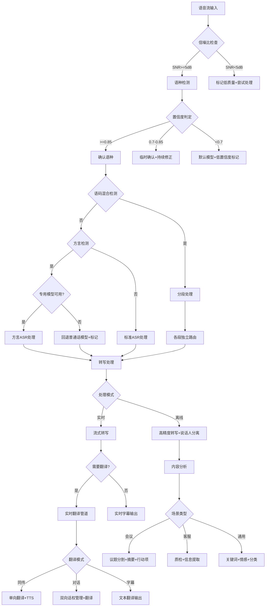

# 多语言语音服务标准操作流程 (SOP)

## 1. 流程概览

本SOP定义了多语言语音服务的端到端操作流程，涵盖语种检测、语音转写、内容分析、实时翻译、TTS合成和数据质量保障六大环节。流程设计目标是确保多语言语音处理的准确性、实时性和可靠性，将非结构化语音流高效转化为结构化数据资产。

---

## 2. RACI矩阵

| 流程步骤 | 语言路由Agent | 转写分析Agent | 实时翻译Agent | 运维团队 | 业务方 |
|----------|:---:|:---:|:---:|:---:|:---:|
| SOP-1 语种检测 | **R/A** | I | I | C | I |
| SOP-2 语音转写 | C | **R/A** | I | I | I |
| SOP-3 内容分析 | I | **R/A** | I | I | **C** |
| SOP-4 实时翻译 | C | I | **R/A** | I | I |
| SOP-5 TTS合成 | C | I | **R** | I | **A** |
| SOP-6 数据质量保障 | C | C | C | **R/A** | I |

> R=Responsible(执行)  A=Accountable(负责)  C=Consulted(咨询)  I=Informed(知会)

---

## 3. 详细流程步骤

### SOP-1：语种检测

**触发条件：** 新的语音流接入系统（来自客服通道、会议录制、API调用等任何语音输入源）

**执行步骤：**

1. **音频预处理**（0-100ms）
   - 接收输入语音流，执行采样率统一（转换为16kHz/16bit）
   - 执行VAD检测，过滤纯静音和纯噪声段
   - 计算信噪比SNR，若SNR<5dB标记为"低质量输入"

2. **快速语种判定**（100-500ms）
   - 提取首500ms音频的声学特征（Mel频谱+基频+韵律）
   - 运行语种分类模型，输出Top-3候选语种及置信度
   - 检查用户历史语言偏好作为先验参考

3. **路由决策**（<50ms）
   - 置信度>=0.85 → 确认语种，加载对应ASR模型
   - 置信度0.7-0.85 → 临时使用候选语种模型，继续修正
   - 置信度<0.7 → 使用默认语言模型，标记"低置信度待修正"

4. **语码混合检测**（并行执行）
   - 检测是否存在多语言混合信号
   - 若检测到语码混合 → 激活code-switching-segmentation技能
   - 输出分段结果，每段独立路由

5. **方言细分**（条件触发）
   - 若基础语种为中文且声学特征呈方言指示 → 激活dialect-recognition技能
   - 匹配到专用方言模型 → 路由到方言ASR
   - 未匹配 → 回退到普通话模型 + 标记fallback

**输出物：**
- 语种路由决策（language_code + model_id + confidence）
- 语码混合分段信息（若适用）
- 方言识别结果和回退标记（若适用）

**质量检查点：**
| 指标 | 目标值 | 测量方式 |
|------|--------|----------|
| 主要语言识别准确率 | >=97% | 月度抽样测试集评估 |
| 判定延迟 | <500ms | P95延迟监控 |
| 语码混合边界检测准确率 | >=90% | 人工标注对比评估 |
| 方言识别准确率（主要方言） | >=85% | 方言测试集评估 |

**异常处理：**
- 音频质量极差（SNR<3dB）→ 返回"输入质量不足"错误码，建议用户改善录音环境
- 未知语言（不在支持列表中）→ 标记"unsupported_language"，路由到通用多语言模型做最佳努力
- 模型加载超时（>200ms）→ 使用缓存中的最近可用模型先行处理

---

### SOP-2：语音转写

**触发条件：** 语种检测完成，ASR模型已加载，语音流准备就绪

**执行步骤：**

1. **转写模式确定**
   - 实时语音流输入 → 流式转写模式（增量输出）
   - 完整音频文件 → 离线高精度模式（全文输出）
   - 根据场景加载对应术语热词表

2. **流式转写执行**（实时路径）
   - 每接收320ms音频帧，执行CTC/Attention混合解码
   - 输出增量转写结果（partial→final状态标记）
   - 首字输出延迟<300ms
   - 支持增量修正（前序输出的partial结果可能被后续final结果覆盖）

3. **高精度转写执行**（离线路径）
   - 完整音频经过多遍解码（第一遍CTC + 第二遍Attention + LM重打分）
   - 执行说话人分离：Speaker Diarization聚类 → 说话人标签分配
   - 强制对齐：生成词级别时间戳
   - 标点恢复：基于语义和停顿模式插入标点

4. **后处理流水线**
   - 数字/日期/时间的规范化转写
   - 敏感信息检测（身份证/银行卡/手机号）→ 选择性脱敏
   - 语码混合文本格式化（保持原始混合形式）
   - 置信度标注（每个词/句的confidence分数）

5. **质量自评估**
   - 计算整体转写质量估计（基于模型后验概率分布）
   - 低置信度片段（<0.7）标记加入人工复核队列
   - 统计各项指标：WER估计、说话人分离DER、标点准确率

**输出物：**
- 结构化转写文本（含说话人标签、时间戳、置信度）
- 质量评估报告（WER估计、低置信度片段数量）
- 人工复核队列条目（低置信度片段）

**质量检查点：**
| 指标 | 目标值 | 测量方式 |
|------|--------|----------|
| 普通话WER | <8% | 标准测试集评估 |
| 英语WER | <10% | 标准测试集评估 |
| 方言WER | <15% | 方言测试集评估 |
| 说话人分离DER | <12% | RTTM对比评估 |
| 标点恢复准确率 | >=95% | 人工标注对比 |
| 首字延迟（流式） | <300ms | 延迟监控 |

**异常处理：**
- ASR模型推理超时 → 切换到轻量模型保证实时性，标记"降级处理"
- 说话人分离失败（如所有音频聚为单人）→ 标记"diarization_failed"，仍输出转写文本
- 音频中段出现长静音（>30秒）→ 分段处理，静音段标记为[silence]

---

### SOP-3：内容分析

**触发条件：** 转写完成（离线模式完整转写输出；实时模式积累到可分析的文本量）

**执行步骤：**

1. **场景识别与模板选择**
   - 根据输入元数据判断场景类型：
     - 会议标识 → 加载会议分析模板
     - 客服通话标识 → 加载质检分析模板
     - 通用/未标注 → 加载通用分析模板
   - 加载场景对应的自定义信息提取字段

2. **会议场景分析**
   - 议题自动分割：基于语义突变和转折语识别议题边界
   - 逐议题摘要生成：3-5句概括讨论要点和结论
   - 决策点提取：识别"决定"、"同意"、"确定"等决策信号词
   - 行动项提取：识别任务分配语句，提取负责人+任务+截止日期
   - 参会人关联：将发言内容与参会人姓名关联

3. **客服场景分析**
   - 问题分类：识别通话主题（咨询/投诉/办理/其他）
   - 解决方案提取：识别坐席给出的解决措施
   - 合规话术检查：对照合规清单检查必说话术
   - 情绪轨迹标注：标记用户情绪变化时间线
   - 敏感信息处理：检测并脱敏个人隐私信息
   - 信息提取：按场景模板提取结构化信息

4. **通用场景分析**
   - 关键词/关键短语提取（TF-IDF + 语义重要性评分）
   - 情感倾向分析（正面/中性/负面 + 强度分数）
   - 主题分类和标签生成
   - 文本摘要（按指定压缩比生成摘要）

5. **结果组装与输出**
   - 将分析结果按对应JSON Schema组装
   - 标注每项提取结果的置信度
   - 低置信度结果标记[待确认]
   - 生成分析质量评估指标

**输出物：**
- 会议场景：MeetingSummary（议题+摘要+决策+行动项）
- 客服场景：CallAnalysis（分类+质检+情绪+信息提取）
- 通用场景：ContentAnalysis（关键词+情感+分类+摘要）

**质量检查点：**
| 指标 | 目标值 | 测量方式 |
|------|--------|----------|
| 会议摘要覆盖率 | >=95% | 关键决策点人工核验 |
| 行动项提取准确率 | >=90% | 人工标注对比 |
| 质检报告生成时间 | <通话时长10% | 处理时间监控 |
| 问题分类准确率 | >=90% | 测试集评估 |
| 情感分析准确率 | >=85% | 人工标注对比 |

**异常处理：**
- 转写质量过低（估计WER>20%）→ 在分析结果中标注"低质量转写源，分析结果可靠性降低"
- 会议无法自动分割议题 → 按固定时间窗口（每15分钟）分段输出摘要
- 自定义模板字段提取率<50% → 标记"模板匹配度低，建议人工补充"

---

### SOP-4：实时翻译

**触发条件：** 检测到跨语言交互需求（翻译模式被激活），或用户主动请求翻译服务

**执行步骤：**

1. **翻译管道初始化**
   - 确定翻译方向：源语言→目标语言
   - 确定翻译模式：同传/对话/字幕
   - 加载对应语言对的翻译模型
   - 加载术语表和翻译记忆库

2. **流式翻译处理**
   - 接收ASR增量文本输出
   - 执行翻译分段策略（句完整时翻译/语义单元完整时翻译/超时强制翻译）
   - 术语预处理：扫描输入中的术语表词条，替换为标记占位符
   - 调用翻译模型执行翻译
   - 术语后处理：将占位符替换为术语表指定翻译
   - 输出翻译结果及延迟指标

3. **双向对话管理**（对话模式特有）
   - 启动双语对话管理技能
   - 监控话权状态（A_SPEAKING/B_SPEAKING/TRANSITION）
   - 话权切换时同步切换翻译方向
   - 维护双向上下文连贯性

4. **TTS合成指令**（语音输出模式）
   - 根据翻译结果生成TTS合成参数
   - 语速匹配：目标语言TTS语速与源语言说话速度适配
   - 情感保持：翻译后文本的TTS情感参数与源语音情感一致
   - 发送合成指令到TTS引擎

5. **质量监控与反馈**
   - 实时计算翻译延迟（目标<2秒）
   - 标记低置信度翻译片段
   - 记录翻译对到翻译记忆库（后续模型优化素材）
   - 术语一致性检查

**输出物：**
- 翻译后文本（含置信度、延迟、术语匹配信息）
- TTS合成指令（语音输出模式）
- 翻译质量指标（延迟、BLEU估计、术语一致性）

**质量检查点：**
| 指标 | 目标值 | 测量方式 |
|------|--------|----------|
| 端到端翻译延迟 | <2秒 | P95延迟监控 |
| 翻译质量BLEU（通用） | >=35 | 周度评测集评估 |
| 翻译质量BLEU（领域适配） | >=45 | 领域测试集评估 |
| 术语一致性 | >=98% | 自动术语对比检查 |
| 话权切换延迟（对话模式） | <200ms | 延迟监控 |

**异常处理：**
- 翻译延迟超过3秒 → 降级为关键词翻译模式（仅翻译核心语义）
- 术语表加载失败 → 继续翻译但标记"术语未校验"，事后补检
- 翻译模型不可用 → 切换到备用模型（可能质量降低），告知上游系统
- 双向对话话权冲突 → 优先保持当前翻译方向，缓冲新方向输入

---

### SOP-5：TTS合成

**触发条件：** 翻译完成需要语音输出，或转写后需要朗读确认

**执行步骤：**

1. **语音模型选择**
   - 根据目标语言选择对应TTS模型
   - 考虑性别、年龄、风格等voice参数
   - 语码混合文本选择混合语音模型（同一语音合成器支持两种语言的发音）

2. **文本预处理**
   - 数字、缩写、特殊符号的读法处理
   - 多语言文本中各语言片段的发音规则分配
   - SSML标记注入（停顿、重音、语速变化）

3. **语音合成执行**
   - 流式合成：每接收一个句子/短语立即开始合成
   - 首字节延迟<150ms
   - 生成PCM/Opus音频流

4. **自然度优化**
   - 语言切换处的韵律平滑（避免突兀的断裂感）
   - 情感参数注入（与源语音情感色彩匹配）
   - 语速自适应（匹配对话节奏）

5. **质量验证**
   - 合成音频MOS评分自动评估
   - 语言切换处的自然度专项检查
   - 异常检测（如合成卡顿、漏字、乱码音）

**输出物：**
- 合成音频流（PCM 16kHz 或 Opus编码）
- 合成质量指标（MOS估计、首字节延迟）

**质量检查点：**
| 指标 | 目标值 | 测量方式 |
|------|--------|----------|
| MOS评分 | >=4.0 | MOS-Net自动评估 + 季度人工评测 |
| 首字节延迟 | <150ms | 延迟监控 |
| 语言切换自然度 | 无明显断裂 | 人工听测评估（季度） |
| 合成完整性 | 100%（无漏字） | 自动对比检查 |

**异常处理：**
- TTS模型推理超时 → 切换到轻量快速模型（质量降低但保证延迟）
- 目标语言无高质量语音 → 使用通用多语言TTS，标记"质量受限"
- 合成结果包含异常音频（检测到噪声爆裂）→ 重试一次，仍失败则输出文本替代

---

### SOP-6：数据质量保障

**触发条件：** 持续运行，覆盖所有环节的质量监控；周期性批量质检

**执行步骤：**

1. **低置信度片段管理**
   - 收集所有环节标记的低置信度片段
   - 按优先级排序（业务关键度×置信度倒数）
   - 推入人工复核队列
   - 人工复核批次周转时间目标<4小时

2. **翻译质量抽检**
   - 每日抽取5%的翻译输出进行质量评估
   - 计算BLEU/TER/人工评分
   - 识别系统性质量问题（某语言对持续低分）
   - 触发模型优化工作流

3. **方言识别反馈循环**
   - 收集方言识别失败案例（用户确认与系统判定不一致）
   - 更新用户语言偏好Profile
   - 积累方言训练数据
   - 定期（月度）重训方言识别模型

4. **跨Scope数据同步检查**
   - 验证与智能语音客服Scope的语言偏好同步一致性
   - 验证转写分析结果正确推送给下游系统
   - 检查术语表版本在各引用点的一致性

5. **异常监控与告警**
   - 实时监控各语言ASR准确率（基于置信度分布变化检测）
   - 翻译延迟突增告警（P95超过3秒）
   - 语种识别准确率突降告警（置信度分布异常）
   - 自动生成异常报告并通知运维团队

**输出物：**
- 人工复核任务队列
- 日/周/月质量报告
- 异常告警通知
- 模型优化需求单

**质量检查点：**
| 指标 | 目标值 | 测量方式 |
|------|--------|----------|
| 低置信度片段标记率 | 100% | 系统日志审计 |
| 人工复核批次周转时间 | <4小时 | 队列平均处理时长 |
| 翻译抽检覆盖率 | >=5%/日 | 抽检记录统计 |
| 异常告警响应时间 | <30分钟 | 告警→确认时间 |
| 质量报告按时交付率 | 100% | 报告交付记录 |

**异常处理：**
- 人工复核队列积压（>4小时未处理）→ 升级通知运维主管 + 临时扩充复核人员
- 某语言ASR准确率持续下降（连续3天低于阈值）→ 触发紧急模型诊断 + 考虑临时下线该语言
- 术语表冲突（不同版本共存）→ 强制使用最新版本 + 回溯检查近期翻译结果

---

## 4. 决策树

---

## 5. KPI指标体系

### 核心业务指标

| 指标名称 | 目标值 | 监控频率 | 告警阈值 |
|----------|--------|----------|----------|
| 多语言ASR准确率（WER） | 普通话<8%、英语<10%、方言<15% | 日 | WER超标3个百分点 |
| 语码混合识别准确率 | >=90% | 周 | <85% |
| 实时翻译端到端延迟 | <2秒（P95） | 实时 | P95>3秒 |
| 会议摘要覆盖率 | >=95% | 周 | <90% |
| TTS自然度MOS评分 | >=4.0 | 月 | <3.8 |
| 方言识别覆盖率 | >=85%目标方言 | 月 | <80% |
| 质检报告自动生成率 | >=90% | 日 | <85% |

### 系统运行指标

| 指标名称 | 目标值 | 监控频率 | 告警阈值 |
|----------|--------|----------|----------|
| 语种检测延迟 | <500ms | 实时 | >800ms |
| ASR首字延迟（流式） | <300ms | 实时 | >500ms |
| TTS首字节延迟 | <150ms | 实时 | >300ms |
| 术语一致性 | >=98% | 日 | <95% |
| 系统可用性 | >=99.9% | 实时 | <99.5% |

### 质量保障指标

| 指标名称 | 目标值 | 监控频率 | 告警阈值 |
|----------|--------|----------|----------|
| 低置信度片段标记率 | 100% | 日 | <99% |
| 人工复核周转时间 | <4小时 | 实时 | >6小时 |
| 说话人分离DER | <12% | 周 | >15% |
| 标点恢复准确率 | >=95% | 周 | <92% |
| 翻译BLEU（通用） | >=35 | 周 | <30 |

---

## 6. 质量检查清单

### 每日检查
- [ ] 各语言ASR准确率是否达标
- [ ] 实时翻译延迟P95是否<2秒
- [ ] 人工复核队列是否按时清空
- [ ] 系统异常告警是否全部已响应
- [ ] 术语表同步状态是否正常

### 每周检查
- [ ] 语码混合识别准确率抽样评估
- [ ] 会议摘要覆盖率抽样验证
- [ ] 翻译质量BLEU评分计算
- [ ] 低置信度片段趋势分析
- [ ] 方言识别失败案例回顾

### 每月检查
- [ ] TTS MOS评分完整评测
- [ ] 方言识别覆盖率评估
- [ ] 术语表完整性审计
- [ ] 模型性能退化趋势分析
- [ ] 用户满意度调研数据回顾

---

## 7. 跨Scope协作协议

### 与智能语音客服Scope
- **数据流向**：语言偏好信息双向同步；转写和质检分析结果单向输出给客服质检Agent
- **接口约定**：语言偏好使用统一user_profile中的language_preference字段
- **SLA要求**：语言路由结果传递延迟<50ms

### 与语音驱动业务闭环Scope
- **数据流向**：实时翻译结果输出给跨语言业务流程
- **接口约定**：翻译结果附带confidence字段，业务Scope根据置信度决定是否需要用户确认
- **SLA要求**：翻译延迟<2秒不阻塞业务流程

### 与语音赋能智能硬件Scope
- **数据流向**：为多语言硬件控制场景提供语种识别和翻译支持
- **接口约定**：硬件场景优先使用本地轻量模型，云端多语言服务作为增强
- **SLA要求**：语种识别结果缓存有效期24小时
