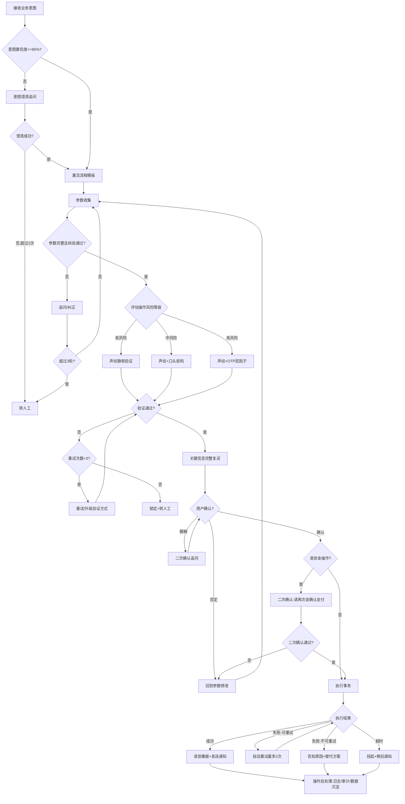

# 语音驱动业务闭环 - 标准操作规程 (SOP)

## 1. 概述

本SOP定义了通过语音对话驱动业务操作（下单、支付、预约、改签、退款等）的端到端标准流程。核心目标是在保障操作安全性和准确性的前提下，实现单次通话业务完成率>=75%、平均业务完成时长<3分钟的高效体验。

本规程适用于所有通过语音渠道发起的业务操作类请求，涵盖从意图接收到操作完成后通知的完整生命周期。

---

## 2. RACI 矩阵

| 流程步骤 | 流程引导Agent | 身份验证Agent | 事务执行Agent | 对话编排引擎(上游) | 风控系统(外部) | 人工客服(兜底) |
|---------|:---:|:---:|:---:|:---:|:---:|:---:|
| SOP-1 意图接收与流程激活 | **R/A** | I | I | C | - | - |
| SOP-2 参数收集与校验 | **R/A** | - | I | C | - | - |
| SOP-3 身份验证执行 | C | **R/A** | I | I | C | I |
| SOP-4 关键信息确认 | **R/A** | - | I | I | - | - |
| SOP-5 事务执行与监控 | C | I | **R/A** | I | C | I |
| SOP-6 异常处理与降级 | **R/A** | C | C | I | C | **R**(升级时) |
| SOP-7 操作后处理与审计 | C | C | **R/A** | I | I | - |

> R=Responsible(执行), A=Accountable(负责), C=Consulted(咨询), I=Informed(知会)

---

## 3. 详细流程步骤

### SOP-1: 意图接收与流程激活

**触发条件：**
- 对话编排引擎识别到业务操作类意图（非查询/闲聊）
- 意图分类置信度>=85%（低于此阈值先进行意图澄清）

**执行动作：**
1. 流程引导Agent接收意图标签和初始参数
2. 匹配对应的流程模板（下单/改签/退款/预约/转账等）
3. 初始化流程实例，创建流程状态记录
4. 从用户首句话中预提取已知参数
5. 若意图模糊（置信度85%-92%），执行自然语言澄清："您是想要改签航班还是取消航班呢？"

**输出产物：**
- 激活的流程模板实例（flow_instance_id）
- 预填充的参数集合
- 流程初始状态（INITIATED）

**质量检查点：**
- 业务意图分类准确率 >= 92%
- 模糊意图澄清成功率 >= 85%
- 流程激活耗时 < 500ms

**异常处理：**
- 意图完全无法识别：追问最多2次，仍不明确则礼貌告知"我没太听清您的需求"并建议转人工
- 不支持的业务类型：明确告知"目前暂不支持该操作，建议您通过APP操作或转人工处理"
- 流程模板不存在：记录日志+告知用户暂不支持+转人工

---

### SOP-2: 参数收集与校验

**触发条件：**
- 流程实例已激活且存在未收集的必填参数

**执行动作：**
1. 按优先级排序待收集参数（先收集能缩小选择范围的参数）
2. 生成自然语言追问话术（非机械式"请提供XXX"）
3. 从用户响应中提取参数值（NLU实体抽取）
4. 执行参数格式校验：
   - 日期合法性（不能是过去日期）
   - 金额合理性（不超过限额）
   - 手机号/身份证号格式正确
5. 处理特殊表达：
   - 相对时间 → 绝对时间转换（"后天" → 具体日期）
   - 口语数字 → 标准数字（"一百二" → 120）
   - 指代消解（"还是那个" → 上下文中的具体对象）
6. 对关键参数进行确认（尤其是数字类）

**输出产物：**
- 完整的参数集合（所有必填参数已填充且校验通过）
- 参数确认记录

**质量检查点：**
- 必填参数遗漏率 < 2%
- 参数格式校验通过率 >= 98%
- 参数收集轮次 <= 3轮（80%的场景）
- 同音词歧义正确消解率 >= 90%

**异常处理：**
- 用户无法提供某必填参数：提供选项引导或从历史数据推荐
- 参数校验反复失败：最多3次纠正尝试后建议转人工
- 用户中途变更需求：保留已收集参数，切换到新分支或新流程
- 用户沉默超时（15秒）：友好提醒"您还在吗？需要我帮您...吗？"

---

### SOP-3: 身份验证执行

**触发条件：**
- 参数收集完毕，流程进入验证环节
- 由流程引导Agent向身份验证Agent发起验证请求

**执行动作：**
1. 身份验证Agent评估操作风险等级：
   - 低风险（查询类）：声纹静默验证（用户无感知）
   - 中风险（修改类）：显式声纹验证 + 口头密码
   - 高风险（资金类）：声纹 + 短信OTP双因子验证
2. 按确定的策略执行验证：
   - 声纹验证：从对话音频中提取特征→与注册模板比对→输出置信度
   - 口头密码：引导用户说出→ASR转写→哈希比对
   - OTP：发送验证码→用户口述→比对
3. 执行反欺骗检测（录音回放/TTS合成/语音变换检测）
4. 综合判定验证结果

**输出产物：**
- 验证结果（通过/失败/需升级）
- verification_token（通过时生成，有效期5分钟）
- 验证审计日志

**质量检查点：**
- 声纹验证 FAR（误接受率）< 0.1%
- 声纹验证 FRR（误拒绝率）< 5%
- OTP送达率 >= 99%
- 验证全流程耗时 < 30秒
- 反欺骗检测准确率 >= 99%

**异常处理：**
- 声纹置信度在90%-95%边界区间：升级验证方式（追加口头密码或OTP）
- 验证失败第1-2次：友好提示重试（"没关系，请再试一次"）
- 验证失败第3次：立即锁定操作+触发安全告警+自动转人工
- OTP收不到：提供重发选项（60秒间隔）或替代验证方式
- 声纹突变检测（置信度突降>20个百分点）：强制最高验证+记录安全事件

---

### SOP-4: 关键信息确认

**触发条件：**
- 身份验证通过（verification_token有效）
- 所有必填参数已收集完毕

**执行动作：**
1. 组装操作摘要（必须包含金额/时间/对象三要素）
2. 生成自然语言确认话术：
   - 示例："好的，确认为您将3月15日北京到上海CA1234航班改签到3月17日同一航班，需补差价120元，确认吗？"
3. 等待用户响应并解析：
   - 肯定确认："对/确认/没问题" → 进入执行
   - 否定："不对/等等" → 回到参数修改步骤
   - 部分修正："对，但时间改成下午5点" → 更新参数后重新确认
4. 资金类操作的二次确认（强制）：
   - 等待首次确认后，间隔2秒
   - "本次操作涉及支付120元，请再次说'确认支付'"
   - 必须听到"确认支付/确认转账"等特定词组

**输出产物：**
- 确认凭证（confirmation_token）
- 确认音频记录（留存90天）
- 最终确认的操作参数快照

**质量检查点：**
- 关键信息复述完整性 100%（金额/时间/对象三要素全部复述）
- 二次确认跳过率 0%（系统强制，无法绕过）
- 确认话术自然度评分 >= 4.0/5.0
- 误确认率 < 0.1%（用户并非真的确认但被系统判为确认）

**异常处理：**
- 用户连续3次否定：主动询问"是否需要重新来过，或者我帮您转人工？"
- 用户响应模糊（"嗯..."犹豫语气）：二次确认"您是确认还是需要再考虑一下？"
- 确认超时（30秒无响应）：提醒一次，再无响应则暂停流程可稍后恢复
- 二次确认中用户说"等等/不对"：立即取消执行，回到参数确认步骤

---

### SOP-5: 事务执行与监控

**触发条件：**
- 已获得有效的verification_token和confirmation_token
- 流程引导Agent向事务执行Agent发送执行指令

**执行动作：**
1. 事务执行Agent验证双Token有效性
2. 执行业务预检：
   - 余额/库存/资源可用性验证
   - 业务规则最终校验
   - 幂等性检查（防重复执行）
3. 调用后端业务系统API
4. 状态跟踪：INITIALIZED → EXECUTING → SUCCESS/FAILED/TIMEOUT
5. 结果处理：
   - 成功：生成结果摘要+确认通知内容
   - 失败-可重试：自动重试（最多2次，间隔2秒）
   - 失败-不可重试：生成错误说明+替代方案
   - 超时：挂起事务+标记待确认+通知用户稍后查询

**输出产物：**
- 事务执行结果（结构化数据）
- 语音播报文本
- 确认通知（短信/推送）内容
- 错误分类和替代方案（失败时）

**质量检查点：**
- API调用成功率 >= 99%
- 事务回滚成功率 100%（失败时状态完全恢复）
- 执行结果通知送达率 >= 99%
- 执行耗时 P95 < 5秒
- 幂等性：重复请求不产生重复操作

**异常处理：**
- API超时（30秒）：标记为PENDING，异步查询结果，告知用户"操作正在处理中，稍后会发送结果通知"
- 部分失败（多步操作中间步失败）：触发补偿事务回滚已完成步骤
- 下游系统不可用：触发熔断，告知用户"系统暂时繁忙，建议稍后重试"
- 资金操作异常（扣款但订单未创建）：立即触发退款补偿+告警+记录

---

### SOP-6: 异常处理与降级

**触发条件：**
- 任何流程步骤中出现非预期情况
- 系统性能指标超过告警阈值
- 用户主动要求升级服务

**执行动作：**
1. 异常分类：
   - A类-用户侧异常：意图不明、参数无法收集、用户放弃
   - B类-系统侧异常：API失败、超时、服务不可用
   - C类-安全异常：验证反复失败、声纹异常、疑似欺诈
2. 响应策略：
   - A类：最多3次引导尝试→提供替代方案→转人工
   - B类：自动重试→降级方案→告知用户+记录工单
   - C类：立即锁定→安全告警→强制转人工
3. 替代方案提供（失败原因告知后5秒内）：
   - 航班已满："同一天还有其他3个航班可选，需要帮您查看吗？"
   - 支付失败："您可以更换支付方式，或者稍后重试"
   - 库存不足："目前该规格缺货，相似商品XX有货，需要了解一下吗？"
4. 转人工流程：
   - 生成对话摘要和操作进度
   - 将上下文（已收集参数、验证状态）传递给人工坐席
   - 播放过渡话术"正在为您转接人工客服，请稍候"

**输出产物：**
- 异常处理记录
- 替代方案列表
- 转人工上下文包（如适用）

**质量检查点：**
- 失败原因告知率 100%（不允许无解释的失败）
- 替代方案提供率 >= 90%
- 异常操作人工介入响应时间 < 60秒
- 转人工时上下文传递完整性 >= 95%

**异常处理（元级）：**
- 异常处理本身失败：直接转人工并记录系统异常
- 人工坐席全忙：告知预计等待时间，提供回拨选项

---

### SOP-7: 操作后处理与审计

**触发条件：**
- 事务执行完成（无论成功或失败）
- 用户会话即将结束

**执行动作：**
1. 成功操作后处理：
   - 语音播报操作结果（自然语言描述）
   - 发送确认短信（含操作详情和单号）
   - 发送APP推送通知
   - 更新用户操作历史
2. 操作日志归档：
   - 完整操作链路记录（从意图到执行结果）
   - 各环节耗时明细
   - 确认音频文件归档
   - 验证日志归档
3. 安全审计：
   - 异常模式检测（同一用户短时间大量操作等）
   - 操作合规性回顾
   - 风险评分更新
4. 数据沉淀：
   - 流程执行效率数据（供优化分析）
   - 用户行为模式数据（供个性化使用）
   - 失败原因分布数据（供系统改进）

**输出产物：**
- 操作确认通知（短信+推送）
- 完整操作审计日志
- 会话摘要（持久化24小时用于回访）

**质量检查点：**
- 操作日志完整性 100%
- 确认通知送达率 >= 99%
- 异常模式检测覆盖率 >= 95%
- 日志归档成功率 100%

**异常处理：**
- 通知发送失败：重试3次，仍失败则记录人工跟进任务
- 日志写入失败：切换备用存储，触发告警

---

## 4. 决策树

---

## 5. KPI 指标体系

### 核心效率指标
| 指标名称 | 目标值 | 告警阈值 | 测量方式 |
|---------|-------|---------|---------|
| 单次通话业务完成率 | >= 75% | < 65% | 成功完成事务数/总业务意图数 |
| 平均业务完成时长 | < 3分钟 | > 4分钟 | 从意图接收到事务完成的平均时间 |
| 用户中途放弃率 | < 20% | > 30% | 用户主动终止未完成流程数/总流程数 |

### 安全性指标
| 指标名称 | 目标值 | 告警阈值 | 测量方式 |
|---------|-------|---------|---------|
| 身份验证通过率 | >= 90% | < 80% | 验证通过数/验证尝试数（首次） |
| 声纹FAR（误接受率）| < 0.1% | > 0.5% | 非授权用户通过验证数/非授权尝试数 |
| 声纹FRR（误拒绝率）| < 5% | > 10% | 合法用户被拒绝数/合法用户验证总数 |
| 二次确认跳过率 | 0% | > 0%（任何跳过即P0） | 资金操作中未执行二次确认的比例 |

### 准确性指标
| 指标名称 | 目标值 | 告警阈值 | 测量方式 |
|---------|-------|---------|---------|
| 操作确认准确率 | 100% | < 99% | 关键信息无遗漏的确认比例 |
| 参数格式校验通过率 | >= 98% | < 95% | 参数一次性通过校验的比例 |
| 事务执行成功率 | >= 99% | < 97% | 事务执行成功数/事务提交数 |
| 事务回滚成功率 | 100% | < 100%（任何失败即P0） | 回滚操作成功完成的比例 |

### 体验性指标
| 指标名称 | 目标值 | 告警阈值 | 测量方式 |
|---------|-------|---------|---------|
| 操作后通知送达率 | >= 99% | < 97% | 通知成功到达用户的比例 |
| 失败原因告知率 | 100% | < 100% | 操作失败时向用户解释原因的比例 |
| 替代方案提供率 | >= 90% | < 80% | 失败时提供替代方案的比例 |
| 人工介入响应时间 | < 60秒 | > 120秒 | 从触发转人工到人工接入的时间 |

---

## 6. 质量保障检查清单

### 每次操作必检项
- [ ] 身份验证token有效（未过期、未使用过）
- [ ] 确认协议完整执行（关键信息全部复述、用户明确确认）
- [ ] 资金操作二次确认已完成（confirmation_token携带double_confirm标记）
- [ ] 操作审计日志已写入
- [ ] 结果通知已发送

### 每日检查项
- [ ] 各环节成功率是否在目标范围内
- [ ] 异常操作模式检测结果复核
- [ ] 失败事务的补偿/回滚是否全部完成
- [ ] 转人工工单的处理进度

### 每周检查项
- [ ] 声纹验证FAR/FRR指标趋势
- [ ] 用户放弃率变化趋势和原因分析
- [ ] 流程模板优化建议（基于耗时和失败分布）
- [ ] 安全事件复盘
