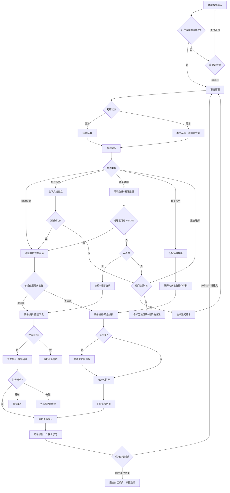

# 语音赋能智能硬件 - 标准操作流程 (SOP)

## 1. 概述

本SOP定义了语音赋能智能硬件系统从唤醒检测到设备执行完成的全链路标准操作流程，覆盖远场唤醒、语音处理、意图解析、设备编排、反馈生成和个性化学习六大环节。适用于智能家居、车载系统和工业控制面板等场景。

---

## 2. RACI矩阵

| 流程步骤 | 意图解析Agent | 设备编排Agent | 个性化学习Agent | 唤醒/ASR模块(外部) | 用户 |
|---------|:---:|:---:|:---:|:---:|:---:|
| 唤醒检测 | I | I | I | R/A | C |
| 语音处理(ASR) | I | - | - | R/A | - |
| 意图解析 | R/A | I | C | - | C |
| 指代消解 | R/A | - | C | - | C |
| 模糊意图推理 | R/A | - | C | - | C |
| 场景模板匹配 | R | A | C | - | I |
| 设备状态查询 | C | R/A | I | - | - |
| 单设备控制执行 | I | R/A | I | - | I |
| 多设备场景编排 | I | R/A | C | - | I |
| 指令冲突解决 | I | R/A | - | - | I |
| 语音反馈生成 | R/A | C | - | - | I |
| 行为数据记录 | - | C | R/A | - | - |
| 偏好模型更新 | - | - | R/A | - | - |
| 连续对话管理 | R/A | - | - | C | C |
| 离线模式切换 | I | R/A | - | R | I |

> R=Responsible(执行) A=Accountable(问责) C=Consulted(咨询) I=Informed(知会)

---

## 3. 流程详细定义

### SOP-1: 唤醒检测流程

**触发条件：** 环境持续监听到音频流

**执行步骤：**
1. 本地唤醒词模型持续处理音频帧（16kHz, 16bit单声道）
2. 检测到唤醒词候选 → 二次确认模型验证（降低误唤醒）
3. 唤醒确认 → 播放唤醒确认音效（嘟声，<100ms）
4. 激活远场拾音链路（波束成形+降噪）
5. 进入连续对话模式，启动30秒超时计时器

**输出：** 唤醒事件{timestamp, wakeword_confidence, direction_of_arrival}

**异常处理：**
- 唤醒置信度在阈值边缘（0.7-0.85）→ 不响应但记录日志用于模型优化
- 误唤醒后用户说"不是叫你"→ 立即退出对话模式并道歉
- 已在连续对话模式中 → 跳过唤醒直接处理语音

**KPI检查点：**
| 指标 | 目标值 | 测试条件 |
|------|--------|----------|
| 唤醒率 | >=95% | 5米距离, 60dB环境噪声 |
| 误唤醒率 | <0.5次/天 | 电视/音乐播放环境 |
| 唤醒响应时间 | <500ms | 从说完唤醒词到确认音效 |

---

### SOP-2: 远场语音处理流程

**触发条件：** 唤醒成功或处于连续对话模式中

**执行步骤：**
1. 多麦克风阵列采集原始音频
2. 波束成形（Beamforming）→ 增强目标方向信号，信噪比提升>=15dB
3. AEC回声消除 → 去除设备自身播放的音频回声
4. 噪声抑制（NS）→ 去除稳态噪声
5. VAD端点检测 → 确定用户说话起止点
6. 网络状态评估：
   - 网络正常（延迟<100ms）→ 云端ASR（高精度模式）
   - 网络异常（延迟>500ms或不可达）→ 本地ASR（基础命令集模式）
7. ASR输出转写文本 + 识别置信度

**输出：** {asr_text, confidence, is_offline_mode, audio_quality_score}

**异常处理：**
- VAD检测到持续静音（>5秒）→ 提示"没有听到您说话"
- ASR置信度极低（<0.3）→ 提示"没听清，请再说一次"
- 网络中途断开 → 无缝切换到本地ASR，不中断用户体验
- 音频质量差（回声/噪声未完全消除）→ 标记低质量，提高解析谨慎度

**KPI检查点：**
| 指标 | 目标值 | 测试条件 |
|------|--------|----------|
| 波束成形信噪比提升 | >=15dB | 3米距离, 多噪声源 |
| AEC回声消除率 | >=95% | 设备播放音乐时 |
| 云端ASR WER | <10% | 普通话, 安静环境 |
| 本地ASR WER(基础命令) | <15% | 100条高频命令集 |
| ASR首包延迟 | <300ms | 云端模式 |

---

### SOP-3: 意图解析流程

**触发条件：** 收到ASR转写文本

**执行步骤：**
1. 文本预处理：去除语气词、ASR纠错（设备名称词典后纠正）
2. 意图分类：
   - **明确指令**（"关闭客厅灯"）→ 直接映射为控制命令
   - **指代指令**（"把这个关了"）→ 调用上下文管理技能消解指代
   - **模糊意图**（"有点暗"）→ 调用模糊意图推理技能
   - **场景指令**（"我要睡觉了"）→ 匹配场景关键词库
   - **无法理解** → 生成追问话术
3. 查询个性化学习Agent获取用户偏好参数填充默认值
4. 组装结构化控制命令
5. 更新对话上下文栈

**输出：** {intent_type, commands[], confidence, context_updated}

**异常处理：**
- 意图置信度<0.7 → 生成追问（最多2次）
- 连续2次追问仍无法理解 → 告知用户换种说法 + 记录到日志用于模型优化
- 指代消解失败（上下文栈为空）→ 追问"请问您想控制哪个设备？"
- 安全设备操作置信度<0.9 → 强制追问确认

**KPI检查点：**
| 指标 | 目标值 | 测试条件 |
|------|--------|----------|
| 明确指令解析准确率 | >=98% | 标准指令测试集 |
| 指代消解准确率 | >=90% | 连续对话场景 |
| 模糊意图推理合理率 | >=85% | 主观表达测试集 |
| 解析总耗时 | <100ms | 含上下文查询 |

---

### SOP-4: 设备控制执行流程

**触发条件：** 收到意图解析Agent输出的结构化控制命令

**执行步骤：**
1. 校验目标设备在线状态
2. 校验操作参数合法性（在设备允许范围内）
3. 检查是否存在指令冲突（调用冲突解决技能）
4. 将结构化命令翻译为设备协议指令
5. 下发控制指令到目标设备
6. 等待设备执行确认（超时3秒）
7. 接收执行结果，更新设备状态图谱

**输出：** {device_id, action, status, execution_time_ms, error_info}

**异常处理：**
- 设备离线 → 告知用户"设备不可达，请检查设备连接"
- 参数越界 → 自动截断到边界值 + 告知用户实际执行值
- 执行超时 → 重试1次，仍超时则标记设备异常
- 设备返回错误码 → 翻译为用户可理解的错误信息

**KPI检查点：**
| 指标 | 目标值 | 测试条件 |
|------|--------|----------|
| 指令下发到设备响应 | <500ms | 设备在线, 网络正常 |
| 控制成功率 | >=99% | 设备在线时 |
| 冲突解决正确率 | >=95% | 多指令并发场景 |
| 冲突检测耗时 | <50ms | 含优先级判定 |

---

### SOP-5: 场景联动编排流程

**触发条件：** 意图解析识别到场景触发词

**执行步骤：**
1. 加载场景模板（设备列表、目标状态、执行条件、依赖关系）
2. 检查场景涉及设备的在线状态
3. 分析设备间依赖关系，生成执行DAG
4. 确定并行组和串行顺序
5. 按组逐步执行：
   - 并行下发同组内所有设备指令
   - 等待组内所有设备响应（组超时5秒）
   - 全部成功→进入下一组；部分失败→评估是否继续
6. 汇总场景执行结果

**输出：** {scene_id, execution_status, success_count/total, failed_devices[], total_time_ms}

**异常处理：**
- 关键设备离线 → 终止场景执行, 告知用户哪个设备不可用
- 非关键设备失败 → 跳过该设备继续执行, 事后告知
- 场景执行中收到新指令 → 暂停场景, 处理新指令, 评估是否恢复
- 场景执行超时（30秒总超时）→ 强制结束, 报告当前状态

**KPI检查点：**
| 指标 | 目标值 | 测试条件 |
|------|--------|----------|
| 场景执行完整率 | >=98% | 所有设备在线时 |
| 执行顺序正确率 | 100% | 有依赖关系的操作 |
| 场景总执行时间 | <5秒(典型) | 5设备以内的场景 |
| 部分失败降级正确率 | >=95% | 非关键设备故障 |

---

### SOP-6: 离线模式操作流程

**触发条件：** 网络不可达或延迟>500ms

**执行步骤：**
1. 系统检测到网络异常 → 切换到离线模式
2. 加载本地命令集（预编译的高频命令模型）
3. 本地ASR处理语音 → 仅支持基础命令（开/关/调节+设备名）
4. 本地意图解析（规则匹配，不支持模糊推理）
5. 通过本地控制协议下发指令（Zigbee/BLE直连）
6. 记录离线期间的操作到本地日志
7. 网络恢复后 → 自动同步操作日志到云端 + 刷新设备状态

**输出：** {offline_mode: true, command_executed, sync_pending_count}

**异常处理：**
- 用户尝试复杂指令（场景联动/模糊意图）→ 告知当前为离线模式仅支持基础控制
- 网络恢复不稳定（反复切换）→ 设置稳定判断窗口（连续在线30秒才切回云端模式）
- 离线期间设备状态与云端不一致 → 网络恢复后以设备实际状态为准进行同步

**KPI检查点：**
| 指标 | 目标值 | 测试条件 |
|------|--------|----------|
| 基础命令集覆盖率 | >=80%常用操作 | Top50高频命令 |
| 离线ASR准确率 | >=85% | 基础命令词汇表 |
| 网络恢复同步成功率 | >=99% | 操作日志同步 |
| 离线模式切换时间 | <1秒 | 从检测到切换完成 |

---

### SOP-7: 个性化学习与偏好更新流程

**触发条件：** 每次设备操作完成后(实时记录) + 每日凌晨(批量分析)

**执行步骤：**
1. **实时记录**：每次操作完成后记录{user_id, device, action, params, time, context}
2. **日批量分析**（凌晨3:00执行）：
   a. 运行行为模式挖掘 → 发现新模式或确认已有模式
   b. 更新偏好模型EMA值
   c. 评估是否有新的场景建议可推荐
   d. 清理过期数据（>90天）
3. **偏好查询服务**：随时响应意图解析Agent的偏好参数查询
4. **反馈学习**：用户修正系统默认值时实时更新权重

**输出：** {patterns_discovered[], preferences_updated[], recommendations_ready[]}

**异常处理：**
- 数据量不足（新用户<5次操作）→ 使用品类默认值，不输出个性化建议
- 模式突变（用户生活方式改变）→ 提高EMA新值权重，加速适应
- 多用户声纹识别失败 → 使用家庭公共偏好作为回退
- 存储空间接近上限 → 按可靠度排序淘汰低价值模式

**KPI检查点：**
| 指标 | 目标值 | 测试条件 |
|------|--------|----------|
| 偏好学习准确率 | >=80% | 用户采纳建议的比率 |
| 多用户偏好隔离正确率 | >=95% | 家庭多成员场景 |
| 偏好查询响应时间 | <20ms | 含上下文匹配 |
| 主动建议采纳率 | >=60% | 去除频率限制的情况下 |

---

## 4. 决策树

---

## 5. 质量检查清单

### 每日巡检
- [ ] 唤醒率抽检（随机100次测试，>=95次成功）
- [ ] 误唤醒日志检查（当日误唤醒次数<0.5）
- [ ] 设备在线率检查（全网设备在线率>=98%）
- [ ] ASR服务可用性（云端ASR uptime>=99.9%）
- [ ] 离线模式可用性验证（模拟断网测试）

### 每周评审
- [ ] 意图解析准确率统计（明确/指代/模糊分类达标率）
- [ ] 设备控制成功率统计（分设备类型统计）
- [ ] 场景执行完整率统计
- [ ] 用户偏好采纳率统计
- [ ] 冲突解决案例审查（抽检10例）
- [ ] 用户投诉/反馈分析

### 每月优化
- [ ] 唤醒模型误唤醒样本分析与模型更新
- [ ] ASR纠错词典更新（新增设备名/用户别名）
- [ ] 场景模板库扩展（基于用户行为模式新建通用场景）
- [ ] 偏好模型准确度评估与参数调优
- [ ] 设备协议兼容性测试（新增设备品类验证）

---

## 6. 关键指标汇总仪表盘

| 指标类别 | 核心指标 | 目标值 | 告警阈值 | 计算方式 |
|---------|---------|--------|----------|---------|
| 唤醒性能 | 唤醒率 | >=95% | <90% | 成功唤醒次数/总测试次数 |
| 唤醒性能 | 误唤醒率 | <0.5次/天 | >1次/天 | 日误唤醒总次数 |
| 响应时延 | 端到端控制时延 | <500ms | >800ms | 从语音结束到设备动作 |
| 理解能力 | 意图解析准确率 | >=95% | <90% | 正确解析数/总请求数 |
| 控制可靠性 | 设备控制成功率 | >=99% | <97% | 成功执行/总下发(在线设备) |
| 场景能力 | 场景联动完整执行率 | >=98% | <95% | 全部成功场景/总触发场景 |
| 个性化 | 用户偏好采纳率 | >=80% | <60% | 用户采纳建议数/总建议数 |
| 可靠性 | 离线基础控制可用性 | >=99.5% | <98% | 离线成功控制/离线总请求 |

---

## 7. 版本与变更记录

| 版本 | 日期 | 变更内容 | 责任人 |
|------|------|---------|--------|
| v1.0 | 初始版本 | SOP初始化，覆盖全链路7大流程 | 系统架构师 |
